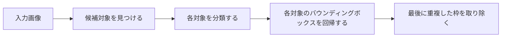

# 10.3.2 物体検出の概要


:::tip 本節の位置づけ
画像分類では次のことしか答えられません：

- この画像はだいたい何か

でも、実際の多くのタスクでは、もっと具体的な答えが必要です。

> **画像の中に何があり、しかもそれはどこにあるのか？**

これが物体検出の核心です。
:::

## 学習目標

- 物体検出と画像分類の違いを理解する
- バウンディングボックス、クラス、信頼度の3要素を理解する
- 実行可能な例を通して IoU のような重要指標の直感をつかむ
- 検出タスクと、その後の YOLO / 検出実践とのつながりを持つ

---

## まずは全体の地図をつくろう

もし画像分類を学び終えたばかりなら、この節は次のように理解するとよいです：

- 分類が解決するのは「画像全体でいちばん重要なものは何か」
- 検出が解決するのは「画像の中のそれぞれの対象は何で、どこにあるか」

つまり、検出は単に「枠が1つ増える」だけではなく、次のように変わります：

- 出力する対象が変わる
- 評価する対象が変わる
- エラーの種類も変わる

物体検出を初心者が理解する順番は、「まずモデルを覚える」ことではなく、先にタスクの構造をはっきりさせることです。



そのため、検出タスクは本質的に分類より複雑です。なぜなら、同時に次のことを行っているからです：

- 分類
- 位置特定
- 複数対象の選別

## 一、物体検出は何をしているのか？

検出タスクは通常、次のものを同時に出力します：

- クラス
- バウンディングボックスの位置
- 信頼度

たとえば：

- 街の風景画像に車が2台、人が1人いる
- それぞれの対象の位置を示す必要がある

これは画像全体の分類より、ずっと複雑です。

### この節を最初に学ぶとき、何を覚えるべき？

まず覚えるべきことは次の3つです。

1. 検出は画像全体を判定するのではなく、複数対象を判定する
2. 各対象には少なくとも3つの要素がある：クラス、位置、信頼度
3. 後で出てくる多くのモデルの違いは、実はこの3つをどう扱うかに関係している

### なぜこの節では「3要素」を先に押さえるべきなのか？

なぜなら、後のほとんどすべての検出モデルは、最終的にこの3つを中心に考えるからです。

- クラス
- 枠
- 信頼度

物体検出の出力は、まず次のような素朴な一文として理解するとよいです。

> 「ここに何か対象がある気がする。だいたいこのあたりにあって、どれくらい確かかも分かる。」

---

## 二、なぜ分類モデルでは足りないのか？

同じ画像の中に、次のようなことが起こりうるからです：

- 複数の対象がある
- 対象の大きさが違う
- 対象の位置が違う

画像分類は画像全体に1つのラベルを付けるだけなので、  
こうした情報を表現できません。

### 初心者にとって分かりやすい見分け方

今後、ある画像認識の問題を見たら、まず次のように考えてみてください。

- 画像全体に対して1つの答えがあればよいのか？
- それとも、画像の中の各対象を個別に見つける必要があるのか？

後者なら、それはもう普通の分類タスクの範囲を超えています。

---

## 三、まずは最小の IoU 例を見てみよう

IoU は検出で非常に重要な概念です。  
なぜなら、次のことを教えてくれるからです。

- 予測ボックスと正解ボックスが、どれだけうまく重なっているか

```python
def iou(box_a, box_b):
    ax1, ay1, ax2, ay2 = box_a
    bx1, by1, bx2, by2 = box_b

    inter_x1 = max(ax1, bx1)
    inter_y1 = max(ay1, by1)
    inter_x2 = min(ax2, bx2)
    inter_y2 = min(ay2, by2)

    inter_w = max(0, inter_x2 - inter_x1)
    inter_h = max(0, inter_y2 - inter_y1)
    inter_area = inter_w * inter_h

    area_a = (ax2 - ax1) * (ay2 - ay1)
    area_b = (bx2 - bx1) * (by2 - by1)
    union = area_a + area_b - inter_area

    return inter_area / union if union > 0 else 0.0


gt_box = (10, 10, 30, 30)
pred_box = (15, 15, 32, 32)

print("IoU =", round(iou(gt_box, pred_box), 4))
```

### なぜこの指標がとても重要なのか？

検出では、「対象を見つけたかどうか」だけでなく、  
次の点も見る必要があるからです。

- 枠がどれだけ正確か

### IoU で最初に覚えるべきなのは式ではなく、「重なりの質」

初めて検出を学ぶときは、交差比や式を最初に丸暗記しなくて大丈夫です。  
まずは次のことを覚えてください。

- IoU は本質的に、予測ボックスと正解ボックスがどれだけよく重なっているかを見るもの

これは、後で出てくる多くの概念の理解に直結します。

- 正例・負例のマッチング
- NMS
- mAP

### 初心者が最初に覚えるべき3つの概念は？

物体検出に初めて触れるとき、まず覚えるべきなのは次の3つです。

1. バウンディングボックス  
   モデルは「車がある」と答えるだけでなく、「車がどこにあるか」も答える。

2. IoU  
   予測ボックスと正解ボックスの重なり具合を測る。

3. 複数対象の場面  
   同じ画像に対象が複数あることが普通なので、重複枠・遮蔽・重なりといった問題が出る。

### なぜ検出は本質的に「システム問題」に近いのか？

最後に扱うのは1つの枠ではなく、  
枠の集まりだからです。

- どの枠を残すか
- どの枠が重複か
- どの枠はスコアが低いので除外するか

だからこそ、検出には最初から目立つ後処理の段階があります。

### 初めて検出をやるとき、見落としやすいものは？

多くの場合、モデルそのものよりも次の点です。

- 枠の定義
- 閾値の選び方
- 重複枠の扱い
- 誤検出と見逃しのバランス

そのため、検出プロジェクトは単なるモデル出力というより、完成したシステムに近いものになります。


:::tip 図の見方
この図では、検出の出力を class、box、score の3つに分け、さらに IoU を使って枠がどれくらい正確かを判断しています。検出エラーは単なる「1つのミス」ではなく、見逃し、誤検出、位置のずれ、重複枠が組み合わさって起こります。
:::

---

## 四、いちばんハマりやすい落とし穴

### 誤解1：検出は分類に枠を足しただけ

枠そのものが、かなり難しい回帰問題です。

### 誤解2：分類スコアだけを見る

位置のずれも同じくらい重要です。

### 誤解3：複数対象の場面を単一対象のように考える

複数対象では、次のような問題が起こります。

- 重なり
- 遮蔽
- 重複予測

## 五、この節で持つべき正しい期待

この節で一番大事なのは、今日すぐに完全な検出器を作れるようになることではありません。  
まず本当に区別すべきなのは次の点です。

- 分類タスクは「何か」だけに答える
- 検出タスクは「何か」と「どこにあるか」の両方に答える
- その後の YOLO や Faster R-CNN は、本質的にこの2つの問題の組み合わせを解いている

## 初めて検出プロジェクトをやるとき、まず持つべき意識は？

まず持つべきなのは次の意識です。

- 検出プロジェクトは、まずアノテーションのプロジェクトである
- その次にモデルのプロジェクトである

なぜなら、枠の基準が揃っていないと、後でモデルも評価もまとめて崩れてしまうからです。

---

## まとめ

この節で最も大切なのは、次の検出の見方を持つことです。

> **対象検出は、「何か」と「どこにあるか」を同時に解決する。そのため、分類より本質的に複雑で、実際の画像応用により近い。**

## この節で持ち帰るべきこと

- 検出は、分類に枠を足しただけではない
- IoU は検出品質を理解する最初の鍵
- 本当の難しさは、複数対象、遮蔽、位置ずれにある

一文でまとめるなら、次のようになります。

> **対象検出は、「見つける」ことを、「それぞれの対象を見つけて、個別に位置を特定する」ことへと進化させる。**

---

## 練習

1. 枠の座標を2組変えて、IoU がどう変わるか見てみましょう。
2. なぜ検出は分類より実際の画像タスクに近いと言えるのでしょうか？
3. ある検出枠のクラスは合っているのに、位置がかなりずれていたら、その予測は良いと言えるでしょうか？ なぜですか？
4. 考えてみましょう：なぜ複数対象の場面は単一対象の場面よりずっと難しいのでしょうか？
