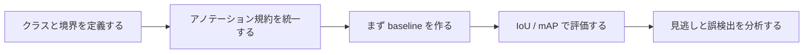

# 10.3.5 検出実践

:::tip 本節の位置づけ
実際に検出プロジェクトを進めると、難しさはモデルそのものだけではありません。
よりよくある問題は次のとおりです。

- アノテーションはどう作るか
- 正例・負例をどう定義するか
- 小さな対象をどう評価するか
- 検出枠は本当に正しいと言えるのか

そのため、この節の重点は、最小限の検出プロジェクトを問題定義から評価の閉ループまでつなげることです。
:::

## 学習目標

- 最小限の物体検出プロジェクトを定義できるようになる
- 検出プロジェクトにおけるアノテーション、枠のマッチング、評価ロジックを理解する
- 実行可能な例を通して IoU ベースの評価感覚を身につける
- 検出プロジェクトの見せ方の土台を作る

---

## まずは全体図を作ろう

もしあなたが検出の概要、古典的な検出器、YOLO まで学び終えたなら、この節は自然な続きになります。

- これまでに、検出タスクが何を解決しているかは分かっている
- ここでは「これを本当にプロジェクトにするなら、最初の一歩は何か」を考える

なので、この節で本当に重要なのは新しいモデルではなく、次の点です。

- クラス定義
- アノテーション規約
- 評価基準
- 失敗例の振り返り

検出実践の理解順は、「先にモデルを学習する」ではなく、まずプロジェクトの閉ループをはっきり見ることです。



つまり、この節が本当に解決したいのは次のことです。

- 検出プロジェクトはどう進めるべきか
- どこがモデル構造より先に問題になりやすいか

## 一、検出プロジェクトで最初に決めることは？

### クラスの境界

たとえば防犯シーンでは、まずは次のように絞ることがあります。

- person
- helmet

最初から全部の対象を入れる必要はありません。

### アノテーション規約

次の点を最初に明確にする必要があります。

- 枠はどれくらいぴったり付けるか
- どう遮蔽を扱うか
- 小さな対象をどう数えるか

### 評価基準

少なくとも次を明確にしておきましょう。

- IoU の閾値
- 再現率 / 適合率

### 初めて検出プロジェクトをやるとき、どんな題材が安定しやすい？

安定しやすい題材には、だいたい次の特徴があります。

- クラス数が多すぎない
- 対象の定義がはっきりしている
- 誤検出と見逃しを目で理解しやすい

そのため、初めてプロジェクトを作るなら、
「少ないクラス、明確な定義、説明しやすさ」が、
「派手さ」より大切なことが多いです。

### なぜこの段階が「先にモデルを選ぶ」より重要なの？

最初に次のことが固まっていないと、

- クラス境界
- アノテーションルール
- 枠の定義
- IoU の閾値

あとでどれだけモデル比較をしても、結局は曖昧な基準の上で空回りしてしまうからです。

---

## 二、まずは最小のマッチング評価を動かしてみよう

```python
ground_truth = [
    {"label": "person", "box": (10, 10, 30, 50)},
    {"label": "helmet", "box": (14, 8, 24, 18)},
]

predictions = [
    {"label": "person", "box": (11, 12, 31, 48), "score": 0.92},
    {"label": "helmet", "box": (15, 9, 23, 17), "score": 0.81},
    {"label": "helmet", "box": (40, 40, 50, 50), "score": 0.30},
]


def iou(box_a, box_b):
    ax1, ay1, ax2, ay2 = box_a
    bx1, by1, bx2, by2 = box_b

    inter_x1 = max(ax1, bx1)
    inter_y1 = max(ay1, by1)
    inter_x2 = min(ax2, bx2)
    inter_y2 = min(ay2, by2)

    inter_w = max(0, inter_x2 - inter_x1)
    inter_h = max(0, inter_y2 - inter_y1)
    inter_area = inter_w * inter_h

    area_a = (ax2 - ax1) * (ay2 - ay1)
    area_b = (bx2 - bx1) * (by2 - by1)
    union = area_a + area_b - inter_area
    return inter_area / union if union else 0.0


matches = []
for pred in predictions:
    best_iou = 0.0
    best_gt = None
    for gt in ground_truth:
        if gt["label"] != pred["label"]:
            continue
        cur_iou = iou(pred["box"], gt["box"])
        if cur_iou > best_iou:
            best_iou = cur_iou
            best_gt = gt
    matches.append(
        {
            "label": pred["label"],
            "score": pred["score"],
            "best_iou": round(best_iou, 4),
            "matched": best_iou >= 0.5,
        }
    )

print(matches)
```

実行結果の例：

```text
[{'label': 'person', 'score': 0.92, 'best_iou': 0.8182, 'matched': True}, {'label': 'helmet', 'score': 0.81, 'best_iou': 0.64, 'matched': True}, {'label': 'helmet', 'score': 0.3, 'best_iou': 0.0, 'matched': False}]
```

この出力は行ごとに読みます。最初の2つの予測は、同じラベルの正解ボックスと IoU `0.5` 以上で一致しています。最後の helmet 予測は対応する正解 helmet ボックスがないため、誤検出です。

### このコードでいちばん大事なところは？

このコードは、検出評価が次のようなものではないことを見せてくれます。

- ラベルが合っていればよい

そうではなく、

- クラスが合っていること
- 枠も十分に正確であること

が必要です。

### なぜこれが多くの検出プロジェクトの核心なの？

実際の検出結果の良し悪しは、
最終的にはしばしば次の点に表れます。

- マッチング閾値
- 枠の品質

### なぜ検出プロジェクトでは「誤検出 / 見逃し」の視点が特に大事なの？

検出システムは、「正しい / 間違い」の2種類だけではありません。
もっとよくあるのは次のようなケースです。

- 枠がずれている
- 対象を見逃している
- 余計な枠を出している

だからこそ、検出プロジェクトを見せるときは、成功例だけを数枚並べるだけでは不十分です。

### 初めて検出プロジェクトをやるとき、まず分けるべきミスは？

とても実用的な分類は、次の3つです。

1. 見逃し
   目の前に対象があるのに、システムが出力しない。

2. 誤検出
   対象がないのに、出力してしまう。

3. 位置ずれ
   クラスは合っているが、枠のずれが大きい。

この3つを分けると、その後の改善方向がかなり見えやすくなります。


:::tip 図の見方
検出プロジェクトを見せるときは、成功スクリーンショットだけを載せないようにしましょう。この図を見るときは、アノテーション規約、IoU/mAP 評価、誤検出/見逃し/位置ずれの分類、そして次の改善でデータ・閾値・モデルのどれを直すか、の4点を意識してください。
:::

---

## 三、検出プロジェクトで最もつまずきやすい点

### アノテーション基準が一致していない

これは学習と評価の両方を一気に乱してしまいます。

### 小さな対象や遮蔽を個別に分析していない

多くのシステムは、このような場面で性能がはっきり下がります。

### きれいな画像を1〜2枚だけ見せる

本当のプロジェクトでは、次のような点を見せるべきです。

- どんな状況で見逃しやすいか
- どんな状況で誤検出しやすいか

## 四、初心者がそのまま真似しやすい進め方

おすすめは次の順番です。

1. まずクラスとアノテーションルールを決める
2. 次にサンプリングしてアノテーション品質を確認する
3. まず最小限の baseline を作る
4. そのあと IoU / mAP の評価基準を統一する
5. 最後に典型的な見逃し / 誤検出を選んで分析する

### 作品集として見せるなら、何を出すとよい？

1枚の「予測結果画像」だけを見せるより、次の内容のほうがずっと価値があります。

- クラス定義とアノテーションルール
- baseline の IoU / mAP
- 典型的な誤検出と見逃しの例
- 失敗をどう説明するか
- 次にデータ、閾値、モデルのどれを優先して改善するか

---

## 残す証拠

このページを終えたら、この evidence card を残します。

```text
input_image: detection sample with ground-truth or expected objects
prediction: boxes, labels, confidence scores, IoU, and threshold settings
metric: precision/recall, mAP, false positives, and false negatives
failure_check: small object, overlap, NMS, poor labels, or confidence threshold
Expected_output: annotated image plus detection metrics or error buckets
```

## まとめ

この節でいちばん大事なのは、プロジェクトの視点を持つことです。

> **検出プロジェクトの鍵は、モデル名だけではなく、クラス定義、アノテーション規約、枠レベルの評価方法が明確かどうかです。**

## この節で必ず持ち帰りたいこと

- 検出プロジェクトは、まずアノテーションと評価のプロジェクトであり、その次にモデルのプロジェクトである
- IoU の閾値とアノテーション基準は、「検出が正しいか」をどう判断するかに直接影響する
- 誤検出 / 見逃しの分析は、検出プロジェクトで見せる価値が高い部分のひとつ

ひとことで言うなら、次のとおりです。

> **検出プロジェクトの本当の難しさは、モデルを動かすことではなく、「何をもって検出成功とするか」をはっきり定義することです。**

---

## 練習

1. IoU 閾値を `0.7` に変更して、マッチング結果がどう変わるか見てみましょう。
2. 考えてみましょう。なぜ検出プロジェクトは分類プロジェクトより、明確なアノテーション規約に強く依存するのでしょうか？
3. もしプロジェクトで小さな対象をよく見逃すなら、データ、入力解像度、モデル構造のどれを先に確認しますか？
4. この検出プロジェクトを作品集としてどうまとめますか？

<details>
<summary>参考解答と解説</summary>

1. IoU しきい値を `0.7` にすると、matching はより厳しくなります。`0.5` では true positive だった box が、false positive や false negative になることがあります。
2. 検出が annotation standard に強く依存するのは、box 自体がラベルの一部だからです。box のルールが少し違うだけで IoU や mAP が変わります。
3. 小物体の見逃しが多い場合は、まずデータ、アノテーション品質、入力 resolution を確認します。物体が欠けている、誤ラベル、または縮小で消えているなら、モデル変更だけでは根本解決になりません。
4. ポートフォリオ化するなら、クラス定義、annotation 例、baseline 指標、典型的な false positive / missed detection、次の改善計画を含めます。

</details>
