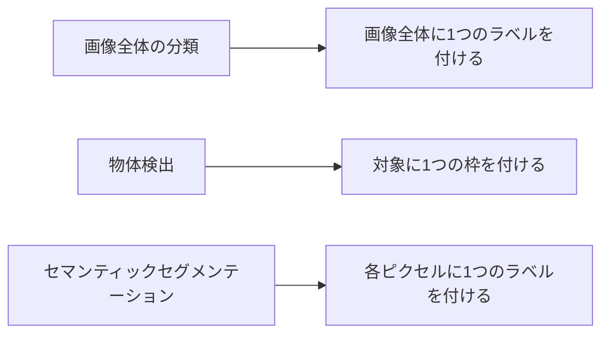

# 10.4.2 セマンティックセグメンテーション


:::tip この節の位置づけ
分類が答えるのは：

- この画像は何か

検出が答えるのは：

- 画像の中に何があるか、どこにあるか

セマンティックセグメンテーションは、さらに一歩進んでこう答えます：

> **画像の中の各ピクセルは、どのカテゴリに属するのか。**

これによって、視覚理解はより細かい粒度に進みます。
:::

## 学習目標

- セマンティックセグメンテーションと分類/検出の違いを理解する
- セグメンテーションの mask がなぜより細かい粒度なのかを理解する
- 実行可能な例を通して、ピクセル単位のラベルと IoU を理解する
- セマンティックセグメンテーションの基本的なタスク感覚を身につける

---

## まずは地図を1枚作ろう

分類と検出を学び終えたばかりなら、この節はまずこう理解するとよいです。

- 分類は画像全体に1つの答えを出す
- 検出は各対象に1つの枠を出す
- セグメンテーションは各ピクセルに1つのカテゴリを与える

つまり、この節で新しく増える核心は次の3つです。

- 出力の粒度が最も細かくなる
- 評価もより細かくなる
- モデルが「境界を理解できているか」がとても重要になる

セマンティックセグメンテーションを初心者が理解する順序としては、次の流れが最適です。



この節でいちばん大事なのは、先にネットワーク名を覚えることではなく、まず次を理解することです。

- セグメンテーションはなぜ検出より細かいのか
- mask がなぜ中心的な表現なのか

### 初心者にわかりやすい、より大きな比喩

分類、検出、セグメンテーションをまとめて見ると、こう考えられます。

- 分類は「この写真は主に何を撮ったの？」と聞く
- 検出は「画面の中にどんな対象があって、だいたいどこ？」と聞く
- セグメンテーションは「画像全体を塗り分けて、各ピクセルが誰のものか決める」と考える

こうすると、なぜセグメンテーションのほうが難しいのかがすぐに見えてきます。

- 1つの答えだけではない
- 枠をいくつか描くだけでもない
- 画像全体のすべての領域に責任を持つ必要がある

## 一、セマンティックセグメンテーションは何をしているのか？

目的は次のとおりです。

- 画像の各ピクセルにカテゴリを割り当てる

たとえば：

- 空
- 路面
- 人
- 車

### 初学者がまず覚えるべきことは？

まず押さえるべきなのは次の3つです。

1. 分類は画像全体にラベルを付ける
2. 検出は枠を出す
3. セグメンテーションは領域を出す

しかもこの「領域」はざっくりした目印ではなく、各ピクセルに所属カテゴリがある、という意味です。

### なぜ検出より細かいのか？

検出は枠を出すだけですが、  
セグメンテーションは領域の境界をより正確に示します。

### なぜこの節で「ピクセル単位」が特に大事なのか？

この節から、視覚タスクは単に次をするだけではなくなります。

- 対象を見つける
- 枠を付ける

それに加えて、次のような問いに答えるようになります。

- この領域は本当は何に属するのか
- この境界は本当に正しく描けているのか

なので、セマンティックセグメンテーションはまず次のように理解するとよいです。

> **画像全体を「各ピクセルに意味ラベルがある地図」に変えること。**

---

## 二、まずは最小のセグメンテーション mask 例を動かしてみよう

```python
pred_mask = [
    [0, 0, 1],
    [0, 1, 1],
    [0, 0, 1],
]

gt_mask = [
    [0, 0, 1],
    [0, 1, 1],
    [0, 1, 1],
]


def iou_for_class(pred, gt, target_class):
    inter = 0
    union = 0
    for pred_row, gt_row in zip(pred, gt):
        for p, g in zip(pred_row, gt_row):
            if p == target_class and g == target_class:
                inter += 1
            if p == target_class or g == target_class:
                union += 1
    return inter / union if union else 0.0


print("クラス1の IoU:", round(iou_for_class(pred_mask, gt_mask, 1), 4))
```

実行結果の例：

```text
クラス1の IoU: 0.8
```

ここではクラス `1` が前景領域です。前景ピクセルを1つ見落としているので、mask はかなり近く見えても、IoU はすでに `0.8` まで下がっています。

### この例でいちばん大事な直感は？

セグメンテーションの評価は「画像全体が正しいか」を見るのではなく、  
次を見ることです。

- 領域の重なりがどれくらい良いか

### なぜセグメンテーションの IoU は分類指標より存在感が大きいのか？

セグメンテーションでは、次のように考えるからです。

- カテゴリが合っているだけでは足りない
- 領域がだいたい重なって初めて、きちんと分けられたと言える

そのため、よく見る指標は次のようなものです。

- per-class IoU
- mIoU

単純な全体正解率だけを見ることはあまりありません。

だからこそ、IoU はセグメンテーションでとても重要です。

### 初心者がセグメンテーションを学ぶとき、まず押さえるべき3つは？

1. mask はピクセル単位のラベル図である
2. セグメンテーション評価は分類より領域の重なりを重視する
3. 小さいカテゴリと境界部分が特に難しい

### なぜセグメンテーションでは「見た目はだいたい合っているのに、指標が大きく違う」ことが起きやすいのか？

境界部分が少しずれたり、小さいカテゴリを少し見落としたりするだけで、  
IoU はかなり下がることがあります。

だからこそ、セグメンテーションは新人に次の意識を身につけてもらうのにとても向いています。

> **視覚結果は「それっぽく見える」だけでは不十分で、領域境界そのものが結果の一部である。**

### 初めてセグメンテーションを学ぶとき、見落としやすいものは？

見落としやすいのは次の3つです。

- 境界
- 小さいカテゴリ
- クラス不均衡

これらは可視化では少ししか見えないことが多いですが、  
IoU や実際の性能には大きく影響します。

### もう1つ、最小の「クラス不均衡」例を見てみよう

```python
mask = [
    [0, 0, 0, 0],
    [0, 1, 1, 0],
    [0, 0, 0, 0],
    [0, 0, 0, 0],
]


def class_counts(mask):
    counts = {}
    for row in mask:
        for value in row:
            counts[value] = counts.get(value, 0) + 1
    return counts


print(class_counts(mask))
```

実行結果の例：

```text
{0: 14, 1: 2}
```

前景は2ピクセルしかありませんが、背景は14ピクセルあります。だから、全体のピクセル精度が高くても、本当に重要な小さいクラスを失敗していることがあります。

この例はとても小さいですが、初心者が現実の問題をすぐ理解するのに役立ちます。

- 背景ピクセルは非常に多いことがある
- 本当に重要な小さいカテゴリは、ごく一部しかないことが多い

そのため、セグメンテーションで全体のピクセル正解率だけを見ていると、  
「背景を全部当てたから高得点」という状況にだまされやすいです。


:::tip 図の見方
セグメンテーションは「色を塗れたら終わり」ではありません。この図では、元画像、GT mask、予測 mask、IoU、境界誤差を並べて、なぜ小さいカテゴリや端の領域が mIoU に影響するのかをわかりやすく示しています。
:::

---

## 三、いちばんつまずきやすいポイント

### 境界が正確でない

セグメンテーションモデルは、物体の端で間違いやすいです。

### クラス不均衡が極端

背景が多すぎることがよくあり、  
小さい対象カテゴリは見落とされやすいです。

### 全体のピクセル正解率だけを見る

ピクセル正解率が高くても、小さいカテゴリが本当にうまく分けられているとは限りません。

### 色付き可視化だけを見て、失敗を分けて分析しない

初心者が最初にセグメンテーションをやると、きれいな mask 図を数枚貼って終わりにしがちです。  
でも、本当にプロジェクトを前に進めるのは、失敗例を次のように分けて見ることです。

- 境界の誤り
- 小さいカテゴリの見落とし
- カテゴリの混同
- ラベル自体に議論があるケース

こうして初めて、次に直すべきものがわかります。

- データ
- 損失関数
- サンプリング戦略
- それともモデル構造か

## 四、この節で持つべき正しい期待

この節で大事なのは、今日すぐ複雑なセグメンテーションモデルをマスターすることではありません。  
まず本当に見えてくるようになるべきなのは、次の点です。

- セグメンテーションは検出よりさらに細かい粒度である
- セグメンテーション結果は領域レベルの指標に強く依存する
- 小さいカテゴリと境界誤差が、実際の性能に大きく影響する

## 初めてセマンティックセグメンテーションのプロジェクトをやるときの、いちばん安定した順序

おすすめは次の順番です。

1. まずカテゴリ定義を絞る
2. 次に mask のラベル基準をそろえる
3. まず最小の baseline を作る
4. それから per-class IoU と失敗例を見る

このほうが、最初から複雑なネットワークを追うより、プロジェクトを整理しやすいです。

---

## これをプロジェクトとして見せるなら、何を出すとよいか

- 元画像
- 予測 mask
- GT mask
- per-class IoU
- 失敗例での境界比較

こうすると、ただ「色付き mask 画像を1枚貼る」より、ずっと本物のプロジェクトらしくなります。

---

## まとめ

この節でいちばん大事なのは、次の判断を持つことです。

> **セマンティックセグメンテーションはピクセル単位の分類を行うため、分類や検出よりも細かい粒度で、領域レベルの評価に強く依存する。**

## この節で必ず持ち帰りたいこと

- セグメンテーションの中心は mask であり、画像全体ラベルでも枠でもない
- IoU はセグメンテーションで脇役ではなく、中心的な評価視点である
- 境界とクラス不均衡はセグメンテーションのよくある難所である

一言でまとめるなら、こうです。

> **セマンティックセグメンテーションはピクセル単位の意味地図を作ることであり、本当に見るべきなのは「認識できたか」だけでなく、「領域の境界が正しく描けているか」でもある。**

## 練習

1. `pred_mask` を自分で少し変えて、IoU がどう変わるか観察してみましょう。
2. なぜピクセル正解率が高くても、セグメンテーションモデルが本当に良いとは限らないのでしょうか？
3. セマンティックセグメンテーションと物体検出の最大の違いは何でしょうか？
4. クラス不均衡が非常に強いとき、最も心配すべき問題は何でしょうか？
