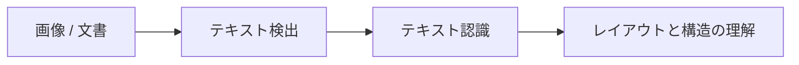

# OCR 文字認識【選択】


:::tip この節の位置づけ
OCR は一言で説明されがちです。

- 画像の中の文字を認識する

でも、実際のプロジェクトでは、もっと細かい問題があります。

- 文字はどこにあるか
- 読む順番はどうか
- 複数カラムのレイアウトはどう読むか
- 斜めやぼやけはどうするか

そのため OCR は、単一のモデルというより、パイプラインに近いものです。
:::

## 学習目標

- OCR における「検出」と「認識」の違いを理解する
- 文書レイアウトがなぜさらに複雑さを増すのかを理解する
- 実行できるサンプルを通して OCR パイプラインの感覚をつかむ
- OCR がフォーム、票票、文書シーンで持つ特有の難しさを理解する

---

## まずは全体像をつかもう

この節で初心者に一番おすすめなのは、「まず認識結果を見る」ことではなく、先にパイプライン全体をはっきりさせることです。



この節で本当に解決したいのは、次の点です。

- なぜ OCR は単一モデルではないのか
- なぜ検出、認識、レイアウト理解を分けて考える必要があるのか

## 一、OCR は通常どのような手順に分かれるのか？

### 1. テキスト検出

まず、文字領域がどこにあるかを見つけます。

### 2. テキスト認識

次に、各文字領域を文字列に変換します。

### 3. レイアウトと構造の理解

複雑な文書では、さらに次のようなことに答える必要があります。

- どの段落から読むか
- どこがタイトルか
- どこが表や本文か

### 1.4 初心者向けの、よりわかりやすいたとえ

OCR は、1枚の請求書を3人のチームで処理するようなものだと考えるとわかりやすいです。

1. 1人目が、まずすべての文字を囲みます
2. 2人目が、囲まれた文字を読み取ります
3. 3人目が、それらの文字のうち、どれがタイトルで、どれが金額で、どれが日付かを判断します

このように考えると、OCR はもう、

- 何だかよくわからない大きなモデルのブラックボックス

ではなく、

- 役割が明確に分かれたパイプライン

として見えるようになります。

---

## 二、まずは最小の OCR パイプライン例を見よう

```python
image_blocks = [
    {"box": (0, 0, 50, 20), "pixels": "INV-001"},
    {"box": (0, 30, 80, 50), "pixels": "TOTAL 299"},
]


def detect_text_regions(image_blocks):
    return [block["box"] for block in image_blocks]


def recognize_text(image_blocks):
    return [{"box": block["box"], "text": block["pixels"]} for block in image_blocks]


regions = detect_text_regions(image_blocks)
texts = recognize_text(image_blocks)

print("regions:", regions)
print("texts:", texts)
```

### 2.1 この例でいちばん重要な点は何ですか？

この例では、次の2つをはっきり分けています。

- 文字がどこにあるかを見つける
- 文字を読み取る

これこそが、OCR の最も基本的な2段階構造です。

### 2.2 なぜ OCR のエラーは「文字そのものの認識」以外でも起きるのか？

検出段階で文字枠を切り間違えると、

- 一部を見落とす
- 順番が崩れる

といった問題が起きます。

その場合、後段の認識モデルがどれだけ強くても、完全には取り戻せません。

### 2.3 初めて OCR を学ぶ人が、最初に覚えるべきことは？

まず覚えるべきなのは、次の3つです。

1. 検出は「文字がどこにあるか」を担当する
2. 認識は「文字が何か」を担当する
3. 文書シーンでは「どこから読むか」「どの塊に属するか」も大事になる

---

## 三、OCR はなぜ想像以上に難しいことが多いのか？

### 3.1 文字はいつも整った配置ではない

次のようなケースがあります。

- 斜め
- 透視変形
- ぼやけ
- 隠れ

### 3.2 文書はいつも1カラム・1行ではない

たとえば、

- 表
- 請求書
- 医療書類

のようなものがあります。

この場合、「文字を認識する」だけではまだ第一歩にすぎません。  
本当に難しいのは、構造を理解することです。

### 3.3 文字レベルのミスは下流の業務に影響する

番号、金額、日付のような項目では、  
1文字でも誤ると業務に直接影響することがあります。

### 3.4 もう一度、最小の「読み順復元」例を見よう

```python
lines = [
    {"y": 80, "text": "TOTAL 299"},
    {"y": 20, "text": "INVOICE"},
    {"y": 50, "text": "INV-001"},
]


def restore_reading_order(lines):
    return [item["text"] for item in sorted(lines, key=lambda x: x["y"])]


print(restore_reading_order(lines))
```

この小さな例は、初心者が大事な感覚をつかむのに役立ちます。

- OCR は認識が終わったら終わりではない
- 文字の順番や構造の復元も、同じくらい重要なことが多い


:::tip 図の読み方
OCR プロジェクトは3段階で確認すると整理しやすいです。テキスト検出で枠が合っているか、テキスト認識で正しく読めているか、レイアウト構造で順番を復元できているかを見ます。票票、表、2カラム文書では、3段階目で失敗することがよくあります。
:::

## 四、初心者がそのまま真似しやすい進め方

より安定しやすい順番は、たいてい次の通りです。

1. まずは見やすい単カラムの小さなサンプルで始める
2. 次に、斜めやぼやけのあるサンプルを見る
3. その後、レイアウト順序と構造理解を追加する
4. 最後に、票票や表のようなさらに複雑な文書へ進む

この順番のほうが、最初から複雑な票票システムを作るより、ずっと安定しやすいです。

### 4.1 OCR をプロジェクトにするなら、最初にどんな題材を選ぶべき？

より始めやすい題材は、たとえば次のようなものです。

- 見やすい票票の項目抽出
- シンプルな単カラム文書認識
- 少数の固定テンプレートフォーム

このような題材のよい点は、次の通りです。

- 検出領域がわかりやすい
- 業務項目の評価がしやすい
- 失敗サンプルを分析しやすい

### 4.2 OCR をプロジェクトとして見せるなら、何を最初に見せるとよい？

実際のプロジェクトらしく見せるなら、次の順番がおすすめです。

1. 元画像
2. テキスト検出枠
3. 認識後のテキストブロック
4. 復元後の項目や読み順
5. 失敗サンプルの分析

こうすると、読み手は一目で次を理解できます。

- どの段階で問題が起きたのか
- システムがどの部分を重点的に改善したのか

---

## 五、最もつまずきやすいポイント

### 5.1 認識精度だけを見て、検出品質を見ない

OCR は複数段階のパイプラインです。前の段階のミスは後ろに伝わります。

### 5.2 文字認識だけをして、構造復元をしない

文書系プロジェクトで本当に必要なのは、次のようなものです。

- 項目
- 表構造
- 読み順

### 5.3 画像前処理を無視する

たとえば、

- 二値化
- ノイズ除去
- 傾き補正

は、多くの場面でとても重要です。

### 5.4 より実務に近い最小のエラーカテゴリ表

```python
errors = [
    {"type": "detection_miss", "count": 4},
    {"type": "wrong_character", "count": 7},
    {"type": "reading_order", "count": 3},
]

for item in errors:
    print(f"{item['type']}: {item['count']}")
```

この表はシンプルですが、実際の OCR プロジェクトで最初にやることに近いです。

- まず、エラーの主因が検出なのか、認識なのか、構造復元なのかを分けて考える

これをしないと、次のようになりがちです。

- 認識モデルを次々に入れ替える
- でも本当の問題は検出や読み順だった

---

## 六、作品集として見せるなら、何を一番見せるべきか

- 元画像
- 検出枠の結果
- 認識テキストの結果
- 項目復元の結果
- 典型的な失敗サンプル

このほうが、単に「どの文字を認識したか」だけを見せるより、実際の document AI プロジェクトらしく見えます。

---

## まとめ

この節で最も大事なのは、パイプラインとして見ることです。

> **OCR は単一の「文字を読むモデル」ではなく、テキスト検出、テキスト認識、レイアウト理解を含む多段階システムです。**

この流れが理解できれば、その後に票票、フォーム、文書理解のプロジェクトを作るときも、認識モデルだけを見て迷うことは少なくなります。

## この節で特に持ち帰るべきこと

- OCR の中心は単一モデルではなく、パイプラインである
- 多くの問題は、検出と構造の段階で上限が決まる
- 文書系 OCR は、レイアウトと項目復元を別に考える価値が高い

## 練習

1. サンプルに新しい文字ブロックを1つ追加して、読み順をどう復元するか考えてみましょう。
2. なぜ検出段階のエラーは、OCR の最終結果を大きく悪くするのでしょうか？
3. 票票や表と、街中の看板文字認識では、どの段階の難しさが最も違うでしょうか？
4. 金額欄がいつも1文字間違うなら、まず検出、認識、それとも後処理のどこを確認しますか？ なぜですか？
