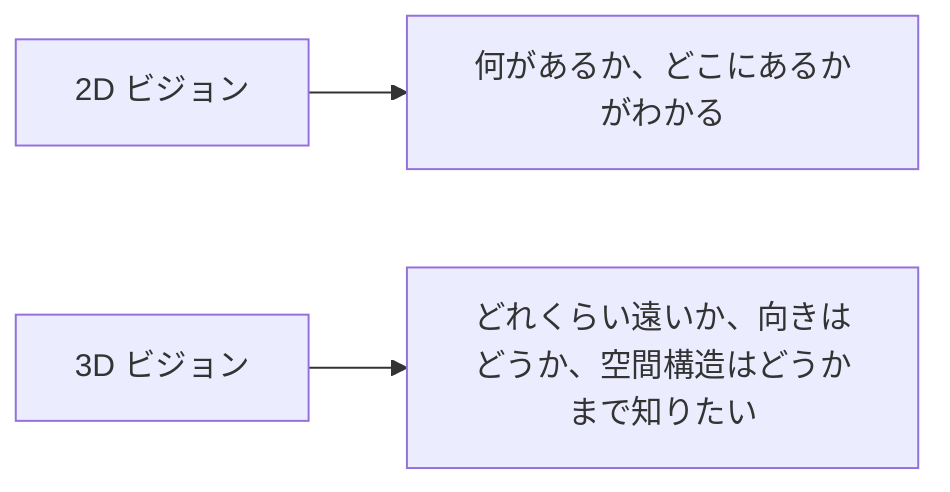

# 10.5.5 3Dビジョン入門【選択】

:::tip この節の位置づけ
2Dビジョンは主に平面画像の中で内容を理解します。  
3Dビジョンは、そこからもう一歩進みます。

> **画像の中に何があるかを知るだけでなく、それが空間の中でどれくらい離れているのか、向きはどうか、構造はどうなっているかも知りたい。**

これが、普通のCVとの大きな違いです。
:::

## 学習目標

- 深度、点群、多視点幾何の基本的な直感を理解する
- 3Dビジョンが2Dより難しい理由を理解する
- 実行できる例を通して、深度推定の最小限の直感を身につける
- 3Dビジョンのよくある応用場面を知る

---

## まずは全体像をつかもう

3Dビジョンを初心者向けに理解するなら、「1次元増えた」と考えるより、どこが難しくなるのかを見るほうが大事です。



この節で本当に身につけてほしいのは、次の2点です。

- 平面の理解と空間の理解の違い
- 深度、点群、多視点幾何がそれぞれ何を解決するのか

### 初心者にわかりやすい全体のたとえ

2Dと3Dの違いは、こんなふうに考えるとわかりやすいです。

- 2Dは旅行写真を見るようなもの
- 3Dは実際にその場に立って、人がどれくらい離れているか、机がどれくらい高いか、車が左前にあるか右前にあるかを知りたい感じ

つまり、3Dビジョンで新しく重要になるのは、

- 空間関係そのものを気にすること

です。

## 一、3Dビジョンでいちばん大事な新しい問題は何か？

2D画像では、多くの場合は次のことを気にします。

- カテゴリ
- 位置

3Dビジョンでは、さらに次のことも気にします。

- 距離
- 体積
- 空間構造

### たとえで理解する

2Dは地図のスクリーンショットを見る感じに近いです。  
3Dは本当にその場に立っていて、次のことを知りたい感じです。

- この物体はどれくらい離れているか

---

## 二、よく出る3Dビジョンの概念

### 深度（Depth）

各点がカメラからどれくらい離れているか。

### 点群（Point Cloud）

シーンを、3次元座標を持つたくさんの点で表したもの。

### 多視点幾何

複数の視点の対応関係を使って、3次元構造を復元する考え方。

---

## 三、まずは最小限の深度の直感を見てみよう

```python
def estimate_depth(focal_length, baseline, disparity):
    if disparity == 0:
        return float("inf")
    return focal_length * baseline / disparity


focal_length = 800
baseline = 0.12

for disparity in [40, 20, 10]:
    depth = estimate_depth(focal_length, baseline, disparity)
    print({"disparity": disparity, "depth": round(depth, 4)})
```

実行結果の例：

```text
{'disparity': 40, 'depth': 2.4}
{'disparity': 20, 'depth': 4.8}
{'disparity': 10, 'depth': 9.6}
```

視差が小さくなるほど、推定される depth は大きくなります。ステレオ幾何を詳しく学ぶ前に、まずこの直感を押さえてください。

### この例でいちばん伝えたいことは？

これは、ステレオビジョンのいちばん大事な直感を表しています。

- 視差が大きいほど、ふつうは近い
- 視差が小さいほど、ふつうは遠い

### なぜこれが大事なのか？

画像の中の点が、初めて現実の3次元空間とつながるからです。

### 初心者が3Dビジョンを学ぶとき、まず覚えるべき3つは？

1. 深度  
   まずは「カメラからどれくらい離れているか」を理解する。

2. 点群  
   3Dの世界は、たくさんの空間点で表せると理解する。

3. 視差  
   複数視点でなぜ空間距離が復元できるのかを理解する。

### さらに最小限の「深度から点を復元する」例

```python
pixels = [
    {"u": 10, "v": 20, "z": 2.0},
    {"u": 12, "v": 21, "z": 2.5},
]


def to_point(pixel):
    return (pixel["u"] * pixel["z"], pixel["v"] * pixel["z"], pixel["z"])


points = [to_point(pixel) for pixel in pixels]
print(points)
```

実行結果の例：

```text
[(20.0, 40.0, 2.0), (30.0, 52.5, 2.5)]
```

これは簡略化した point cloud の直感です。各画像点が depth を持つと、その点を 3D 空間上の点として想像できます。

この例は厳密なカメラモデルではありません。  
ただし、初心者がまず直感をつかむには役立ちます。

- すでに深度がわかっていれば
- 画像の中の点を、空間の点として考え直せる

これが「点群っぽさ」を最初に理解するいちばん簡単な入口です。


:::tip 図の見方
3Dビジョンで本当に新しくなるのは空間関係です。  
この図を見るときは、まず disparity が depth にどう影響するかを見て、その次に、ピクセルが深度を持つことでどう point cloud になるかを見てください。最後に、カメラパラメータと多視点幾何がなぜ重要なのかを考えるとよいです。
:::

---

## 四、3Dビジョンはなぜ難しいのか？

### データを集めるのが難しい

2D画像は集めやすいですが、  
3Dのラベルや深度データは、ふつうもっと高価です。

### 幾何関係が複雑

見た目だけを処理するのではなく、  
次のようなものも扱う必要があります。

- カメラパラメータ
- 視点の変化
- 空間的一貫性

### 可視化とデバッグも難しい

2次元画像の誤りはすぐ見つけやすいですが、  
3次元構造の誤りは目で見てもわかりにくいことが多いです。

---

## 五、よくある勘違い

### 勘違い1：3Dビジョンは「1次元増える」だけ

それだけではありません。  
新しい幾何学的な問題が増えます。

### 勘違い2：2Dがうまくできれば自然に3Dもできる

役立ちはしますが、空間幾何の直感は別に補う必要があります。

### 勘違い3：最初から複雑な3Dネットワークを使えばよい

より安定したやり方は、まず次をしっかり固めることです。

- 深度
- 視差
- 点群

### 最初に3Dプロジェクトをやるときの、いちばん安定した順番

だいたい次の順番がよいです。

1. まずは単一目的の小さな場面を選ぶ
2. まず深度と視差を理解する
3. 2次元の点と3次元の点の対応を理解する
4. それから点群や多視点幾何に進む
5. 最後に、より複雑な再構成や3D検出を見る

こうすると、最初から複雑な3Dネットワークを読むより、ずっと安定します。

## この節で持つべき正しい学習期待

この節の目的は、すぐに複雑な3次元再構成まで行くことではありません。  
まず本当に気づいてほしいのは、次のことです。

- 3Dビジョンは2Dビジョンより空間幾何の問題が増える
- そのため、データ、モデリング、評価、デバッグの難しさにも影響する

---

## まとめ

この節でいちばん大事なのは、次の判断を持つことです。

> **3Dビジョンの本当の価値は、画像理解を平面から空間構造へ広げることにある。そしてその分、2Dビジョンより1層多い幾何学的な難しさがある。**

## この節で特に持ち帰るべきこと

- 3Dビジョンは「1次元増える」だけではない
- 深度、視差、点群は、まず固めるべき3つの直感
- 先に空間感覚を学んでから複雑なモデルを見るほうが、ずっと安定する

## これをプロジェクトにするなら、何を見せるとよいか

- 小さな深度推定、またはステレオの例
- 深度マップと元画像の比較
- 画像上の点から空間上の点への最小限の可視化
- 「近い／遠い」の判断ミスの例

こうすると、ただ「3Dビジョンをやりました」と言うより、ずっと説得力があります。

---

## 練習

1. `disparity` を変えて、深度がどう変わるか観察してみましょう。
2. 3Dビジョンが2Dビジョンより幾何の直感に強く依存するのはなぜですか？
3. 点群が3D表現として自然だと言えるのはなぜですか？
4. どんな応用が、2D検出だけでは足りず、3Dビジョンに強く依存するでしょうか？
