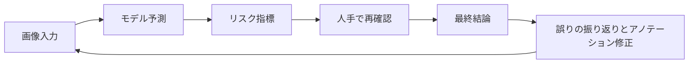

# プロジェクト：医用画像解析【選択】

:::tip この節の位置づけ
医用画像プロジェクトと普通の画像プロジェクトの大きな違いは、モデルの名前が変わることではなく、次の点にあります。

- エラーの代償が大きい
- データが高価
- アノテーションが難しい
- 本番導入の境界がより繊細

だからこそ、「高リスクな AI プロジェクト」を見極める練習にとても向いています。
:::

## 学習目標

- 医用画像プロジェクトの範囲を十分に明確に定められるようになる
- アノテーション、指標、臨床リスクをまとめてプロジェクト定義に書けるようになる
- 臨床補助システムらしい評価の見せ方を設計できるようになる
- この種のプロジェクトを、見栄えのする demo ではなく、作品レベルのページに仕上げられるようになる

---

## まずは地図を作ろう

医用画像プロジェクトは、「タスク境界 -> リスク指標 -> 人手による再確認 -> 失敗例の振り返り」という順で理解すると整理しやすいです。


この節で本当に解決したいのは、次のことです。

- 医用画像プロジェクトで、なぜ普通の画像プロジェクトの考え方をそのまま当てはめてはいけないのか
- なぜこの種のプロジェクトでは境界、リスク、再確認が特に重視されるのか

---

## 一、なぜプロジェクト題目を必ず絞る必要があるのか？

作品集に向いている題目の例は、次のようなものです。

> **「肺の病変領域セグメンテーション補助システム」を作る。CT slice を入力し、病変領域の mask とリスク説明を出力する。**

### なぜこの題目がよいのか？

- 入力と出力が明確
- 指標を説明しやすい
- リスクの境界がはっきりしている

### なぜ最初から大きくしすぎないほうがよいのか？

たとえば、

- 複数臓器、複数疾患、複数モダリティをカバーする

といった設計にすると、最初から検証可能性が失われてしまいます。

---

## 二、作品レベルの医用画像プロジェクトに必要な最小閉ループ

1. タスクと臨床上の境界を定義する
2. アノテーション方針を説明する
3. baseline を選ぶ
4. 高リスク指標を定義する
5. 成功例と失敗例を見せる
6. 人手による再確認と適用範囲を明確にする

これらが説明されていないと、プロジェクトはなかなか信頼されません。

### 2.1 実際の臨床補助システムに近い閉ループ図



この閉ループが重要なのは、医用画像プロジェクトが通常、

- モデルを動かしたら終わり

ではないからです。

むしろ、

- まずモデルが補助判断を出す
- そのあと人が確認する
- 失敗サンプルを元に、データやルールを修正する

という流れになります。

---

## 三、まずは実際のプロジェクトに近い設定を見てみよう

```python
from dataclasses import dataclass, field


@dataclass
class MedicalProject:
    task: str
    input_type: str
    labels: list
    metrics: list
    clinical_constraints: list
    risks: list = field(default_factory=list)


project = MedicalProject(
    task="肺の病変領域セグメンテーション",
    input_type="CT slice",
    labels=["background", "lesion"],
    metrics=["dice", "iou", "sensitivity", "false_negative_rate"],
    clinical_constraints=[
        "高リスクサンプルは必ず人手で再確認する",
        "結果は補助用途に限定し、臨床判断を直接置き換えない",
    ],
    risks=["アノテーションの不一致", "クラスの極端な不均衡", "false negative の代償が大きい"],
)

print(project)
```

### 3.1 なぜここで `clinical_constraints` を別にしているのか？

この種のプロジェクトは、普通の画像プロジェクトと大きく違う点の一つとして、

- モデルの成績だけを見るのではない
- 臨床での使い方の境界も見る

という点があります。

ここが、より実際の高リスクプロジェクトらしいところです。

---

## 四、なぜこの種のプロジェクトでは false negative が特に怖いのか？

モデルが病変を見逃した場合、  
通常は、疑わしい領域を多めに出すよりもリスクが高くなります。

そのため、作品レベルのプロジェクトでは、次の指標を個別に見せる価値があります。

- sensitivity / recall
- false negative rate

全体 accuracy だけを載せるよりも、ずっと重要です。

### 4.1 初学者向けのわかりやすい例え

医用画像システムを、次のようなものだと考えてみてください。

- 空港の手荷物検査機

怪しい荷物を少し多めに見つけて、検査員に再確認してもらうのは問題ありません。  
でも、本当に危険な荷物を完全に見逃すと、もっと深刻な問題になります。

だからこそ、医用画像の多くの場面では、

- false positive は煩わしい
- false negative はもっと危険

と言えます。

### 4.2 最小の「症例再確認優先度」例

```python
cases = [
    {"id": "case-001", "lesion_score": 0.91, "size_mm": 18},
    {"id": "case-002", "lesion_score": 0.44, "size_mm": 5},
    {"id": "case-003", "lesion_score": 0.78, "size_mm": 22},
]


def review_priority(case):
    if case["lesion_score"] >= 0.85:
        return "high"
    if case["lesion_score"] >= 0.6 or case["size_mm"] >= 20:
        return "medium"
    return "low"


for case in cases:
    print(case["id"], review_priority(case))
```

この例は小さいですが、すでに実際のプロジェクトの考え方を表しています。

- すべてのサンプルを同じようには扱わない
- 高リスクサンプルは優先して人手で再確認する

---

## 五、最小の「高リスク指標の優先順位」例

```python
metrics = {
    "dice": 0.81,
    "iou": 0.69,
    "sensitivity": 0.92,
    "false_negative_rate": 0.08,
}


def risk_summary(metrics):
    if metrics["false_negative_rate"] > 0.1:
        return "現在の false negative はやや高く、高リスク補助システムとしてそのまま使うのは適切ではありません。"
    if metrics["sensitivity"] < 0.9:
        return "再現率がまだ低めなので、まず病変検出率の改善を優先することをおすすめします。"
    return "指標はひとまず使えますが、人手による再確認と臨床検証を組み合わせる必要があります。"


print(risk_summary(metrics))
```

### 5.1 これが、ただ数字を並べるだけより価値がある理由

指標を、次のような「プロジェクト判断に使える言葉」に変えているからです。

- このプロジェクトは今どの段階か
- どこが危険なのか
- 何を優先して改善すべきか

医用画像では、これはとても重要です。

### 5.2 初学者が先に覚えやすい評価表

| 指標 | 何を答えているか |
|---|---|
| Dice / IoU | 領域を正しく分けられているか |
| Sensitivity / Recall | 本当の病変をできるだけ見つけられているか |
| False Negative Rate | 高リスクサンプルを見逃す割合がどれくらいか |
| 人手再確認の通過率 | 実際の補助フローに入れそうか |

この表は初心者にとても向いています。  
医用画像の評価を「指標名が増えるだけの話」ではなく、「その指標は誰のためのものか」という視点に戻してくれるからです。


:::tip 読み方のヒント
医用画像プロジェクトでは、きれいな mask を見せるだけでは不十分です。この図を見るときは、タスク境界、アノテーション方針、sensitivity、false negative rate、人手再確認、失敗サンプルのフィードバックという順で、そのプロジェクトが信頼できるかを判断してください。
:::

---

## 六、医用画像プロジェクトで何を見せるべきか？

少なくとも、次の内容は見せるのがおすすめです。

1. 元画像
2. 専門家によるアノテーション mask
3. モデル予測 mask
4. 失敗例
5. リスク境界の説明

### なぜ、これらが「きれいな成功例を数枚」より大事なのか？

高リスクプロジェクトで大切なのは、次の3つだからです。

- 信頼できること
- 説明できること
- 境界が明確であること

### 6.1 初めてこの種のプロジェクトを作るときの、いちばん堅い進め方

一般的には、次の順番が安定しています。

1. まずタスクを一つの疾患、または一つの臓器まで絞る
2. まずは二値分類か単一クラス分割の baseline を作る
3. まずアノテーション方針とリスク境界を明確に書く
4. そのあとで sensitivity、false negative rate などの高リスク指標を追加する
5. 最後に成功例、失敗例、人手再確認の流れを見せる

こうすると、最初から次を狙うよりも、はるかに信頼できるプロジェクトにしやすいです。

- 複数疾患
- 複数モダリティ
- 複数タスク

### 6.2 作品集に入れるなら、何を見せるとよいか

見せるべきなのは、モデルスコアだけではありません。むしろ次の点が重要です。

1. なぜここまで狭くタスクを絞ったのか
2. なぜ false negative を重点リスクにしたのか
3. モデル結果がどう人手再確認フローに入るのか
4. 失敗例はどんなものか
5. このプロジェクトの境界はどこか

こうすると、採用担当や読者に次のことが伝わりやすくなります。

- システム全体を理解している
- 単に分割モデルを動かせるだけではない

### 6.3 初学者がそのまま使いやすいエラー分析の順番

最初のエラー分析は、次の順番が堅実です。

1. まず見逃しと誤検出を分ける
2. 次に高リスクサンプルが特に間違いやすいかを見る
3. 次に、境界の問題とアノテーションの問題のどちらが大きいかを見る
4. 最後に、データ追加、ルール追加、モデル変更のどれが必要かを決める

こうしたほうが、いきなりネットワークを変えるよりも、本当の問題が見えやすくなります。

それではなく、視覚的な見せ方だけを重視するのではありません。

---

## 七、よくある落とし穴

### 7.1 全体 accuracy だけを見る

### 7.2 アノテーションの一貫性の問題を書かない

### 7.3 人手再確認の境界を説明しない

### 7.4 きれいな成功例だけを見せて、高リスクの失敗例を見せない

医用画像プロジェクトは、「見た目は強そう」に見えやすいです。  
成功例は直感的にわかりやすいからです。  
でも、本当に価値が高いのは、次のような点です。

- どの症例が見逃されやすいか
- どの境界が誤分類されやすいか
- これらの誤りが人手の補助判断に影響するか

---

## まとめ

この節で最も大事なのは、作品レベルの判断基準を作ることです。

> **医用画像プロジェクトが本当にプロジェクトらしくなるのは、モデルがどれだけ複雑かではなく、タスク境界、アノテーション方針、重要指標、リスク説明をまとめて、きちんと説明できるかどうかです。**

これができれば、この種のプロジェクトは非常に説得力のあるものになります。

## この節でいちばん持ち帰るべきこと

- 医用画像プロジェクトは、普通の画像プロジェクトよりもリスク境界を強く意識する
- 多くの場合、sensitivity と false negative rate は全体 accuracy より重要
- 信頼できる医用画像プロジェクトでは、人手再確認と適用範囲を必ず一緒に説明する

---


## バージョン進行のおすすめ

| バージョン | 目的 | 重点成果物 |
|---|---|---|
| 基礎版 | 最小閉ループを通す | 入力できる、処理できる、出力できる、そしてサンプルを 1 つ残す |
| 標準版 | 見せられるプロジェクトにする | 設定、ログ、エラー処理、README、スクリーンショットを追加する |
| 発展版 | 作品集レベルに近づける | 評価、比較実験、失敗例分析、次のロードマップを追加する |

まずは基礎版を完成させるのがおすすめです。最初から大きく全部を作ろうとしないでください。バージョンを 1 つ上げるたびに、「何が新しくできるようになったか、どう検証したか、まだ何が課題か」を README に書きましょう。

## 練習問題

1. プロジェクトをさらに小さくして、二値スクリーニングタスクに変え、`clinical_constraints` を書き直してみましょう。
2. 医用画像プロジェクトで `false_negative_rate` が、全体 accuracy よりも個別に見せる価値が高いのはなぜでしょうか？
3. アノテーションの一貫性が低いとき、モデル結果はどう解釈すべきか考えてみましょう。
4. このプロジェクトを作品集に入れるなら、どのリスク説明を特に強調したいですか？
