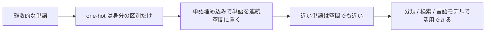

# 11.2.2 単語埋め込み


:::tip この節の位置づけ
NLP をやるとき、モデルは「返金」「証明書」「パスワード」といった単語そのものを直接理解しているわけではありません。  
最初に見るのは次のようなものです。

- ひと続きの番号
- それがさらにひと続きのベクトルに変わったもの

単語埋め込みの価値はここにあります。

> **単語をただの番号にするだけでなく、ベクトル空間の中で意味の関係も表せるようにすること。**

この部分を本当に理解できていないと、あとで文脈表現、BERT、検索ベクトルを学ぶときに手応えがなくなります。
:::

## 学習目標

- one-hot 表現がなぜ不十分かを理解する
- 単語埋め込みがなぜ類似性を表せるのかを理解する
- コサイン類似度のような、もっともよく使う類似度の直感を身につける
- 実行できるサンプルを通して「単語ベクトル空間」の最初の感覚をつかむ

## 歴史的背景：Word2Vec はなぜ NLP の重要な節目になったのか？

この節でいちばん知っておきたい歴史的ポイントは次です。

| 年 | 論文 / 手法 | 主な著者 | もっとも重要に解決したこと |
|---|---|---|---|
| 2013 | Word2Vec | Mikolov ら | 単語に分散表現を持たせ、NLP を「単語が出たかどうか」から「単語同士の関係も計算できる」段階へ進めた |

初心者がまず覚えるべきなのは次のことです。

> **Word2Vec の意味は、単に「単語ベクトルがかっこいい」ことではなく、「意味が近い」をベクトル空間の中で初めて計算可能な関係にしたことです。**

---

## まず地図を1枚作る

one-hot、BoW、TF-IDF を学び終えたなら、この節は自然な続きです。

- これまでの方法で、テキストを数字に変換できるようになった
- この節では「その数字にどうやって意味の関係を持たせるか」を扱う

つまり、この節で本当に大事なのは「また別の表現方法」を覚えることではなく、次のように変わることです。

- 表現が「計算できる」から「意味の構造を持っている」に進む

単語埋め込みを学ぶとき、初心者にいちばん合っている理解の順番は、いきなりいくつかのベクトル手法を暗記することではありません。まず次をはっきりさせることです。



つまり、この節が本当に解決したいのは次の点です。

- なぜ one-hot では足りないのか
- なぜ「単語どうしの関係」を計算できる距離に変える必要があるのか

### 初心者向けの、よりよい全体たとえ

これらの表現方法は、次のように考えるとわかりやすいです。

- one-hot は、各単語に社員番号を配るようなもの
- 単語埋め込みは、各単語を「意味の地図」に置くようなもの

社員番号なら誰が誰かは区別できますが、  
- どの単語どうしが似ているか
- どの単語が同じ種類の場面によく出るか

は見えません。

でも地図の座標にすると、「近い」ということが初めて計算できるようになります。

## 一、なぜ単語埋め込みが必要なのか？

### one-hot は身分しか区別できず、関係を表せない

語彙に次の単語があるとします。

- `返金`
- `返品`
- `パスワード`

one-hot を使うと、それぞれはたとえば次のようになります。

- `返金` は `[1, 0, 0]`
- `返品` は `[0, 1, 0]`
- `パスワード` は `[0, 0, 1]`

問題はここです。

- `返金` と `返品` は意味がかなり近い
- でも one-hot では、どれも同じように「遠い」

### 単語埋め込みは何をしているのか？

単語埋め込みがやることは次の通りです。

- 単語を低次元ベクトルに写す
- 意味が近い単語ほど、ベクトル空間で近くなるようにする

つまり、これは単なる「符号化」ではなく、次のことをしているのです。

- 意味表現

### たとえ話

単語埋め込みは地図の座標のようなものだと考えられます。

- one-hot は身分証番号に近い
- 単語埋め込みは地図上の位置に近い

身分証番号では人を区別できても、誰と誰が近くに住んでいるかはわかりません。  
一方、地図の座標なら「近い」という関係を計算できます。

### 初めて単語埋め込みを学ぶとき、まず何をつかむべきか？

まずつかむべきなのは、学習方法ではなく、この一文です。

> **単語埋め込みのいちばん重要な価値は、「単語どうしの関係」も表現に持ち込めることです。**

これがしっかりすると、あとで出てくる次の概念が理解しやすくなります。

- コサイン類似度
- 近傍単語
- 文脈表現

---

## 二、単語埋め込みはどうやって意味を学ぶのか？

### 基本仮説：文脈が似ていれば、意味も似ていることが多い

2つの単語が似た文脈に頻繁に現れるなら、  
モデルはそれらを近いベクトルとして学習する傾向があります。

たとえば：

- `返金`
- `返品`

は次のような文脈に一緒に出やすいかもしれません。

- アフターサービス
- 注文
- 申請

このため、空間の中でも近くなっていきます。

### ベクトルが「近い」ことは、完全な同義を意味しない

これはたいてい、次のような意味を表します。

- 用法が近い
- 文脈分布が近い

なので、単語埋め込みにおける「近い」は、多くの場合、分布的な意味での近さです。辞書的な意味で完全に同じ、というわけではありません。

### なぜこれだけでも十分価値があるのか？

このような空間関係ができると、  
多くのタスクでそれを利用できます。

- 類似語の検索
- テキスト分類
- 検索
- クラスタリング

### なぜ「分布が似ている」ことが NLP の主流を変えるのか？

ここからモデルは、単に次のことを考えるだけではなくなります。

- この単語が出たかどうか

それよりも次のことを考えやすくなります。

- この単語はどんな文脈と一緒に出ることが多いか
- 意味空間の中でどの種類の単語に似ているか

これが、後の表現学習がより深い方向へ進んでいく出発点です。

---

## 三、まずは単語ベクトルの類似度を試してみる

次の例では、3つのことを行います。

1. いくつかの単語に小さな埋め込みを定義する
2. それらのコサイン類似度を計算する
3. どの単語がより近いかを比較する

```python
from math import sqrt

embeddings = {
    "refund": [0.90, 0.80, 0.10],
    "return": [0.88, 0.78, 0.12],
    "invoice": [0.15, 0.85, 0.20],
    "password": [0.10, 0.15, 0.95],
}


def cosine(a, b):
    dot = sum(x * y for x, y in zip(a, b))
    norm_a = sqrt(sum(x * x for x in a))
    norm_b = sqrt(sum(x * x for x in b))
    return dot / (norm_a * norm_b)


print("refund vs return  :", round(cosine(embeddings["refund"], embeddings["return"]), 4))
print("refund vs invoice :", round(cosine(embeddings["refund"], embeddings["invoice"]), 4))
print("refund vs password:", round(cosine(embeddings["refund"], embeddings["password"]), 4))
```

実行結果の例：

```text
refund vs return  : 0.9998
refund vs invoice : 0.78
refund vs password: 0.261
```

このおもちゃのベクトルでは、`refund` と `return` はほぼ同じ方向を向き、`password` はかなり離れています。実務ではこのような距離感が、分類、検索、類似語の発見に使われます。

### この例でいちばん大事な直感は何か？

次のような結果が見えるはずです。

- `refund` と `return` はより近い
- `password` とはより遠い

これが単語埋め込みの最重要な直感です。

> **「意味が近い」は「ベクトルが近い」に変えられる。**

### なぜここではコサイン類似度を使うのか？

私たちがよく見たいのは次のことだからです。

- 方向が似ているか

絶対的な長さよりも、こちらの方が重要なことが多いです。  
コサイン類似度はこの比較にちょうど向いています。

### 初心者が最初に覚えるべきことは？

まず覚えるべきなのは次の3つです。

1. one-hot は番号には近いが、意味表現には弱い
2. 単語埋め込みの価値は「意味が近い」を「ベクトルが近い」に変えること
3. 後の多くの NLP モデルでも、最初の一歩は本質的に embedding を使っている

### もう1つの最小「近傍単語を探す」例

```python
from math import sqrt

embeddings = {
    "refund": [0.90, 0.80, 0.10],
    "return": [0.88, 0.78, 0.12],
    "invoice": [0.15, 0.85, 0.20],
    "password": [0.10, 0.15, 0.95],
}


def cosine(a, b):
    dot = sum(x * y for x, y in zip(a, b))
    norm_a = sqrt(sum(x * x for x in a))
    norm_b = sqrt(sum(x * x for x in b))
    return dot / (norm_a * norm_b)


target = "refund"
neighbors = []
for word, vector in embeddings.items():
    if word == target:
        continue
    neighbors.append((word, round(cosine(embeddings[target], vector), 4)))

neighbors.sort(key=lambda x: x[1], reverse=True)
print(neighbors)
```

実行結果の例：

```text
[('return', 0.9998), ('invoice', 0.78), ('password', 0.261)]
```

結果を上から見ると、`refund` に最も近い単語は `return` です。次に `invoice`、最後に `password` となります。これは検索システムで「近い候補から順に取り出す」動きの最小版です。

この例は初学者にとても向いています。なぜなら、抽象的な概念をすぐ具体的にできるからです。

- もしベクトルに本当に意味の関係が入っているなら
- 空間から「より似ている単語」を取り出せるはず

---

## 四、単語埋め込みはなぜ後続タスクに役立つのか？

### テキスト分類

もし `返金` と `返品` のベクトルが近ければ、  
モデルはそれらを一緒に「アフターサービス系」として学習しやすくなります。

### 類似テキスト検索

あるテキストがたくさんの似た単語でできていれば、  
そのベクトルは同じテーマの内容に近くなりやすいです。

### 下流の深層学習モデルへの入力

多くのモデルでは、最初の層は本質的に次の変換です。

- token id -> embedding vector

つまり、単語埋め込みは古い知識ではなく、後でより複雑なモデルに入るための入口です。

### この節がそのまま後の事前学習主線につながる理由

後で見るほとんどの NLP モデルでも、最初にやることは似ています。

- まず token をベクトル表現に変える

違いは次の通りです。

- 固定 embedding はより静的
- 文脈化表現はより動的
- 事前学習モデルは、この表現力を大規模に強く学習する

### 初めて embedding をプロジェクトに入れるときの、いちばん安全な使い方

より安全な使い方は、たいてい次の順番です。

1. まず単語をベクトルに変える
2. 類似語や類似文が妥当か確認する
3. それから分類、検索、クラスタリングに embedding をつなぐ

こうすると、最初から複雑なモデルに飛びつくより、感覚をつかみやすくなります。

---

## 五、単語埋め込みで起きやすい落とし穴

### 誤解1：単語埋め込みは辞書の意味そのもの

違います。  
これは辞書の定義表ではなく、統計的な意味空間に近いものです。

### 誤解2：単語ベクトルが学習できれば何でも解決する

単語埋め込みは、基本的な意味関係しか表しません。  
多義語や複雑な文脈では、すぐに足りなくなります。

### 誤解3：単語だけを見て、タスクを見ない

単語埋め込みの価値は、最終的には具体的なタスクに戻して判断する必要があります。

## まとめ

この節でいちばん大切なのは、単語埋め込みを次のように理解することです。

> **離散的な単語を連続的な意味空間に写し、「近い単語」をベクトル上でも近くなるようにする方法。**

この直感が一度できれば、  
あとで文脈表現、文ベクトル、言語モデルを見てもずっと理解しやすくなります。

---

## この節で持ち帰るべきこと

- 単語埋め込みは、単語の番号を変えるだけではなく、意味空間上の位置を作るもの
- コサイン類似度は、この意味空間を理解するための最初の重要な鍵
- 後の文脈化表現や事前学習モデルも、実はこの道の先にある

ひとことで言うなら、こうです。

> **単語埋め込みの意味は、単語を短くすることではなく、単語と単語の間に計算可能な意味距離を初めて持たせることです。**

---

## 練習

1. サンプルに `delivery` を追加し、自分でベクトルを決めて、他の単語との類似度を観察してみましょう。
2. one-hot は単語を区別できるのに、なぜ単語と単語の関係は表せないのでしょうか？
3. 自分の言葉で説明してみましょう。なぜコサイン類似度は単語ベクトルの比較に向いているのでしょうか？
4. 考えてみましょう。1つの単語が複数の異なる文脈に頻繁に出る場合、固定された単語ベクトルだけではどんな問題が起きるでしょうか？
