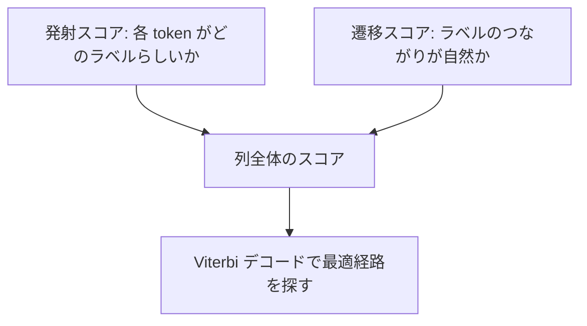

# 11.4.4 BiLSTM + CRF


:::tip 画像の見方
BiLSTM は各 token に対してコンテキスト表現を作り、CRF はすべての候補ラベル経路の中から最も自然なものを選びます。図を見るときは、「各位置のスコア」と「ラベル遷移の制約」がどのように合わさって最終的な BIO 列を決めるのかに注目してください。
:::

:::tip この節の位置づけ
NER は、各 token を独立に分類するだけではありません。ラベル同士には制約があり、たとえば `I-PER` は文頭にいきなり現れるのが普通ではありません。BiLSTM + CRF の価値は、コンテキストとラベル列の妥当性を同時に見ることにあります。
:::

## 学習目標

- BiLSTM がシーケンスラベリングで何を担当するかを理解する
- CRF がなぜラベル遷移の制約をモデル化できるのかを理解する
- BIO ラベル体系でどんな予測が不自然なのかを知る
- BiLSTM + CRF と通常の token 分類の違いを説明できるようになる

---

## まず全体構造を見る


BiLSTM はコンテキストの理解を担当し、CRF は全体として最も自然なラベル経路を選びます。この 2 つを組み合わせることで、モデルは単に「この token はエンティティっぽいか」を見るだけでなく、「このラベル列全体はつながりとして妥当か」も考えるようになります。

## 一、なぜ普通の token 分類だけでは不十分なのか

BIO ラベル体系を使うとします。`B-PER` は人名の開始、`I-PER` は人名の内部、`O` はエンティティではないことを表します。もしモデルが各 token を独立に予測すると、次のような結果になることがあります。

```text
我   爱   北京
O   I-LOC B-LOC
```

ここでは `I-LOC` がエンティティの開始位置に出てきており、通常は不自然です。普通の分類器ではこうしたラベル遷移を明示的に制約しにくいですが、CRF はラベル間の遷移スコアを学習できます。

## 二、BiLSTM がコンテキスト表現を担当する

LSTM はテキストを順番に読みますが、BiLSTM は左から右、右から左の両方向で読みます。これにより、各 token の表現に前後の文脈情報が含まれます。

たとえば「りんご」は、文によって果物にも会社にもなりえます。BiLSTM の役割は、現在位置が周囲の単語を見られるようにして、あいまいさを減らすことです。

## 三、CRF が全体のデコードを担当する

CRF は 2 種類のスコアを同時に考えます。各位置があるラベルである度合いを表す発射スコアと、ラベル同士が続くことの自然さを表す遷移スコアです。最終予測では、位置ごとに貪欲に選ぶのではなく、列全体の合計スコアが最も高いラベル経路を探します。



だからこそ CRF は、NER、品詞タグ付け、分かち書きのように、ラベル同士に構造的な制約があるタスクに特に向いています。

## 四、最小限の直感例

```python
labels = ["B-PER", "I-PER", "O", "B-LOC", "I-LOC"]

# 簡略版: 不自然な遷移を手動で定義する
invalid_transitions = {
    ("O", "I-PER"),
    ("O", "I-LOC"),
    ("B-PER", "I-LOC"),
    ("B-LOC", "I-PER"),
}

path = ["O", "I-LOC", "B-LOC"]

for a, b in zip(path, path[1:]):
    if (a, b) in invalid_transitions:
        print("不自然な遷移:", a, "->", b)
```

実行結果の例：

```text
不自然な遷移: O -> I-LOC
```

局所的な token 分類器は `I-LOC` を出すかもしれません。しかし経路全体で見ると不自然です。場所エンティティの内側タグは、通常 `B-LOC` または `I-LOC` の後に続くべきだからです。

実際の CRF は手書きルールで判断するのではなく、学習データからどのラベル遷移がより自然かを学びます。この例は、あくまで「ラベル同士には関係がある」という感覚をつかむためのものです。

## 五、BERT の token classification との関係

現代の NER では、BERT に線形分類層をつなげる方法がよく使われますし、BERT の後ろに CRF を追加することもできます。BERT は BiLSTM より強いコンテキスト表現能力を持つことが多いですが、CRF によるラベル制約にも価値があります。特に、データ量が少ない場合、ラベル形式が厳密な場合、エンティティ境界のミスが起きやすい場合に有効です。

## 残す証拠

このページを終えたら、この evidence card を残します。

```text
schema: entity types, BIO tags, or sequence-label rules
prediction: token-level labels and extracted spans
metric: entity precision/recall/F1 and boundary cases
failure_check: span boundary, nested entity, unknown word, or inconsistent annotation
Expected_output: gold-vs-predicted span table with at least one miss
```

## よくある誤解

1 つ目の誤解は、CRF を古いモデルだと思い込むことです。最強の手法とは限りませんが、ラベル制約の考え方はいまでも重要です。2 つ目の誤解は、token 単位の正解率だけを見て、エンティティ単位の F1 を見ないことです。NER で本当に大事なのは、エンティティの境界と種類が完全に正しいかどうかです。3 つ目の誤解は、BIO アノテーションの一貫性を無視して、学習データ自体に不正なラベル列が含まれてしまうことです。

## 演習

1. 中国語の 1 文について BIO ラベルを書き、`I-*` で始まる不正なラベルがないか確認してください。
2. 「token ごとの分類」と「列全体のデコード」の違いを比較してください。
3. 考えてみましょう: なぜ entity 単位の F1 のほうが NER に適しているのでしょうか？
4. BERT で NER を行う場合、CRF はまだ必要でしょうか？賛成と反対の理由をそれぞれ挙げてください。

<details>
<summary>参考解答と解説</summary>

1. 中国語の BIO 例では、まず token 単位を決め、entity が `I-*` から始まっていないか、各 `I-*` の前に対応する `B-*` または `I-*` があるか確認します。
2. token-by-token classification は各位置を独立に採点します。global sequence decoding は文全体で最も妥当で合法な label path を選びます。
3. entity-level F1 が token accuracy より適しているのは、boundary が 1 つずれるだけで抽出 entity が使えなくなることがあるからです。
4. BERT は CRF なしでも動きますが、CRF は legal transition と entity boundary の一貫性を助けます。一方で複雑さが増え、簡単な dataset では不要な場合もあります。

</details>

## 合格基準

この節を学び終えたら、BiLSTM と CRF がそれぞれ何を担当するのかを説明でき、BIO ラベルの不正な遷移を見分けられ、シーケンスラベリングでラベル間の依存関係を考える必要がある理由を説明でき、さらにこの考え方を次の構造化情報抽出タスクへ応用できるようになっているはずです。
