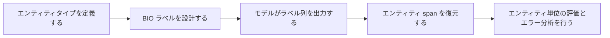

# NER 実践


:::tip 読み方のヒント
NER プロジェクトでは、token accuracy だけを見ないでください。まずはラベル体系、アノテーション例、エンティティ復元、エンティティ単位の Precision/Recall/F1、そしてエラーの分類がどうつながって閉ループになるのかを見ましょう。これのほうが、単純にモデルを替えるより実際のプロジェクトに近いです。
:::

:::tip この節の位置づけ
前の 2 節で次の内容はすでに説明しました。

- シーケンスラベリングタスク
- BiLSTM + CRF の基本的な考え方

この節では、それをプロジェクトに戻して、より実務に近い形で練習します。

> **履歴書テキストから、名前・学校・スキルを抽出する。**

このようなタスクは NER の練習にとても向いています。なぜなら、次の要素がすべて含まれているからです。

- 明確な span
- 明確なタイプ
- 多くの境界の細かい問題
:::

## 学習目標

- 最小限の NER プロジェクトの範囲を定義できるようになる
- token ラベルからエンティティを復元できるようになる
- エンティティ単位のエラー分析ができるようになる
- 実行できる例を通して、情報抽出プロジェクトの骨組みを作れるようになる

---

## まずは全体像をつかもう

NER の実践は、「ラベル -> エンティティ -> 評価 -> 改善」という順番で理解すると分かりやすいです。



この節で本当に解決したいのは、次の点です。

- NER プロジェクトはなぜ「ラベル予測」だけではないのか
- なぜエンティティ復元とエラー分析のほうが、実際のプロジェクトに近いのか

---

## 一、まずプロジェクトの問題をはっきり決める

### 1.1 想定シーン

入力：

- 履歴書や候補者プロフィールのテキスト

出力：

- 名前
- 学校
- スキル

### 1.2 なぜ「なんとなくエンティティを抜く」より練習に向いているのか？

理由は、境界がはっきりしているからです。

- クラス数が多くない
- エンティティタイプが明確
- 結果を業務の文脈で説明しやすい

### 1.3 最初に大事なのはモデルではなく、ラベル体系

たとえば：

- `张三` -> `B-NAME`
- `清华大学` -> `B-SCHOOL I-SCHOOL ...`
- `Python` -> `B-SKILL`

ここがあいまいだと、その後のモデル学習も評価も、すべて崩れやすくなります。

### 1.4 初心者向けの分かりやすい比喩

NER は、次のように考えると理解しやすいです。

- テキストの中で、蛍光ペンで重要情報を囲む

難しいのは、ただ囲むことではなくて、次の点です。

- どこから囲み始めるか
- どこで囲み終わるか
- その部分はどの種類に属するのか

こう考えると、NER が境界の問題でつまずきやすい理由が自然に見えてきます。

---

## 二、まずは実行できるアノテーションとデコードの閉ループを作る

次の例では、3 つのことをします。

1. 小さなサンプルを用意する
2. BIO ラベルをデコードしてエンティティに戻す
3. 簡単な予測比較とエラー分析をする

```python
samples = [
    {
        "tokens": ["张三", "毕业于", "清华大学", "，", "熟悉", "Python", "和", "PyTorch"],
        "gold_tags": ["B-NAME", "O", "B-SCHOOL", "O", "O", "B-SKILL", "O", "B-SKILL"],
        "pred_tags": ["B-NAME", "O", "B-SCHOOL", "O", "O", "B-SKILL", "O", "B-SKILL"],
    },
    {
        "tokens": ["李四", "来自", "北京大学", "，", "掌握", "Java"],
        "gold_tags": ["B-NAME", "O", "B-SCHOOL", "O", "O", "B-SKILL"],
        "pred_tags": ["B-NAME", "O", "O", "O", "O", "B-SKILL"],
    },
]


def decode_entities(tokens, tags):
    entities = []
    current_tokens = []
    current_type = None

    for token, tag in zip(tokens, tags):
        if tag == "O":
            if current_tokens:
                entities.append(("".join(current_tokens), current_type))
                current_tokens = []
                current_type = None
            continue

        prefix, entity_type = tag.split("-", 1)

        if prefix == "B":
            if current_tokens:
                entities.append(("".join(current_tokens), current_type))
            current_tokens = [token]
            current_type = entity_type
        elif prefix == "I" and current_type == entity_type:
            current_tokens.append(token)
        else:
            if current_tokens:
                entities.append(("".join(current_tokens), current_type))
            current_tokens = [token]
            current_type = entity_type

    if current_tokens:
        entities.append(("".join(current_tokens), current_type))

    return entities


for sample in samples:
    gold_entities = decode_entities(sample["tokens"], sample["gold_tags"])
    pred_entities = decode_entities(sample["tokens"], sample["pred_tags"])

    print("tokens:", sample["tokens"])
    print("gold :", gold_entities)
    print("pred :", pred_entities)
    print("miss :", [x for x in gold_entities if x not in pred_entities])
    print()
```

### 2.1 なぜこのコードが「プロジェクトの最小閉ループ」なのか？

すでに次の要素が入っているからです。

- データ表現
- 予測結果
- エンティティ復元
- エラー分析

これは、ただラベルを並べるだけよりも、実際のプロジェクトにかなり近い形です。

### 2.2 なぜ token ではなく、エンティティ単位で比べるのか？

業務で本当に知りたいのは、たいてい次の点だからです。

- エンティティをきちんと抽出できたか
- タイプは正しいか

どの token が当たったかだけを見ても、実際の価値は見えにくいです。

### 2.3 最小の「エンティティログ」の例

```python
sample = samples[1]
gold_entities = decode_entities(sample["tokens"], sample["gold_tags"])
pred_entities = decode_entities(sample["tokens"], sample["pred_tags"])

print(
    {
        "text": "".join(sample["tokens"]),
        "gold_entities": gold_entities,
        "pred_entities": pred_entities,
    }
)
```

このログは、初心者にとても向いています。なぜなら、抽象的なラベルタスクを、実際のプロジェクトっぽい出力に変えてくれるからです。

- 元のテキストは何か
- 正しいエンティティは何か
- システムは何を見逃したのか

---

## 三、NER プロジェクトで最初に見るべき指標は何か？

### 3.1 エンティティ単位の Precision / Recall / F1

これは、もっとも一般的で、もっとも意味のある指標のセットです。

### 3.2 なぜ token accuracy では足りないのか？

系列の中には、`O` がたくさん出てくることが多いからです。

token accuracy だけを見ると、数値は高く見えやすいです。  
でも、実際のエンティティ抽出性能が良いとは限りません。

### 3.3 とても簡単なエンティティ Recall の例

```python
def entity_recall(gold_entities, pred_entities):
    if not gold_entities:
        return 1.0
    hit = sum(entity in pred_entities for entity in gold_entities)
    return hit / len(gold_entities)


for sample in samples:
    gold_entities = decode_entities(sample["tokens"], sample["gold_tags"])
    pred_entities = decode_entities(sample["tokens"], sample["pred_tags"])
    print(entity_recall(gold_entities, pred_entities))
```

### 3.4 NER プロジェクトを始めるときの、いちばん安定した順番

一般的には、次の順番が安定しています。

1. まずエンティティタイプを絞る
2. まずラベル規則を明確にする
3. まずエンティティ復元とエンティティ単位の評価を作る
4. そのあとで、より強いモデルに切り替える

最初から BERT を急いで入れるより、こちらのほうがプロジェクトを安定させやすいです。

---

## 四、NER プロジェクトでよくある失敗

### 4.1 エンティティ境界のミス

たとえば、学校名を半分しか抽出できないケースです。

### 4.2 タイプのミス

たとえば、スキルを学校として認識してしまうケースです。

### 4.3 エンティティの見逃し

たとえば、サンプル 2 で `北京大学` を取りこぼしているケースです。

### 4.4 なぜエラー分析に向いているのか？

NER のミスはかなり具体的なので、  
1 件ずつ見たり、種類ごとに直したりしやすいからです。

### 4.5 初心者がまず使うとよいエラー分類

最初のエラー分析では、まず次の 3 つに分けるのがおすすめです。

1. 境界ミス
2. タイプミス
3. 見逃し

この 3 つだけでも、次のどれが原因か見えてきます。

- データアノテーションの問題
- モデル表現の問題
- 後処理ルール不足の問題

---

## 五、実際のプロジェクトでは次に何をすべきか？

### 5.1 データを増やす

特に次のようなサンプルを増やすとよいです。

- 長いエンティティ
- まれなエンティティ
- 混同しやすいタイプ

### 5.2 ルールや古典的モデルから、より強いモデルへ進む

たとえば：

- BiLSTM + CRF
- BERT token classification

### 5.3 後処理ルールを入れる

多くの業務プロジェクトでは、  
適切な後処理ルールだけでもエンティティ品質をかなり改善できます。

## これをプロジェクトとして見せるなら、何を見せるとよいか

見せる価値が高いのは、たいてい次のようなものです。

- ラベルの予測結果の一覧

ではなく、

1. 元のテキスト
2. gold エンティティ
3. 予測エンティティ
4. 抽出漏れと誤抽出の例
5. 次にどの種類のエラーを優先して直すか

こうすると、見る人に次のことが伝わりやすくなります。

- ただの系列ラベリングではなく、情報抽出プロジェクトをやっている
- モデルを学習しただけの半完成品ではない

---

## 六、よくある勘違い

### 6.1 勘違い 1：token レベルの指標だけを見る

NER では、エンティティレベルの結果をもっと重視すべきです。

### 6.2 勘違い 2：最初からすべてのエンティティタイプをカバーしようとする

より安定した方法は、たいてい次のとおりです。

- まず 2〜4 種類のコアなエンティティをしっかり作る

### 6.3 勘違い 3：最初にラベル体系をきちんと決めない

ラベルの境界があいまいだと、データも評価も一緒にぶれます。

---

## まとめ

この節でいちばん大切なのは、実践の習慣を身につけることです。

> **NER プロジェクトでは、まずエンティティタイプ、ラベル体系、エンティティ復元、エンティティ単位のエラー分析をしっかり作り、そのうえで、より複雑なモデルを目指す。**

こうすると、残るのは本当に説明できて、改善もできる情報抽出プロジェクトです。  
ただ学習スクリプトを動かせるだけの未完成品にはなりません。

---

## 練習

1. サンプルに `ORG` か `TITLE` のエンティティタイプを追加して、データを拡張してみましょう。
2. 考えてみましょう。なぜ NER プロジェクトでは、token accuracy よりエンティティ単位の指標を見るほうがよいのでしょうか？
3. システムが長い学校名をいつも半分しか抽出できない場合、まずデータ、モデル、後処理のどれを直しますか？ なぜですか？
4. この履歴書抽出プロジェクトを、さらにポートフォリオ用の成果物としてどう発展させますか？
