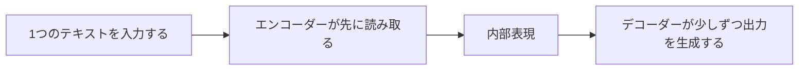

# Seq2Seq モデル


:::tip 図の読み方
Seq2Seq の核心的な難しさは、「入力系列を表現に圧縮してから、出力系列を少しずつ生成する」ことです。図を見るときは、context vector がなぜ情報のボトルネックになるのか、そしてその後に Attention がなぜ必要になるのかに注目してください。
:::

:::tip この節の位置づけ
前の分類や系列ラベリングのタスクでは、出力は通常「ラベル」でした。  
一方、この章からは別の種類の問題に入ります。

> **入力は1つのテキスト、出力も1つのテキスト。**

たとえば：

- 翻訳
- 要約
- 言い換え
- 質問応答生成

この種のタスクのもっとも代表的な出発点が、encoder-decoder 構造です。
:::

## 学習目標

- Seq2Seq と分類タスクの根本的な違いを理解する
- encoder と decoder がそれぞれ何を担当するかを理解する
- 実行できるサンプルを通して「エンコードしてから生成する」感覚をつかむ
- Seq2Seq が多くの生成タスクの基礎構造になる理由を理解する

---

## まず全体像をつかもう

この節は、初心者には「先にモデルの細部を見る」のではなく、まずタスクの形がどう変わるかを見るのがいちばん理解しやすいです。



なので、この節で本当に解決したいのは次の2点です。

- なぜ「テキストからテキストへ」のタスクは分類タスクとまったく別物なのか
- なぜシステムを encoder と decoder の2つに分けるのか

## 一、Seq2Seq は何を解決するのか？

### 1.1 これは「文全体にラベルを付ける」ものではない

むしろ次のようなものです。

- 1列の token を入力する
- 別の1列の token を出力する

たとえば：

- 「私は学習が好きです」 -> 「I like studying」

### 1.2 なぜ普通の分類器では向いていないのか？

分類器の出力は通常、固定された集合の中の1つのラベルです。  
それに対して Seq2Seq タスクの出力は：

- 長さが固定ではない
- 内容も固定ではない
- 生成の過程に順序依存がある

### 1.3 たとえで考えると

分類は、作文に点数を付けるようなものです。  
Seq2Seq は、中国語の作文を英語の作文に書き直すようなものです。

---

## 二、encoder と decoder はそれぞれ何をするのか？

### 2.1 encoder

encoder の役割は次のとおりです。

- 入力系列を読み込む
- 入力を内部表現に圧縮する

### 2.2 decoder

decoder の役割は次のとおりです。

- エンコード結果をもとにする
- 出力系列を1歩ずつ生成する

### 2.3 なぜ2つに分けるのか？

この種のタスクは、自然に

- まず入力を理解する
- それから出力を組み立てる

という流れになるからです。

これは単純な分類とは違います。

---

## 三、まずは「エンコードしてから生成する」最小例を動かしてみよう

```python
translation_memory = {
    "私": "I",
    "は": "like",
    "学習": "study",
}


def encode(source_tokens):
    return {"source_tokens": source_tokens, "length": len(source_tokens)}


def decode(encoded):
    output = []
    for token in encoded["source_tokens"]:
        output.append(translation_memory.get(token, "<unk>"))
    return output


source = ["私", "は", "学習"]
encoded = encode(source)
target = decode(encoded)

print("encoded:", encoded)
print("decoded:", target)
```

### 3.1 この例からいちばん大事にしたいことは？

この例が示しているのは、Seq2Seq の基本的な流れです。

1. 入力がそのまま最終答えになるわけではない
2. 途中でいったんエンコード表現を作る
3. そのあと decoder が出力を生成する

### 3.2 初心者が最初に覚えるべきことは？

まずは次の3点を押さえるのが大事です。

1. encoder は「入力を先に理解する」役目
2. decoder は「理解結果をもとに少しずつ出力を書く」役目
3. 出力は固定ラベルではなく、順序を持つ生成プロセス

---

## 四、Seq2Seq でよくある難しさは何か？

### 4.1 入力の圧縮が粗すぎる

初期の encoder-decoder でよくある問題は、

- 入力全体を1つの固定長ベクトルに圧縮してしまうことです

入力が長くなるほど、情報が失われやすくなります。

### 4.2 出力は1ステップずつ生成される

これはつまり、

- 前のステップで間違えると
- 後ろのステップにも影響しやすい

ということです。

### 4.3 だから後で Attention が入ってくる

Attention の大きな目的の1つは、decoder が生成するときに固定の1つのベクトルだけに頼らず、  
入力の異なる位置を動的に参照できるようにすることです。

### 4.4 この節と後の Attention の関係は？

この節でまず押さえるべき主線は、

- Seq2Seq の「エンコード -> デコード」という流れ

です。

そして次の Attention は、ここで生まれる中心的なボトルネックを解決します。

- 固定長表現だと情報を落としやすい

---

## 五、Seq2Seq はどんなタスクに向いているのか？

### 5.1 翻訳

もっとも代表的な入力・出力の対応タスクです。

### 5.2 要約

長い文章を入力して、短い文章を出力します。

### 5.3 言い換えと質問応答生成

入力と出力は同じテキストではありませんが、はっきりした対応関係があります。

---

## 六、よくあるつまずきポイント

### 6.1 誤解1：Seq2Seq は「翻訳モデル」だけ

翻訳はもっとも有名な例ですが、  
本質的には、もっと広い「テキストからテキストへ」のタスクに使えます。

### 6.2 誤解2：encoder と decoder があれば十分

Attention や、より強い表現がなければ、長い入力はかなり苦しくなります。

### 6.3 誤解3：生成タスクは出力できればそれでいい

Seq2Seq で本当に難しいのは、

- 入力に忠実であること
- 自然に生成すること
- 構造を保つこと

です。

## まとめ

この節でいちばん大事なのは、Seq2Seq を次のように理解することです。

> **入力をいったんエンコードし、その後に少しずつ出力を生成する構造。翻訳、要約、多くのテキスト生成タスクの基礎になるパラダイムです。**

この主線がはっきりしていれば、後で Attention や T5 を学ぶときも、とても自然に理解できます。

---

## この節で持ち帰るべきこと

- Seq2Seq は「入力系列 -> 出力系列」の基礎構造
- encoder / decoder は「先に理解して、それから生成する」ためのもの
- Attention が登場したのは、Seq2Seq の最大の情報ボトルネックを補うため

---

## 練習

1. サンプルの辞書を 5〜10 語に増やして、いくつか文を試してみましょう。
2. なぜ Seq2Seq の出力は固定長でも固定ラベル集合でもないと言えるのでしょうか？
3. 入力が非常に長いとき、なぜ「1つのベクトルに圧縮する」だけでは苦しくなるのでしょうか？
4. 自分の言葉で、encoder と decoder がそれぞれ何を担当するか説明してみましょう。
