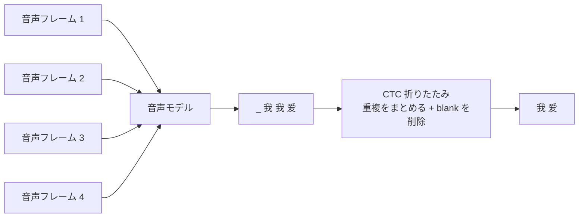

# 11.5.5 CTC と Deep Speech：音声認識における系列アラインメント


:::tip この節の位置づけ
この節は Seq2Seq の拡張です。音声認識が、なぜ「1フレームの音声 = 1文字」のように単純には学習できないのかを理解する助けになります。

最も大事な一文は次のとおりです。

> **CTC は、入力がとても長く、出力が短く、しかも両者の正確な対応ラベルがないときでも、モデルをどうやって学習できるかを解決します。**
:::

## 一、なぜ音声認識はテキスト分類より難しいのか？

テキスト分類は、通常こんな形です。

```text
1つの文 -> 1つのラベル
```

機械翻訳は、通常こんな形です。

```text
1列の token -> 別の1列の token
```

しかし音声認識は、こうなります。

```text
長い音声フレーム列 -> 文字列
```

問題は次のとおりです。

- 音声フレームは多いのに、文字 token は少ない
- 1文字は複数の音声フレームにまたがる
- 学習データは通常、文全体の書き起こしだけを与え、どのフレームがどの文字に対応するかは教えてくれない

これが系列アラインメントの難しさです。

まずは、次のようにイメージすると分かりやすいです。



モデルが見るのは細かい時間スライスで、ラベルとして与えられるのは最終的な文だけです。CTC は、この2つをつなぐ橋になります。

## 二、CTC の核心的な直感：空白と繰り返しを含む経路をまず出してよい

CTC は、blank という特別な記号を導入します。  
モデルはまず、より長い経路を出力し、その後に「重複を削除し、blank を削除」して最終的なテキストを得ます。

たとえば、こんな感じです。

```text
モデルの経路：_ 我 我 _ 爱 爱 _ AI _
折りたたみ結果：我 爱 AI
```

これにより、モデルは事前に次のことを知らなくてもよくなります。

- 「我」が何フレーム目から始まるのか
- 「爱」がどれくらいの長さ続くのか
- どのフレームが休止や遷移なのか

必要なのは、正しいテキストに折りたためるすべての経路の全体確率を大きくすることだけです。

## 三、Deep Speech が重要な節目である理由

Deep Speech は、エンドツーエンド音声認識が深層学習時代に入るうえで重要な流れを代表しています。

従来の ASR システムは、しばしば多くのモジュールに分かれていました。

- 音響モデル
- 発音辞書
- 言語モデル
- デコーダ

Deep Speech のような研究は、よりエンドツーエンドな考え方を押し進めました。

> **音声特徴量から直接テキスト出力を学習し、複雑なパイプラインを学習可能なモデルの中に押し込む。**

初心者の方は、最初から完全な ASR システムを再現する必要はありません。  
まずは、それがなぜ重要なのかを理解できれば十分です。

- 音声認識を、1つの統一された学習問題として扱いやすくなる
- CTC により、アラインされていない系列でも学習できる
- その後の Whisper などのモデルが、音声認識をさらに汎用的な事前学習の流れへ進めた

## 四、超簡単な折りたたみの例

```python
def ctc_collapse(path, blank="_"):
    result = []
    prev = None

    for token in path:
        if token != blank and token != prev:
            result.append(token)
        prev = token

    return result

path = ["_", "私", "私", "_", "好き", "好き", "_", "AI", "_"]
print(ctc_collapse(path))
```

出力は、だいたい次のようになります。

```text
['私', '好き', 'AI']
```

この例は CTC の数式の代わりにはなりませんが、まず直感をつかむ助けになります。

> **モデルはまずフレーム単位の長い経路を出し、その後に折りたたんで最終的な短いテキストにすることができる。**

## 五、実行できる小さなアラインメント探索

CTC の重要な点は、「正しい経路が1つだけある」のではなく、多くの経路が同じテキストに折りたためることです。CTC の学習では、それらの有効な経路の確率をまとめて考えます。

次の小さなプログラムは、`["私", "好き"]` になる短い経路を列挙します。

```python
from itertools import product

def ctc_collapse(path, blank="_"):
    result = []
    prev = None

    for token in path:
        if token != blank and token != prev:
            result.append(token)
        prev = token

    return result

vocab = ["_", "私", "好き"]
target = ["私", "好き"]
valid_paths = []

for path in product(vocab, repeat=4):
    if ctc_collapse(path) == target:
        valid_paths.append(path)

print("有効な経路数:", len(valid_paths))
for path in valid_paths[:8]:
    print(path, "->", ctc_collapse(path))
```

実行結果の冒頭は次のようになります。

```text
有効な経路数: 15
('_', '_', '私', '好き') -> ['私', '好き']
('_', '私', '_', '好き') -> ['私', '好き']
('_', '私', '私', '好き') -> ['私', '好き']
```

重要なのはリストの順番ではなく、多くのフレーム単位の経路が同じ最終テキストに折りたためるという点です。

CTC を初めて学ぶときに大事なのは、次の感覚です。

- モデルは最初から正確なフレーム境界を知る必要がない
- 繰り返し token は、音が長く続くことを表せる
- blank は、休止や遷移を表せる
- 正しい文字列に折りたためるすべての経路が学習で評価される

つまり CTC は、人間に1フレームずつラベルを付けさせるのではなく、モデル自身に多くの可能なアラインメントへ確率を配分させる方法です。

## 六、CTC、Seq2Seq、Transformer ASR の関係

| 方法 | まずどう理解するとよいか |
|---|---|
| CTC | 入力と出力の正確な対応がわからないとき、ありうるすべての経路で学習する |
| Seq2Seq Attention | Decoder が生成しながら、入力の位置に動的に注目する |
| Transformer ASR | より強い attention 構造で長い音声コンテキストをモデル化する |
| Whisper | 大規模な弱教師あり音声データ + Transformer で、ASR をより汎用的にする |

これは、音声認識が独立した分野ではなく、この章の Seq2Seq、attention、Transformer とつながっていることを示しています。

## 七、歴史的な節目をコースの章に対応づける

| 歴史的な節目 | 解決した問題 | 対応するコース章 |
|---|---|---|
| CTC | 入力と出力がアラインされていないとき、系列モデルをどう学習するか | 5.5 本節、5.2 Seq2Seq |
| Deep Speech | エンドツーエンド深層音声認識の流れ | 5.5 本節、12.3 音声とマルチモーダル |
| Seq2Seq Attention | 出力の各ステップで入力位置を動的にアラインする | 5.3 NLP の attention 機構 |
| Transformer ASR / Whisper | 大規模事前学習による音声認識 | 12 AIGC とマルチモーダル拡張 |

## 八、この節を学び終えたときに持っておきたい直感

音声認識で本当に難しいのは、単に「音を文字にする」ことではなく、次の点です。

- 入力と出力の長さが違う
- フレームごとの対応ラベルがない
- 音声には、休止、引き延ばし、繰り返し、雑音がある

CTC のすばらしい点は、  
人手で各フレームを無理にラベル付けさせず、モデル自身がありうるすべてのアラインメント経路の中から学習できるようにしたことです。
