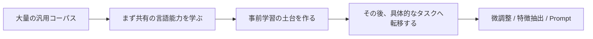

# 事前学習パラダイム


:::tip 図の読み方
事前学習パラダイムで最も大事なのは、個々のモデル名ではなく、「汎用コーパスで土台を学ぶ -> 下流タスクへ転移する -> 微調整または Prompt で適応する」という流れです。まずこの流れをつかめば、BERT、GPT、T5 がばらばらな専門用語に見えなくなります。
:::

:::tip この節の位置づけ
この章の主軸は、実はたった一文です。

> **大規模コーパスで汎用能力を学び、その能力を具体的なタスクへ転移する。**

これが現代 NLP の事前学習パラダイムです。

もし前の段階で、これをただの「先に少し学習してから微調整すること」だとだけ捉えると、あとで用語だけが残りやすくなります。  
だからこの節では、なぜ重要なのか、なぜ NLP 全体を変えたのかをしっかり説明します。
:::

## 学習目標

- 事前学習パラダイムと「各タスクをゼロから学習すること」の違いを理解する
- 事前学習 -> 転移 -> 微調整 という主線を理解する
- 実行可能な例を通して「共有された土台」の感覚をつかむ
- なぜ現代 NLP の主流がほぼこれを中心に展開しているのかを理解する

---

## まずは地図を描こう

すでに語彙埋め込み、文脈化表現、言語モデルを学んでいるなら、この節は自然な続きです。

- これまでに、テキスト表現がどんどん強くなってきたことを見ました
- この節では、「なぜその後 NLP 全体が共有された土台を中心に組み立てられるようになったのか」を説明します

つまり、事前学習パラダイムは「もう一段訓練する」だけではなく、

- タスクの組み立て方そのものが変わった

ということです。

この節を初学者が理解するうえで最も自然な順番は、「まずモデル名を覚える」ことではなく、次の流れを見通すことです。



この節で本当に伝えたいのは、次の点です。

- なぜ「各タスクをゼロから学習する」やり方は非効率なのか
- なぜ「まず土台を学び、それから転移する」やり方が NLP 全体を変えたのか

## 一、なぜ事前学習は NLP 全体を変えたのか？

### 1.1 多くのタスクが、土台となる言語能力を共有しているから

たとえば次のようなタスクでも、

- 分類
- NER
- 質問応答
- 翻訳

共通して必要になる基礎能力があります。

- 単語の意味理解
- 文法構造の理解
- 文脈の把握

### 1.2 各タスクをゼロから学ぶと、非常にもったいないから

これはまるで、

- 新しい問題を解くたびに、言語そのものを一から勉強する

ようなものです。

当然、コストが高すぎます。

### 1.3 事前学習パラダイムの核心

そこで、より合理的なやり方はこうなります。

1. まず大量の汎用テキストで基礎能力を学ぶ
2. その能力を具体的なタスクへ転移する

これが現代 NLP の主軸です。

### 1.4 初めて事前学習パラダイムを学ぶとき、最初に押さえるべきことは？

最初に押さえるべきなのはモデル名ではなく、次の一文です。

> **事前学習の核心的な価値は、多くのタスクで共通に使う言語能力を先にまとめて学べることにある。**

この一文がしっかりすると、あとで

- BERT
- GPT
- T5

を見たときも、まず自然に次を考えられます。

- このモデルは、共有された土台の流れの中でどんな役割を持つのか？

---

## 二、事前学習・転移・微調整の関係は？

### 2.1 事前学習

目的は、

- 汎用的な言語表現とパターンを学ぶこと

### 2.2 転移

目的は、

- すでに学んだ能力を新しいタスクへ持っていくこと

### 2.3 微調整

目的は、

- 具体的なタスクに合わせてさらに適応させること

### 2.4 アナロジー

事前学習は、まず教養科目の教材を読むようなものです。  
転移は、その基礎を新しい科目に持ち込むことです。  
微調整は、試験問題の傾向に合わせて特訓することです。

### 2.5 なぜこのアナロジーを先に覚える価値があるのか？

初学者は、事前学習を聞くと次のように誤解しやすいからです。

- 事前学習 = ただ長く訓練すること

でも、このアナロジーがあると、次の違いが見えやすくなります。

- 事前学習は汎用能力を学ぶ
- 転移はその能力を使い回す
- 微調整はタスクに合わせて整える

---

## 三、まず「共有された土台」の例を見てみよう

```python
shared_representation = {
    "返金": [1.0, 0.2, 0.1],
    "請求書": [0.3, 1.0, 0.1],
    "パスワード": [0.1, 0.2, 1.0],
}


def sentence_vector(tokens):
    vectors = [shared_representation[token] for token in tokens if token in shared_representation]
    dim = len(vectors[0])
    return [sum(vec[i] for vec in vectors) / len(vectors) for i in range(dim)]


def classify_intent(tokens):
    vec = sentence_vector(tokens)
    scores = {
        "refund": vec[0],
        "invoice": vec[1],
        "password": vec[2],
    }
    return max(scores, key=scores.get), scores


for tokens in [["返金"], ["請求書"], ["パスワード"]]:
    print(tokens, "->", classify_intent(tokens))
```

### 3.1 この例は何を示しているのか？

これは、本当の強力なモデルを表しているわけではありません。  
伝えたいのは、いちばん本質的な感覚です。

- まず共有された表現の土台がある
- その上で具体的なタスクを解く

### 3.2 なぜこれは事前学習時代の考え方に近いのか？

なぜなら、各タスクが

- 毎回ゼロからすべての表現を学ぶ

のではなく、

- すでにある言語表現を再利用する

ようになるからです。

### 3.3 初学者が最初に覚えるべきことは？

まず覚えるべきなのは、次の 3 点です。

1. 事前学習は「もう一段訓練する」ことではなく、タスクの組み立て方を変えること
2. 共有された土台の能力は、現代 NLP の重要な資産であること
3. その結果、下流タスクのハードルが大きく下がること

### 3.4 なぜ「共有された土台」という見方が重要なのか？

この見方があると、後で問題を見るときの考え方が変わるからです。

たとえば、単に次のように考えるのではなく、

- このタスクには専用モデルが必要だろうか？

もっと自然に、こう考えられるようになります。

- このタスクは、すでにある土台の上に載せられるだろうか？
- 必要なのは微調整か、特徴抽出か、それとも Prompt か？

---

## 四、なぜこの流れは BERT / GPT / T5 へつながるのか？

### 4.1 スケールしやすいから

事前学習が成立すると、  
より大きなデータやより多くの計算資源が、土台の能力向上につながりやすくなります。

### 4.2 汎用性が高いから

同じ土台を、さまざまなタスクに転移できます。

### 4.3 下流タスクのハードルを下げるから

多くのタスクで、大きなモデルをゼロから学習し直す必要がなくなります。  
その代わりに、

- 事前学習済みモデルをそのまま適応する

という形をとれます。

---

## 五、よくあるつまずきポイント

### 5.1 誤解 1：事前学習パラダイムは「先に少し訓練する」だけ

違います。  
変わるのは、タスクの組み立て方そのものです。

### 5.2 誤解 2：すべてのタスクで必ず微調整が必要

そうではありません。  
タスクによっては、

- 特徴抽出
- Prompt
- 検索

だけで十分なこともあります。

### 5.3 誤解 3：モデル名だけを覚えて、パラダイムを理解しない

本当に大事なのは、

- なぜ共通の能力を先に学んでから転移すると効果的なのか

です。

## まとめ

この節で最も重要なのは、ひとつの時代認識を持つことです。

> **現代 NLP の中心的な変化は、単にモデルが大きくなったことではなく、学習パラダイムが「各タスクを個別に作る」から「まず共通の土台を学び、それを転移・適応する」へ変わったことにある。**

この理解があるだけで、BERT、GPT、T5 を学ぶときに、流行語を追うだけではなくなります。

---

## この節で持ち帰るべきこと

- 現代 NLP の重要な変化は、モデルの大型化だけでなく、パラダイムの変化にある
- 事前学習、転移、微調整は、必ず一本の流れとして理解する
- この先 BERT / GPT / T5 を学ぶときは、それぞれがこの流れの中でどんな役割を担うかを先に考える

さらに一文でまとめるなら、こうです。

> **事前学習パラダイムが本当に変えたのは、学習の順番だけではなく、NLP 全体を「各タスクがばらばらに作る世界」から「より強い共通の言語土台を共有する世界」へ移したことです。**

---

## 練習

1. 自分の言葉で説明してください。なぜ事前学習パラダイムは、多くの NLP タスクのハードルを大きく下げるのでしょうか？
2. どのようなタスクなら、事前学習済みの特徴だけで十分で、必ずしも全面的な微調整が必要ではないでしょうか？
3. この「共有された土台」の例は、実際のシステムではそれぞれ何に対応するでしょうか？
4. なぜ、事前学習パラダイムはモデルだけでなく、タスクの組み立て方全体を変えたと言えるのでしょうか？
