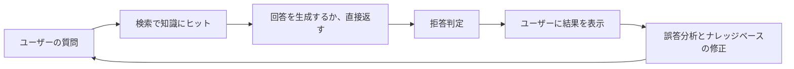

# プロジェクト：スマートQAシステム


:::tip 図の見方
QAシステムは「それっぽい答えを1文生成したら終わり」ではありません。図を見るときは、query、retrieval、evidence、answer、refusal、evaluation、error log がどう閉ループになっているかに注目してください。これが後の RAG プロジェクトの核心の骨組みです。
:::

:::tip この節の位置づけ
QAシステムは NLP のポートフォリオ課題としてとても向いています。なぜなら、自然に次の点を見せられるからです。

- テキスト表現
- 類似度
- 検索
- 拒答戦略

ただし、単なる「数問に答えられる」デモではなく、ちゃんと「プロジェクト」にするには、次の点を明確にすることが重要です。

> **知識の境界、検索品質、拒答メカニズム、評価方法をきちんと説明できること。**
:::

## 学習目標

- 説明可能な小規模QAシステムの範囲を定義できるようになる
- ナレッジベース、検索器、拒答戦略を設計できるようになる
- 最小限の評価セットでシステムを検証できるようになる
- QAシステムをポートフォリオページとしてまとめられるようになる

---

## 一、プロジェクトの題材をどう絞る？

とても安定した出発点は次の通りです。

> **講座プラットフォームのFAQ検索型QAシステムを作る。**

この題材が向いている理由は次の通りです。

- テーマ範囲がはっきりしている
- ナレッジベースを準備しやすい
- エラーの原因を分析しやすい

---

## 二、作品レベルのQAプロジェクトの最小閉ループ

1. 知識範囲を定義する
2. ナレッジベースを用意する
3. 検索のベースラインを作る
4. 拒答を追加する
5. 評価セットを作る
6. エラー分析を表示する

この6ステップがはっきりしていれば、プロジェクトとしてかなり説得力があります。

### 2.1 実際のシステムらしい閉ループ図



この図が重要なのは、QAシステムが本当に提供しているものは次のどちらかではないからです。

- 見た目が賢そうな返答

そうではなく、

- 知識の境界が明確で、間違っても振り返り方が分かるシステム

## 三、進め方のおすすめ順

初心者には、だいたい次の順番が安定です。

1. まず知識範囲を絞る
2. 次に一番シンプルな検索ベースラインを作る
3. それから拒答メカニズムを足す
4. 最後に評価と表示を整える

こうすると、プロジェクトが「説明可能なシステム」に見えやすくなります。  
「たまたま何問か当たったデモ」にはなりにくいです。

### 3.1 なぜQAシステムは「システムの境界感」を鍛えるのに向いているのか？

なぜなら、ずっと次の3つを考えさせられるからです。

- このシステムは何を知っているのか
- 何を知らないのか
- いつ止まって答えないべきか

これは多くの実際の製品システムで、とても重要な判断です。

### 3.2 初心者向けの分かりやすいたとえ

QAシステムは次のように考えるとよいです。

- 図書館の受付での案内

受付は何でも知っているわけではありません。  
その代わりに、

- まず館内資料を探す
- 見つかれば答える
- 見つからなければ、ないと明確に伝える

このたとえはとても大切です。  
初心者が早い段階で、正しい感覚を持つ助けになるからです。

- QAシステムはまず知識の境界を扱うシステム
- 「どんな質問にもとりあえず何か言う」チャットシステムではない

---

## 四、まずはより完全な最小システムを作る

```python
knowledge_base = [
    {"question": "講座は購入後何日以内なら返金できますか？", "answer": "講座購入後 7 日以内で、かつ学習進捗が 20% 未満であれば返金を申請できます。"},
    {"question": "修了証はどうやって取得しますか？", "answer": "必修項目をすべて完了し、修了テストに合格すると、修了証を取得できます。"},
    {"question": "学習の順番は何ですか？", "answer": "まず Python、データ分析、機械学習を学び、その後に深層学習と大規模モデルの段階へ進むのがおすすめです。"},
    {"question": "前の4段階で GPU は必要ですか？", "answer": "前の4段階では GPU は不要で、普通のパソコンで学習できます。"},
]


def tokenize(text):
    return set(text.replace("？", "").replace("?", ""))


def answer_question(user_query):
    query_tokens = tokenize(user_query)
    scored = []

    for item in knowledge_base:
        score = len(query_tokens & tokenize(item["question"]))
        scored.append((score, item))

    scored.sort(key=lambda x: x[0], reverse=True)
    best_score, best_item = scored[0]
    return {
        "matched_question": best_item["question"],
        "answer": best_item["answer"],
        "score": best_score,
    }


print(answer_question("返金はいつまでできますか"))
print(answer_question("修了証はどうやって取りますか"))
```

### 4.1 この例が、ただの関数ではなくプロジェクトらしいのはなぜ？

すでに次のものがあるからです。

- ナレッジベース
- マッチングロジック
- マッチングスコア
- 説明可能な返り値

### 4.2 `matched_question` を見せる価値が高いのはなぜ？

それによって、次の判断がしやすくなるからです。

- システムは本当に正しく答えたのか
- それとも、たまたまそれらしく答えただけなのか

### 4.3 「どの知識にヒットしたか」を、「答えが自然かどうか」より先に見るべきなのはなぜ？

QAシステムの誤りは、生成部分のミスとは限りません。  
むしろ最初から、

- 間違った知識にヒットしている

ことが多いからです。

ここを見逃すと、  
どこに問題があるのか判断しにくくなります。

### 4.4 最小の「ヒットログ」の例をもう一つ見る

```python
queries = ["返金はいつまでできますか", "修了証はどうやって取りますか"]

for query in queries:
    result = answer_question(query)
    print(
        {
            "query": query,
            "matched_question": result["matched_question"],
            "score": result["score"],
        }
    )
```

このログは、実際のプロジェクトでまず見るべきものの1つにとても近いです。

- ユーザーが何を聞いたか
- どの知識にヒットしたか
- だいたいどれくらいのスコアか

多くの問題は、この段階でかなり特定できます。

---

## 五、拒答メカニズムが作品レベルQAシステムで重要な理由

拒答がないと、システムは簡単に

- どんな質問にも無理に答える

ようになってしまいます。

これは実運用では危険です。

```python
def safe_answer_question(user_query, threshold=2):
    result = answer_question(user_query)
    if result["score"] < threshold:
        return {
            "answer": "現在のナレッジベースには十分関連する情報がありません。",
            "matched_question": None,
            "score": result["score"],
        }
    return result


print(safe_answer_question("DeepSeek と OpenAI はどちらが強いですか？"))
```

### 5.1 なぜこのステップはとても価値があるのか？

これにより、システムが次の状態から変わるからです。

- 何でもとにかく何か言いたがる

から、

- いつ止まるべきかを知っている

へ。

これはポートフォリオでもかなり評価されます。

---

## 六、最小の評価セットはどう設計する？

```python
eval_data = [
    ("返金期間はどのくらいですか", "受講購入後 7 日以内で、学習進捗が 20% 未満であれば返金を申請できます。"),
    ("修了証はどうやって取得しますか", "すべての必修項目を完了し、修了テストに合格すると、修了証を取得できます。"),
    ("前の4段階にGPUは必要ですか", "前の4段階では GPU は不要です。普通のパソコンで学習を進められます。"),
]


correct = 0
for q, gold in eval_data:
    pred = safe_answer_question(q, threshold=1)["answer"]
    if pred == gold:
        correct += 1

accuracy = correct / len(eval_data)
print("accuracy =", accuracy)
```

### 6.1 ほかに何を評価すべき？

正解率だけでなく、次も見る価値があります。

- 拒答が適切か
- どの質問が誤マッチしやすいか
- 言い換え表現にどれだけ安定しているか

### 6.2 初心者にちょうどよい最小評価表

まずは、次のような表を1つ作るだけで十分です。

| query | matched_question | answer | should_answer | actually_answered | correct |
|---|---|---|---|---|---|

この表があれば、次を判断できます。

- ヒットは合っているか
- 拒答は安定しているか
- 最終的な答えは信頼できるか

### 6.3 初めてQAプロジェクトを作るときの、安定した順番

おすすめは次の通りです。

1. まずナレッジベースを小さく、分かりやすく書く
2. 次に一番シンプルな検索 baseline を作る
3. それから拒答を1段階足す
4. その後で評価表と誤答分析を補う

こうすると、最初から生成品質を追いかけるより、信頼できるシステムを作りやすくなります。

---

## 七、いちばん見せる価値がある失敗例

たとえば次のようなものです。

- 質問の言い回しが変わって誤マッチする
- ナレッジベースにその内容がない
- 答えるべきでないのに誤答する

これらを並べると、正解例だけを見せるよりずっとプロジェクトらしくなります。

### 7.1 さらにプロジェクトを発展させるなら、何を足すべき？

優先して足す価値が高いのは、だいたい次の3つです。

1. 言い換え表現に対する頑健性テスト
2. より安定した拒答戦略
3. ヒット結果と最終回答の並列表

こうすると、単なる FAQ 文の寄せ集めではなく、本当の説明可能なQAシステムに近づきます。

---

## プロジェクト納品時に補うとよい内容

- 知識の境界を説明する表
- 検索ヒット / 拒答の例
- 典型的な誤答例
- 次にどう拡張するかの説明文

## ポートフォリオとして見せるなら、何がいちばん大事？

見せる価値が高いのは、たいてい次のものです。

- 「何問当たったか」だけではありません

むしろ次の5つです。

1. 知識の境界
2. 検索ヒットログ
3. 拒答の例
4. 誤答分析
5. 次のアップグレード方針

こうすると、見る人は次のように感じやすくなります。

- ちゃんとシステムを作っている
- ただ FAQ を数行つないだだけではない

## まとめ

この節でいちばん大事なのは、作品レベルの判断を持つことです。

> **QAシステムの価値は、「何問正解できるか」だけではなく、知識の境界、検索ロジック、拒答戦略、エラー分析を1つの閉ループとして説明できるかにある。**

この閉ループがしっかり立てば、このプロジェクトはポートフォリオにとても向いています。

## この節で必ず持ち帰りたいこと

- QAシステムはまず「知識の境界システム」であり、次に「回答システム」である
- 検索ヒット、拒答、エラー分析は、いちばん見せる価値が高い3つ
- 「なぜ答えたか、なぜ答えなかったか、なぜ間違えたか」を説明できると、かなり作品レベルに見える

---


## バージョンアップのおすすめ方針

| バージョン | 目標 | 重点的に仕上げること |
|---|---|---|
| 基本版 | 最小閉ループを動かす | 入力できる、処理できる、出力できる、そしてサンプルを1セット残す |
| 標準版 | 見せられるプロジェクトにする | 設定、ログ、エラー処理、README、スクリーンショットを追加する |
| 挑戦版 | ポートフォリオ品質に近づける | 評価、比較実験、失敗サンプル分析、次の方針を追加する |

まずは基本版を完成させるのがおすすめです。最初から全部盛りを目指さないでください。バージョンを1つ上げるたびに、「何が新しくできるようになったか、どう検証したか、まだ何が課題か」を README に書きましょう。

## 練習

1. ナレッジベースにさらに5件の講座FAQを追加して、マッチング結果がどう変わるか見てみましょう。
2. なぜ拒答メカニズムはプロジェクトの信頼性を大きく上げるのでしょうか？
3. 考えてみましょう。2つの質問がとても似ているのに答えが違う場合、システムは最もどんなミスをしやすいでしょうか？
4. ポートフォリオとして見せるなら、面接官にどの3つを見せたいですか？
