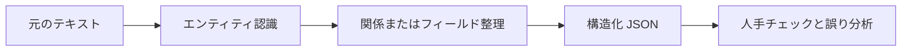

# 11.7.4 プロジェクト：情報抽出


:::tip 図の見方
情報抽出のポイントは、まず schema を定義し、そのうえでテキストを安定してフィールド、エンティティ、関係に落とし込むことです。図を見るときは、ルール、NER、関係抽出、JSON 出力、そして人手レビューがどのようにつながって、実際に使える流れになっているかに注目してください。
:::

:::tip この節の位置づけ
情報抽出プロジェクトの目的は、モデルに「すべてのテキストを理解させる」ことではありません。テキストの中にある重要なエンティティ、関係、フィールドを安定して構造化データに変換することです。これは、従来の NLP、RAG の文書処理、そして LLM の構造化出力をつなぐ重要な橋渡しになります。
:::

## プロジェクトの目標

「小さな講座告知の情報抽出器」を作りましょう。入力として講座告知やイベント案内の文章を受け取り、時間、場所、テーマ、講師、対象者などの構造化フィールドを出力します。



## 最小版

まずは学習済みモデルを使わず、ルールと正規表現でフィールド抽出を実装するところから始められます。たとえば、テキストから日付、時刻、場所など、形式が比較的わかりやすい情報を抽出します。

```python
import re

text = "今週土曜 19:30 に Tencent Meeting で AI アプリ初学者向けの RAG 入門ライブ配信を開催します。講師は張先生です。"

speaker_match = re.search(r"[\u3400-\u9fff]先生", text)

result = {
    "time": re.findall(r"\d{1,2}:\d{2}", text)[0],
    "platform": "Tencent Meeting" if "Tencent Meeting" in text else None,
    "topic": "RAG 入門" if "RAG 入門" in text else None,
    "speaker": speaker_match.group(0) if speaker_match else None,
    "audience": "AI アプリ初学者" if "AI アプリ初学者" in text else None,
}

print(result)
```

想定出力：

```text
{'time': '19:30', 'platform': 'Tencent Meeting', 'topic': 'RAG 入門', 'speaker': '張先生', 'audience': 'AI アプリ初学者'}
```

この版はシンプルですが、情報抽出の核心である「非構造化テキストから使えるフィールドを取り出す」という考え方を理解する助けになります。

### 小さなフィールド単位の評価器を追加する

成功例 1 件で止めないようにしましょう。プロジェクトでは、複数の入力に対して各フィールドが安定しているかを見せる必要があります。

```python
import re

examples = [
    {
        "text": "今週土曜 19:30 に Tencent Meeting で RAG 入門ライブ配信を開催します。講師は張先生です。",
        "gold": {"time": "19:30", "platform": "Tencent Meeting", "topic": "RAG 入門", "speaker": "張先生"},
    },
    {
        "text": "日曜 10:00 に Zoom で評価指標の解説を行います。講師は李先生です。",
        "gold": {"time": "10:00", "platform": "Zoom", "topic": "評価指標", "speaker": "李先生"},
    },
]


def extract(text):
    time_match = re.search(r"\d{1,2}:\d{2}", text)
    speaker_match = re.search(r"[\u3400-\u9fff]先生", text)
    platform = next((name for name in ["Tencent Meeting", "Zoom"] if name in text), "")
    topic = "RAG 入門" if "RAG" in text else ("評価指標" if "評価指標" in text else "")
    return {
        "time": time_match.group(0) if time_match else "",
        "platform": platform,
        "topic": topic,
        "speaker": speaker_match.group(0) if speaker_match else "",
    }


correct = 0
total = 0
for item in examples:
    predicted = extract(item["text"])
    print({"text": item["text"], "predicted": predicted})
    for field, gold_value in item["gold"].items():
        correct += int(predicted[field] == gold_value)
        total += 1

print("field_accuracy =", round(correct / total, 4))
```

想定出力：

```text
{'text': '今週土曜 19:30 に Tencent Meeting で RAG 入門ライブ配信を開催します。講師は張先生です。', 'predicted': {'time': '19:30', 'platform': 'Tencent Meeting', 'topic': 'RAG 入門', 'speaker': '張先生'}}
{'text': '日曜 10:00 に Zoom で評価指標の解説を行います。講師は李先生です。', 'predicted': {'time': '10:00', 'platform': 'Zoom', 'topic': '評価指標', 'speaker': '李先生'}}
field_accuracy = 1.0
```

この評価器は小さいですが、重要な習慣を身につけられます。情報抽出は、最終 JSON がそれらしく見えるかではなく、フィールドごとに測る必要があります。

## 標準版

標準版では、NER や LLM の構造化出力を取り入れられます。既存の NER モデルで人名、組織、場所を認識し、さらにルールや Prompt を使って結果を JSON に整理します。大切なのは完璧さを追うことではなく、「抽出結果を確認できる」流れを作ることです。

出力形式の例は以下の通りです。

```json
{
  "event_name": "RAG 入門ライブ配信",
  "time": "土曜 19:30",
  "location": "Tencent Meeting",
  "speaker": "張先生",
  "audience": "AI アプリ初学者",
  "confidence": "medium"
}
```

## チャレンジ版

チャレンジ版では、一括抽出と人手検証を追加できます。たとえば 20 件の講座告知を入力し、システムが JSON をまとめて生成し、その後で人手で「どのフィールドが正しいか」「どのフィールドが欠けているか」「どこを誤って抽出したか」を記録します。最後に、フィールド単位の正解率を集計します。

| フィールド | 正解率 | よくある誤り |
|---|---|---|
| time | 90% | 相対時間が正規化されていない |
| location | 85% | オンラインのプラットフォームと場所を混同する |
| speaker | 80% | 肩書きと氏名の境界があいまい |
| topic | 75% | テーマが長すぎる、またはキーワードを落とす |

## RAG / Agent とのつながり

情報抽出は、RAG の文書メタデータ作成に使えます。たとえば、講座文書から段階、章、重要概念、対象者を抽出し、検索の絞り込み条件として利用できます。また Agent のツールとしても使えます。Agent が会議、契約、問い合わせ票、講座資料を整理する必要があるとき、まず構造化フィールドを抽出し、そのあとで次の判断を行う、という流れにできます。

## プロジェクトの提出物

README には、プロジェクトの目標、入力例、出力 JSON schema、抽出方法、フィールドの説明、評価方法、失敗サンプル、今後の計画を入れるのがおすすめです。ポートフォリオとして見せるときは、「原文 -> JSON -> 人手修正」を並べた比較表を 1 組入れるとわかりやすくなります。

## 残す証拠

このページを終えたら、この evidence card を残します。

```text
タスク出力：ラベル、entity fields、要約、回答、retrieval 結果、または semantic graph
成果物: 生テキスト、処理済みテキスト、予測、metrics、失敗ケース
指標：accuracy/F1、precision/recall、検索ヒット率、忠実性、またはスキーマ妥当性
失敗確認: 不明確なラベル、過度なクリーニング、境界エラー、ハルシネーション、または裏付けのない回答
期待される成果: 指標と例を含む再現可能なテキストパイプラインフォルダ
```

## よくある誤解

1 つ目の誤解は、成功例だけを見せてフィールド単位の評価をしないことです。2 つ目の誤解は、JSON schema が安定しておらず、後続のプログラムで使えないことです。3 つ目の誤解は、境界の問題を無視することです。たとえば「張先生は北京大学で共有します」のような文では、北京大学が場所にも組織にも見える場合があります。4 つ目の誤解は、LLM の出力をそのままデータベースに入れてしまい、検証をしないことです。


## バージョン別の進め方

| バージョン | 目標 | 提出の重点 |
|---|---|---|
| 基礎版 | 最小限の閉ループを動かす | 入力できる、処理できる、出力できる、そしてサンプルを 1 組残す |
| 標準版 | 見せられるプロジェクトにする | 設定、ログ、エラー処理、README、スクリーンショットを追加する |
| チャレンジ版 | ポートフォリオ品質に近づける | 評価、比較実験、失敗サンプル分析、今後の方針を追加する |

まずは基礎版を完成させるのがおすすめです。最初から大きく作りすぎないようにしましょう。1 つバージョンを上げるたびに、「何が新しくできるようになったか」「どう検証したか」「まだどんな問題があるか」を README に書き足してください。

## 練習

1. 講座告知を抽出する JSON schema を設計してください。
2. 5 件のサンプル告知を使ってルールベース抽出をテストし、各フィールドが正しいか記録してください。
3. 抽出に失敗したケースを 3 つ探し、エンティティ境界の誤りか、フィールド欠落か、schema 設計が不明確なのかを分析してください。
4. 考えてみましょう。こうした構造化フィールドは、後続の RAG 検索にどう役立ちますか？

<details>
<summary>プロジェクト参考とレビュー観点</summary>

1. course announcement schema には、`course`、`date`、`deadline`、`task`、`location_or_url`、`target_audience`、`required_action` などを入れられます。
2. 各 sample は field level で評価します。correct、missing、wrong boundary、wrong type、source text に unsupported かを見ます。
3. 3 つの failure は、entity boundary error、missing field、unclear schema design に分けます。カテゴリごとに修正方法が違います。
4. structured fields は RAG の filtering、routing、metadata search、citation grouping、より安全な downstream Agent actions に役立ちます。

</details>

## 合格基準

このプロジェクトを終えたら、情報抽出とテキスト分類、NER の違いを説明できること、安定した出力 schema を設計できること、フィールド単位の指標で抽出品質を評価できること、そしてそれが RAG や Agent システムにどう役立つかを説明できることが目標です。
