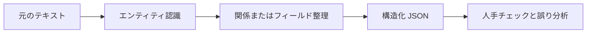

# 11.7.4 プロジェクト：情報抽出


:::tip 図の見方
情報抽出のポイントは、まず schema を定義し、そのうえでテキストを安定してフィールド、エンティティ、関係に落とし込むことです。図を見るときは、ルール、NER、関係抽出、JSON 出力、そして人手レビューがどのようにつながって、実際に使える流れになっているかに注目してください。
:::

:::tip この節の位置づけ
情報抽出プロジェクトの目的は、モデルに「すべてのテキストを理解させる」ことではありません。テキストの中にある重要なエンティティ、関係、フィールドを安定して構造化データに変換することです。これは、従来の NLP、RAG の文書処理、そして LLM の構造化出力をつなぐ重要な橋渡しになります。
:::

## プロジェクトの目標

「小さな講座告知の情報抽出器」を作りましょう。入力として講座告知やイベント案内の文章を受け取り、時間、場所、テーマ、講師、対象者などの構造化フィールドを出力します。



## 最小版

まずは学習済みモデルを使わず、ルールと正規表現でフィールド抽出を実装するところから始められます。たとえば、テキストから日付、時刻、場所など、形式が比較的わかりやすい情報を抽出します。

```python
import re

text = "今週土曜 19:30 に Tencent Meeting で RAG 入門ライブ配信を開催します。講師は張先生です。"

result = {
    "time": re.findall(r"\d{1,2}:\d{2}", text),
    "platform": "Tencent Meeting" if "Tencent Meeting" in text else None,
    "topic": "RAG 入門" if "RAG 入門" in text else None,
}

print(result)
```

この版はシンプルですが、情報抽出の核心である「非構造化テキストから使えるフィールドを取り出す」という考え方を理解する助けになります。

## 標準版

標準版では、NER や LLM の構造化出力を取り入れられます。既存の NER モデルで人名、組織、場所を認識し、さらにルールや Prompt を使って結果を JSON に整理します。大切なのは完璧さを追うことではなく、「抽出結果を確認できる」流れを作ることです。

出力形式の例は以下の通りです。

```json
{
  "event_name": "RAG 入門ライブ配信",
  "time": "土曜 19:30",
  "location": "Tencent Meeting",
  "speaker": "張先生",
  "audience": "AI アプリ初学者",
  "confidence": "medium"
}
```

## チャレンジ版

チャレンジ版では、一括抽出と人手検証を追加できます。たとえば 20 件の講座告知を入力し、システムが JSON をまとめて生成し、その後で人手で「どのフィールドが正しいか」「どのフィールドが欠けているか」「どこを誤って抽出したか」を記録します。最後に、フィールド単位の正解率を集計します。

| フィールド | 正解率 | よくある誤り |
|---|---|---|
| time | 90% | 相対時間が正規化されていない |
| location | 85% | オンラインのプラットフォームと場所を混同する |
| speaker | 80% | 肩書きと氏名の境界があいまい |
| topic | 75% | テーマが長すぎる、またはキーワードを落とす |

## RAG / Agent とのつながり

情報抽出は、RAG の文書メタデータ作成に使えます。たとえば、講座文書から段階、章、重要概念、対象者を抽出し、検索の絞り込み条件として利用できます。また Agent のツールとしても使えます。Agent が会議、契約、問い合わせ票、講座資料を整理する必要があるとき、まず構造化フィールドを抽出し、そのあとで次の判断を行う、という流れにできます。

## プロジェクトの提出物

README には、プロジェクトの目標、入力例、出力 JSON schema、抽出方法、フィールドの説明、評価方法、失敗サンプル、今後の計画を入れるのがおすすめです。ポートフォリオとして見せるときは、「原文 -> JSON -> 人手修正」を並べた比較表を 1 組入れるとわかりやすくなります。

## よくある誤解

1 つ目の誤解は、成功例だけを見せてフィールド単位の評価をしないことです。2 つ目の誤解は、JSON schema が安定しておらず、後続のプログラムで使えないことです。3 つ目の誤解は、境界の問題を無視することです。たとえば「張先生は北京大学で共有します」のような文では、北京大学が場所にも組織にも見える場合があります。4 つ目の誤解は、LLM の出力をそのままデータベースに入れてしまい、検証をしないことです。


## バージョン別の進め方

| バージョン | 目標 | 提出の重点 |
|---|---|---|
| 基礎版 | 最小限の閉ループを動かす | 入力できる、処理できる、出力できる、そしてサンプルを 1 組残す |
| 標準版 | 見せられるプロジェクトにする | 設定、ログ、エラー処理、README、スクリーンショットを追加する |
| チャレンジ版 | ポートフォリオ品質に近づける | 評価、比較実験、失敗サンプル分析、今後の方針を追加する |

まずは基礎版を完成させるのがおすすめです。最初から大きく作りすぎないようにしましょう。1 つバージョンを上げるたびに、「何が新しくできるようになったか」「どう検証したか」「まだどんな問題があるか」を README に書き足してください。

## 練習

1. 講座告知を抽出する JSON schema を設計してください。
2. 5 件のサンプル告知を使ってルールベース抽出をテストし、各フィールドが正しいか記録してください。
3. 抽出に失敗したケースを 3 つ探し、エンティティ境界の誤りか、フィールド欠落か、schema 設計が不明確なのかを分析してください。
4. 考えてみましょう。こうした構造化フィールドは、後続の RAG 検索にどう役立ちますか？

## 合格基準

このプロジェクトを終えたら、情報抽出とテキスト分類、NER の違いを説明できること、安定した出力 schema を設計できること、フィールド単位の指標で抽出品質を評価できること、そしてそれが RAG や Agent システムにどう役立つかを説明できることが目標です。
