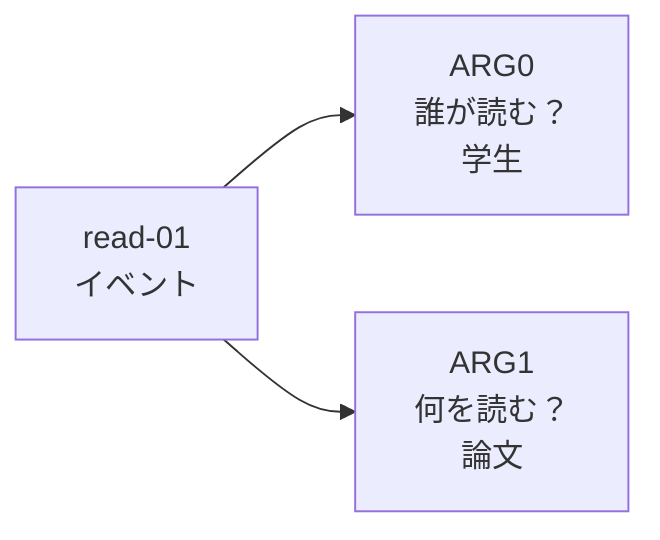
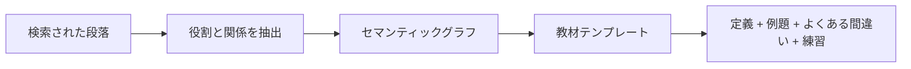

# 11.7.5 セマンティックグラフと AMR：文を構造化された意味に変える


:::tip この節の位置づけ
テキストは、ただの単語の並びではありません。多くの場合、私たちが本当に知りたいのは、文の背後にある構造化された意味です。

AMR のようなセマンティックグラフの考え方は、次の問いに答えようとしています。

> **1つの文を「誰が何をしたのか、誰に対してしたのか、どんな条件で行ったのか」という構造図に変えられるのか？**
:::

## 一、なぜセマンティックグラフが必要なのか？

普通のテキスト表現は、たとえばこんな形です。

```text
ジョブズは Apple を創業した。
```

でも、情報抽出や知識ベースのシステムは、次のような構造を求めています。

```text
人物：ジョブズ
関係：創業
組織：Apple
```

さらに複雑になると、文の中には時間、場所、因果関係、条件、否定、照応などが入ってきます。  
そうなると、単純なキーワード一致だけでは足りません。

セマンティックグラフの目標は、次のようなものです。

> **自然言語の意味を、機械がより扱いやすいグラフ構造に変えること。**

## 二、AMR とは？

AMR は Abstract Meaning Representation の略で、まずは抽象的な意味表現の一種だと考えるとよいです。

AMR は、単にエンティティを示すだけではなく、イベントや役割の関係も表そうとします。

たとえば「学生が論文を読む」は、次のようにイメージできます。

```text
read-01
  ARG0: 学生
  ARG1: 論文
```

この構造が表しているのは、次の内容です。

- 中心となるイベントは「読む」
- 誰が読むのか：学生
- 何を読むのか：論文

これは単なる分かち書きよりも、ずっと「文が本当に言いたいこと」に近い表現です。

初心者にとって一番読みやすい見方は、次のようなものです。



`ARG0` と `ARG1` は「1番目の単語」「2番目の単語」という意味ではありません。意味上の役割です。多くの単純なイベント文では、まず次のように読めます。

- `ARG0`: 動作を行う人やもの
- `ARG1`: 動作の対象になるもの

この小さな見方の切り替えが重要です。セマンティックグラフは、語順よりも意味の関係を重視します。

## 三、セマンティックグラフと情報抽出はどう関係するのか？

情報抽出は、通常は次のような具体的なタスクに分かれます。

- エンティティ抽出
- 関係抽出
- イベント抽出
- 属性抽出

セマンティックグラフは、これらの結果をまとめて、より完全な意味構造として整理するイメージです。

| タスク | 出力のイメージ |
|---|---|
| NER | どの語が人名、組織名、場所か |
| 関係抽出 | A と B がどんな関係か |
| イベント抽出 | 誰が、いつ、何をしたか |
| AMR / セマンティックグラフ | 文全体の役割と意味構造 |

## 四、なぜ RAG や知識ベースのプロジェクトに役立つのか？

前に挙げた「知識ベースから自動で Word の教材を作る」プロジェクトでは、セマンティックグラフの考え方がとても役立ちます。

教材には、よく次のような要素が入るからです。

- 定義
- 例題
- 手順
- 条件
- 注意点
- 前後関係や因果関係

システムがベクトル検索だけを行うと、似た段落は見つかっても、構造までは理解できないことがあります。  
一方で、構造化された関係を抽出できれば、教材をより安定して組み立てられます。

```text
知識点 -> 定義 -> 例題 -> 解法手順 -> よくある間違い -> 練習問題
```

これが、セマンティックグラフと情報抽出が知識ベースシステムにとって重要な理由です。

## 五、構文解析や再帰ニューラルネットワークとの関係

Transformer が主流になる前、NLP では長い間、構文構造や意味構造が研究されていました。

たとえば、次のような分野があります。

- 依存構文解析
- 句構造解析
- 役割ラベル付け
- 木構造を表現するための再帰ニューラルネットワークの研究

これらの研究が共通して示しているのは、1つのことです。

> **テキスト理解は、単なる単語ベクトルの類似度だけではなく、構造的な関係も含む。**

今日の大規模モデルは、多くの構造を暗黙的に扱えるようになっています。  
それでも、厳密さが必要な知識ベース、法律、医療、教材生成では、明示的な構造が今でもとても重要です。

## 六、最小限の構造化抽出の例

以下は完全な AMR ではなく、あくまで「文を構造として書き直す」感覚を示す簡単な例です。

```python
sentence = "Andrew Ng 教授が機械学習コースを教えている"

semantic_graph = {
    "event": "教える",
    "teacher": "Andrew Ng 教授",
    "topic": "機械学習コース",
}

for role, value in semantic_graph.items():
    print(role, "=>", value)
```

ここで大事なのは、まず次の点を理解することです。

- テキストは役割に分解できる
- 役割はグラフのように結びつけられる
- グラフ構造は、その後の生成や検索に役立つ

## 七、1つの文から教材構造へ

知識ベースから教材を生成したい場合、セマンティックグラフは「検索された段落」と「最終的な Word 文書」の間に置く中間構造になります。

小さな例を見てみましょう。

```python
sentence = "連鎖律は、ニューラルネットワークが層ごとに勾配を計算するのを助ける。"

semantic_graph = {
    "concept": "連鎖律",
    "function": "勾配を計算する",
    "scenario": "ニューラルネットワーク",
    "method": "層ごとに",
}

courseware_block = {
    "title": semantic_graph["concept"],
    "definition": "合成関数の導関数を分解して考えるための規則。",
    "why_it_matters": f"{semantic_graph['scenario']} が {semantic_graph['function']} ために重要。",
    "teaching_hint": f"勾配信号が {semantic_graph['method']} 前の層へ伝わる、と説明できる。",
}

for key, value in courseware_block.items():
    print(f"{key}: {value}")
```

流れは次のように整理できます。



そのため、すぐに完全な AMR パーサーを実装しなくても、AMR はより構造的な問いを立てる訓練になります。

- ここで扱う概念は何か？
- どんな動作や関係が述べられているか？
- その関係に参加している対象は何か？
- 条件、原因、結果は付いているか？

## 八、歴史的な流れをコースの章に対応づける

| 歴史的な流れ | 解決しようとした問題 | 対応するコース章 |
|---|---|---|
| 構文解析 / 再帰ニューラルネットワークの研究 | 木構造による言語表現 | 7.5 本節、5.2 Seq2Seq の背景 |
| AMR | 文の意味をセマンティックグラフで表す | 7.5 本節、7.4 情報抽出プロジェクト |
| 意味役割付与 | 誰が誰に何をしたか | 7.4 情報抽出、知識グラフの拡張 |
| Knowledge Graph | 抽出結果を検索可能な知識として整理する | 第 8 章 RAG、知識ベースシステム |

## 九、この節を学んだあとに身につけたい感覚

ベクトル検索は「どの文が似ているか」を教えてくれます。  
セマンティックグラフは「その文の中にどんな役割や関係があるか」を重視します。

教材作成、知識ベースQ&A、自動 Word 文書生成をやるなら、この違いはとても大切です。

- ベクトル検索は資料を見つける
- 情報抽出は要点を拾う
- セマンティックグラフは構造を整理する
- 大規模モデルはテンプレートに沿って内容を生成する

これが、現代の知識ベースアプリケーションで「検索 + 構造化 + 生成」がますます重視されている理由です。
