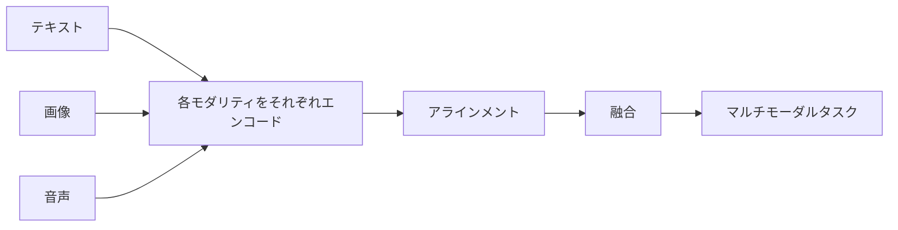

# 12.1.2 マルチモーダル学習の基礎


## 学習目標

この節を終えると、次のことができるようになります。

- 「モダリティ」とは何かを理解する
- マルチモーダルシステムがなぜ現実世界により近いのかを説明できる
- 融合（fusion）とアラインメント（alignment）の直感をつかむ
- すごく簡単な画像・テキストマッチングの例を実行する

## 歴史的背景：なぜマルチモーダルが急に主役になったのか？

この節で特に知っておきたい歴史的な節目は次です。

| 年 | 論文 / 手法 | 主な著者 | 最も重要に解決したこと |
|---|---|---|---|
| 2021 | CLIP | Radford ら | 画像とテキストを同じ意味空間にそろえ、画像検索、視覚言語理解、マルチモーダル基盤モデルの流れを大きく前進させた |

初心者にとって、まず覚えておくとよいのは次です。

> **CLIP の意味は、単に「画像・テキスト検索が強くなった」ことではなく、「異なるモダリティを先にそろえてからタスクを行う」という流れが本当に定着したことにあります。**

なので、この節で出てくる「アラインメント」や「共有意味空間」は抽象的な概念ではなく、  
その後の多くのマルチモーダルシステムが本当に動くための土台です。

### なぜ CLIP のような研究で、多くの人が初めて「マルチモーダルが本物になった」と感じたのか？

それ以前は、多くの画像・テキストシステムが次のような感じでした。

- 1つのタスクごとに個別のモデルを作る
- タスクが変わるたびに、また作り直す

でも CLIP が与えた感覚はかなり違いました。

- 画像とテキストが、まず共通の空間を学べるかもしれない
- そのアラインメントが安定すれば、多くのタスクをその上に積み上げられる

これは、BERT や GPT に初めて触れたときの感覚に少し似ています。

- ただ「あるタスクがよくなる」だけではない
- まるで「土台そのものが強くなった」ように見える

だから CLIP がわくわくさせたのは、  
検索精度だけではなく、  
「マルチモーダル基盤モデル」が本当に大きく育っていきそうだと感じさせた点です。

### なぜ CLIP のような研究で、マルチモーダルが急に「ひとつの時代」っぽく見えたのか？

それ以前は、多くの画像・テキストタスクが次のように見えていました。

- 1つのタスクのために、個別のシステムを作る

でも CLIP によって、多くの人が初めて強く感じたのは次のことです。

- もしかすると画像とテキストは、先に同じ共有意味空間を学べるのではないか
- そして多くのタスクは、その土台から育っていけるのではないか

これは NLP における事前学習モデルがもたらした感覚によく似ています。

- もはや「1つのタスクを解く」だけではない
- より汎用的な土台を作っている

だから CLIP が初学者にとって特に魅力的なのは、次の点です。

> **「画像とテキストが本当に互いを理解できる」ということが、初めてデモではなく、安定した技術ルートのように見えたことです。**

---

## まず全体像をつかもう

前のテキストシステムや Agent の主線を学び終えているなら、この節は次のように理解するとよいです。

- 前の多くのシステムは主にテキストだけを扱っていた
- この節では、もしシステムが画像を見て、音声を聞き、動画を理解するなら、それらの情報をどうやって同じ流れに入れるのかを考える

なので、この節で本当に重要なのは概念をたくさん覚えることではなく、次のための最小限の直感をつかむことです。

- これからのマルチモーダル理解とマルチモーダル生成の土台を作る

マルチモーダル学習の基礎を初心者が理解する順番として最適なのは、いきなり用語を暗記することではなく、まず次をはっきり見ることです。



この節で本当に解決したいのは次の2つです。

- 「モダリティ」とは何か
- なぜアラインメントと融合がマルチモーダルの2つの核心的な動きなのか

## 一、モダリティとは何か？

モダリティ（modality）は、簡単に言うと「情報の表現形式」です。

よくあるモダリティには次のようなものがあります。

- テキスト
- 画像
- 音声
- 動画
- 構造化テーブル

つまり、マルチモーダルシステムとは、2種類以上の情報形式を同時に扱うシステムのことです。

たとえるなら、

> 人間は世界を文字だけで理解しているわけではなく、見て、聞いて、読み、話しています。マルチモーダル AI もその方向に向かっています。

### 初めてマルチモーダルを学ぶとき、まず何をつかむべきか？

まずつかむべきなのは、モダリティの種類一覧ではなく、この一文です。

> **マルチモーダルが本当に解決したいのは、異なる情報源を同じ理解の流れに入れることです。**

この感覚が定まると、後で

- 画像・テキスト検索
- 視覚質問応答
- マルチモーダル対話

を見たときに、「これらのシステムはどうやって違う信号をそろえているのか？」と自然に考えられるようになります。

---

## 二、なぜ現実世界はもともとマルチモーダルなのか？

日常の場面をいくつか考えてみましょう。

- 商品画像を見る + 商品説明を読む
- 診療記録のテキストを見る + 医療画像を見る
- 監視カメラ映像を見る + 警報音を聞く
- スクリーンショットを送って「これは何のエラー？」と聞く

もし AI が文字しか見られないなら、それは「目を閉じて仕事している」ようなものです。  
画像しか見られないなら、「説明書が読めない」ようなものです。

だからマルチモーダルシステムが重要なのは、

> **異なる情報源を組み合わせて理解できるからです。**

---

## 三、マルチモーダルのタスクには何があるのか？

| タスク | 例 |
|---|---|
| 画像説明 | 画像に対して1文の説明を生成する |
| 画像・テキスト検索 | 文章で画像を探す、画像で文章を探す |
| 視覚質問応答 | 画像を見て質問に答える |
| OCR + 理解 | 画像内の文字を読み、その内容を理解する |
| 動画理解 | 動画の内容を要約する |
| 音声アシスタント | 音声を聞き取り、返答する |

## 四、融合（Fusion）とは何か？

融合は、次のように理解できます。

> 異なるモダリティの情報をまとめて、より完全な理解を作ること。

たとえば商品推薦では、

- 画像だけを見ると、見た目の雰囲気はわかる
- テキストだけを見ると、用途はわかる
- 画像とテキストを一緒に見ると、より完全に理解できる

### すごく簡単な例

商品画像と説明文をそれぞれ特徴量にしてから、まとめてみましょう。

```python
import numpy as np

# 画像特徴: 明るさ、赤さ、丸さ
image_feature = np.array([0.8, 0.7, 0.2])

# テキスト特徴: おしゃれ感、スポーツ感、ビジネス感
text_feature = np.array([0.6, 0.2, 0.1])

# 最も簡単な融合: 結合
fused_feature = np.concatenate([image_feature, text_feature])

print("画像特徴:", image_feature)
print("テキスト特徴:", text_feature)
print("融合後特徴:", fused_feature)
print("融合後の次元:", fused_feature.shape)
```

想定出力：

```text
画像特徴: [0.8 0.7 0.2]
テキスト特徴: [0.6 0.2 0.1]
融合後特徴: [0.8 0.7 0.2 0.6 0.2 0.1]
融合後の次元: (6,)
```

融合後のベクトルは 6 次元です。3 つの画像特徴の後ろに、3 つのテキスト特徴をつなげているからです。本物のモデルはもっと複雑ですが、ここでは核心だけを見える形にしています。

実際のモデルはもちろんこれよりずっと複雑ですが、「複数の情報源をまとめる」という考え方はこの通りです。

### 融合でまず覚えるべきことは、方法ではなく目的

まず覚えておくべきなのは次です。

- 単一モダリティだけでは全体が見えない
- マルチモーダルは、より完全に判断するためにある

つまり融合は、ただベクトルをつなぐことではなく、次の問いに答えることです。

- どの情報源を一緒に見るべきか
- どの情報が互いに補い合うのか

---

## 五、アラインメント（Alignment）とは何か？

アラインメントは、マルチモーダルのもう1つの重要な概念です。

次のように考えるとわかりやすいです。

> **異なるモダリティにある「同じ意味」を、表現空間の中で近づけること。**

たとえば、

- 猫の画像
- テキスト「かわいい猫」

モデルがうまく学べていれば、これらのベクトル表現は近くなります。

### なぜ「アラインメント」がマルチモーダルの最重要ワードの1つなのか？

異なるモダリティの表現がまったく対応していなければ、その後はほとんど何もできません。

- テキスト検索による画像検索
- 画像・テキスト質問応答
- 画像説明生成

これらの能力の前提は、次のことです。

- まず異なるモダリティが、何らかの共有空間で「同じことを言っている」とわかる必要がある

---

## 六、実行できる画像・テキストマッチングの玩具例

```python
import numpy as np

images = {
    "red_apple.jpg": np.array([0.9, 0.1, 0.0]),   # 赤い、丸い、乗り物ではない
    "blue_car.jpg": np.array([0.1, 0.2, 1.0]),    # 赤くない、やや丸い、乗り物
    "orange_ball.jpg": np.array([0.8, 0.9, 0.0])  # 暖色寄り、とても丸い、乗り物ではない
}

texts = {
    "red fruit": np.array([0.95, 0.2, 0.0]),
    "vehicle": np.array([0.0, 0.1, 1.0]),
    "round toy": np.array([0.7, 0.95, 0.0])
}

def cosine_similarity(a, b):
    return float(np.dot(a, b) / (np.linalg.norm(a) * np.linalg.norm(b)))

for text_name, text_vec in texts.items():
    print(f"\n検索テキスト: {text_name}")
    scores = []
    for image_name, image_vec in images.items():
        scores.append((cosine_similarity(text_vec, image_vec), image_name))
    scores.sort(reverse=True)
    for score, image_name in scores:
        print(f"  {image_name}: {score:.4f}")
```

想定出力：

```text
検索テキスト: red fruit
  red_apple.jpg: 0.9953
  orange_ball.jpg: 0.8041
  blue_car.jpg: 0.1357

検索テキスト: vehicle
  blue_car.jpg: 0.9905
  orange_ball.jpg: 0.0744
  red_apple.jpg: 0.0110

検索テキスト: round toy
  orange_ball.jpg: 0.9958
  red_apple.jpg: 0.6785
  blue_car.jpg: 0.2150
```

最も高いスコアが検索結果です。トップが間違う場合、まず見るべきなのは、画像とテキストが同じ特徴空間で本当に対応づけられているかです。

これは「クロスモーダル検索」の最小原理版です。

- テキストと画像をどちらもベクトルにする
- それから類似度を比べる

---

## 七、なぜマルチモーダルは難しいのか？

マルチモーダルは、次の2種類の問題を同時に解く必要があるからです。

1. 各モダリティの内部をどうモデル化するか
2. 異なるモダリティをどうアラインメントし、どう融合するか

たとえば画像には画像の難しさがあります。

- 空間構造
- 光の変化
- 視点の変化

一方でテキストにはテキストの難しさがあります。

- 曖昧さ
- 文脈
- 長文構造

この2つを合わせるのですから、複雑さが増すのは当然です。

---

## 八、現在よくあるマルチモーダルの流れ

### デュアルタワー検索の流れ

画像用のエンコーダーとテキスト用のエンコーダーを別々に使い、最後にベクトルの類似度を比べます。

### 統一 Transformer の流れ

画像とテキストを共通の系列空間に写し、1つの枠組みでまとめてモデル化します。

### 大規模モデル拡張の流れ

言語モデルの前段に、画像エンコーダーや音声エンコーダーなどのモジュールをつなぎます。

だから今では、多くのシステムで次のことができるのです。

- 画像質問応答
- 画像・テキスト対話
- OCR 理解

---

## 九、初学者がよくする誤解

### マルチモーダルとは「画像 + テキスト」だと思ってしまう

それだけではありません。  
音声、動画、センサー信号もモダリティに含まれます。

### マルチモーダルは必ず単一モーダルより強いと思ってしまう

必ずしもそうではありません。  
追加したモダリティの質が悪いと、逆にノイズになることがあります。

### かっこいいデモだけ見て、アラインメントの問題を見ない

マルチモーダルで本当に難しいのは、多くの場合、アラインメントと融合です。

---

## まとめ

この節で最も大事な一文は次です。

> **マルチモーダルの価値は、異なる情報源をまとめて、より完全な理解を作ることにあります。**

次に視覚言語モデルを学ぶとき、こうした「画像・テキストのアラインメント」がモデルの中でどう使われているのかが見えてきます。

---

## この節で持ち帰るべきこと

- マルチモーダルシステムの本質は、異なる形式の情報を同じ理解の流れに入れること
- 「アラインメント」と「融合」は、まず覚えるべき2つの核心的な動き
- 最初に入力とタスクをはっきりさせることは、いきなりモデル名を追うより大事

さらに一言でまとめると、こうです。

> **マルチモーダルの鍵は、モダリティが増えることではなく、システムが異なる情報源を1つの判断枠組みに入れ始めることです。**

---

## 練習

1. 上の画像ベクトルとテキストベクトルを変更して、マッチング順位がどう変わるか観察してみましょう。
2. 「食べ物 / 乗り物 / 動物」の玩具ベクトル空間を自分で設計してみましょう。
3. 「スクリーンショットのエラー + 質問文」が、エラーテキストだけよりマルチモーダルシステムに向いているのはなぜか、考えてみましょう。
