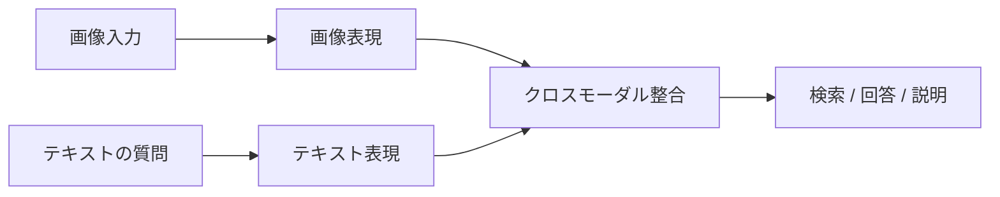
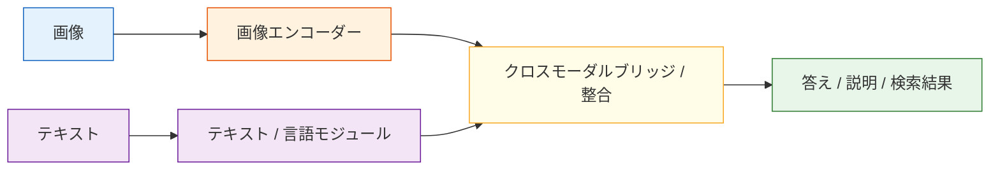

# 12.1.3 視覚-言語モデル


:::tip この節の位置づけ
視覚-言語モデルは、初心者には次のように理解されがちです。

- 画像を入れて、モデルに何か言わせる

でも、より正確には次のように考えるべきです。

- 画像情報とテキストの質問を、まず同じ推論の流れに入れる

なので、この節でいちばん大事なのは「画像が見えること」ではなく、

> **画像と言葉をどうやって本当に結びつけるか。**
:::

## 学習目標

この節を終えると、次のことができるようになります。

- 視覚-言語モデル（VLM）と、通常の画像モデル・テキストモデルの違いを理解する
- 画像エンコーダー、言語モデル、ブリッジモジュールのおおまかな役割を説明できる
- 簡略化した図文検索 / 画像QAの例を動かせる
- VLM がどんなタスクに向いていて、よくある制限は何かを理解する

---

## まず全体の地図を作ろう

視覚-言語モデルは、「画像がどのようにシステムに入り、文字がどうやって質問するのか」で理解するとわかりやすいです。



この節で本当に解決したいのは、次の点です。

- なぜ VLM は単純な「画像 + テキストの足し算」ではないのか
- なぜ画像情報はまず表現され、それから言語の質問と整合させる必要があるのか

---

## 一、視覚-言語モデルとは？

視覚-言語モデル（Vision-Language Model, VLM）は、次のように考えられます。

> **画像も見られて、文字も理解できて、その2つをつなげられるモデル。**

通常のモデルと比べると、

- 純粋な視覚モデル：画像の内容を認識するのが得意
- 純粋な言語モデル：文字を理解し、生成するのが得意
- 視覚-言語モデル：画像と言葉を一緒に扱うのが得意

そのため、特に次のようなタスクに向いています。

- 画像QA
- 図文検索
- 画像説明
- UI理解
- 文書スクリーンショットのQA

### 初心者向けのわかりやすいたとえ

VLM は、次のような存在だと考えられます。

- 画像も見られて、問題文も見られる助手

もし画像は見られても質問の意味がわからなければ、  
言えるのはせいぜい

- 「画像にはこんなものがありそう」

までです。

もし質問は読めても画像が見られなければ、  
こういう問いには答えられません。

- 「この画像の中で実際に何が起きているの？」

だから VLM の本当に特別な点は、

- 「画像を見ること」と「質問を理解すること」を同じシステムに入れていること

です。

---

## 二、VLM の直感的な構造

難しいアーキテクチャに怖がる必要はありません。まずは大きな骨組みだけつかめば十分です。



### まずは役割をこう理解しましょう

| モジュール | 役割 |
|---|---|
| 画像エンコーダー | 画像をベクトル / 特徴量に変える |
| テキストモジュール | プロンプトを理解し、回答を生成する |
| ブリッジモジュール | 画像特徴量と言語システムをつなぐ |

---

## 三、最小の図文検索例

コードをそのまま動かせるように、手作りの画像特徴量とテキスト特徴量を使って、VLM の「同じ空間にそろえる」考え方をまねしてみます。

```python
import numpy as np

image_embeddings = {
    "cat_photo": np.array([0.95, 0.10, 0.05]),
    "car_photo": np.array([0.05, 0.20, 0.95]),
    "cake_photo": np.array([0.60, 0.85, 0.10])
}

text_embeddings = {
    "a small cat": np.array([0.90, 0.15, 0.05]),
    "a vehicle": np.array([0.05, 0.10, 0.98]),
    "a sweet dessert": np.array([0.55, 0.90, 0.10])
}

def cosine_similarity(a, b):
    return float(np.dot(a, b) / (np.linalg.norm(a) * np.linalg.norm(b)))

for text, text_vec in text_embeddings.items():
    print(f"\nテキスト検索: {text}")
    results = []
    for image_name, image_vec in image_embeddings.items():
        results.append((cosine_similarity(text_vec, image_vec), image_name))
    results.sort(reverse=True)
    for score, image_name in results:
        print(f"  {image_name}: {score:.4f}")
```

期待される出力：

```text
テキスト検索: a small cat
  cat_photo: 0.9982
  cake_photo: 0.7041
  car_photo: 0.1379

テキスト検索: a vehicle
  car_photo: 0.9944
  cake_photo: 0.2066
  cat_photo: 0.1129

テキスト検索: a sweet dessert
  cake_photo: 0.9978
  cat_photo: 0.6093
  car_photo: 0.2937
```

テキスト検索ごとに、最も高いスコアの画像が変わります。これが図文検索の中心です。画像と言葉を、同じ対応づけ済みのベクトル空間で比較します。

モデルがうまくクロスモーダル整合を学べると、関連する画像と言葉はより近くなります。


:::tip filename ではなく順位を見る
各 text query は vector になり、すべての image vector と similarity を計算します。そして cosine similarity が最も高い image を結果にします。top-1 が違うなら、まず cross-modal alignment を確認します。
:::

### 初学者がまず覚えるとよい判断表

| タスク | VLM が特に補ってくれる部分 |
|---|---|
| 図文検索 | 画像と言葉を同じ空間で比べる |
| 画像QA | 質問と画像を合わせて推論する |
| 画像説明 | 視覚内容を自然言語に変える |
| UI理解 | スクリーンショットと指示を組み合わせて情報を探す |

この表は初心者にとても役立ちます。なぜなら、次の違いを先に切り分けられるからです。

- 視覚モデルが何を見ているのか
- VLM がさらに何を足しているのか

---

## 四、画像QA（VQA）はどんな感じ？

画像QAの目的は次のとおりです。

> モデルに画像を1枚渡して、質問を1つ聞き、画像内容にもとづいて答えさせる。

実際の VLM では、モデルは次のことをします。

1. 画像を見て視覚特徴量を得る
2. テキストの質問と合わせて要求を理解する
3. その2つをまとめて答えを生成する

まずは、とても簡略化した「おもちゃ版」を書いてみましょう。

```python
image_features = {
    "screen_error": {
        "has_text": True,
        "is_ui": True,
        "main_color": "dark",
        "topic": "error_message"
    },
    "food_photo": {
        "has_text": False,
        "is_ui": False,
        "main_color": "warm",
        "topic": "dessert"
    }
}

def ask_vlm(image_name, question):
    feat = image_features[image_name]
    question = question.lower()

    if "文字" in question or "has text" in question:
        return "文字があります" if feat["has_text"] else "はっきりした文字はありません"
    if "ui" in question or "スクリーンショット" in question:
        return "UIのスクリーンショットのようです" if feat["is_ui"] else "UIのスクリーンショットには見えません"
    if "テーマ" in question:
        return f"この画像のテーマは：{feat['topic']} に近いです"
    return "このおもちゃモデルでは、その質問に答えられません"

print(ask_vlm("screen_error", "この画像に文字はありますか？"))
print(ask_vlm("screen_error", "UIのスクリーンショットですか？"))
print(ask_vlm("food_photo", "テーマは何ですか？"))
```

期待される出力：

```text
文字があります
UIのスクリーンショットのようです
この画像のテーマは：dessert に近いです
```


:::tip question type と image facts を対応させる
image record には複数の事実がありますが、question が使う事実を決めます。答えが違う時は、違う fact を選んだか、question type を誤解した可能性を疑います。
:::

答えは 2 つの入力に依存します。画像レコードが視覚的な事実を持ち、ユーザーの質問がどの事実を使うかを決めます。

もちろん、実際の VLM は手書きルールではありません。ですが、この例で次のことが理解しやすくなります。

- 画像情報はまず表現される
- 質問も理解される
- 最終的な答えは「画像 + 質問」の共同推論に依存する

### まずタスク種類を判断する最小例

```python
def vlm_task_type(question):
    if "文字" in question:
        return "attribute_check"
    if "テーマ" in question or "何ですか" in question:
        return "semantic_qa"
    if "スクリーンショット" in question or "っぽい" in question or "よう" in question:
        return "classification_judgement"
    return "generic_vlm_task"


for question in ["この画像に文字はありますか？", "テーマは何ですか？", "UIのスクリーンショットっぽいですか？"]:
    print(question, "->", vlm_task_type(question))
```

期待される出力：

```text
この画像に文字はありますか？ -> attribute_check
テーマは何ですか？ -> semantic_qa
UIのスクリーンショットっぽいですか？ -> classification_judgement
```

この例は初心者にとても向いています。ユーザーが何を聞いているのか、まずどの種類の問題なのかを考える必要がある、と気づけるからです。

---

## 五、VLM と OCR の関係は？

この2つは混同されやすいです。

### OCR

重点は次のとおりです。

- 画像内の文字が何かを認識する

### VLM

重点は次のとおりです。

- 文字を見るだけでなく、画像全体と質問の関係を理解する

たとえば、エラーダイアログのスクリーンショットなら、

- OCR はエラーテキストを読み取る
- VLM はさらに「これはネットワークエラーっぽいか、それとも権限エラーっぽいか？」まで答えられる

---

## 六、VLM はどんなタスクに向いている？

### とても向いているもの

- 画像QA
- スクリーンショットの説明
- 図文検索
- EC 商品画像の理解
- 文書画像の理解

### 必ずしも向いていないもの

- 画像情報がまったく不要な純テキストタスク
- 非常に細かい専門的な画像診断タスク
- ピクセル単位の高精度が必要なタスク

このような場合は、専用の視覚モデルを組み合わせる必要があることもあります。

---

## 七、なぜ VLM は「見間違える」「答えがずれる」ことがあるの？

VLM は、次の2つの難しさを同時に越える必要があるからです。

1. 画像理解そのものが難しい
2. 画像と言葉の関係をモデル化するのはさらに難しい

よくある問題は次のとおりです。

- 視覚的な細部を見落とす
- OCR で文字を読み間違える
- 質問の意味を取り違える
- 回答を作るときに言いすぎる / 想像で補ってしまう

だから VLM 製品では、評価と安全策の両方がとても大切です。

---

## 八、今の多くのプロダクトで VLM が欠かせないのはなぜ？

実際のユーザー入力は、たいてい「純粋な文字」ではないからです。

たとえば、

- ページのスクリーンショットを送って「どこでエラーが出ていますか？」と聞く
- 請求書の写真を送って「金額はいくらですか？」と聞く
- 料理の写真を送って「何の料理っぽいですか？」と聞く

こうしたタスクは、文字モデルだけでは情報が足りません。

---

## 九、初心者がよくする誤解

### VLM は「画像を GPT に入れるだけ」だと思うこと

より正確には、「画像情報をエンコードして整合させたうえで、言語システムに入れる」です。

### VLM は生まれつき OCR も位置特定も推論も全部うまくできると思うこと

実際の性能は、モデル能力、プロンプト、画像品質、タスク難易度に左右されます。

### 画像が見られれば、純テキストモデルより必ず良いと思うこと

画像情報が本当に価値を持つときだけ、多モーダルには強みがあります。

## これをプロジェクトにするなら、何を見せるとよいか

よく見せるべきなのは、次のようなものです。

- 「モデルが画像を見られること」そのもの

ではなく、

1. 画像入力
2. ユーザーの質問
3. モデルがどうやってタスク種類を判断するか
4. 最終的な答えや検索結果
5. 典型的な失敗例のセット

こうすると、見る人には次のことが伝わりやすくなります。

- あなたが理解しているのは、多モーダル推論の流れだということ
- ただ画像入力を1つつないだだけではないということ

---

## まとめ

この節でいちばん大事な一文は次のとおりです。

> **VLM の本質は「画像を見ること」だけでなく、画像と言語を同じ理解の流れに入れること。**

これが、多モーダルシステムが「見える」段階から「説明できる、答えられる、対話できる」段階へ進むための重要な一歩です。

---

## 練習

1. 図文検索の例のベクトルを変更して、`cake_photo` を `a sweet dessert` にもっと近づけてみましょう。
2. おもちゃ版の `ask_vlm()` に、もう1つ質問タイプを追加してみましょう。たとえば「この画像は生活写真っぽいですか、それともソフトウェアの UI っぽいですか？」です。
3. 考えてみましょう。ユーザーがぼやけたスクリーンショットをアップロードした場合、VLM はどの段階で間違えやすいでしょうか？
