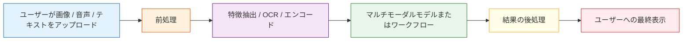

# マルチモーダルアプリ開発


:::tip 図の見方
マルチモーダルアプリは「モデルが画像を見られる」だけでは終わりません。図を見るときは、入力品質、OCR/VLM の役割分担、検索やツール呼び出し、ユーザーフィードバック、失敗時のフォールバック、そしてプライバシーとコンプライアンスが、どう実際の製品フローを作っているかに注目しましょう。
:::

## 学習目標

この節を終えると、次のことができるようになります。

- よくあるマルチモーダルアプリの製品形態を見分ける
- マルチモーダルアプリの基本的なエンジニアリングの流れを理解する
- 「画像情報 + テキストの質問」のおもちゃアプリを動かす
- マルチモーダルシステムを本番に出すときに、どんなエンジニアリング課題を重点的に見るべきかを知る

---

## 一、マルチモーダルアプリは実際にどんな形？

### 1.1 「かっこいいから画像を足す」のではなく、入力が本当により完全になる

多くのタスクは、テキストだけだと情報が実は足りません。

たとえば：

- スクリーンショットのエラー分析
- 領収書の認識と質問応答
- 商品画像検索
- 画像審査
- 書類の写真解析

これらは自然にマルチモーダルに向いています。

### 1.2 よくある製品形態

| 形態 | ユーザー入力 | システム出力 |
|---|---|---|
| スクリーンショットアシスタント | スクリーンショット + 質問 | エラーの説明 / 操作の提案 |
| 画像テキスト客服 | 商品画像 + ユーザーの相談 | 商品説明 / アフターサポートの提案 |
| 文書理解 | 領収書 / 契約書画像 + 質問 | 重要情報の抽出 / 回答 |
| 学習アシスタント | 問題画像 + 学生の質問 | 解説とヒント |

---

## 二、マルチモーダルアプリの基本的なエンジニアリングの流れ

### 2.1 よくある処理パイプライン



### 2.2 なぜ多くのマルチモーダルアプリは「1つのモデルですべて完結」しないのか？

実際のシステムでは、複数のモジュールを組み合わせることが多いからです。

- OCR
- 画像分類
- VLM
- ルール判定
- データベース検索

そのため、マルチモーダルアプリは「純粋なモデル製品」というより、「複数モジュールが協力する製品」になりやすいです。

---

## 三、動かせるおもちゃ版スクリーンショットアシスタント

コードがそのまま動くように、構造化した画像情報を使って視覚モジュールの出力をまねします。

```python
image_info = {
    "type": "screenshot",
    "has_text": True,
    "ocr_text": "Error 401 Unauthorized",
    "dominant_area": "login_page"
}

def multimodal_assistant(image_info, user_question):
    user_question = user_question.lower()

    if image_info["type"] == "screenshot" and image_info["has_text"]:
        if "401" in image_info["ocr_text"] or "unauthorized" in image_info["ocr_text"].lower():
            if "どうすればいい" in user_question or "what should i do" in user_question:
                return "これは認証失敗の問題に見えます。まず API Key、ログイン状態、または権限設定を確認しましょう。"
            return "スクリーンショットの主なエラーは：401 Unauthorized です。"

    return "この画像と質問からは、十分な情報を抽出できません。"

print(multimodal_assistant(image_info, "これは何のエラーですか？"))
print(multimodal_assistant(image_info, "どうやって解決しますか？"))
```

この例はおもちゃ版ですが、すでにマルチモーダルアプリの実際の雰囲気が出ています。

- 画像が視覚的な文脈を提供する
- OCR が文字情報を提供する
- ユーザーの質問が回答の切り口を決める

---

## 四、マルチモーダルアプリで OCR がよく使われるのはなぜ？

### 4.1 多くの「画像を見る問題」は、実は「文字を読む問題」でもあるから

たとえば：

- エラーのスクリーンショット
- 契約書の写真
- 領収書の画像
- フォームのスクリーンショット

こうした場面では、OCR をしないと重要な文字情報をたくさん落としてしまいます。

### 4.2 OCR と VLM の役割分担

まずはこう理解するとよいです。

- OCR：画像の中の文字を読む
- VLM：画像の内容と質問をあわせて理解する

多くのエンジニアリングでは、どちらか一方だけに頼るより、両方を組み合わせたほうが安定します。

---

## 五、画像とテキストを組み合わせる商品アシスタントの例

次の例では、「画像の特徴 + テキストの要望」をあわせて判断します。

```python
product_image_feature = {
    "color": "white",
    "style": "sport",
    "category": "shoes"
}

def match_product(image_feature, user_text):
    user_text = user_text.lower()

    if image_feature["category"] == "shoes":
        if "ランニング" in user_text or "run" in user_text:
            return "この画像はスポーツシューズに見えるので、ランニング関連の商品をおすすめしやすいです。"
        if "通勤" in user_text or "office" in user_text:
            return "この靴はスポーティーな印象なので、通勤シーンにはあまり合わないかもしれません。"

    return "さらに判断するには、もっと画像とテキストの情報が必要です。"

print(match_product(product_image_feature, "ランニングに合う靴を探しています"))
print(match_product(product_image_feature, "会社への通勤で履いても大丈夫ですか"))
```

このような画像とテキストの協調は、EC、レコメンド、客服でとてもよく使われます。

---

## 六、実際のシステムでよくあるエンジニアリング課題

### 6.1 入力品質の問題

たとえば：

- 画像がぼやけている
- スクリーンショットが途中で切れている
- OCR が誤認識する
- 画像解像度が低すぎる

### 6.2 レイテンシとコストの問題

マルチモーダルモデルは、一般に純テキストモデルより重くなりがちです。  
そのため、特に次を意識する必要があります。

- 推論レイテンシ
- 同時処理能力
- 1リクエストあたりのコスト

### 6.3 プライバシーとデータコンプライアンス

画像には次のようなものが含まれていることがあります。

- 顔
- 身分証
- 社内スクリーンショット
- 契約内容

そのため、マルチモーダルアプリは純テキストアプリよりも、プライバシー要件に触れやすいです。

---

## 七、とても実用的な製品設計の習慣

### 7.1 モデルにすべての責任を負わせない

成熟したシステムでは、次のような仕組みを追加することがよくあります。

- 低信頼度の警告
- 人による確認の入口
- 情報ソースの表示
- 画像を認識できないときは、追加アップロードを促す

### 7.2 シンプルな失敗時フォールバックの考え方

```python
def safe_multimodal_reply(image_info, user_question):
    if not image_info.get("has_text") and "エラー" in user_question:
        return "この画像では十分な文字が認識できませんでした。より鮮明で全体が写ったスクリーンショットをアップロードしてください。"
    return multimodal_assistant(image_info, user_question)

print(safe_multimodal_reply({"type": "screenshot", "has_text": False}, "これは何のエラーですか"))
```

多くの場合、無理に間違った答えを出すより、うまくフォールバックするほうがずっと価値があります。

---

## 八、いつマルチモーダルアプリを作るべきか？

### 8.1 とても向いているサイン

ユーザーの質問が、次の情報に強く依存しているなら：

- 画像の内容
- レイアウト構造
- 画面状態
- 視覚的な文脈

このときは、マルチモーダルがとても有効です。

### 8.2 まだ必須ではないサイン

タスクの本質が単に次のようなものなら：

- FAQ のテキスト質問応答
- テキスト検索
- テキスト要約

まずは純テキストの流れをしっかり作るほうが、たいていは効率的です。

---

## 九、初心者がよくやる誤解

### 9.1 マルチモーダルアプリは、最初から最も複雑なモデルを使うべきだと思い込む

実際には、次の組み合わせだけでも多くの問題を解けます。

- OCR + テキストモデル
- 画像分類器 + ルールシステム

### 9.2 画像が見られれば、システムは「場面を理解している」と思い込む

マルチモーダルモデルは情報を抽出できますが、必ずしも業務ルールまで自然に理解しているわけではありません。

### 9.3 失敗場面の設計を軽視する

ぼやけた画像、暗い画像、途中で切れたスクリーンショットは、オンラインでは非常に頻繁に起こります。

---

## まとめ

この節で最も重要なのは、次の認識です。

> マルチモーダルアプリは「画像をモデルに入れるだけ」ではなく、視覚入力、テキストの質問、エンジニアリングの流れ、そして失敗時のフォールバックをまとめて、使えるシステムとして組み立てるものです。

本当に使いやすいマルチモーダル製品は、モデルそのものだけでなく、システム設計で勝っています。

---

## 練習

1. おもちゃ版スクリーンショットアシスタントに、`404 Not Found` のような別のエラータイプを1つ追加してみましょう。
2. 商品アシスタントに、`material` のような画像属性をもう1つ追加し、マッチングロジックを拡張してみましょう。
3. ユーザーがぼやけたスクリーンショットをアップロードした場合、システムはどう補足情報を求めるべきか考えてみましょう。
