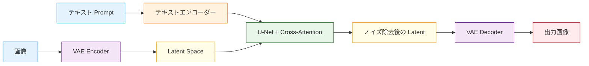

# 12.2.3 Stable Diffusion のアーキテクチャ


:::tip 本節の位置づけ
前の節で、拡散モデルの核心は次のことだと分かりました。

> ノイズから少しずつ構造を復元する。

この節で答えるのは、次の問いです。

> **なぜ Stable Diffusion は、この仕組みを本当に実用的な形で動かせるのか？**

その答えの核心は、「拡散」だけではありません。次の要素も含まれます。

- latent space
- テキスト条件
- U-Net
- VAE
- cross-attention
:::

## 学習目標

- Stable Diffusion の全体的なモジュール分担を理解する
- なぜピクセル空間ではなく latent space で拡散するのかを理解する
- テキストエンコーダー、U-Net、VAE がそれぞれ何を担当するかを理解する
- cross-attention がどのようにテキストを画像生成に接続するかを理解する
- Stable Diffusion の全体ワークフローの体系的な地図を持つ

---

## 一、なぜ元の拡散の考え方だけではまだ「実用的」ではないのか？

### もっとも直感的な問題：ピクセル空間が大きすぎる

もし元の画像のピクセル空間で直接拡散を行うとしたら：

- 解像度が上がるほど、テンソルがとても大きくなる
- 推論も学習も重くなる

たとえば：

- `512 x 512 x 3`

これだけでも、すでに非常に大きな表現空間です。

### Stable Diffusion の重要な転換

Stable Diffusion が最も重要な一歩として行ったのは、次のことです。

> **元画像の上で直接拡散するのではなく、まず画像を latent space に圧縮し、その中で拡散する。**

この考え方は後に次のように呼ばれます。

- latent diffusion

これによって、工程上の実用性が大きく上がりました。

---

## 二、まず全体構造を見てみよう



まずは、大きく3つに分けて覚えるとよいです。

1. テキストエンコーダー：prompt を条件表現に変える
2. U-Net：latent でノイズ除去を行う
3. VAE：画像と latent の変換を担当する

---

## 三、VAE の役割は一体何か？

### ここでは主生成器というより圧縮器に近い

Stable Diffusion における VAE の主な役割は次の通りです。

- Encoder：画像を latent に圧縮する
- Decoder：latent を画像に戻す

つまり、主にやっているのは次のことです。

> 画像空間と latent 空間をつなぐ橋渡し。

### なぜこのステップがとても重要なのか？

なぜなら、もし拡散を元の画像空間で直接行うと、コストが高すぎるからです。  
VAE は、より小さく、より抽象的な中間空間を提供します。

イメージとしては、次のように考えられます。

> 巨大な高精細キャンバスに直接彫り込むのではなく、まずもっと小さな「意味の下書きボード」に圧縮する。

### 最小の「圧縮 / 展開」の直感例

```python
import numpy as np

image = np.random.randn(8, 8).astype(np.float32)

# 平均プーリングで圧縮を模擬する
latent = image.reshape(4, 2, 4, 2).mean(axis=(1, 3))

# repeat でデコードを模擬する
reconstructed = np.repeat(np.repeat(latent, 2, axis=0), 2, axis=1)

print("image shape        :", image.shape)
print("latent shape       :", latent.shape)
print("reconstructed shape:", reconstructed.shape)
```

期待される出力：

```text
image shape        : (8, 8)
latent shape       : (4, 4)
reconstructed shape: (8, 8)
```

注目すべきは真ん中の行です。latent は小さくなっています。Stable Diffusion は主なノイズ除去をこの圧縮空間で行い、最後に latent を画像空間へ戻します。


:::tip shape チェックポイントを読む
reconstructed は最後に `(8, 8)` へ戻りますが、重い denoising は先に小さい `(4, 4)` latent 空間で行えます。
:::

この例はもちろん VAE そのものではありませんが、もっとも大事な直感はつかめます。

- latent は元画像より小さい
- latent はより圧縮された表現である

---

## 四、なぜテキストエンコーダーが必要なのか？

### prompt はそのままでは U-Net に理解できない

U-Net が扱うのは数値テンソルです。次のような自然言語を、そのまま理解することはできません。

- 「窓辺に座るオレンジ色の猫」

### だから先にテキストエンコーダーが必要

テキストエンコーダーの役割は、prompt を次のようなものに変換することです。

- 一組の意味ベクトル

まずは次のように理解すれば十分です。

> **言語条件を、画像生成の流れが利用できる数値条件に変換する。**

### 簡単なイメージ

```python
text_condition = {
    "prompt": "窓辺に座るオレンジ色の猫",
    "embedding_shape": (77, 768)
}

print(text_condition)
```

期待される出力：

```text
{'prompt': '窓辺に座るオレンジ色の猫', 'embedding_shape': (77, 768)}
```

ここでの形状はあくまで例ですが、考え方は実務でも同じです。画像モジュールがテキストを使う前に、prompt は数値ベクトルへ変換されます。

ここで大事なのは具体的な次元数ではなく、次の点です。

- prompt は先にベクトルになる
- その後の視覚モデル本体がそのベクトルを使う

---

## 五、なぜ U-Net が拡散の主役になるのか？

### U-Net はもともと「多段階スケールの情報処理」が得意

U-Net の典型的な特徴は次の通りです。

- エンコーダーパス：少しずつ圧縮し、抽象特徴を取る
- デコーダーパス：少しずつ空間的な細部を戻す
- スキップ接続：細かな情報を完全には失わない

### なぜこれがノイズ除去に向いているのか？

ノイズ除去では、次の両方が必要だからです。

- 全体構造を理解する
- 局所的な細部を保つ

U-Net は、この2つをうまく扱うのに向いています。

そのため Stable Diffusion では、U-Net の役割は次のようになります。

> **latent 空間でノイズを予測し、少しずつノイズを取り除く。**

---

## 六、なぜ cross-attention がそんなに重要なのか？

### 文字と画像は、自然にはつながっていない

もし次のものしかなければ：

- テキストエンコーダー
- U-Net

でも、画像がテキストを「見る」明確な仕組みがなければ、prompt の制御効果はかなり弱くなります。

### cross-attention の直感

その核心は次の通りです。

> 画像のノイズ除去プロセスが、自分を更新するときにテキスト条件を参照できるようにする。

つまり、画像 latent の更新は自分の状態だけを見るのではなく、次のものも見ます。

- prompt が提供する意味情報

### きわめて簡単なイメージ

```python
latent_feature = "現在の画像 latent 特徴"
text_feature = "オレンジ色の猫 + 窓辺 + 夕日"

fusion = f"{latent_feature} が更新するときに {text_feature} を参照する"
print(fusion)
```

期待される出力：

```text
現在の画像 latent 特徴 が更新するときに オレンジ色の猫 + 窓辺 + 夕日 を参照する
```

この文を cross-attention の役割として読んでください。latent は盲目的にノイズ除去されるのではなく、更新のたびにテキスト条件を参照します。

これはただの文字の例ですが、本質はすでに表しています。

- self-attention は「自分自身を見る」イメージ
- cross-attention は「画像がテキストを見る」イメージ

---

## 七、全体のワークフローをつなげてみよう

Stable Diffusion の主な流れは、まず次の5ステップにまとめられます。

1. prompt -> テキストエンコーダー
2. ランダムに latent ノイズを初期化する
3. U-Net がテキスト条件付きで少しずつノイズ除去する
4. よりきれいな latent を得る
5. VAE Decoder が latent を画像にデコードする

```python
workflow = [
    "prompt -> text encoder",
    "latent noise",
    "U-Net denoise with text condition",
    "clean latent",
    "decode to image"
]

for step in workflow:
    print(step)
```

期待される出力：

```text
prompt -> text encoder
latent noise
U-Net denoise with text condition
clean latent
decode to image
```

各行が何を受け取り、何を出すのか説明できれば、Stable Diffusion の多くのワークフローをデバッグするための実用的な地図ができています。

これが Stable Diffusion のもっとも重要な主線です。

---

## 八、なぜこれがテキストから画像生成の重要なアーキテクチャになったのか？

### 効果と工程上の実用性を両立できるから

直接ピクセルを拡散する方法と比べると：

- latent diffusion のほうが軽い
- 学習も推論も現実的

### 条件制御にとても向いているから

Stable Diffusion は次の用途に自然に向いています。

- テキストから画像生成
- 画像編集
- 局所修復
- スタイル制御

### モジュールの境界がはっきりしているから

これはとても重要です。

- テキストエンコーダーは意味を担当する
- U-Net はノイズ除去を担当する
- VAE は空間変換を担当する

モジュールが明確だと、エコシステムも発展しやすくなります。

---

## 九、よくある誤解

### Stable Diffusion は「ひとつの大きなブラックボックス」だと思ってしまう

実際には、複数のモジュールが協力しています。

- テキストエンコーダー
- U-Net
- VAE
- 条件注入メカニズム

### latent diffusion の工程上の意味が分からない

これが「使えるようになる」ための重要な要素のひとつです。

### モジュール名だけ覚えて、役割を理解していない

この状態だと、後で微調整や応用を学ぶときにかなり曖昧になります。

---

## まとめ

この節でいちばん大事なのは、用語を覚えることではなく、次の流れをつかむことです。

> **Stable Diffusion の核心は、latent space で条件付き拡散を行うことです。VAE が圧縮と復号を担当し、テキストエンコーダーが意味条件を提供し、U-Net がノイズ除去を担当し、cross-attention がテキストを画像生成プロセスに本当に接続します。**

この流れを理解できれば、今後テキストから画像生成のアプリケーション、画像編集、微調整を見るときに、ずっと分かりやすくなります。

---

## 練習

1. 自分の言葉で説明してください：なぜ Stable Diffusion はピクセル空間で直接拡散しないのですか？
2. 考えてみましょう：なぜテキストエンコーダーと cross-attention は両方とも必要なのですか？
3. U-Net を普通の小さなネットワークに置き換えると、なぜ通常は性能がかなり悪くなるのでしょうか？
4. 自分の言葉でまとめてください：VAE、U-Net、テキストエンコーダーはそれぞれ何を担当していますか？
