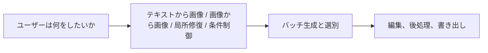

# 12.2.4 SD の応用


:::tip 図の見方
SD の応用では、まずユーザーが本当に「ゼロから生成したい」のか、「参考画像を加工したい」のか、「局所修復したい」のか、それとも「条件付きで制御したい」のかを分けて考えます。  
まず正しい応用モードを選んでから、prompt、パラメータ、ワークフローを考えると、プロジェクトはずっと安定します。
:::

:::tip この節の位置づけ
前の2節で、すでに次の内容を説明しました。

- 拡散モデルの原理
- Stable Diffusion のアーキテクチャ

この節では、視点を「モデルがどう動くか」から「ユーザーや製品がどう使うか」へ切り替えます。

多くの場合、あるモデルに本当の価値があるかどうかを決めるのは、単に生成できるかどうかではなく、次の点です。

> **具体的なワークフローに入れられるか。**
:::

## 学習目標

- Stable Diffusion の最も一般的な応用形を理解する
- テキストから画像、画像から画像、局所修復、スタイル制御を区別する
- 実際のアプリケーションがなぜ「モデル + ワークフロー」になりやすいかを理解する
- SD の製品形態に対する全体的な直感を身につける

---

## まずは地図を作ろう

SD の応用は、「ユーザーの目的 -> 生成形態 -> ワークフロー」で考えると理解しやすいです。



この節で本当に解決したいのは、次の2点です。

- なぜ SD は実際の製品で、1つのボタンだけに頼ることが少ないのか
- なぜワークフロー設計が、単発の生成より重要になることが多いのか

---

## 一、なぜ Stable Diffusion は製品化しやすいのか？

それは、ユーザーのニーズにとても近いからです。  
多くのユーザーの問題は、そのまま生成タスクに対応できます。

- ポスターを1枚作りたい
- このスケッチを完成画像にしたい
- 画像の一部を直したい
- この画像を別のスタイルに変えたい

つまり、Stable Diffusion は次のように自然に移れます。

- モデルの能力

から

- 製品の能力

へ

これが、応用エコシステムが爆発的に広がった根本的な理由です。

### 初学者向けの、よりわかりやすい比喩

Stable Diffusion の応用は、次のように考えるとよいです。

- ひとつの創作作業台

テキストから画像は：

- 白紙のキャンバスから描き始める

画像から画像は：

- 下書きをもとに仕上げる

局所修復は：

- 画面の一部だけを直す

こう考えると、なぜ SD が単なるモデルデモではなく、自然に製品へ育つのかが、ずっとわかりやすくなります。

---

## 二、第一の種類：テキストから画像（text-to-image）

### 最も基本的な入口

ユーザーが入力するもの：

- 1つの prompt

システムが出力するもの：

- 1枚の画像

たとえば：

```python
text_to_image_task = {
    "prompt": "窓辺に座る茶トラ猫、夕日、映画のような雰囲気",
    "output": "generated_image"
}

print(text_to_image_task)
```

期待される出力：

```text
{'prompt': '窓辺に座る茶トラ猫、夕日、映画のような雰囲気', 'output': 'generated_image'}
```

これは「白紙のキャンバス」モードです。prompt が主な入力になり、システムはゼロから新しい候補画像を生成します。

### なぜこんなに直感的なのか？

それは、「言葉で伝えた意図 -> 画像の結果」という流れを、とても直接的に体験できるからです。  
ユーザーはモデルを詳しく知らなくても、説明できれば創作を始められます。

---

## 三、第二の種類：画像から画像（img2img）

### テキストから画像との最大の違い

テキストから画像は、もっと次のような感じです。

- ゼロから始める

画像から画像は、もっと次のような感じです。

- 既存の画像をもとに加工する

たとえば：

```python
img2img_task = {
    "image": "rough_sketch.png",
    "prompt": "これをサイバーパンク風のイラストにして"
}

print(img2img_task)
```

期待される出力：

```text
{'image': 'rough_sketch.png', 'prompt': 'これをサイバーパンク風のイラストにして'}
```

ここでは画像は単なる参考ではなく、出発点となる構造です。prompt は、その構造をどの方向に変えるかを指定します。

### なぜこのモードは価値が高いのか？

多くの創作タスクは、「完全にゼロから画像を作る」ことではなく、次のようなものだからです。

- まず下書きがある
- まず参考画像がある
- まず構図がある

ユーザーは、毎回ゼロから賭けるよりも、「すでにある方向に沿って直したい」と考えることが多いです。

---

## 四、第三の種類：局所修復（inpainting）

### なぜこの機能は、特に製品機能っぽいのか？

実際のユーザーは、画像全体を作り直したいのではなく、一部分だけ直したいことが多いからです。

たとえば：

- 背景にいる通行人を消したい
- 何もない机の上を埋めたい
- ある小さな領域を別のものに置き換えたい

### タスク例

```python
inpainting_task = {
    "image": "scene.png",
    "mask": "mask.png",
    "prompt": "隠れている部分を木のテーブルとして補完する"
}

print(inpainting_task)
```

期待される出力：

```text
{'image': 'scene.png', 'mask': 'mask.png', 'prompt': '隠れている部分を木のテーブルとして補完する'}
```

`mask` が重要な追加入力です。これがないと、システムは間違った場所を編集したり、残したい部分まで作り直したりする可能性があります。

ここで新しく重要になる要素は

- `mask`

です。  
つまり、モデルは「何を生成するか」だけでなく、「どこを変えるか」も知る必要があります。

---

## 五、第四の種類：スタイル制御と条件制御

多くの場合、ユーザーが本当にコントロールしたいのは「何を描くか」ではなく、次のような点です。

- どんなスタイルにするか
- どんな構図を保つか
- どんな線画を使うか
- どんなポーズを引き継ぐか

そのため、「制御付き生成」のワークフローがとても重要になります。

たとえば：

- 線画 -> 完成画像
- ポーズ画像 -> 人物画像
- 深度マップ -> シーン画像

だから実際のアプリケーションでは、ユーザー入力は prompt だけではなく、複数の条件になることがよくあります。

### 初学者が最初に覚えるとよい選択表

| ユーザーのニーズ | より適した形 |
|---|---|
| ゼロからポスターを作りたい | テキストから画像 |
| すでに下書きがあり、きれいにしたい | 画像から画像 |
| 一部の要素だけ直したい | 局所修復 |
| ポーズ、構図、構造を固定したい | 条件制御 |

この表は初心者にとても役立ちます。  
「機能名」をそのまま「いつ使うか」に変換できるからです。

---

## 六、なぜ実際の SD アプリケーションは「1つのモデル + 1つの prompt」ではないのか？

製品化すると、通常は次のような層が追加されるからです。

- prompt テンプレート
- スタイルプリセット
- negative prompt
- バッチ生成
- 候補選別
- 後処理

このときシステムは、次のようなものに近くなります。

> **モデル + パラメータパネル + ワークフロー。**

多くの AI 画像生成製品が、最終的に単なる生成ボタンではなく、創作作業台のように見えるのは、このためです。

---

## 七、ワークフロー製品の例

```python
poster_workflow = {
    "task": "ポスター生成",
    "inputs": {
        "prompt": "テクノロジー会議のポスター、青いネオン風",
        "style_preset": "futuristic",
        "negative_prompt": "ぼやけ, 低解像度, 文字の崩れ",
        "num_images": 4
    },
    "steps": [
        "プロンプトを組み立てる",
        "バッチサンプリングする",
        "候補画像を選ぶ",
        "後処理する"
    ]
}

print(poster_workflow)
```

期待される出力：

```text
{'task': 'ポスター生成', 'inputs': {'prompt': 'テクノロジー会議のポスター、青いネオン風', 'style_preset': 'futuristic', 'negative_prompt': 'ぼやけ, 低解像度, 文字の崩れ', 'num_images': 4}, 'steps': ['プロンプトを組み立てる', 'バッチサンプリングする', '候補画像を選ぶ', '後処理する']}
```

この記録は、単一の prompt よりも製品ワークフローに近い形です。依頼内容、制約、候補数、確認手順を残すことで、結果を再現しやすくなります。

この例で最も大事なのは、次の点です。

> アプリケーション層で本当に大事なのは、単に「1枚の画像を生成すること」ではなく、「ユーザーが受け入れられる結果を安定して出すこと」です。 

### さらに最小の「ワークフロー選択器」の例

```python
def choose_sd_mode(request):
    if "画像を直す" in request or "画像を修正" in request:
        return "inpainting_or_img2img"
    if "ラフ" in request or "下書き" in request or "草稿" in request:
        return "img2img"
    if "ポーズ" in request or "線画" in request:
        return "controlled_generation"
    return "text_to_image"


for request in ["ポスターを作って", "この草稿をイラストにして", "画像を修正：右上の人を消して"]:
    print(request, "->", choose_sd_mode(request))
```

期待される出力：

```text
ポスターを作って -> text_to_image
この草稿をイラストにして -> img2img
画像を修正：右上の人を消して -> inpainting_or_img2img
```

実際の製品では、このようなルーティングの前に表記揺れや類義語の正規化も行います。表現が少し変わっただけで、間違ったモードに入らないようにするためです。

この例は初心者にとても向いています。  
なぜなら、次のことを思い出させてくれるからです。

- 製品レイヤーでは、まずユーザーがどの創作モードにいるかを判断する
- そのあとで、後続のパラメータや流れを決める

---

## 八、なぜアプリケーションではバッチ生成がよく必要なのか？

画像生成には、もともとランダム性があるからです。  
同じ prompt でも、次のように結果が変わります。

- 今回はとても良い
- 次回は普通
- その次は意図とずれる

そのため、多くのアプリケーションでは1枚だけ生成するのではなく、次のようにします。

- 一度に複数枚生成する
- そのあとユーザーに選んでもらう

これは、製品側がモデルのランダム性に対処する方法です。

---

## 九、Stable Diffusion の応用でよくある失敗点

### テキスト制御が安定しない

ユーザーの説明が複雑になるほど、結果はずれやすくなります。

### 局所の細部をうまく制御しにくい

特に難しいのは次のような部分です。

- 文字
- 手
- 細かい構造

### ユーザーの本当の課題は「生成」ではなく「編集」であることが多い

だからこそ、多くの製品では次第に次の機能が重視されます。

- img2img
- inpainting
- control

単発のテキストから画像だけを強調するわけではありません。

## これをプロジェクトにするなら、何を見せるとよいか

本当に見せる価値が高いのは、次のようなものです。

- 「画像を生成できる」こと
- ではなく、次の流れです
1. さまざまな創作ニーズを、どう違うワークフローに振り分けるか
2. 候補画像をどうバッチ生成して選ぶか
3. 編集工程をどうつなぐか
4. 最終結果をどう書き出すか

こうすると、相手には次のことが伝わりやすくなります。

- あなたが理解しているのは創作作業台
- 単なる画像生成ボタンではない

---

## まとめ

この節で最も大事なのは、いくつかの応用名を覚えることではなく、次の点を理解することです。

> **Stable Diffusion の応用価値は、単発の画像生成だけでなく、さまざまな種類の創作ワークフローに組み込めることにある。**

一度「ワークフロー」という視点で見ると、なぜこれほど豊かな製品形態が生まれるのか、ずっと理解しやすくなります。

---

## 練習

1. テキストから画像、画像から画像、局所修復について、それぞれ自分なりのアプリケーションシナリオを1つ考えてみましょう。
2. なぜ実際の SD 製品では、1回で複数の候補画像を生成できることが多いのでしょうか？
3. 自分の言葉で説明してみましょう。なぜ SD 製品は「1つのモデルボタン」よりも「作業台」に近いのでしょうか？
4. もしあなたが EC 商品画像を作るなら、どの種類の SD 応用形がより必要でしょうか？ なぜですか？
