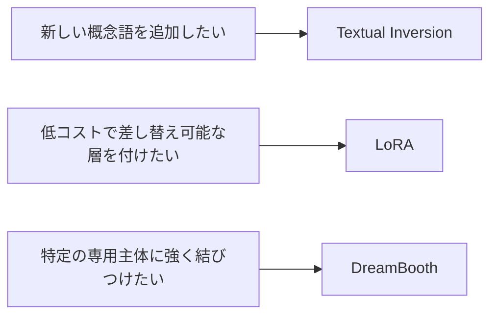

# 12.2.5 画像生成の微調整


:::tip 図の見方
画像生成の微調整は、いきなり「フル学習」を考えなくて大丈夫です。まずは、ほしいのが新しい概念のトリガー語なのか、差し替え可能なスタイルなのか、それとも専用主体の一貫性なのかを判断して、Textual Inversion、LoRA、DreamBooth のどれを使うか選びましょう。
:::

:::tip この節の位置づけ
ベースの Stable Diffusion がすでにかなり強くなったあと、新しく出てくる問題は次のようになります。

> **どうやって、特定の主体・特定のスタイル・特定のブランドの見た目を、もっとよく理解させるか？**

これが、画像生成の微調整が本当に答えるべき問いです。
:::

## 学習目標

- なぜ画像生成モデルにも微調整が必要なのかを理解する
- DreamBooth、LoRA、Textual Inversion の違いを整理する
- それぞれが「何を変えている」のかを理解する
- とても実践的な選び方の感覚を身につける

---

## まずは地図を作ろう

画像生成の微調整は、「何を変えたいのか」が、概念・スタイル・専用主体のどれかで考えると理解しやすくなります。



この節で本当に解決したいのは、次の点です。

- どの方法が一番流行っているか、ではない
- どの対象を微調整したいのか、です

---

## 一、なぜベースモデルだけでは足りないのか？

ベースモデルはもちろん、すでにいろいろなものを生成できます。  
でも、実際のニーズはもっと具体的なことが多いです。

- 特定の専用キャラクターを生成したい
- あるブランドらしいスタイルを固定したい
- ある製品を、どんな場面でも一貫して見せたい

こういうとき、prompt だけでは安定しないことがあります。

だから微調整の本質は、まずこう覚えるとよいです。

> **モデルがもともと持っている能力を、より具体的な視覚目標に向けて寄せていくこと。**

### 初学者向けのたとえ

画像生成の微調整は、次のように考えるとわかりやすいです。

- すでにいろいろ描ける絵師に、目的を絞った練習をしてもらう

ベースモデルは、いろいろな題材を描ける万能型のようなものです。  
でも、実際にほしいのはたとえば次のようなものかもしれません。

- 特定の IP キャラクター
- 特定のブランドの見た目
- 特定の専用スタイル

このとき必要なのは、ゼロから絵を覚え直すことではなく、  
ある方向にもっと安定して描けるようにすることです。

---

## 二、画像生成の微調整で重要な三つの方法

### Textual Inversion

一番軽い考え方です。  
イメージとしては次のようになります。

> 新しいトリガー語 / 概念語を、モデルに覚えさせる。 

### LoRA

より近いイメージは次の通りです。

> ベースモデルの上に、小さな差し替え可能なアダプタを付ける。 

### DreamBooth

こちらは次のようなイメージです。

> 特定の専用主体についての記憶を強くする。 

この 3 つを最初に分けて考えられるようになると、あとで出てくる用語が混ざりにくくなります。

---

## 三、Textual Inversion：なぜ一番軽いと言えるのか？

### 本質的には何を学ぶのか？

モデル全体を大きく変えるのではなく、もっと近いのは次のようなことです。

- 新しい token の表現を学ぶ

つまり、

> モデルに新しい「単語」を覚えさせる

と考えるとよいです。

### とても簡単な例

```python
textual_inversion = {
    "new_token": "<my_style>",
    "meaning": "特定の視覚スタイル",
    "learned_object": "token embedding"
}

print(textual_inversion)
```

期待される出力：

```text
{'new_token': '<my_style>', 'meaning': '特定の視覚スタイル', 'learned_object': 'token embedding'}
```

注目すべきは `learned_object` です。Textual Inversion は主に新しい token の embedding を学ぶため、軽量ですが制御力は限定的です。

### どんなときに向いている？

- スタイル用の trigger word
- 軽い概念の追加

メリットは次の通りです。

- 軽い
- 速い
- 変更範囲が小さい

ただし、能力はより重い方法ほど強くないことがあります。

---

## 四、LoRA：なぜ実務で最もよく使われるのか？

### 一番大事な考え方

LoRA は、元のモデルを丸ごと変えるのではなく、

> 低コストの追加アダプタを学ぶ

という発想です。

そのため、とても向いているのは次のようなケースです。

- 大きなベースモデルに、複数のスタイルを載せる
- いろいろなアダプタを切り替える
- 学習コストや保存コストを下げる

### 簡単な例

```python
base_model = "stable_diffusion_base"
lora_adapter = {
    "target": "attention blocks / U-Net blocks",
    "size": "small",
    "effect": "スタイルや主体の制御能力を追加する"
}

print(base_model)
print(lora_adapter)
```

期待される出力：

```text
stable_diffusion_base
{'target': 'attention blocks / U-Net blocks', 'size': 'small', 'effect': 'スタイルや主体の制御能力を追加する'}
```

これが LoRA が実務で人気な理由です。ベースモデルは共有したまま、小さなアダプタがカスタマイズ能力を持ちます。

### なぜ実務で特に便利なのか？

次のような形にしやすいからです。

- 1つのベースモデル
- 複数の異なるスタイルやキャラクターのアダプタ

つまり、

> カスタム版ごとに、モデル全体を毎回保存しなくてよい

ということです。

これが、LoRA がとても人気な大きな理由です。

---

## 五、DreamBooth：なぜ「専用主体」でよく使われるのか？

### 何を解決する方法なのか？

DreamBooth がよく使われる目的は、たとえば次のようなものです。

- 特定の人物を覚えさせる
- 特定の物体を覚えさせる
- 特定の専用 IP の見た目を覚えさせる

### なぜ Textual Inversion より「強い」のか？

単に 1 つの単語を学ぶだけでなく、  
その主体が画像空間でどう見えるかに、より深く適応させるからです。

### その代わり何が必要なのか？

- 重い
- 過学習しやすい
- データ品質への依存が大きい

なので、ざっくり覚えるなら次のように考えられます。

- Textual Inversion：軽い
- LoRA：バランス型
- DreamBooth：より強力だが重い

---

## 六、どう選ぶ？ とても実用的な判断方法

### 軽いスタイル用トリガー語がほしいなら

まず考えるのは：

- Textual Inversion

### 低コストで、差し替え可能で、保守しやすくしたいなら

まず考えるのは：

- LoRA

### 特定の専用主体に強く結びつけたいなら

まず考えるのは：

- DreamBooth

本当に大事なのは、次の問いです。

> 「どの方法が一番強いか？」ではなく、  
> **「自分はいま、何を微調整したいのか？」**

### 初学者が最初に覚えるとよい選び方の表

| あなたの目的 | まずの有力候補 |
|---|---|
| トリガー語や軽い概念を追加したい | Textual Inversion |
| 多くのスタイル版を低コストで保守したい | LoRA |
| 特定の人物 / 物体 / IP に強く結びつけたい | DreamBooth |

この表は、方法名の暗記ではなく、  
「何を選ぶべきか」を目的から考えるために役立ちます。

---

## 七、なぜ画像生成の微調整は評価が難しいのか？

分類タスクのように、正解率だけでは判断できないからです。

見るべきポイントは、たとえば次のようなものです。

- 生成結果が目標のスタイルに見えるか
- 主体が毎回きちんと一貫しているか
- 学習画像に過学習していないか
- prompt を変えても安定しているか

つまり、

> 評価は、数値だけでなく、見た目と創造性の質を見る作業に近い

ということです。

### 初学者向けの評価表

| 評価観点 | 最初に確認したいこと |
|---|---|
| スタイルの一貫性 | 目標のスタイルに見えるか |
| 主体の一貫性 | 同じ人物 / 同じ物体に見えるか |
| 汎化の安定性 | prompt を変えても安定するか |
| 過学習 | 学習画像の繰り返しになっていないか |

この表も、新人にとってはとても大切です。  
「評価は主観的すぎる」という印象を、観察しやすい観点に分解してくれます。

---

## 八、とても実用的な経験まとめ表

| 方法 | 何に近いか | メリット | 代償 |
|---|---|---|---|
| Textual Inversion | 新しい単語を学ぶ | 軽量、速い | 制御力は限定的 |
| LoRA | 小さなアダプタを付ける | 低コスト、切り替えやすい | 対象モジュールの理解が必要 |
| DreamBooth | 専用主体を学ぶ | 主体制御が強い | 重い、過学習しやすい |

この表は丸暗記するためではなく、判断の型を作るためのものです。

---

## 九、よくある間違い

### いきなりフル微調整をやろうとする

多くの場合、そこまで必要ありません。

### 何を微調整したいのかがはっきりしていない

スタイルなのか、主体なのか、トリガー語なのか。  
ここが曖昧だと、方法選びもずれやすくなります。

### 成功した数枚だけを見る

本当に重要なのは、次の点です。

- たくさんの prompt で安定するか
- 何回かサンプリングしても似ているか

## これをプロジェクトや提案資料にするなら、何を見せるべきか

本当に見せる価値が高いのは、次のような点です。

- 「SD を微調整しました」ではなく
- 目的が概念・スタイル・主体のどれだったのか
- なぜその微調整方法を選んだのか
- 評価でどの観点を見たのか
- どの prompt では安定し、どの prompt では不安定だったのか

こうすると、見る側は次のことを理解しやすくなります。

- 単に学習スクリプトを走らせただけではない
- 選定と評価をちゃんと理解している

---

## まとめ

この節で一番大切なのは、DreamBooth、LoRA、Textual Inversion という名前を覚えることではありません。理解しておきたいのは、次の点です。

> **画像生成の微調整とは、スタイル・主体・概念に対する安定した制御を、異なるコストで手に入れること。**

この見方ができるようになると、あとで具体的な学習フローを見るときも、ずっと理解しやすくなります。

---

## 練習

1. Textual Inversion、LoRA、DreamBooth が、それぞれ「何を変えている」のかを自分の言葉で説明してみましょう。
2. モデルにスタイル用の trigger word を 1 つ追加したいだけなら、なぜ DreamBooth が必須とは限らないのでしょうか？
3. 長期的にたくさんのスタイル版を管理したいなら、なぜ LoRA は実務上とても価値があるのでしょうか？
4. 画像生成の微調整の評価が、テキスト分類よりも人の感覚に頼りやすいのはなぜでしょうか？
