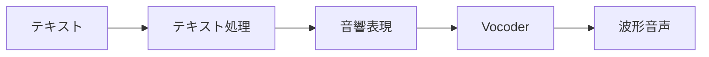
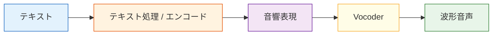

# 12.3.3 音声合成


:::tip 図の見方
TTS は文字を1文字ずつ読むだけではありません。図を見るときは、テキスト正規化、音素/韻律、音響特徴、vocoder、音色、そしてリアルタイム性がどのように組み合わさって「人が話しているように聞こえるか」を決めるのかに注目しましょう。
:::

:::tip この節の位置づけ
動画生成が「連続的な視覚」を解決しているとすれば、音声合成が解決しているのは次のことです：

> **1つの文章を、自然で安定していて、制御可能な音声に変えること。**

これはとても直感的に聞こえますが、実際には簡単ではありません。なぜなら、音声には「発音」だけでなく、次のような要素も含まれるからです。

- リズム
- 音の高さ
- 間
- 感情
:::

## 学習目標

- 音声合成がなぜ「テキストを音声ファイルに変える」よりずっと複雑なのかを理解する
- TTS システムが通常どのようなモジュールに分かれるのかを理解する
- 最小限のテキストから音声への流れ図を読み取れるようになる
- 多話者、感情制御、音声クローンがそれぞれ何を解決しているのかを理解する

---

## まずは全体像をつかもう

この節の TTS を理解する順番として、新人に最も向いているのは「文字がそのまま音声になる」と考えることではなく、まず次の流れをはっきり見ることです。



つまり、この節で本当に理解したいのは次の点です。

- なぜ TTS は多段階の生成タスクなのか
- なぜ TTS は言語タスクにも、音声生成タスクにも見えるのか

### 初学者向けの、よりわかりやすい比喩

TTS は次のように考えると理解しやすいです。

- スタジオで仕事をする吹き替え俳優

彼は文字を見て機械的に読むだけではなく、自然に次のようなことを処理します。

- どこで区切るか
- どの単語を強めるか
- 落ち着いた口調にするか、興奮した口調にするか

この比喩は初心者に向いています。なぜなら、次のことをつかみやすくなるからです。

- TTS の本当の目的は「音を出すこと」ではない
- 「人が話しているような音を出すこと」である

## 音声合成は具体的に何をしているのか？

### 単純に文字を1つずつ読むだけではない

もし文字を1文字ずつ機械的に読んだら、結果はたいていとても不自然になります。
自然な音声には、「文字の内容」以上の情報がたくさん含まれています。たとえば：

- 句切り
- 強勢
- 口調
- 話す速さ
- 感情

つまり、TTS の本当の問題は次の問いではありません。

> 「音を出せるか」

本当の問いは次です。

> 「人が話すような音を出せるか」

### とても大事な直感

音声合成の本質は、次の処理を行うことです。

- テキスト理解
- 発音のモデリング
- 音響特徴の生成
- 波形の復元

つまり、1回で変換するのではなく、多段階の生成問題だということです。

---

## 最小の TTS 流れはどんな形か？

まずは大まかに、次のように理解できます。

1. テキスト前処理
2. 中間の音響表現を生成
3. Vocoder で波形に変換



このフローチャートで一番大切なのは、まず次の認識を持つことです。

> 音声合成は1段階ではなく、多層のパイプラインである。

### 初学者が最初に覚えたいモジュール表

| モジュール | 最初に覚えるべき役割 |
|---|---|
| テキスト処理 | 文字を発音しやすい形に整える |
| 音響表現 | 「どう読むべきか」を表す |
| Vocoder | 音響表現を実際の波形に変える |

この表は初心者に向いています。なぜなら、TTS を「ひとつのブラックボックス」ではなく、3つの役割に分けて考えられるようになるからです。

---

## なぜテキスト処理の段階を省けないのか？

### 文字そのものは発音情報と同じではないから

たとえば、同じ文でも場面によって区切り方や口調は変わります。

- 「来たね。」
- 「来たね？」

文字面はかなり似ていますが、音声表現はまったく違います。

### テキスト処理では通常何をするのか？

- 分かち書き / 音素への変換
- 数字の読み方変換
- 句読点と間の処理
- 口調のヒントを加える

つまり、TTS システムはまず「文字」を「発音に近い表現」に変換する必要があります。

---

## 音響表現とは何か？

### なぜ文字から直接波形にしないのか？

テキストから一気に波形を生成するのはとても難しいです。なぜなら、波形は非常に長く、細かく、影響を受けやすいからです。

そのため、多くの TTS システムはまず中間表現を生成します。たとえば：

- mel spectrogram（メルスペクトログラム）

まずは次のように考えれば十分です。

> **音の「周波数の熱量図」のようなもの。**

### 直感的なイメージ

```python
tts_pipeline = {
    "input": "こんにちは、AI フルスタックコースへようこそ。",
    "intermediate": "mel_spectrogram",
    "output": "waveform"
}

print(tts_pipeline)
```

期待される出力：

```text
{'input': 'こんにちは、AI フルスタックコースへようこそ。', 'intermediate': 'mel_spectrogram', 'output': 'waveform'}
```

重要なのは中間層です。多くの TTS システムでは、テキストがまず音響表現になり、そのあと実際に再生できる音声へ変換されます。


この例はあくまで構造のイメージですが、すでに次のことがわかります。

- テキストは直接音になるわけではない
- その間に、モデル化しやすい中間表現がある

---

## Vocoder（声碼器）は何をしているのか？

### 役割は「スペクトルを本当に聞ける音に翻訳する」ことに近い

前のモジュールが「音響の設計図」を作るとすれば、vocoder はそれを実際の波形にします。

### とても実用的な理解

次のように覚えるとよいです。

- 音響モデル： 「何をどう話すか」を決める
- Vocoder： それを「どうやって実際に発声するか」を決める

この2つのモジュールは、別々に設計・改善されることがよくあります。

---

## 最小の「多話者制御」のイメージ

多くの現代的な音声合成システムは、ただ文字を読むだけでなく、次のような要素も制御できます。

- 話者
- 話す速さ
- 感情

たとえば、次のように書けます。

```python
tts_config = {
    "text": "コース学習へようこそ。",
    "speaker": "female_voice_01",
    "speed": 1.0,
    "emotion": "neutral"
}

print(tts_config)
```

期待される出力：

```text
{'text': 'コース学習へようこそ。', 'speaker': 'female_voice_01', 'speed': 1.0, 'emotion': 'neutral'}
```

実務で覚えておきたい入力形はこれです。TTS のリクエストには、文そのものと「どう話すか」の制御条件が一緒に入ることが多いです。


### この例は何を示しているのか？

ここで示している初学者向けの重要な考え方は次のとおりです。

> TTS の入力は、テキストだけでなく、「どう話すか」を指定する制御条件も含むことが多い。

これが、現代の音声合成が初期のシステムより強力になった理由の1つです。

### 初学者が最初に覚えたい選択表

| ユーザーの要望 | TTS システムが優先して制御すべきもの |
|---|---|
| 音色を変えたい | speaker |
| もっと速く、またはゆっくり話したい | speed |
| 接客っぽく、またはアナウンスっぽくしたい | style / emotion |
| 特定の人に似せたい | voice cloning / speaker adaptation |

この表は、新人にとって「制御可能な TTS」を具体的なつまみに分解してくれるので、とても役立ちます。

---

## なぜ音声合成は想像以上に生成タスクに近いのか？

なぜなら、音声合成にも次のような典型的な生成の難しさがあるからです。

- 結果が自然であること
- 結果が安定していること
- 結果を制御できること

しかも画像生成と同じように、次の課題にも直面します。

- スタイル制御
- 個別最適化
- 品質と速度のトレードオフ

つまり、TTS は次のように理解できます。

> 音声世界における生成モデルの問題。

---

## 実際の製品で特に重要な TTS の方向

### 多話者

システムが複数の音色を切り替えられるか。

### 感情と韻律の制御

システムが次のような感情を表現できるか。

- 嬉しい
- 落ち着いている
- 厳しい

### 音声クローン

システムが特定の人物の声の特徴を学べるか。

### リアルタイム性

対話アシスタントでは、遅延が非常に重要です。

---

## 初めて TTS を学ぶときに、まず覚えるべきこと

最初に覚えるべきことは次の3つです。

1. テキストは発音情報と同じではない
2. 音響表現は中間層であり、省略できない
3. Vocoder が「実際にどう発声するか」を決める

---

## 初学者がよくハマる落とし穴

### TTS は「文字を読むだけ」だと思ってしまう

実際には、自然な発話の過程を生成するものに近いです。

### 音色だけを見て、リズムや間を見ない

「不自然さ」の原因は、音色そのものではなく、韻律にあることが多いです。

### TTS は最初からリアルタイムだと思ってしまう

高品質なモデルの多くは、必ずしも低遅延を実現できるわけではありません。

## これをプロジェクトやシステム設計として示すなら、何を見せるとよいか

よく見せるべきなのは、次のようなことです。

- 「文字を音声に変えました」

ではなく、次の点です。

1. テキストがどのように TTS の流れに入るか
2. どの制御条件を使ったか
3. どの層が自然さを決め、どの層が最終的な音質を決めるか
4. 遅延と品質をどう両立させるか

そうすると、相手には次のことが伝わりやすくなります。

- TTS のワークフローを理解している
- 単に吹き替え API を呼んだだけではない

---

## 残す証拠

このページを終えたら、この evidence card を残します。

```text
ストーリーボード：シーン一覧、duration、camera/voice/subtitle/timing のメモ
資産一覧: images、audio、voice、captions、clips、source/license フィールド
同期チェック：音声テキストのタイミング、口パク、ショットの連続性、またはフレームの一貫性
失敗確認：ちらつき、アイデンティティのずれ、音声不一致、安全でない類似、または書き出しの問題
期待される成果: レビュー用メモを含むストーリーボードまたはタイムラインのアーティファクト
```

## まとめ

この節で最も大事なのは、ある TTS モデル名を覚えることではなく、次の直感を持つことです。

> **音声合成の本質は、テキストと発話制御情報を、自然で聞き取りやすく、制御可能な音声波形へと段階的に変えていくこと。**

この主線を理解しておくと、今後、デジタルヒューマン、吹き替えシステム、音声アシスタントを見るときに、ずっと理解しやすくなります。

## この節で持ち帰るべきこと

- TTS は文字を読み上げるだけではない
- 本質的には、テキストから音響、そして波形へと進む生成パイプラインである
- 「音を出せる」ことより、「自然・安定・制御可能」であることのほうが、実際の製品要件に近い

---

## 練習

1. 自分の言葉で説明してみましょう：なぜ TTS は「文字を1つずつ読むだけ」ではないのですか？
2. 考えてみましょう：なぜ多くの TTS システムでは「話者、話す速さ、感情」も入力として扱うのでしょうか？
3. リアルタイム音声アシスタントを作るとしたら、なぜ TTS の遅延が重要な工程指標になるのでしょうか？
4. 自分の言葉で説明してみましょう：音響モデルと vocoder は、それぞれ何を解決するものに近いですか？

<details>
<summary>解法と解説</summary>

1. TTS は発音、間、リズム、強調、感情、音響的な形を予測する必要があります。文字を 1 つずつ読むだけでは prosody が失われ、不自然に聞こえます。
2. 話者、速度、感情も入力になるのは、同じ文でも妥当な読み方が複数あるからです。これらの制御によって、製品の役割、アクセシビリティ要件、会話状態に合わせられます。
3. 音声アシスタントは対話的なので、遅延が大きいと turn-taking が崩れます。音質が良くても、返答がすぐ始まらないとユーザーは遅いと感じます。
4. acoustic model はテキストや言語特徴を mel spectrogram などの音声表現へ写像します。vocoder はその表現を可聴な waveform に変換します。

</details>
