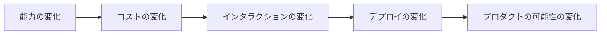
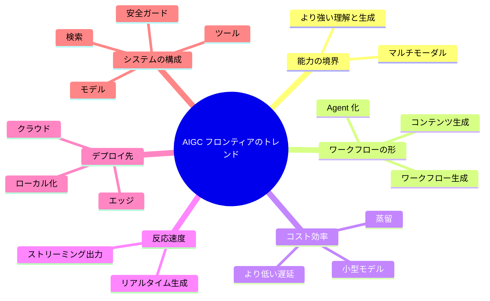

# AIGC フロンティアのトレンド


:::tip 図の見方
フロンティアのトレンドは、「モデル能力、コスト効率、プロダクト形態、コンプライアンスの境界、ワークフロー統合」をまとめて判断します。ランキングだけを見ると不安になりやすいですが、システム全体の変化を見ると、次に何を学ぶべきかが分かりやすくなります。
:::

:::tip この節の位置づけ
「トレンド」を説明するときに一番避けたいのは、次の2つです。

- 名詞を並べるだけ
- 流行だけを追うこと

この節で本当にやりたいのは、別のことです。

> **トレンドを見るためのフレームワークをあなたに渡すこと。**

そうすれば、これから新しいモデル名や新しいプロダクト形態に出会っても、それがどの流れの延長なのかを判断しやすくなります。
:::

## 学習目標

- AIGC の今もっとも重要な進化方向を理解する
- 「能力、コスト、プロダクト形態、デプロイ方法」という複数の観点でトレンドを見る
- 流行を追うだけでなく、長期的な主線を見極める習慣を身につける

---

## まずは地図を作ろう

### まず1つの場面を見てみよう：なぜ同じモデル能力が、違うプロダクトになるのか？

3つの会社が、同じくらい強いマルチモーダルモデルを手に入れたと想像してみてください。

1社目はそれをスクリーンショットQAアシスタントにして、ユーザーが画面のスクリーンショットをアップロードすると「このボタンは何ですか？」と聞けるようにしました。2社目はそれを動画編集ツールにして、ユーザーが一言話すだけで粗編集版を生成できるようにしました。3社目はそれをスマホ端末に組み込み、ユーザーがオフラインでプライベートな写真アルバムを処理できるようにしました。

モデルの土台は似ていても、プロダクトの方向はまったく違います。理由は「誰のモデル名がより流行っているか」ではなく、それぞれが違う変化をつかんだからです。入力の入り口が変わり、ワークフローが変わり、コスト構造が変わり、デプロイ先も変わったのです。

だから AIGC のトレンドを見るときは、モデルランキングだけを追うのではなく、「この変化はどの層を変えるのか？」と考える必要があります。

フロンティアトレンドを学ぶとき、新人にとって一番分かりやすい順番は「今年一番ホットな名前を覚えること」ではありません。まず次のことをはっきり見ていきましょう。



この節が本当に解決したいのは、次の2つです。

- トレンドをどう判断するか
- なぜフロンティアはモデルランキングを見るだけではないのか

### 新人により向いている全体のたとえ

「トレンドを見る」というのは、こんなふうに考えると分かりやすいです。

- どの車が今日いちばん速かったかを見るのではなく、その街がどんな道路を整備しているかを見る

モデルランキングは、より次のイメージです。

- 今日どの車が少し速かったか

トレンド判断は、もっとこういうイメージです。

- この街はこれから高鉄、地下鉄、高速道路のどれを重視していくのか

このたとえは新人にとても向いています。なぜなら、次のことをつかみやすくなるからです。

- トレンドで本当に大事なのは長期的な主線
- 短期的な流行語ではない

## 一、なぜ AIGC のトレンドはモデルランキングだけでは見られないのか？

本当に業界を変えるものは、たいてい次のようなことだけではありません。

- モデルのパラメータがどれだけ増えたか
- あるランキングがどれだけ更新されたか

もっと根本にあるのは、次の変化です。

- 能力の境界が変わったか
- インタラクションの形が変わったか
- コスト構造が変わったか
- デプロイ方法が変わったか

だからトレンドを見るときに本当に聞くべきなのは、次の問いです。

> **この変化は、どんなアプリケーションの可能性を変えるのか？**

---

## 二、6つのトレンドを1つの図にまとめる

具体的なトレンドに入る前に、まず同じフレームの中に置いてみましょう。



この図の役割は、用語を暗記させることではありません。新しい話題が、どの長期的な流れに属するのかを見分ける助けにすることです。

---

## 三、第一の大きなトレンド：マルチモーダルがデフォルト能力になりつつある

以前の多くのシステムは、主に次のものだけを扱っていました。

- テキストのみ

しかし今は、次のような入力を同時に扱うシステムが増えています。

- テキスト
- 画像
- 音声
- 動画

これは小さな変化ではなく、入力世界そのものが開かれた、ということです。

### 3.1 なぜこれが重要なのか？

現実世界は、もともとマルチモーダルだからです。  
モデルがより多くの種類の入力を受け取れるようになると、アプリケーションの形は大きく広がります。

- スクリーンショットアシスタント
- 画像を見て答える QA
- 動画要約
- 音声で操作するアシスタント

だから、

> マルチモーダルは「あると便利」なものではなく、インタラクションの入り口を作り直すものです。 

### 3.2 初学者がまず覚えるとよい判断

ある方向が新しい入力入口を開くなら、  
それはたいてい「モデル能力が少し上がっただけ」ではありません。むしろ次のものを変えています。

- ユーザーがどのように問題をシステムに渡すか

---

## 四、第二のトレンド：「コンテンツ生成」から「ワークフロー生成」へ

初期の AIGC は、より次のようなものが中心でした。

- 画像を1枚生成する
- 文章を1本生成する

しかし今は、次のようなことを行うシステムが増えています。

- 生成 + 検索
- 生成 + ツール呼び出し
- 生成 + レビュー
- 生成 + 複数ターンの対話

これはつまり、

> AIGC は「1回の出力」から「継続的なワークフローシステム」へ移っている、ということです。 

これが、Agent と AIGC の関係がますます密接になっている理由でもあります。

---

## 五、第三のトレンド：大モデル競争からコスト効率競争へ

### 5.1 大モデルをただ大きくするだけでは、唯一の方向ではなくなった

業界では引き続き大モデルの能力を追いながらも、次の点もますます重視しています。

- 推論コスト
- レイテンシ
- 端末上で動かせるか
- 小型モデルの性能

### 5.2 なぜこれがトレンドになるのか？

実際にプロダクトを作るときは、次の現実に向き合わなければならないからです。

- ユーザー数
- 予算
- デプロイ環境

より強いけれど10倍高いモデルが、必ずしもビジネスに合うとは限りません。

だから今後とても大事な流れは、次のものです。

> **より強いことは、単により大きいことだけを意味しない。より効率が高いことも意味する。**

---

## 六、第四のトレンド：リアルタイム生成の重要性が高まっている

AIGC に対するユーザーの期待は、次の段階から変わってきています。

- 「生成できるか」

から

- 「どれだけ速く生成できるか」

へ。

特に次の場面では、リアルタイム性がますます重要になります。

- 対話
- 音声
- 動画
- インタラクティブな創作

この流れによって、分野全体は引き続き次の点に注目していきます。

- より速いサンプリング
- より軽量な推論
- よりストリーミングに近い生成

---

## 七、第五のトレンド：端末側とローカル化の能力がより重要になる

以前は、生成や推論の多くがクラウドで行われるのが前提でした。  
しかし今は、次のような点に注目する人が増えています。

- ローカル実行
- エッジデプロイ
- プライバシーに配慮した設計
- オフライン対応

特に次のような場面で重要になります。

- 企業内システム
- プライバシーに敏感なデータ
- モバイル端末のアシスタント
- ネット接続への依存が小さい環境

だから今後、とても重要な問いは次のものになります。

> **どの能力をクラウドで処理し、どの能力を端末側に移すべきか？**

---

## 八、第六のトレンド：単体モデル能力からシステム能力へ

昔は、競争の中心は次のようなものでした。

- どの単体モデルが強いか

今は、より次のようになっています。

- モデル + 検索
- モデル + ツール
- モデル + ワークフロー
- モデル + 安全ガード

つまり、本当の競争点は次のところに広がっています。

- モデルそのもの

から

- システム全体をどう組み立てるか

へ。

だから、これから AIGC のプロジェクトを作るときは、モデルだけを見ていてはいけません。

---

## 九、とても実用的なトレンド判断フレームワーク

新しい方向を見たら、まず次の4つを問いましょう。

1. それは能力を強くしたのか、それとも見せ方が変わっただけか？
2. コストを下げたのか、それともデプロイをより柔軟にしたのか？
3. 新しいインタラクションの入口を開いたのか？
4. プロダクトのワークフローに影響するのか？

とてもシンプルな例です。

```python
trend_check = {
    "multimodal": {"ability": 9, "cost_impact": 6, "new_interaction": 9, "workflow_change": 8},
    "small_models": {"ability": 6, "cost_impact": 9, "new_interaction": 5, "workflow_change": 7},
    "real_time_generation": {"ability": 7, "cost_impact": 8, "new_interaction": 9, "workflow_change": 8}
}

for trend, scores in trend_check.items():
    total = sum(scores.values())
    strongest = max(scores, key=scores.get)
    print(f"{trend}: total={total}, strongest_change={strongest}")
```

この例は、客観的な順位を出すためのものではありません。  
むしろ、新しいトレンドを見るたびに、それを具体的な観点に分解して考える習慣をつけるためのものです。

この小さなツールをもっと実用的にしたければ、さらに次のようにできます。

```python
advice = {
    "ability": "まず、それがどんな新しいタスクをできるようにするかを見る",
    "cost_impact": "まず、大規模利用のコストを下げているかを見る",
    "new_interaction": "まず、ユーザーの入り口が変わっているかを見る",
    "workflow_change": "まず、プロダクトの流れが組み替わっているかを見る"
}

for trend, scores in trend_check.items():
    strongest = max(scores, key=scores.get)
    print(trend, "->", advice[strongest])
```

この例は点数をつけるためではなく、次のことを思い出させるためのものです。

> 「新しいかどうか」だけを見ずに、「どの層を変えたのか」を見ること。 

### 9.1 初学者がまず覚えるとよいトレンド判断表

| 観点 | まず何を聞くべきか |
|---|---|
| 能力 | 以前はできなかった、どんなことができるようになったのか？ |
| コスト | 何が安くなったのか、それとも逆に高くなったのか？ |
| インタラクション | ユーザーとシステムの入口は変わったのか？ |
| ワークフロー | プロダクトの流れは短く、速くなったのか、それとも複雑になったのか？ |

この表は新人にとても向いています。なぜなら、「トレンド」という抽象的な判断を、実際に見られるいくつかの問いへ戻してくれるからです。

---

## 十、初めてフロンティアトレンドを見るときの、いちばん安定した順番

おすすめは、次の順番で見ることです。

1. どの能力が変わったのかを見る
2. コスト構造がどれだけ変わったのかを見る
3. 新しいインタラクションや新しいワークフローを開いたかを見る
4. 最後に、それが短期的な流行かどうかを見る

こうすると、「本当の主線」と「短期的なノイズ」を区別しやすくなります。

## 十一、ノートやプロジェクトとしてまとめるなら、何を見せるとよいか

本当に見せる価値が高いのは、次のようなものです。

- 流行の方向を並べたリスト

ではなく、次の3つです。

1. どの4つの観点でトレンドを見たのか
2. ある方向が、具体的にどの層を変えたのか
3. それが将来のプロダクト形態にどう影響するのか

こうすると、見ている人は次のことを理解しやすくなります。

- あなたが理解しているのはトレンド判断フレームワークである
- 単に流行の名前を覚えているだけではない

---

## 十二、初学者がよくハマる落とし穴

### 12.1 「トレンド」を「最近の流行語」と理解してしまう

これだと、ニュースに振り回されやすくなります。主線ではなく、目先だけを追ってしまうからです。

### 12.2 モデル能力だけを見て、コストやプロダクト形態を見ない

これでは判断がずれてしまいます。

### 12.3 トレンドは一直線に進むと思ってしまう

実際には、いくつものトレンドが同時に進みます。

- 大モデルは引き続き強くなる
- 小型モデルは引き続き安くなる
- クラウドは引き続き発展する
- 端末側も引き続き伸びる

---

## まとめ

この節で一番大事なのは、いくつかの方向を覚えることではなく、トレンドを見る方法を身につけることです。

> **AIGC のフロンティアの変化で本当に意味があるのは、たいてい能力の境界、コスト構造、インタラクションの入口、システムの構成方法という4つの層で起こる。**

この4つの観点で新しいトレンドを見るようになると、もう流行を追うだけにはなりません。

## この節で持ち帰るべきこと

- トレンド判断の核心はフレームワークであって、名詞を追うことではない
- 本当に聞くべきなのは「どんな可能性を変えたのか」
- マルチモーダル、システム化、効率化、端末側化は、長期的な主線に近い

---

## 十三、練習問題

1. 最近見た AIGC の新しい方向を1つ選び、「能力 / コスト / インタラクション / ワークフロー」の4つの観点で分析してみてください。
2. なぜマルチモーダルは「インタラクションの入口の変化」であり、単なる「モデル能力の変化」ではないと言えるのでしょうか？
3. 自分の言葉で説明してみてください。なぜ今後の AIGC の競争は「モデル競争」よりも「システム競争」に近づいていくのでしょうか？
4. あるトレンドが長く追う価値があるかを判断するとしたら、最初にどの2つの問いを投げますか？
5. 具体的なプロダクトを1つ選び、それが主にマルチモーダル、リアルタイム生成、端末側化、ワークフロー化のどれに賭けているか判断してみてください。
