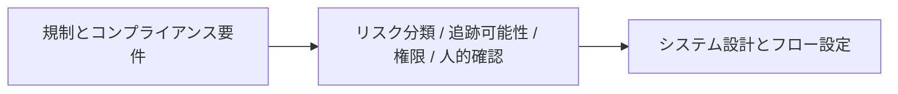

# 12.4.4 AI規制とコンプライアンス


:::tip 読み方のヒント
コンプライアンス要件は、最終的にシステム設計要件に変わります。たとえば、データ権限、ログ監査、リスク分類、人的監督、内容の明示、追跡可能性です。図を見るときは、「規制の言葉」がどのように「エンジニアリング設定」に翻訳されているかに注目してください。
:::

:::tip この節の位置づけ
規制の話は、技術からとても遠いように感じやすいです。  
でも、いったんシステムが次のような環境に入ると：

- 企業環境
- 商用プロダクト
- 高リスク業界

すぐに次のことが分かります。

> **コンプライアンスは最後に足す層ではなく、むしろシステム構造に影響を与えるものです。**

この授業では、その関係をはっきりさせます。
:::

## 学習目標

- AI のコンプライアンス問題が、なぜ製品設計に直接影響するのかを理解する
- リスク分類、監査、追跡可能性といったキーワードが重要な理由を理解する
- 規制要件をシステム要件へ翻訳する方法を学ぶ
- 「規制の問題は法務だけで処理するものではなく、技術も設計に参加する必要がある」という視点を身につける

---

## まずは全体図をつかもう

AI の規制とコンプライアンスは、「法律要件 -> システム能力 -> エンジニアリング実装」という流れで理解すると分かりやすいです。



この節で本当に解決したいのは、次の点です。

- なぜ規制の問題がシステム構造に直接入り込むのか
- なぜ技術チームが「コンプライアンスの翻訳」に参加しなければならないのか

---

## 一、なぜ規制の問題はエンジニアから遠くないのか？

### よくある誤解

多くの技術者は、つい次のように考えがちです。

- 規制は法務の仕事
- モデルはエンジニアの仕事

でも、実際のプロジェクトでは、この2つはよく直接ぶつかります。

### なぜぶつかるのか？

多くの規制要件は、最終的に次のような問いに変わるからです。

- ログはあるか
- 出どころを追跡できるか
- 権限制御はあるか
- 人が引き継げるか

つまり、

> 規制要件は、最終的にシステム能力の要件になることが多いです。 

なので、コンプライアンスは後から確認するものではなく、アーキテクチャへの入力になることがよくあります。

### 初学者により分かりやすい全体イメージ

コンプライアンスは、次のように考えると理解しやすいです。

- 製品公開前に満たす必要がある「建築基準」のようなもの

建築基準は、レンガの置き方までは直接教えてくれません。  
でも、次のようなことは決めます。

- どこに避難通路を確保する必要があるか
- どこに非常口を付ける必要があるか

AI のコンプライアンスもよく似ています。

- コードを直接書いてくれるわけではない
- しかし、システムがどんな形であるべきかを逆に制約する

---

## 二、よくあるコンプライアンスの注目点は何か？

### データとプライバシー

システムは次のような情報を扱うかもしれません。

- 個人情報
- 機微情報
- 企業内部データ

### 追跡可能性

システムは次のことを説明できる必要があります。

- この回答はどこから来たのか
- どんなデータが使われたのか
- どの段階で何が行われたのか

### リスク分類

システムごとにリスクレベルは異なります。  
すべての生成系システムに、同じ強さの統制が必要なわけではありません。

### 人的監督と異議申し立ての仕組み

高リスクの場面では、システムを完全に自動で閉じることは通常できません。

---

## 三、とても実用的なエンジニアリング翻訳の考え方

規制要件をシステム要件に翻訳するときは、次のように考えるとよいです。

| 規制 / コンプライアンス上の論点 | エンジニアリング上の要件になるもの |
|---|---|
| データ保護 | 匿名化、権限制御、保存の最小化 |
| 説明可能性 / 追跡可能性 | ログ、trace、出典参照 |
| 高リスクな意思決定の制限 | 人的確認、二重承認、自動実行の拒否 |
| 監査機能 | 操作記録、バージョン記録、リクエストの痕跡 |

この表はとても重要です。なぜなら、「コンプライアンス」を抽象的な言葉から、エンジニアリング可能な問題へ変えてくれるからです。

### 初学者がまず覚えるとよい判断表

| コンプライアンス要件 | 技術側で最初に考えること |
|---|---|
| データ保護 | 匿名化、権限、保存範囲 |
| 追跡可能性 | ログ、trace、出典参照 |
| 高リスクの制限 | 承認フロー、人的確認、自動実行の拒否 |
| 監査 | バージョン記録、操作の痕跡、設定の再現 |

この表は初学者に向いています。なぜなら、「規制の言葉」をエンジニアリングの言葉に置き換えてくれるからです。

---

## 四、なぜ「追跡可能性」は AI コンプライアンスで頻出なのか？

AI システムの問題は、「出力が間違った」だけではないことが多いからです。むしろ、次のような問題がよくあります。

- なぜ間違ったのか分からない
- どんなデータを使ったのか分からない
- どのモジュールに問題があったのか分からない

そのため、コンプライアンスでは次のものがとても重視されます。

- 出典参照
- タスクの trace
- 意思決定ログ

これは次のように考えると分かりやすいです。

> システムが動くだけでなく、後から調べられることも必要です。 

---

## 五、なぜリスク分類は AI システムで特に重要なのか？

すべての AI アプリを、同じ強さで統制するべきではありません。

たとえば、

- ポスター生成器
- 医療アドバイスアシスタント

この2つは、明らかに同じレベルのリスクではありません。

なので、とても重要な考え方は次のとおりです。

> **ガバナンスとコンプライアンスは、通常は段階的に適用されるものであり、「一律」ではありません。**

これは次のことに影響します。

- 人的確認が必要か
- 自動判断を許可するか
- より強い監査が必要か

---

## 六、最小限の「コンプライアンス要件 -> システム設定」の例

```python
compliance_config = {
    "data_traceable": True,
    "human_override": True,
    "audit_log_enabled": True,
    "sensitive_action_requires_approval": True
}

print(compliance_config)
```

この例はとてもシンプルですが、重要な考え方を表しています。

> コンプライアンス要件は、最終的にシステムのスイッチ、ポリシー、フローになることが多いです。 

---

## 七、AIGC / Agent の場面で、どこが最もコンプライアンス問題に触れやすいか？

### 検索とナレッジベース

もしシステムが社内文書を参照するなら、必ず次が関係します。

- 権限の境界
- 出典の範囲

### ツール呼び出し

もしシステムが次のようなことをするなら、

- メール送信
- データベース更新
- 企業システムの操作

自動実行のリスクがすぐに出てきます。

### コンテンツ生成

もしシステムが次のようなものを生成するなら、

- ユーザー向けの提案
- マーケティング文案
- 契約書の下書き

内容責任や誤誘導のリスクが高まります。

---

## 八、なぜ「人間が介在する仕組み（human-in-the-loop）」がますます重要になるのか？

多くの場面で、規制とコンプライアンスが気にするのは次の点です。

- モデルが出力できるか

ではなく、

- 最終的な重要アクションを、人がまだ制御できるか

たとえば、

- 高リスクの承認
- 外部への正式公開
- 法務や財務に関わる判断

これは次を意味します。

> 多くのシステム設計では、「人が引き継げるポイント」を残しておく必要があります。 

これはコンプライアンス要件であると同時に、エンジニアリング要件でもあります。

### 初学者に覚えやすい段階分けの考え方

システムは、まず次の3つに分けて考えるとよいです。

1. 低リスク：より自動化が多い
2. 中リスク：より強いログと監査が必要
3. 高リスク：人的確認と引き継ぎポイントを残す

この段階分けはとても重要です。なぜなら、「一律の統治」を避けるのに役立つからです。

---

## 九、とても重要なエンジニアリング習慣

高リスクの AI アプリを作るなら、次のような考え方を習慣にするとよいです。

1. まず、そのシステムがどのリスクレベルに属するかを確認する
2. 次に、どんなログと追跡が必要かを確認する
3. 次に、どの操作に人的確認が必要かを確認する
4. 最後に、モデルとワークフローをどう実装するかを考える

これは、「システムを作り切ってからコンプライアンスを後付けする」よりずっと安全です。

## これをシステム設計やガバナンス文書にするなら、何を見せるべきか

本当に見せる価値が高いのは、次のようなものです。

- 「コンプライアンスを満たしています」という一言

ではなく、

1. リスクレベルをどう分類したか
2. コンプライアンス要件を満たすために、どんな能力を追加したか
3. どの操作に人的確認が必要か
4. どのログと trace が監査を支えられるか

こうすると、見る人に次のことが伝わりやすくなります。

- 理解しているのは、コンプライアンスからエンジニアリングへの翻訳プロセスである
- ポリシーの表面だけにとどまっていない

---

## まとめ

この節で最も大事なのは、条文を暗記することではなく、次を理解することです。

> **AI の規制とコンプライアンスが技術側に落ちてくるとき、主な着地点はデータ境界、ログ追跡、権限制御、そして人的確認の仕組みです。**

この見方ができるようになると、コンプライアンスは「エンジニアリングから遠い言葉」ではなくなり、システム設計のときに正面から考えるべき層になります。

---

## 練習

1. 自分がよく知っている AI システムを 1 つ選び、「データ、ログ、権限、人的確認」の 4 つの観点で要件を書き出してみましょう。
2. 「追跡可能性」が、なぜ多くの AI コンプライアンス議論の中心になるのか考えてみましょう。
3. 自分の言葉で説明してみましょう。なぜリスク分類がシステム設計に直接影響するのでしょうか。
4. 「コンプライアンス」を、システムに落とし込める具体的な技術要件 3 つに翻訳してみましょう。
