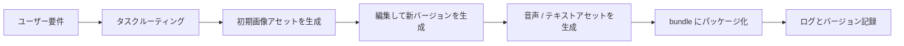

# 12.5.2 プロジェクト：AI クリエイティブコンテンツプラットフォーム


:::tip この節の位置づけ
AI クリエイティブプラットフォームは、とても簡単に「機能を並べただけのページ」になりがちです。

- テキストから画像生成のボタン
- 音声生成のボタン
- 画像編集のボタン

でも、これだけではまだプラットフォームとは言えません。
本当の難しさは次の点です。

> **多モーダルな機能を連続したワークフローとして組み立て、中間アセットを安定して管理すること。**

この節では、これをさらに一段、完成度の高い「作品級のプロダクトプロジェクト」へ押し上げます。
:::

## 学習目標

- 多モーダル生成機能を実際の制作フローとして組み立てられるようになる
- クリエイティブプラットフォームにおけるアセット構造とバージョン管理の考え方を学ぶ
- このテーマを、プロダクト感のある作品級プロジェクトとして形にする
- クリエイティブプラットフォームが、単なる単発生成機能の集合ではない理由を理解する

---

## 一、どんな題材なら「プラットフォームプロジェクト」に見えるのか？

作品らしく見える題材は、次のようなものです。

> **イベントポスター作成プラットフォームを作る：ユーザーが要件を入力すると、システムがポスターを生成し、1 回の画像編集に対応し、さらに宣伝用の音声も生成し、最後に完全なアセットパッケージとして出力する。**

### なぜこの範囲がちょうどいいのか？

- フローがひと通り揃っている
- アセットが明確
- 見せたときに分かりやすい

### なぜ最初から「全部入りの大規模クリエイティブプラットフォーム」を作るのはおすすめしないのか？

理由は次の通りです。

- 機能が多すぎると、主軸がぼやける
- アセット管理とルーティングのロジックがすぐに破綻しやすい

---

## 二、作品級クリエイティブプラットフォームの最小閉ループはどんな形か？

1. ユーザーが要件を入力する
2. 適切なモジュールにルーティングする
3. 初期アセットを生成する
4. 既存アセットをもとに修正する
5. 付随する音声やテキストを生成する
6. ひとつの内容パッケージとして書き出す

この 6 ステップがきちんと回れば、その時点でもうかなりプロダクトらしくなります。

### 実在のプラットフォームらしいアセットフロー図



この図はとても重要です。なぜなら、次の点を思い出させてくれるからです。

- プラットフォームは機能一覧ではない
- プロセスの中でアセットが進化していく仕組みである

## 三、おすすめの進め方

初心者にとって、より安定しやすい順番は通常次の通りです。

1. まずは単発のポスター生成を作る
2. 次に 1 回の画像編集を追加する
3. その次に音声アセットを追加する
4. 最後に bundle、ログ、バージョン管理を追加する

こうすると、「プラットフォーム感」を段階的に作りやすくなります。

### 初心者に合う全体イメージ

クリエイティブプラットフォームは、次のように考えると分かりやすいです。

- 素材棚、編集台、出力エリアがある小さなスタジオ

もし単にボタンがたくさんあるだけなら、それは次のような状態に近いです。

- いろいろなツールを机の上に並べただけ

次のようなことを意識し始めて、はじめて「プラットフォーム」らしくなります。

- どのアセットが初稿なのか
- どのアセットが修正版なのか
- どのアセットが同じプロジェクトに属するのか

---

## 四、まずはプラットフォームらしいワークフローの例を動かしてみる

```python
from dataclasses import dataclass, field


@dataclass
class AssetBundle:
    images: list = field(default_factory=list)
    voices: list = field(default_factory=list)
    logs: list = field(default_factory=list)
    metadata: dict = field(default_factory=dict)


def route_task(user_request):
    if "ナレーション" in user_request or "音声" in user_request:
        return "tts"
    if ("画像" in user_request and ("編集" in user_request or "修正" in user_request or "直す" in user_request)):
        return "image_editing"
    if "ポスター" in user_request or "画像" in user_request:
        return "image_generation"
    return "general"


def generate_image(prompt, style):
    return f"image_asset[{style}]::{prompt}"


def edit_image(image_name, instruction):
    return f"edited::{image_name}::{instruction}"


def generate_voice(script, speaker="default"):
    return f"voice_asset[{speaker}]::{script}"


def run_creative_project(requests):
    bundle = AssetBundle(metadata={"style": "futuristic", "project_name": "tech_event_campaign"})

    for req in requests:
        task_type = route_task(req)
        bundle.logs.append({"request": req, "task_type": task_type})

        if task_type == "image_generation":
            asset = generate_image(req, style=bundle.metadata["style"])
            bundle.images.append(asset)

        elif task_type == "image_editing" and bundle.images:
            asset = edit_image(bundle.images[-1], req)
            bundle.images.append(asset)

        elif task_type == "tts":
            asset = generate_voice(req, speaker="brand_voice")
            bundle.voices.append(asset)

    return bundle


requests = [
    "テックカンファレンスのポスターを 1 枚作って",
    "画像編集：背景を濃い青にして、少し発光エフェクトを加えて",
    "このポスター用に宣伝音声を 1 つ生成して",
]

bundle = run_creative_project(requests)
print("image_count:", len(bundle.images))
print("voice_count:", len(bundle.voices))
print("log_count:", len(bundle.logs))
print("tasks:", [item["task_type"] for item in bundle.logs])
print("latest_image_is_edit:", bundle.images[-1].startswith("edited::"))
```

期待される出力：

```text
image_count: 2
voice_count: 1
log_count: 3
tasks: ['image_generation', 'image_editing', 'tts']
latest_image_is_edit: True
```


重要なのは `tasks` の行です。同じプロジェクトの中に、最初の画像、編集後の画像バージョン、音声アセットが入り、単なる3つの独立した生成ではなくなります。

### この版が前の版より優れている点

今回は単に次の項目があるだけではありません。

- images
- voices

さらに次のものも加わっています。

- `logs`
- より明確な `metadata`

これによって、実際のプラットフォームにより近い次の流れを表現できます。

- アセットの流れ
- 操作の流れ

### なぜ `logs` を見せる価値があるのか？

プラットフォームプロジェクトでよくある失敗は、ユーザーが最終結果しか見られず、
途中経過がまったく見えないことです。

一方で、作品として見せるときは、中間過程こそが見どころになることが多いです。

### さらに最小の「バージョン管理」例を見る

```python
assets = [
    {"id": "img_v1", "type": "image", "parent": None},
    {"id": "img_v2", "type": "image", "parent": "img_v1"},
    {"id": "voice_v1", "type": "voice", "parent": None},
]

for asset in assets:
    print(asset)
```

期待される出力：

```text
{'id': 'img_v1', 'type': 'image', 'parent': None}
{'id': 'img_v2', 'type': 'image', 'parent': 'img_v1'}
{'id': 'voice_v1', 'type': 'voice', 'parent': None}
```


`parent` は最小限のバージョン管理フィールドです。そのアセットが新しい枝なのか、以前のアセットから派生したものなのかを示します。

この例は初心者にとても向いています。なぜなら、まず次の考え方を身につけやすいからです。

- アセットは孤立したファイルではない
- バージョン関係や親子関係を持つことが多い

---

## 五、クリエイティブプラットフォームで特に破綻しやすいポイント

### アセットのバージョンが混乱する

例えば次のようなケースです。

- 初期画像
- 画像修正版 1
- 画像修正版 2

命名や保存ルールが曖昧だと、システムはすぐに混乱します。

### ルーティングロジックが不明確

例えば、1 つの文の中に画像生成の要件と音声生成の要件が両方入っている場合です。

このとき、結果が予測しづらくなります。

### 多モーダル間でスタイルがそろわない

例えば次のようなケースです。

- ポスターは未来感のある雰囲気
- なのに、音声原稿は公式ニュース放送のような文体

こうした不一致は、プロジェクトの中で個別に分析する題材としてとても良いです。

---

## 六、作品級クリエイティブプラットフォームで特に見せるべきものは？

少なくとも次の内容を見せるのがおすすめです。

1. ユーザー要件
2. ルーティング結果
3. 初期ポスター
4. 画像編集後のバージョン
5. 音声アセット
6. 最終的な bundle 構造

### なぜ、ただ 1 枚のポスターを載せるより強いのか？

理由は、見る人に次のことが伝わるからです。

- これはワークフローシステムである
- 単発生成のデモではない

### 初めてこの種のプロジェクトを作るなら、安定しやすい順番

より安定しやすい順番は、通常次の通りです。

1. まずは単一テーマの制作シーンを作る
2. まず画像アセットの閉ループを動かす
3. 次に編集の流れを追加する
4. その次に音声またはテキストアセットを追加する
5. 最後に bundle とバージョン管理を入れる

この順番なら、最初から「全部入りの大規模プラットフォーム」を目指すより、主軸を立てやすくなります。

---

## 七、ぜひ追加したいエラー分析レイヤー

例えば、次のような情報を別途記録できます。

- どんな要件でルーティングミスが起きやすいか
- どんな prompt で画像と音声のスタイルが合わなくなりやすいか
- どのアセットがエクスポート時にメタデータを失いやすいか

これがあると、プロジェクトの完成度がかなり高く見えます。

---

## プロジェクト提出時にぜひ追加したい内容

- ワークフロー図 1 枚
- 要件から bundle までの完全な trace 1 本
- スタイルが一致するケース / 一致しないケースの比較例 1 組
- アセット管理とバージョン設計についての説明文 1 つ

## 作品集に入れるなら、特に強調すべきこと

特に強調すると良いのは、機能の多さではありません。

むしろ次の点です。

1. どの生成チェーンに進むかを、ルーティングがどう決めるか
2. アセットがどのように段階的に進化するか
3. ログとバージョンがどう記録されるか
4. 最終的な bundle が、なぜ本当に納品できる内容パッケージのように見えるのか

こうすると、見る人に次の印象を与えやすくなります。

- これは創作プラットフォームである
- 単なる多モーダル機能の寄せ集めではない

---

## 残す証拠

このページを終えたら、この evidence card を残します。

```text
brief: user goal, audience, assets, constraints, and export format
artifacts: source files, prompts, generated candidates, selected output, and rejected versions
review: factual check, copyright/portrait/sensitive-content check, and human decision
integration: RAG record, Agent trace, creative package, storyboard, or export preview
Expected_output: reproducible asset package with README, review checklist, and failure notes
```

## まとめ

この節で最も大事なのは、作品級の見方を身につけることです。

> **AI クリエイティブコンテンツプラットフォームが本当にプラットフォームらしく見えるのは、機能の数ではなく、タスクルーティング、アセットのバージョン、複数ステップのワークフローを、安定した見せられる生産フローとして組み立てられるかどうかです。**

この流れをきちんと説明できれば、このプロジェクトはとてもプロダクト感のある多モーダル作品になります。


## バージョン別の進め方のおすすめ

| バージョン | 目標 | 提出の重点 |
|---|---|---|
| 基礎版 | 最小閉ループを動かす | 入力できる、処理できる、出力できる、そして一組のサンプルを残せる |
| 標準版 | 見せられるプロジェクトにする | 設定、ログ、エラー処理、README、スクリーンショットを追加する |
| チャレンジ版 | 作品集レベルに近づける | 評価、比較実験、失敗サンプル分析、次の改善案を追加する |

まずは基礎版を完成させるのがおすすめです。最初から全部盛りを狙わないでください。バージョンを 1 つ上げるごとに、「何が追加されたか」「どう検証したか」「まだ何が課題か」を README に書き加えましょう。

## 演習

1. `AssetBundle` に `video_scripts` フィールドを追加してみて、ワークフローの中でどう生成するべきか考えてみましょう。
2. なぜクリエイティブプラットフォームは、単発生成機能よりもアセット管理に強く依存するのでしょうか？
3. 画像と音声のスタイルがいつも一致しない場合、問題をルーティング、プロンプト、それともアセット層のどこに置きますか？ その理由も考えてみましょう。
4. このプロジェクトを作品集に入れるなら、トップページで最も見せる価値がある 5 つのモジュールはどれですか？

<details>
<summary>参考解答と解説</summary>

1. `video_scripts` は brief と asset plan が安定した後に生成します。scene id、ナレーション、visual direction、duration、必要 assets、review status を含めると、動画 workflow が同じ manifest とつながったままになります。
2. creative platform が asset management に依存するのは、生成によって多くの版、却下候補、prompt、権利メモ、レビュー判断が生まれるからです。asset record がなければ、再現も安全な再利用もできません。
3. 画像と音声の style が一貫しない場合、まず asset layer を確認します。共有 style 定義がそろっていない可能性があるからです。その後で routing と prompts を見て、正しい generator と style instruction が使われたかを確認します。
4. portfolio の homepage で見せる価値が高い 5 モジュールは、brief intake、asset manifest/versioning、generation workflow、safety/review dashboard、final export または portfolio preview です。

</details>
