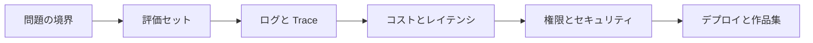
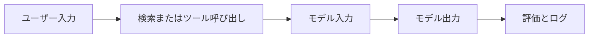

# AI 工学評価とリリースチェックリスト

## この節の位置づけ

このページは、「Demo から使えるシステムへ」進むためのチェックリストです。個別の章に代わるものではなく、RAG、Agent、マルチモーダル、または完全な AI アプリのプロジェクトを作り終えたときに、基本的なエンジニアリング品質が備わっているかを確認するためのものです。

多くの AI プロジェクトは動くように見えても、再現できない、評価できない、エラーの原因を特定できない、コストを管理できない、安全に本番へ出せない、という問題があります。本当に作品集として価値のあるプロジェクトは、他の人が理解できて、実行できて、失敗原因を追える必要があります。

## 図で理解する：Demo から使えるシステムへ

| まず1層だけ補うなら | 優先して補うもの |
|---|---|
| RAG プロジェクト | 検索ログ、引用チェック、評価用の問題 |
| Agent プロジェクト | trace、ツール schema、停止条件、権限 |
| マルチモーダル プロジェクト | 素材の出どころ、手動確認、出力制限 |
| デプロイプロジェクト | `.env.example`、起動コマンド、エラーログ |

## 一、問題と境界は明確か

プロジェクトを本番に出す前に、まず解決する問題がどれだけ具体的かを確認します。「AI アシスタントを作る」だけではなく、誰向けなのか、どんな入力を処理するのか、どんな結果を出すのか、何はやらないのか、どんなときに拒否するか、または人に引き継ぐかを明確にしましょう。

| チェック項目 | 合格基準 |
|---|---|
| 対象ユーザー | そのシステムを誰が使うのか説明できる |
| 入出力 | 入力の種類と出力の形式を列挙できる |
| タスクの境界 | どの問題を処理しないか説明できる |
| 成功基準 | 何をもって良い結果とするか説明できる |
| 失敗時の対応 | 失敗時にどう案内するか、またはどう段階的に落とすか説明できる |

## 二、評価セットはあるか

評価セットがなければ、改善が本当に効いたかを判断するのは難しくなります。Prompt を変えた、検索戦略を変えた、モデルを変えた、というときに、固定されたテスト問題がなければ、感覚で判断するしかありません。

RAG プロジェクトでは、少なくとも固定の質問セットを用意し、期待するヒット文書と理想回答をラベル付けします。Agent プロジェクトでは、少なくとも固定のタスクセットを用意し、完了したか、何ステップ使ったか、どのツールを呼んだか、権限を越えていないかを記録します。マルチモーダル プロジェクトでは、少なくとも画像、スクリーンショット、PDF、または生成タスクのセットを用意し、人手で確認する基準を記録します。

## 三、ログと Trace で十分に振り返れるか

AI アプリのエラーは、単一の箇所のエラーではなく、処理の流れ全体のエラーであることがよくあります。ログには最終回答だけでなく、重要な中間過程も記録しましょう。

振り返り可能なログには、少なくとも次の内容が含まれているべきです。ユーザーの質問、検索された断片、Prompt のバージョン、モデル名、ツール呼び出しのパラメータ、返り値、エラー情報、Token またはコスト、処理時間、最終出力。

## 四、コストとレイテンシは制御できるか

AI システムのコストは複数の場所から発生します。モデルの入出力 Token、Embedding、再ランキング、画像や動画の生成、ツール呼び出し、ベクトルデータベース、サーバー、ログ保存です。プロジェクト初期は大まかに見積もっても構いませんが、完全に無視してはいけません。

| コストの発生源 | 記録すべき内容 |
|---|---|
| LLM 呼び出し | モデル、入出力 Token、呼び出し回数 |
| RAG | 文書数、分割数、検索回数、再ランキング回数 |
| Agent | 実行ステップ数、ツール呼び出し回数、再試行回数 |
| マルチモーダル | 画像、音声、動画の生成回数と1回あたりの時間 |
| デプロイ | サーバー、データベース、ストレージ、監視コスト |

## 五、権限とセキュリティの境界は明確か

ツール呼び出しや Agent プロジェクトでは、特に権限の境界が重要です。モデルはアクションを提案できますが、デフォルトですべての実行権限を持つべきではありません。削除、メッセージ送信、注文、データベース変更、有料 API の呼び出し、コンテンツ公開などの高リスク操作には、人の確認が必要です。

セキュリティチェックには少なくとも、入力検証、出力フォーマット検証、機密情報の取り扱い、ツール権限制限、人手確認、エラー時の段階的な処理、監査ログが含まれます。

## 六、RAGOps チェックリスト

RAG プロジェクトでは、知識ソース、検索品質、回答の忠実性を重点的に確認します。

| チェック項目 | 合格基準 |
|---|---|
| 文書の出典 | 各回答を文書、ページ、または断片まで追跡できる |
| 文書処理 | 解析、クリーニング、分割、索引化の方法を説明できる |
| 検索品質 | 取得された断片と関連度順を確認できる |
| 引用の信頼性 | 回答中の重要な事実が出典と対応している |
| 答えがない場合の処理 | 文書に答えがないときに無理に作らない |
| 更新の仕組み | 文書が変わったら再索引、または期限切れとして扱える |

## 七、AgentOps チェックリスト

Agent プロジェクトでは、実行軌跡、ツールの境界、失敗からの復帰を重点的に確認します。

| チェック項目 | 合格基準 |
|---|---|
| 目標の境界 | Agent がいつ止まるべきか理解している |
| ツール schema | パラメータ、返り値、エラー情報が明確 |
| 実行軌跡 | 各ステップの計画、行動、観察、結果を確認できる |
| 権限制御 | 高リスク操作には人の確認が必要 |
| 失敗復帰 | ツール失敗時に再試行、段階的な処理、停止ができる |
| コスト記録 | 実行ステップ数、呼び出し回数、おおよそのコストが見える |

## 八、マルチモーダル プロジェクトのチェックリスト

マルチモーダルと AIGC プロジェクトでは、素材、生成品質、人手による編集、コンプライアンスを重点的に確認します。

| チェック項目 | 合格基準 |
|---|---|
| 入力品質 | 画像、音声、動画、PDF が見やすく解析可能である |
| 出力の制御 | スタイル、サイズ、形式、用途に制約をかけられる |
| バージョン記録 | 複数回の生成結果を比較して戻せる |
| 人手編集 | ユーザーが重要な内容を修正でき、1回の生成に完全依存しない |
| コンテンツ審査 | 著作権、肖像権、センシティブ内容、事実性の確認がある |
| 書き出しと納品 | 最終結果を使える形式でエクスポートできる |

## 九、作品集での見せ方チェックリスト

就職活動や発表に使うなら、README には少なくとも次の内容を入れましょう。プロジェクトの目的、技術方針、実行方法、入力と出力の例、スクリーンショットまたは GIF、評価方法、失敗例、改善計画、デプロイ説明です。

「成功した画面」だけを見せないようにしましょう。良い AI エンジニアリング作品は、問題をどう特定したか、どう効果を評価したか、どうリスクを抑えたか、どう取捨選択したかを示すべきです。

## 十、デプロイとプロダクション化のチェック

AI アプリを公開する前に、少なくともローカル Demo、再現可能なデプロイ、オンライン運用、継続的改善の4つの層で確認しましょう。デプロイは最後にコマンドを1つ追加するだけではなく、設定、ログ、権限、コスト、失敗時の処理が新しい環境でも動くようにすることです。

| 層 | チェック項目 | 合格基準 |
|---|---|---|
| ローカル Demo | 依存関係、環境変数、起動コマンド | 新しいマシンでも README どおりに最小構成で動く |
| 再現可能なデプロイ | `.env.example`、設定ファイル、データパス | 個人PCの隠しパスや手動コピーに依存しない |
| オンライン運用 | ログ、レート制限、タイムアウト、段階的な処理、エラーページ | リクエスト失敗時に原因を特定でき、ユーザーへ明確に返せる |
| 継続的改善 | 評価セット、フィードバック入力、バージョン記録 | Prompt、検索、モデルの変更を回帰テストできる |

プロダクション化では、キーの安全管理にも特に注意しましょう。API key をフロントエンド、ログ、スクリーンショット、公開リポジトリに書き込んではいけません。プロジェクトを見せる必要がある場合は、`.env.example` で変数名を示し、デモ用 key または mock モードで処理を通しましょう。

## 十一、Demo から作品集へつなぐ公開材料

まだ本物のサーバーがなくても、「準本番の材料」を用意できます。作品集で最も大切なのは、このプロジェクトが本番化を意識していると相手に伝えることであり、実際に本物のユーザーをすでに支えていると約束することではありません。

| 材料 | 説明 |
|---|---|
| デプロイ構成図 | フロントエンド、バックエンド、モデル API、ベクトルストア、ログ保存の関係 |
| 環境変数の説明 | モデル key、データベースアドレス、ベクトルストアのパス、ポート、切り替え設定 |
| 起動とロールバックのコマンド | 起動、停止、キャッシュ削除、前の版に戻す方法 |
| 本番障害対応案 | timeout、rate limit、key 失効、ベクトルストア利用不可時の対応 |
| コスト見積もり | 1リクエストあたりの token、平均レイテンシ、1日あたりの呼び出し量、予算上限 |

これらの材料があると、プロジェクトは「動く Demo」から「本物の工程に近い AI アプリ」へと一段上がります。

## 十二、公開前の最後の質問

公開前に、自分にこう問いましょう。もしこのシステムが明日、間違えた回答をしたら、検索を間違えたら、ツールを誤って呼び出したら、コストが急に上がったら、どの層に問題があるか分かるだろうか？

答えが「いいえ」なら、まず評価、ログ、境界を補いましょう。AI 工学の成熟度は、Demo がどれだけかっこいいかではなく、失敗したときに振り返れて改善できるかで決まります。
