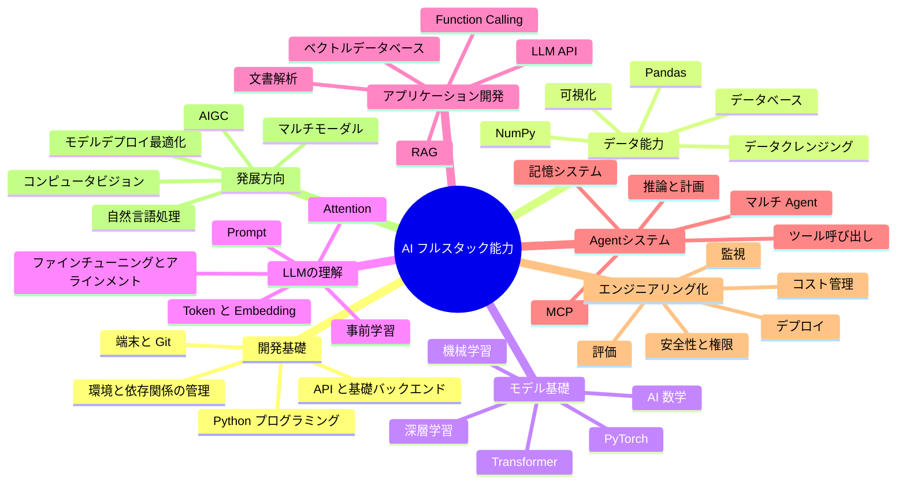

# AIフルスタック能力マップ

AI学習でいちばん迷いやすい理由は、Python、数学、機械学習、深層学習、Transformer、Prompt、RAG、Agent、MCP、ベクトルデータベース、ファインチューニング、デプロイ、安全性など、たくさんの言葉を同時に見ることです。これらは並列の関係ではなく、いくつも層が重なった能力です。

このコースでは、AIフルスタックの能力を7層に分けます。開発基礎、データ能力、モデル基礎、LLMの理解、アプリケーション開発、Agentシステム、エンジニアリング化と発展方向です。

## まずこの表を覚えよう

| 層 | 解決する問題 | 最終的に作れるもの |
| --- | --- | --- |
| 開発基礎 | どこにコードを書き、どう実行し、どう保存するか | 実行できて、振り返りもできる小さなプロジェクト |
| データ能力 | どのように資料を整理し、整形し、観察するか | データレポート、可視化グラフ、検索しやすい資料 |
| モデル基礎 | モデルはなぜデータから規則を学べるのか | 分類、予測、クラスタリング、推薦などの基本モデル |
| LLMの理解 | LLMはなぜ文章を理解し、生成できるのか | Prompt、Embedding、Transformer の感覚 |
| アプリケーション開発 | どうやってモデルをユーザーが使える機能にするか | チャットアシスタント、ナレッジベースQA、文書処理ツール |
| Agentシステム | AIにタスク分解、ツール操作、記憶保持をどうさせるか | 自動化アシスタント、学習計画Agent |
| エンジニアリング化と発展 | どうやってアプリを安定して公開し、分野を深く広げるか | デプロイしたプロジェクト、評価体系、CV/NLP/AIGC作品 |

## 全体能力マップ

## 7層はどうつながるのか

| どの層からどの層へ | つながり |
| --- | --- |
| 開発基礎 -> データ能力 | まずスクリプトが書けて、はじめてデータを自動でクレンジング、集計、保存できる |
| データ能力 -> モデル基礎 | モデルが学ぶ規則は、データの質、特徴量、ラベルから生まれる |
| モデル基礎 -> LLMの理解 | Transformer、Embedding、損失関数などの概念が何度も出てくる |
| LLMの理解 -> アプリケーション開発 | 文脈、幻覚、限界を理解してこそ、信頼できる Prompt と RAG を設計できる |
| アプリケーション開発 -> Agentシステム | RAG は資料検索を担当し、Agent はさらにタスク分解とツール呼び出しを担当する |
| Agentシステム -> エンジニアリング化 | 実際に公開するときは、権限、ログ、評価、コスト、エラー復旧を扱う必要がある |

## 最小記憶版

7層を一文にまとめると、まずコードを動かし、次にデータを整理し、それからモデルがどう学ぶかを理解し、続いて LLM でアプリを作り、最後にプロジェクトをデプロイして、公開し、振り返ります。

最初の学習では、全部の地図を暗記する必要はありません。「ツール -> データ -> モデル -> LLM -> アプリケーション -> Agent -> エンジニアリング化」という主線だけ覚えておけば、用語の多さで迷わずに進めます。
