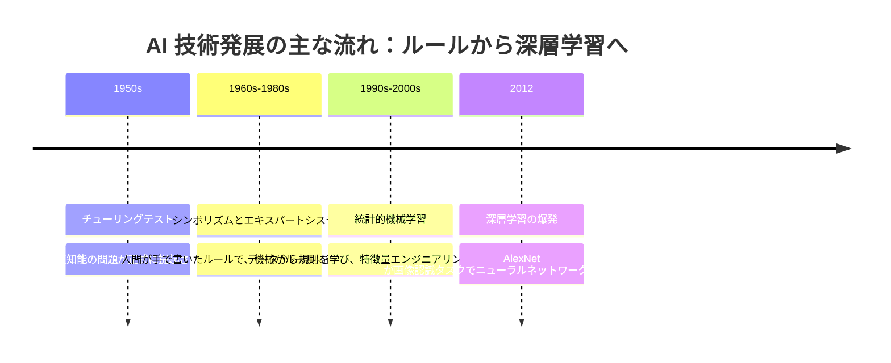
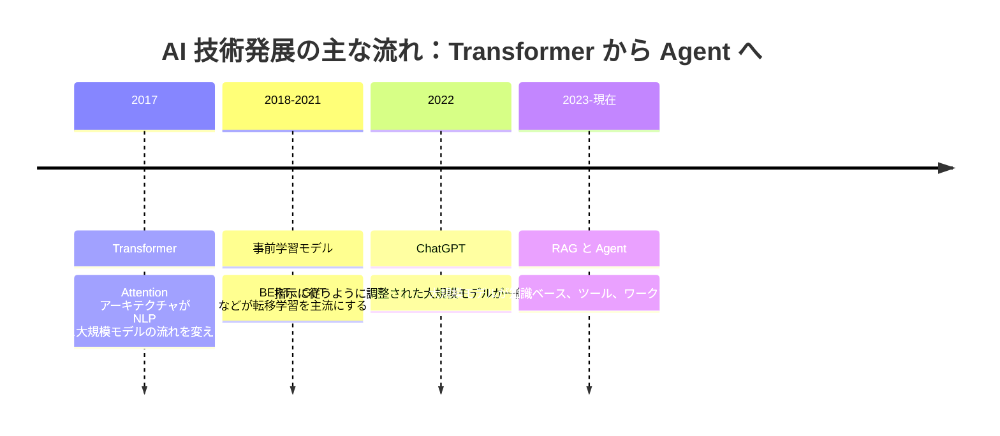

# AIの発展史マップ

AI を学ぶときは、技術用語を覚えるだけでは不十分です。なぜその技術が登場したのかを理解することも大切です。  
それぞれの技術の波は、基本的に「前の世代の方法では解決できなかった問題」に答えようとして生まれました。

このページは学術史を完全に網羅するものではなく、学習のための地図です。  
エキスパートシステム、機械学習、深層学習、Transformer、大規模モデル、RAG、Agent の関係をつかめるようにすることが目的です。

## まず進化のロジックを見る

| 段階 | 主に何を解決したか | 新しく生まれた問題 |
|---|---|---|
| シンボリズム | 専門家のルールを機械に書き込む | ルールが多すぎる、保守しにくい、汎化しにくい |
| 統計的機械学習 | データから規則を学ぶ | 特徴量エンジニアリングとデータ品質に依存する |
| 深層学習 | 複雑な表現を自動で学習する | より多くのデータ、計算資源、学習の工夫が必要 |
| Transformer | 長い系列と文脈をよりうまく扱う | モデル規模、学習コスト、説明可能性の問題 |
| 大規模モデル + RAG + Agent | 知識ベース、ツール、ワークフローをつなぐ | 幻覚、権限、評価、コスト、安全性 |

## 1枚でわかる AI の進化

前半の主な流れは、まず AI が人間の手でルールを書こうとし、次第に機械がデータから規則を学ぶ方向へ移っていった、というものです。  
2012 年ごろになると、データ、GPU、学習手法がそろい、深層学習が主流になっていきました。

## 第1段階：シンボリズムとエキスパートシステム

初期の AI の中心的な考え方は、もし人間の専門家が知識をルールとして書けるなら、機械はそのルールに従って推論できる、というものでした。  
たとえば医療診断システムなら、「症状 A と指標 B があれば、病気 C を考える」といった形で書けます。

この方法は、ルールが明確で範囲が限られた場面では役立ちます。  
しかし、現実世界の複雑さを扱うのは苦手です。ルールが増えるほど保守コストは高くなり、新しいデータから自動で改善することも難しくなります。

## 第2段階：統計的機械学習

機械学習では考え方が変わりました。人間がすべてのルールを手で書く代わりに、機械がデータから規則を学ぶようにしたのです。

この段階の代表的な手法には、線形回帰、ロジスティック回帰、決定木、ランダムフォレスト、SVM、ナイーブベイズ、クラスタリング、次元削減などがあります。  
学習の重点は、「ルールを書く」ことから、「データを準備する、特徴量を設計する、モデルを学習させる、結果を評価する」ことへ移りました。

だからこそ、このコースでは大規模モデルに入る前に、機械学習とデータ分析も扱います。  
モデルの学習、評価、過学習、特徴量、データ分布といった概念は、今日の AI アプリケーションでもとても重要だからです。

## 第3段階：深層学習

深層学習によって、モデルはより複雑な表現を自動で学習できるようになりました。  
画像認識、音声認識、機械翻訳などのタスクがこれによって大きく進歩しました。

この段階の重要な背景には、データ量の増加、GPU 計算能力の向上、ニューラルネットワークの学習手法の成熟があります。  
このコースでは、ニューラルネットワーク、逆伝播、最適化手法、CNN、RNN、Transformer の基礎を学びます。

深層学習は、すべての従来の機械学習を置き換えるものではありません。  
高次元で複雑なデータに対して強く、特に画像、テキスト、音声、マルチモーダルのタスクに適しています。

## 第4段階：Transformer と事前学習モデル

Transformer の重要な変化は、Attention 機構で系列の関係を扱うようにしたことです。  
RNN と比べて、Transformer は並列学習に向いており、大規模データや大規模モデルにも拡張しやすいです。

BERT、GPT、T5 などの事前学習モデルは、NLP の考え方を大きく変えました。  
まず大量のデータで事前学習し、その後、具体的なタスクに対して微調整したり、Prompt を与えたりします。  
その後、大規模言語モデルは「言語インターフェース」を、さまざまな能力への入り口へと変えていきました。

## 第5段階：大規模モデル、RAG、Agent

ChatGPT の登場後、大規模モデルは研究用ツールから一般向けのアプリケーションへと広がりました。  
それと同時に、新しい問題も出てきました。モデルは幻覚を起こすことがあり、知識は古くなることがあり、企業内部の資料に直接アクセスできず、外部アクションを自然に実行できるわけでもありません。

RAG は、検索で拡張した生成を使って、外部の知識ベースをモデルの文脈に接続します。  
Agent はさらに一歩進み、モデルが手順を計画し、ツールを呼び出し、記憶を保存し、システムと連携して、より複雑なタスクを完了できるようにします。

これが、このコース後半の主な流れです。  
単に「大規模モデルに質問する」だけではなく、信頼できる AI アプリケーションシステムを設計できるようになることを目指します。

## 学習するときにこの歴史マップをどう使うか

新しい概念を学んだら、次の3つを自分に問いかけてみてください。  
それは前の世代の方法のどんな問題を解決したのか。  
どんな新しい能力をもたらしたのか。  
そして、どんな新しいリスクや制約を生んだのか。

たとえば RAG は、大規模モデルの知識不足と知識更新の問題を解決しますが、文書の分割、検索品質、引用の信頼性、評価の問題を新たに生みます。  
Agent はタスク実行の問題を解決しますが、ツールの安全性、権限管理、コスト、安定性の問題を生みます。

このような進化のロジックを理解すると、各技術用語をばらばらに覚えるより、ずっと実践的で役に立ちます。
