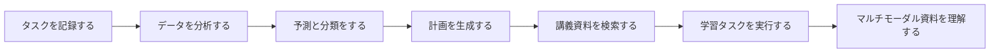
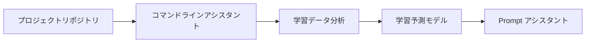
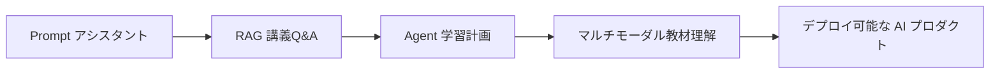

# 全課を通したプロジェクト：AI 学習アシスタントの成長ロードマップ

## この節の位置づけ

このページでは、講義全体を1つの継続的にアップグレードしていくプロダクトプロジェクト、AI 学習アシスタントとしてつなぎます。各段階の小さなプロジェクトを、このプロダクトの1回ずつの改善だと考えると、最終的にコマンドラインツールから始まり、RAG、Agent、マルチモーダルアシスタントへと成長する、ひとつながりのポートフォリオができます。

もし「毎回ゼロから始める感じ」で分かれすぎていると感じるなら、この主線に沿って学ぶのがおすすめです。講義が「章をたくさん見る」よりも「1つのプロダクトを作る」感覚に近くなります。実際にこのプロジェクト用のリポジトリを立ち上げたい場合は、[全課を通したプロジェクト用リポジトリテンプレート：AI 学習アシスタント](/intro/ai-learning-assistant-template) をそのまま参考にできます。

## まず図で見る：1つのプロジェクトが全講義を貫く



| どこまで学んだか | アシスタントに追加するもの | 残す証拠 |
|---|---|---|
| 1～3 站 | 学習データの記録、保存、分析 | JSON、グラフ、README |
| 4～6 站 | モデルで学習リスクの判断を補助する | baseline、指標、失敗サンプル |
| 7～9 站 | Prompt、RAG、Agent の機能 | Prompt バージョン、引用、trace |
| 10～12 站 | 画像、テキスト、マルチモーダルの拡張 | 入力素材、出力結果、確認記録 |

## プロダクトストーリー

AI を使って自分の学習を支えてくれるアシスタントを作っていると想像してください。最初はただ動く Python プロジェクトにすぎませんが、やがて学習タスクを記録し、学習データを分析し、学習進度を予測し、講義の質問に答え、ツールを呼び出して資料を整理し、最後にはスクリーンショット、スライド、マルチモーダルな内容まで理解できるようになります。

このロードマップの目的は、最初から大きなシステムを作ることではありません。各ステップを学び終えるたびに、同じプロダクトに1つずつ新しい能力を足していくことです。





## 1～3 站：まずは学習を記録できるツールを作る

第1站では、開発環境、Git リポジトリ、プロジェクト構成を整えます。第2站では、Python でコマンドライン学習アシスタントを作り、タスクの追加、確認、完了マーク、JSON への保存をできるようにします。第3站では、学習記録の分析に進みます。たとえば、毎日の学習時間、完了率、最も先延ばししやすいテーマを調べ、グラフで見せます。

この段階の作品で大事なのは、「動く」「保存できる」「分析できる」です。AI モデルはまだ必要ありませんが、ここで開発の習慣を作り始めます。README を書く、データを保存する、エラーを記録する、結果をスクリーンショットで残す、といったことが大切です。

## 4～6 站：アシスタントにデータとモデルの理解を持たせる

第4站では、数学の概念をプロジェクトに接続します。たとえば、学習テーマをベクトルで表す、完了率を確率で理解する、モデル学習の感覚を勾配でつかむ、といったイメージです。第5站では、学習進度の予測やタスク分類モデルを作れます。過去の記録から、ある種類のタスクが遅れやすいかを予測したり、学習の質問を環境、文法、データ、モデル、RAG、Agent などのカテゴリに分けたりします。第6站では、簡単なテキスト分類や画像分類の実験を行い、深層学習の学習曲線や失敗サンプルを理解します。

この段階の作品で大事なのは、「評価できる」ことです。モデルのスコアは飾りではありません。学習データ、テストデータ、baseline、指標、エラーサンプルを説明できるようにしましょう。

## 第7站：Prompt 学習アシスタントへアップグレードする

大規模言語モデルの段階に入ると、学習アシスタントは LLM API に接続できるようになります。学習目標に合わせた学習計画を生成したり、あいまいな質問を分かりやすい Prompt に言い換えたり、学習ノートを構造化された要約に整理したり、決まった形式で振り返りカードを作ったりできます。

この段階のポイントは、派手さではなく Prompt の安定性を比べることです。入力、出力、失敗サンプル、改善の過程をきちんと記録してください。

## 第8站：RAG 講義Q&Aアシスタントへアップグレードする

第8站は、このプロジェクトの重要なアップグレードです。アシスタントが講義ドキュメント、ノート、プロジェクト README を読み、それらの資料をもとに質問に答えられるようにします。最小構成では、Markdown ファイルの読み込み、分割、ベクトル化、検索、回答、出典引用を実装すれば十分です。

標準構成では、さらに Hybrid Search、Reranking、Query Rewrite、評価用質問集、引用チェック、ログを追加します。発展版では、GraphRAG、Agentic RAG、Multimodal RAG に挑戦して、文書をまたぐ関係の処理、必要な資料の追加検索、スクリーンショットや PDF の読み取りまで扱えるようにできます。

## 第9站：Agent 学習計画アシスタントへアップグレードする

第9站では、アシスタントを「質問に答える」ものから「学習タスクを実行する」ものへ進化させます。たとえば、ユーザーが「RAG 段階の復習を手伝って」と言ったら、Agent がタスクを分解し、関連する講義資料を探し、復習計画を作り、練習問題を挙げ、完了状況を確認し、実行の流れを記録します。

この段階で特に重要なのは境界です。どの手順は自動で実行してよいのか、どこは人の確認が必要なのか。ツール呼び出しが失敗したときはどう落とし込むのか。各ステップの計画、ツール、結果、コスト、エラーをどう記録するのか、をはっきりさせます。

## 第12站：マルチモーダル学習アシスタントへアップグレードする

マルチモーダルの段階では、学習アシスタントはスクリーンショット、スライド画像、PDF ページ、グラフ、音声メモを扱えるようになります。モデル構造図を説明したり、スライドのスクリーンショットから重要概念を抜き出したり、学習動画のアウトラインを作ったり、学習内容を図と文章の復習カードにまとめたりできます。

この段階で大事なのは、見た目のきれいな結果を出すことだけではありません。マルチモーダルの理解、生成、編集、確認、出力を1つのワークフローとしてつなぐことです。

## バージョン反復ロードマップ

この全課を通したプロジェクトを本当にポートフォリオにしたいなら、各バージョンを「小さなリリース」として扱うのがおすすめです。思いつきの練習ではなく、毎回 README、実行コマンド、入力例と出力例、変更履歴、失敗サンプルを残しましょう。そうすると、卒業制作の段階で、このプロジェクトがどのようにスクリプトから AI プロダクトへ成長したかをはっきり示せます。

| バージョン | 重要な問い | 最小機能 | 標準機能 | 合格証拠 |
|---|---|---|---|---|
| v0.1 プロジェクトの土台 | プロジェクトは安定して動き、バージョンを保存できるか | リポジトリ作成、README、Python エントリポイント、依存ファイル | コマンドライン引数、ログ用ディレクトリ、学習記録用ディレクトリを追加 | Git commit、実行画面、README |
| v0.2 コマンドライン学習アシスタント | 学習タスクを記録できるか | タスクの追加、確認、完了、JSON 保存 | 分類、締切、簡単な検索、エラー処理をサポート | サンプル JSON、コマンド出力、エラー処理記録 |
| v0.3 学習データ分析 | 記録から問題を見つけられるか | 学習時間、完了率、高頻度テーマを集計 | グラフ、週報、学習提案を生成 | EDA Notebook、グラフ、分析結果 |
| v0.4 学習テーマ分類 | ルールや ML で章の推薦を補助できるか | キーワードや baseline で学習の質問を分類 | 簡単なモデルを学習し、ルールとモデルの効果を比較 | テストセット、指標表、失敗サンプル |
| v0.5 表現学習の実験 | テキストベクトルと類似度を理解できるか | 簡単なテキスト表現法を比較 | テキスト類似度や分類の実験を行い、学習曲線を記録 | 実験ログ、学習結果、振り返り |
| v0.7 Prompt 学習アシスタント | 学習計画と振り返りを安定して生成できるか | LLM API を呼び出し、構造化された計画を出力 | Prompt バージョンを管理し、テンプレートごとの差を比較 | Prompt 記録、入出力例、失敗サンプル |
| v0.8 RAG 講義Q&A | 講義資料をもとに答え、出典を示せるか | Markdown 読み込み、分割、検索、回答、引用 | 評価用セット、Hybrid Search、Rerank、ログを追加 | 質問集、引用チェック、検索ログ |
| v0.9 Agent 学習計画 | タスクを分解し、ツールを呼び出せるか | 学習計画を生成し、講義検索ツールを呼び出す | trace、人の確認、失敗復旧、コスト記録を追加 | 実行トレース、ツール呼び出しログ、安全境界の説明 |
| v1.0 卒業作品 | 完成した AI プロダクトとして見せられるか | 実行可能な Demo、README、サンプル、評価 | デプロイ、権限、監視、振り返り、今後のロードマップ | デモ動画/スクリーンショット、デプロイ説明、評価レポート |

バージョン番号は実際の進み具合に合わせて調整してかまいません。ただし、合格証拠は飛ばさないでください。ポートフォリオで最も説得力があるのは、最終画面そのものよりも、各段階に残された実行記録、失敗サンプル、改善の流れです。

## 各バージョンで共通の提出フォーマット

各バージョンを完成させるたびに、リポジトリ内にその版の記録を残すのがおすすめです。形式はシンプルで大丈夫です。本バージョンの目的、追加した機能、実行方法、入力と出力の例、失敗したケース、次の版で直したい点を書きます。

````md
## v0.8 RAG 講義Q&Aアシスタント

### このバージョンの目的
学習アシスタントが講義 Markdown をもとに質問へ答え、出典引用を返せるようにする。

### 実行方法
```bash
python -m src.rag_qa --question "RAG と fine-tuning の違いは何ですか？"
```

### 出力例
質問：RAG と fine-tuning の違いは何ですか？
回答：RAG は主に外部知識を検索して文脈を補い、fine-tuning は主に学習によってモデルのパラメータを変えます……
出典：docs/ch08-rag/ch01-rag/01-rag-basics.md

### 失敗サンプル
質問：Agent フレームワークはどう選べばいいですか？
失敗理由：現在のインデックスには RAG 章しか入っておらず、Agent 章が入っていません。
次の一歩：ドキュメントの取り込み範囲を広げ、metadata に段階情報を保存する。
````

この共通フォーマットがあれば、「プロジェクトは作ったけれど、うまく説明できない」という状態を避けられます。履歴書、面接、ポートフォリオを準備するときには、各バージョンがそのまま再利用できる材料になります。

## 段階ごとの実装チェックリスト

本当にこの全課を通したプロジェクトの流れで進めるなら、各学習ステップをそのまま1回ずつのバージョンアップだと考えてください。下の表は追加課題ではなく、ばらばらの章を1つの作品にまとめるためのガイドです。

| 学習ステップ | プロジェクト版 | おすすめの成果物 | 対応する講義入口 |
|---|---|---|---|
| 1 開発者ツール基礎 | v0.1 プロジェクトの土台 | Git リポジトリ作成、README、Python 環境設定、実行画面の記録 | [開発者ツール基礎](/ch01-tools) |
| 2 Python プログラミング基礎 | v0.2 コマンドライン学習アシスタント | JSON でタスクを保存し、追加、確認、完了、削除をサポート | [Python プログラミング基礎](/ch02-python) |
| 3 データ分析と可視化 | v0.3 学習データ分析 | 学習時間、完了率、先延ばしテーマを集計し、グラフで表示 | [データ分析と可視化](/ch03-data-analysis) |
| 4 AI 数学基礎 | v0.4 学習指標の理解 | ベクトル、確率、勾配などで学習データとモデルの直感を説明 | [AI 数学の最小必須基礎](/ch04-ai-math) |
| 5 機械学習 | v0.5 学習予測モデル | タスク延期リスクを予測するか、学習の質問を分類し、baseline と指標を明記 | [機械学習入門から実践まで](/ch05-machine-learning) |
| 6 深層学習と Transformer | v0.6 簡単な深層学習実験 | テキストまたは画像分類の小実験を行い、学習曲線と失敗サンプルを記録 | [深層学習と Transformer の基礎](/ch06-deep-learning) |
| 7 大規模言語モデルの原理と Prompt | v0.7 Prompt 学習アシスタント | 学習計画、振り返りカード、質問の言い換えテンプレートを生成し、Prompt バージョンを記録 | [大規模言語モデルの原理、Prompt、fine-tuning](/ch07-llm-principles) |
| 8 LLM アプリ開発と RAG | v0.8 講義Q&Aアシスタント | 講義 Markdown を読み、検索、回答、出典引用、評価用質問集に対応 | [LLM アプリ開発と RAG](/ch08-rag) |
| 9 AI Agent | v0.9 学習計画 Agent | 復習タスクを分解し、ツールで資料を探し、計画を生成して実行トレースを残す | [AI Agent とエージェントシステム](/ch09-agent) |
| 10～12 方向の拡張 | v1.0 マルチモーダル学習アシスタント | スクリーンショット、スライド画像、音声メモを処理し、見せられる卒業作品にする | [AIGC とマルチモーダル](/ch12-multimodal) |

各バージョンを終えたら、README には少なくとも次の3つを残してください。どう実行するか、入力と出力の例、今回の反省点と次の計画です。そうすれば、最終的に「たくさんの教材を見た」ではなく、「成長の過程を説明できる AI プロジェクト」を持てます。

## 最終成果物の基準

完成した AI 学習アシスタントは、機能が多くなくてもかまいません。ただし、はっきりした閉ループが必要です。ユーザーが学習目標や資料を入力すると、システムが文脈を読み取り、必要なら講義内容を検索し、ツールやモデルで結果を生成し、出典、ログ、評価サンプル、改善記録を返せることが大切です。

このプロジェクトは卒業制作として使えます。プログラミング、データ、モデル、大規模言語モデルの応用、RAG、Agent、マルチモーダル、エンジニアリングまでを一通り示せるからです。

## README の書き方

この全課を通したプロジェクトの README は、継続的に更新するのがおすすめです。各段階が終わるたびに、その版の記録を追加します。新しく何ができるようになったか、どう実行するか、入力と出力の例は何か、どんな問題があったか、次にどう直すかを書きます。

そうすれば、講義全体を学び終えたとき、ただバラバラのノートが残るのではなく、成長の過程をきちんと説明できるポートフォリオプロジェクトを持てます。
