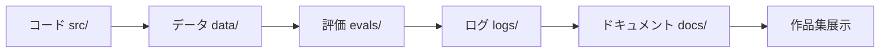

# プロジェクト全体を通して使うリポジトリテンプレート：AI 学習アシスタント

## この節の位置づけ

このページでは、「AI 学習アシスタント」の通しプロジェクトにそのまま使えるリポジトリテンプレートを紹介します。最初からすべてのディレクトリを埋める必要はありません。第 1 ステップから、本物のプロジェクトと同じように、コード、データ、実験、ログ、評価、ドキュメントを残していくためのものです。

良い作品集プロジェクトは、機能のスクリーンショットだけでは足りません。どう改善したか、どう評価したか、失敗をどう特定したか、何を取捨選択したかが、他の人に伝わることも大切です。

## 一目でわかる：リポジトリは証拠箱



| ディレクトリ | 何に答えるためのものか |
|---|---|
| `src/` | システムがどう動くか |
| `data/` | 入力資料がどこから来るか |
| `evals/` | 効果をどう判断するか |
| `logs/` | 失敗や実行過程をどう振り返るか |
| `docs/` | 他の人がどう理解するか |

## おすすめのディレクトリ構成

```text
ai-learning-assistant/
  README.md
  requirements.txt
  .env.example
  data/
    raw/
    processed/
    samples/
  src/
    app/
    rag/
    agent/
    multimodal/
    utils/
  notebooks/
  evals/
    questions.jsonl
    expected_sources.jsonl
    results/
  logs/
    traces/
    failures/
  docs/
    screenshots/
    decisions.md
    changelog.md
  tests/
```

この構成は、とても小さく始めても大丈夫です。第 1〜3 ステップでは `README.md`、`src/`、`data/`、`docs/screenshots/` だけで十分です。第 5〜6 ステップから `notebooks/`、`evals/` を追加し、第 8〜9 ステップで `rag/`、`agent/`、`logs/traces/` を追加します。第 12 ステップで `multimodal/` を加えます。

## 各ディレクトリには何を置くか

| ディレクトリ | 用途 | よくある内容 |
|---|---|---|
| `data/raw/` | 生データ | 学習記録、授業資料、サンプルテキスト |
| `data/processed/` | 加工後データ | 分割済みドキュメント、特徴量表、インデックス入力 |
| `src/app/` | アプリの入口 | CLI、API、簡単な Web ページ |
| `src/rag/` | RAG 機能 | 文書解析、分割、検索、引用、評価 |
| `src/agent/` | Agent 機能 | ツール定義、タスク計画、実行トレース、権限制御 |
| `src/multimodal/` | マルチモーダル機能 | OCR、スクリーンショット解析、PDF ページ処理、画像とテキストの出力 |
| `evals/` | 評価セット | 固定質問、期待される出典、評価結果 |
| `logs/` | 振り返り材料 | Trace、失敗サンプル、コストと処理時間の記録 |
| `docs/` | 作品集用資料 | スクリーンショット、構成図、技術判断、バージョン記録 |
| `tests/` | 自動チェック | データ処理、検索、ツール呼び出し、フォーマットのテスト |

## 1〜12 ステップで段階的にアップグレードする

| 学習ステップ | プロジェクト版 | 追加する機能 | 残しておくべき証拠 |
|---|---|---|---|
| 1 | v0.1 プロジェクト骨組み | Git、README、ディレクトリ構成 | リポジトリのスクリーンショット、起動方法 |
| 2 | v0.2 コマンドラインアシスタント | タスク追加、タスク確認、JSON 保存 | CLI の入出力例 |
| 3 | v0.3 学習データ分析 | 完了率、学習時間、テーマ集計 | グラフと結論 |
| 4 | v0.4 数学的直感カード | ベクトル、確率、勾配の説明カード | 概念図と小さな実験 |
| 5 | v0.5 予測モデル | 学習タスク分類、または遅延予測 | baseline、指標、誤りサンプル |
| 6 | v0.6 深層学習実験 | テキストまたは画像分類の学習 | loss 曲線、テスト結果 |
| 7 | v0.7 Prompt アシスタント | 学習計画、ノート要約、振り返りカード | Prompt のバージョンと失敗サンプル |
| 8 | v0.8 RAG 質疑応答アシスタント | 文書検索、引用、評価セット | 検索断片、出典引用、評価結果 |
| 9 | v0.9 Agent 計画アシスタント | ツール呼び出し、タスク分解、Trace | 実行トレース、権限の境界、失敗復旧 |
| 10〜11 | v1.0 方向拡張 | CV または NLP のサブ機能 | 独立した方向の実験レポート |
| 12 | v1.1 マルチモーダルアシスタント | スクリーンショット、PDF、画像とテキストの振り返りカード | マルチモーダル入出力、チェックリスト |

## README の最小テンプレート

````md
# AI 学習アシスタント

## プロジェクトの目的

このプロジェクトは、学習者が学習タスクを記録し、学習状況を分析できるようにします。さらに、授業の質問に答えたり、学習タスクを計画したり、スクリーンショットや教材を理解したりできる AI アシスタントへと、段階的に発展させていきます。

## 現在のバージョン

現在のバージョン：v0.8 RAG 授業 Q&A アシスタント

このバージョンで追加したもの：授業ドキュメントの読み込み、テキスト分割、検索、出典付き回答、固定評価 प्रश्नセット。

## 実行方法

```bash
pip install -r requirements.txt
python -m src.app.cli
```

## 入出力の例

入力：RAG プロジェクトになぜ評価セットが必要なのですか？

出力：システムの回答、引用元、検索された断片、ログファイルのパス。

## 評価方法

`evals/questions.jsonl` の固定質問を使い、期待される出典に当たっているか、回答が事実に忠実か、答えがないときに作り話をしていないかを確認します。

## 失敗サンプル

少なくとも 3 つの失敗サンプルを記録します。たとえば、検索できない、引用が正確でない、回答が一般化しすぎている、などです。そして、次にどう直すかも書きます。

## 次の計画

Reranking、Query Rewrite、Agent の学習計画、マルチモーダル PDF 理解を追加します。
````

## 評価ファイルの例

```json
{"id":"q001","question":"RAG プロジェクトになぜ評価セットが必要なのですか？","expected_sources":["ai-engineering-checklist.md"],"ideal_points":["改善効果を比較する","感覚で判断しない","失敗サンプルを記録する"]}
{"id":"q002","question":"Agent の高リスク操作になぜ人の確認が必要なのですか？","expected_sources":["ai-engineering-checklist.md","ch09-agent/index.md"],"ideal_points":["権限の境界","監査ログ","危険な操作を自動実行しないため"]}
```

## Trace ログの例

```json
{
  "run_id": "2026-04-25-rag-001",
  "user_input": "RAG ステップの復習を手伝って",
  "steps": [
    {"action": "rewrite_query", "output": "RAGOps 評価 ログ 検索品質"},
    {"action": "retrieve", "sources": ["modern-ai-stack.md", "ai-engineering-checklist.md"]},
    {"action": "generate_plan", "cost_estimate": "low"}
  ],
  "final_output": "RAG 復習プランを生成しました",
  "failure": null
}
```

## 作品集で見せるときのおすすめ

このプロジェクトを見せるときは、完成後のスクリーンショットだけを置かないようにしましょう。おすすめの順番は、まず学習者の課題を説明し、次にプロダクトがコマンドラインツールからどのように段階的に進化したかを示し、その後で RAG の検索断片、Agent の実行トレース、マルチモーダルの入出力を見せます。最後に、評価結果、失敗サンプル、次の計画を示すとよいです。

面接官に「このプロジェクトの難しさは何ですか」と聞かれたら、こう答えられます。難しいのはモデルを呼び出すことではなく、システムを再現可能にし、評価可能にし、追跡可能にし、コストを制御できるようにすることです。そして、答えが間違ったり、検索が外れたり、ツールの呼び出しがずれたりしたときに、原因を特定できるようにすることです。
