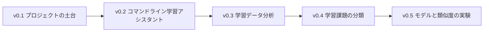
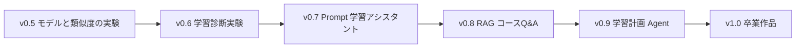

# AI 学習アシスタント バージョンロードマップ


AI 学習アシスタントは、このコースで最もおすすめの貫通プロジェクトです。大事なのは、最初から何でもできる大規模な製品を作ることではありません。各段階で学んだ力を、毎回ひとつの小さなバージョンリリースに変えていくことです。まず動く、次にデータを保存できる、さらに分析できる、そして LLM、RAG、Agent、多モーダルにもつなげていきます。

このページでは、各フェーズで AI 学習アシスタントに何を追加すべきか、何を証拠として残すべきか、そしていつ次の版に進めるかを、ひとつずつ説明します。

## まずはリリースルールを確認しよう


| 各バージョンに必ず必要なもの | 何を証明するか |
|---|---|
| 実行方法 | エディタの中でたまたま動いた、だけではない |
| 入出力サンプル | 機能がどんな見た目か、利用者が理解できる |
| 失敗サンプル | システムの限界がどこか分かっている |
| 次の版の計画 | プロジェクトは継続的に改善されるもので、一回きりの練習ではない |

## 全体のバージョンの流れ





バージョン番号の形式は、必ずこの通りである必要はありません。実際の進み方が違うなら、バージョンをまとめたり分けたりしても構いません。ただし、「実行方法・入出力サンプル・失敗サンプル・評価方法」の4種類の証拠は飛ばさないでください。

## v0.1 プロジェクトの土台：まずはプロジェクトを安定して存在させる

v0.1 の目標は、AI を実装することではありません。今後も継続して改善できるリポジトリの土台を作ることです。作品集がうまくいかない原因は、モデルの性能不足よりも、最初からディレクトリ構成、README、依存関係、実行コマンドが整っていないことにある場合が多いです。

| 項目 | 最小版 | 標準版 | 検収の証拠 |
|---|---|---|---|
| リポジトリ | プロジェクトディレクトリと Git リポジトリを作成する | `src/`、`data/`、`reports/`、`evals/`、`logs/` を追加する | commit 履歴、ディレクトリのスクリーンショット |
| README | プロジェクトの目的と実行コマンドを書く | バージョン記録、入出力、制限も追加する | README を手順通りに再現できる |
| 環境 | Python のエントリーファイルを1つ実行できる | 依存ファイルと環境説明を追加する | `python main.py` の出力スクリーンショット |
| 記録 | 学習ログを1回保存する | ログの項目を標準化する | 例の JSON または Markdown |

次の版へ進む前に、新しいターミナルで README どおりにプロジェクトを動かせる必要があります。今使っているエディタの中だけで動く、という状態では不十分です。

## v0.2 コマンドライン学習アシスタント：タスクを記録できるようにする

v0.2 は Python プログラミング基礎に対応します。目標は、コマンドラインで使える学習アシスタントを作ることです。学習タスクの追加、タスク一覧の確認、完了マークの付与ができ、データは JSON ファイルに保存します。

| 機能 | 最小版 | 標準版 | よくある失敗 |
|---|---|---|---|
| タスク追加 | タイトルを入力して保存する | テーマ、締切、優先度に対応する | JSON 書き込み失敗、パスの間違い |
| タスク確認 | すべてのタスクを表示する | 状態やテーマで絞り込める | 空データの扱いがよくない |
| 完了マーク | `done` フィールドを変更する | 完了時刻とメモを記録する | ID が不安定、または範囲外 |
| 例外処理 | ファイルがない場合は空リストを返す | ファイル破損時にやさしいメッセージを出す | エラーが traceback しか出ない |

この版で中心になるのは、Python のファイル読み書き、リストと辞書、関数、例外処理、そしてコマンドライン入出力です。

## v0.3 学習データ分析：学習パターンを見つけられるようにする

v0.3 はデータ分析と可視化に対応します。目標は、学習タスクや学習ログを分析できるデータに変えることです。たとえば、学習時間、完了率、よく出るテーマ、先延ばしされたタスク、週ごとの傾向などを見られるようにします。

| 分析したい問題 | 最小出力 | 作品集向けの出力 |
|---|---|---|
| どのテーマに時間を使ったか | テーマごとの合計分数を集計する | グラフ + 結論 + 限界 |
| どのタスクが遅れやすいか | 期限超過タスクを一覧にする | 遅延理由の分類と改善提案 |
| 学習は安定しているか | 日ごと、または週ごとの学習時間を出す | 傾向グラフと異常日の説明 |
| データは信頼できるか | 欠損値と重複値を確認する | データ辞書、クリーニングログ、前後比較 |

この版では、ただ見た目のきれいなグラフを作るだけではだめです。グラフごとに「どんな学習の問いに答えるのか」をはっきりさせ、さらにデータの限界も説明しましょう。

## v0.4 学習課題の分類：つまずきポイントを見つけやすくする

v0.4 は数学と機械学習の入門応用に対応します。目標は、学習中の問題を、環境、Python、データ、モデル、Prompt、RAG、Agent、デプロイなどのカテゴリに分けることです。最小版はルールベースでもよく、標準版では簡単な分類モデルを学習しても構いません。

| 方式 | 適した段階 | 評価方法 | 作品の証拠 |
|---|---|---|---|
| キーワードルール | 分類を始めたばかりのとき | 20 件のサンプルを目視確認する | ルール表、誤分類サンプル |
| ML baseline | 機械学習を学び終えた後 | train/test の指標を見る | 指標表、混同行列 |
| LLM 分類 | Prompt を学んだ後 | 固定入力で出力を比較する | Prompt バージョン、schema 検証 |
| RAG による補助 | RAG を学んだ後 | 関連する講義ページを引用できるか | 検索ログ、引用確認 |

この版は、前半のトラブルシュート索引と後半の RAG、Agent をつなぐ役割があります。ユーザーがつまずきを入力すると、まずそれがどのカテゴリかを判定し、そのあとで見直すべき章を提案します。

## v0.5 モデルと類似度の実験：表現と検索の前提を理解する

v0.5 は、機械学習、ベクトル、Embedding の前提理解に対応します。目標は、学習アシスタントが学習課題、講義章、ノート同士の類似度を比較できるようにし、その後の RAG の準備をすることです。

| 実験 | 最小版 | 標準版 |
|---|---|---|
| テキスト類似度 | 単純な単語袋やキーワードの重なりを使う | TF-IDF、Embedding、または異なる類似度を比較する |
| 章の推薦 | 問題に合う章ラベルを対応付ける | 推薦理由と信頼度も出す |
| 誤り分析 | マッチを外したサンプルを記録する | キーワード、表現方法、ラベル境界のどれが原因かを分析する |
| 指標の説明 | 人手で命中したかを判断する | top-k 命中率や簡単な正解率を集計する |

この版で大事なのは、アルゴリズムの高度さではありません。「表現のしかたが検索結果に影響する」という点を理解することです。後で RAG を作るとき、多くの問題はこの層までさかのぼって説明できます。

## v0.6 学習診断実験：モデルが失敗する理由を理解する

v0.6 は深層学習と Transformer の基礎に対応します。AI 学習アシスタント自体は、大きなモデルを学習させる必要はないかもしれません。しかし、小さな実験を通して、学習ループ、loss、検証データ、過学習、失敗サンプルを理解しておく必要があります。

| 学習の証拠 | 最小要件 | 作品集の要件 |
|---|---|---|
| データ | 小さなテキストまたは画像データ | ラベルの説明とデータ分割 |
| 学習 | 学習ループを1回動かし切る | 設定、乱数シード、ログを保存する |
| 評価 | 検証指標を出力する | 混同行列、誤りサンプル、曲線 |
| 振り返り | 1 回の失敗を説明する | 想定原因と次の実験を説明する |

この版の価値は、今後 LLM、微調整、または多モーダルモデルに向き合うとき、最終結果だけを見るのではなく、データ、指標、失敗の原因に目を向けられるようになることです。

## v0.7 Prompt 学習アシスタント：計画と振り返りを生成できるようにする

v0.7 は大規模言語モデルの原理、Prompt、構造化出力に対応します。学習アシスタントは LLM API を使い始め、ユーザーの学習計画作成、振り返りカード作成、質問の言い換え、段階的な要約を支援します。

| 機能 | 最小版 | 標準版 | 評価材料 |
|---|---|---|---|
| 学習計画 | 目標を入力すると、3～5 個のタスクを出す | 時間、基礎レベル、目標に合わせて計画を調整する | 固定入力での出力比較 |
| 振り返りカード | 学習記録をまとめて要約する | 構造化された JSON または Markdown を出す | schema 検証結果 |
| 質問の言い換え | あいまいな質問を分かりやすくする | 複数の検索 query を生成する | Prompt バージョン表 |
| 失敗処理 | 出力が不適切なら人手で再試行する | 自動検証と再試行を行う | 失敗サンプルの記録 |

この版で最も大切なのは安定性です。見栄えのいい回答を1回保存するだけでは不十分で、同じ入力に対して Prompt のバージョンごとに出力がどう変わるかも保存しましょう。

## v0.8 RAG コースQ&A：資料に基づいて答えられるようにする

v0.8 は貫通プロジェクトの重要なバージョンです。目標は、学習アシスタントが講義の Markdown、個人ノート、またはプロジェクトの README を読み込み、資料に基づいて質問に答え、さらに出典を示すことです。

| モジュール | 最小版 | 標準版 | 作品集の証拠 |
|---|---|---|---|
| 文書取り込み | Markdown テキストを読む | タイトル、段階、パスなどの metadata を保存する | 文書一覧、chunk のサンプル |
| 検索 | 単純なベクトル検索 | Hybrid Search、Rerank、Query Rewrite | retrieval logs |
| 回答 | 検索した断片に基づいて答える | 答えがないときは拒否するか、資料追加を促す | Q&A サンプル、引用確認 |
| 評価 | 10 個の固定質問 | gold_doc、gold_answer、citation_ok | eval questions、失敗集計 |

この版では、RAG がなぜ失敗したかを重点的に記録してください。文書を取り込めていないのか、chunk の分割が悪いのか、query が不明確なのか、検索が当たっていないのか、それともモデルが引用を忠実に使っていないのか、を切り分けます。

## v0.9 学習計画 Agent：複数ステップのタスクを実行できるようにする

v0.9 は Agent フェーズに対応します。学習アシスタントは「質問に答える」だけでなく、「目標に向かってタスクを実行する」段階に進みます。たとえば、ユーザーが「RAG の復習を手伝って」と入力したら、資料を探す、要点をまとめる、練習問題を作る、復習計画を組む、という複数のステップに分解できます。

| Agent の能力 | 最小版 | 標準版 | リスク管理 |
|---|---|---|---|
| タスク分解 | 手順の一覧を作る | 中間結果に応じて手順を調整する | 最大ステップ数を制限する |
| ツール呼び出し | 講義検索ツールを呼ぶ | todo、要約、評価ツールも呼ぶ | ツールのホワイトリスト |
| 実行軌跡 | 各 step の action と observation を表示する | `agent_traces.jsonl` に保存する | trace を再生できる |
| 人手確認 | リスクの高い step で止まる | 読み取り、書き込み、送信、削除を分ける | デフォルトは dry-run |

この版では、「モデルが完全に自律する」ことを目指しすぎないでください。作品集としては、ツール権限を制限し、実行軌跡を記録し、停止条件を設定し、固定タスクセットで完了率とツールエラー率を評価した、という見せ方のほうがよいです。

## v1.0 卒業作品：学習アシスタントを展示できる製品にまとめる

v1.0 は、機能数が最も多いことが必須ではありません。大事なのは、完全に動き、説明でき、評価できることです。RAG コースQ&Aアシスタント、学習計画 Agent、多モーダル講義資料アシスタント、またはそれらの組み合わせでも構いません。

| 卒業要件 | 最低基準 | 優秀基準 |
|---|---|---|
| 問題設定 | 誰のどんな学習問題を解くか説明できる | ユーザーシーン、境界、使わないケースまである |
| 実行方法 | ローカルで動く | デプロイ、環境変数、起動方法がある |
| サンプル | 成功例が3つある | 成功、失敗、境界のサンプルがそろっている |
| 評価 | 固定の質問またはタスク集がある | 完了率、引用正確率、コスト、失敗タイプを集計する |
| 工学化 | README、ログ、設定がある | 監視、レート制限、安全境界、回帰テストがある |
| 発表 | スクリーンショットまたは録画がある | デモ用スクリプト、作品集説明、振り返り記事がある |

最終発表では、ただ「AI アシスタントを作りました」と言うだけでは足りません。よりよい言い方は、「このプロジェクトは v0.1 のコマンドラインツールから始まり、v1.0 まで段階的に改善した。各バージョンで実行記録、失敗サンプル、評価証拠を残した」という伝え方です。

## 各バージョンで共通の記録テンプレート

各バージョンを完成させるたびに、プロジェクトの README か `reports/improvement_record.md` に、次のようなバージョン記録を追加するのがおすすめです。

```md
## v0.x バージョン名

### この版の目標
この版で何を解決したいか。

### 新しく追加した能力
この版で増えた機能やモジュール。

### 実行方法
どのコマンドで動かすか、どんなデータや設定が必要か。

### 入出力サンプル
実際の入力と、それに対応する出力を1つ示す。

### 評価方法
どんなサンプル、指標、または人手確認で効果を判断するか。

### 失敗サンプル
少なくとも1つの失敗入力、実際の結果、原因、修正計画を記録する。

### 次の版の計画
次の版でどんな能力を補うか。
```

このテンプレートを続けていけば、卒業時に作品集用の資料を作り直す必要はありません。プロジェクトの成長過程そのものが、すでに記録されているからです。
