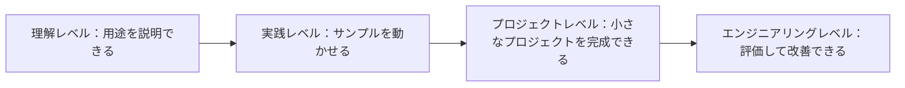

# コース全体の能力評価と通過基準

このページでは、ひとつの核心的な問いに答えます。どこまで学べば、本当に理解できたと言えるのでしょうか。AI フルスタックの学習では、単に「章を読み終えたか」だけで進捗を判断するのではなく、概念を説明できるか、コードを動かせるか、プロジェクトを完成できるか、結果を評価できるか、失敗を振り返れるか、そしてそれらの証拠を見せられる成果として整理できるかを見ることが大切です。

## 一目で分かる：理解度はどう上がるか

最初の学習では、毎章をエンジニアリングレベルまで到達させる必要はありません。ただし、各主要ステージごとに少なくとも 1 つのプロジェクトをプロジェクトレベルまで仕上げる必要があります。RAG、Agent、卒業プロジェクトでは、できるだけエンジニアリングレベルに近づけるようにしましょう。

## 4 段階の能力基準

| レベル | 状態 | できること | 代表的な証拠 |
|---|---|---|---|
| 理解レベル | 概念が分かる | その技術が何を解決するのか説明できる | 学習ノート、概念図、重要用語の説明 |
| 実践レベル | 最小限の流れを動かせる | サンプルを自力で実行し、主要パラメータを変更できる | 実行可能なスクリプト、コマンド記録、スクリーンショット |
| プロジェクトレベル | 完成した小さなプロジェクトを作れる | 入力、処理の流れ、出力、例外処理、README がある | プロジェクトリポジトリ、入力と出力の例、結果説明 |
| エンジニアリングレベル | 評価して改善できる | baseline、指標、ログ、失敗サンプル、改善記録がある | 評価表、ログ、失敗サンプル、振り返りレポート |

学習の初期段階では、毎章をエンジニアリングレベルまで到達させる必要はありません。ただし、各主要ステージごとに少なくとも 1 つのプロジェクトをプロジェクトレベルまで仕上げる必要があります。RAG、Agent、卒業プロジェクトに進んだ後は、評価、ログ、失敗サンプルを標準の要件として扱いましょう。

## 段階ごとの通過マトリクス

| ステージ | 最低通過基準 | 推奨通過基準 | 次のステージに進む前に確認すること |
|---|---|---|---|
| 1 開発者ツールの基礎 | コマンドライン、Git、開発環境を使ってプロジェクトを実行できる | リポジトリを作成し、コードをコミットし、実行手順を分かりやすく書ける | パスやコマンドをコピー＆ペーストに頼らなくなる |
| 2 Python プログラミング基礎 | 関数を書ける、ファイルを読み書きできる、例外処理ができる | スクリプトをモジュールに分け、小さな API または CLI を作れる | よくある Python エラーを自力で切り分けられる |
| 3 データ分析と可視化 | データを読み込み、クリーニングし、集計し、グラフ化できる | 結論のあるデータ分析レポートを書ける | データ品質が結論にどう影響するか説明できる |
| 4 AI 数学の基礎 | ベクトル、確率、勾配の直感を説明できる | 小さな実験で、数学の概念がモデルにどう影響するか示せる | 公式をただのブラックボックスとして暗記しない |
| 5 機械学習 | baseline を学習し、指標を理解できる | 特徴量処理、モデル比較、エラー分析ができる | 学習結果、汎化性能、データの問題を区別できる |
| 6 深層学習と Transformer | 学習ループを動かし、曲線を確認できる | 過学習、未学習、転移学習の結果を分析できる | Transformer がなぜ系列モデリングに向いているか理解できる |
| 7 大規模言語モデルと Prompt | 再利用できる Prompt を設計し、出力を比較できる | 構造化出力、バージョン管理、回帰サンプルを扱える | Prompt の良し悪しを感覚だけで判断しない |
| 8 LLM アプリケーションと RAG | 出典引用付きの Q&A プロトタイプを完成できる | チャンク分割、検索ログ、評価セット、失敗サンプルがある | 失敗の原因が検索、生成、引用のどれか判断できる |
| 9 AI Agent | ツールを定義し、複数ステップのタスクを完了できる | trace、ツールログ、権限の境界、安全テストがある | Agent をいつ止めて確認すべきか説明できる |
| 10 画像認識 | 画像分類、検出、または OCR の実験を完了できる | データ注釈、指標、エラーサンプル、可視化結果がある | 失敗の原因がデータ、注釈、モデルのどれか説明できる |
| 11 自然言語処理 | テキスト分類、抽出、要約のタスクを完了できる | 従来の NLP、深層学習、LLM の方案を比較できる | テキスト表現、ラベルの境界、評価方法を説明できる |
| 12 AIGC とマルチモーダル | 画像、音声、動画、またはマルチモーダル理解の実験を 1 つ完了できる | 入力素材、生成/理解の流れ、品質基準、人手確認がある | 生成結果を主観だけで判断しない |
| 卒業プロジェクト | 完全な AI アプリを実行できる | デプロイ手順、評価レポート、失敗の振り返り、デモ用スクリプトがある | 3 分以内でアーキテクチャ、指標、制限、次の一手を説明できる |

## 各ステージの振り返り質問

ひとつのステージが終わるたびに、「読み終えたか」だけを聞くのではなく、次のことを確認しましょう。自分の言葉で、このステージが何を解決するのか説明できるか。自分の手で最小プロジェクトを動かしたか。README、実行コマンド、サンプル出力を残したか。少なくとも 1 つの失敗サンプルを記録したか。来週もう一度そのプロジェクトを動かしたとき、結果を再現できるか。

これらの質問のうち 2 つ以上に答えられない場合は、次のステージへ進む前に、まずプロジェクトの証拠を補いましょう。コースの進み方は速さが重要なのではなく、各ステップで検証可能な成果を残せることが大切です。

## AI アプリケーション段階の追加確認

Prompt、RAG、Agent からは、プロジェクトを「それっぽく答えられるか」だけで見てはいけません。AI アプリケーションのプロジェクトでは、モデル呼び出しにエラー処理があるか、Prompt にバージョンがあるか、RAG で出典と検索ログを表示できるか、Agent にツールの境界と実行の軌跡があるか、システムがコスト、遅延、失敗理由を記録できるかも確認する必要があります。

| プロジェクトの種類 | 必ず残すべき証拠 | 不合格のサイン |
|---|---|---|
| Prompt プロジェクト | Prompt のバージョン、固定入力、出力比較、失敗サンプル | 1 回の成功出力だけを見せる |
| RAG プロジェクト | chunks、retrieval logs、eval questions、citation check | 回答に引用はあるが、その引用が結論を支えていない |
| Agent プロジェクト | tool schema、agent trace、max_steps、安全境界 | Agent が何をしたのか分からず、失敗を再現できない |
| デプロイプロジェクト | 環境変数の説明、起動コマンド、ログ、エラー処理 | 自分の PC でしか動かない |

## 最終判断基準

あるプロジェクトについて、問題定義から実行方法まで、技術方針から評価結果まで、成功サンプルから失敗サンプルまで、そして現在の制限から次の改善までを 1 つの流れで説明できるようになったら、それはすでにポートフォリオ級に近づいています。本当の AI フルスタック能力とは、どれだけ多くのツール名を知っているかではなく、問題、データ、モデル、エンジニアリング、評価、振り返りをひとつの安定した閉ループとしてつなげられることです。
