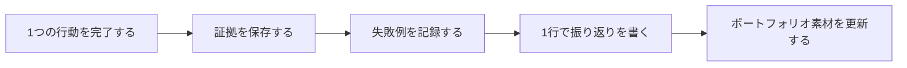

# スキルバッジとアチーブメントシステム

バッジは飾りではありません。学習をスタンプラリーのようにするためのものでもありません。  
それぞれのバッジは、検証できる行動に対応しています。たとえば、実行できる、説明できる、再現できる、評価できる、振り返れる、というような動きです。  
こうすることで、学習者は気軽な達成感を得られる一方で、本当に学ぶべき内容から外れにくくなります。

バッジは、自分のプロジェクトの README か `reports/badges.md` に記録するのがおすすめです。  
バッジを1つ取るたびに、証拠となるリンクやスクリーンショットの説明も添えましょう。

## 図で理解する：バッジは証拠の連鎖



| バッジが証明すべきこと | よくある証拠 |
|---|---|
| 実行できる | コマンド履歴、スクリーンショット、サンプル出力 |
| 説明できる | README、振り返りの段落、図表の結論 |
| 再現できる | 依存関係の説明、実行手順、サンプルデータ |
| 評価できる | 指標表、失敗例、比較実験 |
| 改善できる | バージョン記録、修正説明、次の計画 |

## バッジ一覧

| フェーズ | バッジ | 解放条件 | 証拠 |
|---|---|---|---|
| 1 開発者ツール | ターミナル生存者 | ターミナルでディレクトリ操作、実行、コミットまで一通り完了する | コマンド記録、commit |
| 1 開発者ツール | Git アーカイブ職人 | 1回、わかりやすい commit を行い、変更を見返せる | Git log、diff のスクリーンショット |
| 2 Python | JSON 飼いならし者 | JSON を読み書きし、壊れたファイルを処理する | 正常入力と異常入力のサンプル |
| 2 Python | 例外キャッチャー | エラー入力が来てもプログラムが落ちないようにする | エラー処理の記録 |
| 3 データ分析 | 汚れたデータ探偵 | 欠損、重複、異常値を見つける | データ品質チェック表 |
| 3 データ分析 | グラフ語り手 | すべてのグラフに結論と限界を書く | グラフと説明文 |
| 4 AI 数学 | ベクトル翻訳者 | 類似度や距離をコードで説明する | 小さな実験と説明 |
| 5 機械学習 | Baseline ガーディアン | まず baseline を作ってからモデルに進む | baseline 指標 |
| 6 深層学習 | Loss 観察者 | 学習曲線を保存し、説明する | loss カーブ、振り返り |
| 7 Prompt | Prompt チューナー | 2つの Prompt 版を比較する | 版管理表、出力比較 |
| 7 Prompt | Schema ガーディアン | 構造化出力を検証する | schema 通過率 |
| 8 RAG | 引用警察 | 答えがソースに裏づけられているか確認する | citation_check.csv |
| 8 RAG | 検索考古学者 | ログから検索失敗の原因を見つけられる | retrieval_logs.jsonl |
| 9 Agent | Trace 記録員 | 再生可能な実行トレースを保存する | agent_traces.jsonl |
| 9 Agent | Agent 安全管理者 | 高リスクツールに人手確認を追加する | 権限表、権限逸脱テスト |
| 卒業プロジェクト | デモ演出家 | デモ用スクリプトを準備する | demo_notes.md |
| 卒業プロジェクト | 振り返り執筆者 | 失敗の原因分析と次の計画を書く | improvement_record.md |

初回学習では、各フェーズで1つバッジを取れれば十分です。  
ポートフォリオ段階になったら、重要なバッジをあとから埋めていきましょう。

## 初心者向けおすすめ10バッジ

始めたばかりなら、すべてのバッジに圧倒されなくて大丈夫です。  
まずは次の10個を取ることから始めましょう。これで主線を1周するのに必要な土台がだいたい揃います。

| 順番 | バッジ | 先に取る理由 |
|---|---|---|
| 1 | ターミナル生存者 | 「どこでコマンドを実行すればいいのかわからない」という不安をなくす |
| 2 | Git アーカイブ職人 | 進歩のたびにバージョン記録を残せるようにする |
| 3 | JSON 飼いならし者 | データを保存する小さなプログラムを初めて作れるようにする |
| 4 | 例外キャッチャー | エラー入力は失敗ではなく、テスト例だと学べる |
| 5 | 汚れたデータ探偵 | データを信頼する意識を身につける |
| 6 | グラフ語り手 | グラフで1つの結論を伝える練習になる |
| 7 | Baseline ガーディアン | モデル開発が見た目だけの点数勝負にならないようにする |
| 8 | Prompt チューナー | Prompt もバージョン管理とテストが必要だとわかる |
| 9 | 引用警察 | RAG の信頼性を意識できるようになる |
| 10 | Trace 記録員 | Agent は必ず振り返れる形にする必要があると学べる |

この10個のバッジで、環境、コード、データ、モデル、LLM、RAG、Agent の最小限の能力の流れをカバーできます。

## 各フェーズのミニアチーブメントカード

ミニアチーブメントカードは、章やフェーズの終わりに置くと、初心者に前向きなフィードバックを返しやすくなります。  
大きな成果である必要はありませんが、「自分は今ちょうど何を終えたのか」がわかることが大切です。

| フェーズ | ミニアチーブメントカード |
|---|---|
| 1 開発者ツール | 今日、空っぽのフォルダを追跡可能なプロジェクトに変えました |
| 2 Python | 今日、プログラムが初めてデータを覚えました |
| 3 データ分析 | 今日、たくさんの表の中から最初の信頼できる結論を見つけました |
| 4 AI 数学 | 今日、1つの式を実行できるコードに変えました |
| 5 機械学習 | 今日、モデルが初めて baseline に挑戦しました |
| 6 深層学習 | 今日、loss がどう変化するか見えました |
| 7 Prompt | 今日、LLM に指定した形式で出力させました |
| 8 RAG | 今日、答えが初めて証拠つきで出てきました |
| 9 Agent | 今日、AI にただ答えさせるのではなく、手順に沿って行動させました |
| 10～12 | 今日、AI に文字以外の世界も扱わせました |
| 卒業プロジェクト | 今日、学習の過程を見せられる作品に変えました |

このカードがあると、初心者が「ずっと勉強したのに、何もできていない気がする」という感覚を減らせます。

## バッジの証拠をどう保存するか

バッジには必ず証拠を付けましょう。そうしないと、ただの形だけのチェックインになりやすいです。  
保存先は、プロジェクト内で統一するのがおすすめです。

```text
reports/
├── badges.md
├── failure_cases.md
├── improvement_record.md
└── demo_notes.md

evals/
├── prompt_eval_cases.csv
├── eval_questions.csv
└── citation_check.csv

logs/
├── retrieval_logs.jsonl
├── agent_traces.jsonl
└── tool_calls.jsonl
```

`badges.md` はとてもシンプルで大丈夫です。  
バッジ名、達成日、対応ファイル、学んだこと、次にどう改善するか、を書けば十分です。

## バッジ記録テンプレート

```md
## バッジ：RAG 引用警察

### 解放日
2026-04-27

### やったこと
10個の RAG Q&A サンプルに対して citation_ok をチェックし、3個の「引用が答えを支えていない」失敗例を見つけました。

### 証拠ファイル
- evals/eval_questions.csv
- evals/citation_check.csv
- logs/retrieval_logs.jsonl

### 学んだこと
答えがもっともらしく見えることと、資料に裏づけられていることは別です。RAG プロジェクトでは、引用チェックを評価の一部にする必要があります。

### 次の一歩
chunk と query rewrite を調整して、もう一度 citation_ok を確認します。
```

このテンプレートを使うと、バッジとポートフォリオの証拠をつなげられます。  
あとで履歴書を書いたり、面接でプロジェクトを説明したりするときも、証拠がすでに保存されているので、あわてて思い出す必要がありません。

## バッジのアップグレードルール

それぞれのバッジは、ベーシック版からポートフォリオ版へアップグレードできます。  
ベーシック版は「やったことがある」証明、ポートフォリオ版は「説明できる、再現できる、評価できる」証明です。

| レベル | 基準 | 例 |
|---|---|---|
| ベーシックバッジ | 1回、動作を完了する | 1つの Prompt を動かして JSON を得る |
| 標準バッジ | 記録と失敗例がある | 10個の入出力と2個の失敗例を保存する |
| ポートフォリオバッジ | 評価と改善がある | 2つの Prompt 版を比較し、改善結果を説明する |

時間が限られているなら、まずはベーシックバッジを取りましょう。  
ポートフォリオを作る段階になったら、重要なバッジから順番にアップグレードしていけば大丈夫です。

## チームやクラスでの使い方

このコースを授業やコミュニティで使うなら、学習者に「何章読んだか」だけでなく、毎週1つのバッジを見せてもらう形にできます。  
発表では、次の3つだけ答えます。何の能力を解放したか、証拠はどこにあるか、どんな失敗が1つあったか。

こうすると、成功だけでなく、実際のミスや修正の過程も共有できるので、学習の雰囲気がやわらかくなります。  
初心者は、つまずくのは普通だとわかり、大切なのは振り返れることだと学べます。
