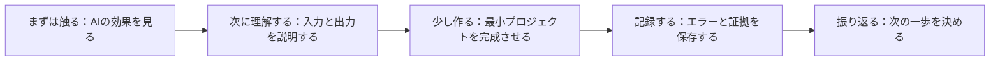
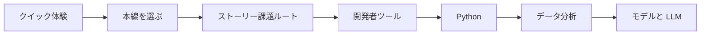

# 初心者向けやさしい学習ガイド

AIフルスタックを学び始めたばかりで、目次が長い、用語が多い、プロジェクトが多いと感じるのは普通です。全部を一気に理解する必要はありませんし、最初から完成した AI プロダクトを作る必要もありません。最初の1回でいちばん大事なのは、自信をつけることです。小さなものを動かせること、少しでも出力を読めること、失敗を1回記録できること、次にどこへ進むか分かることです。

このページの目的は、学習の負担を下げて、初心者がもっと楽に学べるようにすることです。ただし、学習の質は下げません。

## 図でわかる：初心者の最初の1回はどう学ぶ？



| まず何をつかむか | 最初に悩まなくてよいこと |
|---|---|
| 1つの結果を出す | すべての原理を一度で理解する |
| 入力と出力を理解する | すべての用語を暗記する |
| 1回の失敗を保存する | 最初から完璧なプロジェクトにする |
| 毎週1つの小さな完了までやる | すべての新しい AI ツールを同時に追う |

## 第一の原則：まず触る、次に理解する、最後に深く作る

多くの人は最初から概念を全部理解しようとして、1週目で止まってしまいます。より良い順番は、まず少し触って効果を見ること、次にだいたいどう動くかを理解すること、最後にプロジェクトの中で深く作ることです。

| 段階 | 目指すもの | 目指さなくてよいもの |
|---|---|---|
| 初めて触るとき | 結果を出して、直感をつかむ | すべてのコードを完全に理解する |
| 最初の本線 | 各段階で最小プロジェクトを終える | すべての分岐や上級内容を学び切る |
| 2回目の補強 | つまずいた点と弱い章を見直す | 最初から全部学び直す |
| ポートフォリオ段階 | プロジェクトを動かせる、説明できる、評価できるようにする | 機能が多ければ多いほどよいと考える |

ある概念が3回読んでも分からないなら、いったんメモして、そのまま最小プロジェクトを進めましょう。多くの概念は、プロジェクトの中で2〜3回出会って初めて本当に理解できます。

## 初心者にいちばん楽な7日間スタート法

最初の1週間は予定を詰めすぎないでください。目標は、自分のペースを作ることであって、自分が強いと証明することではありません。

| 日数 | タスク | 完了基準 |
|---|---|---|
| 1日目 | 30分のクイック体験を見る | AIのサンプルを動かす、または出力を理解する |
| 2日目 | 能力マップと4つの本線を読む | 1つのルートを選び、迷わない |
| 3日目 | ターミナルとPythonを整える | `python --version` を実行できる |
| 4日目 | 学習プロジェクト用のフォルダを作る | README があり、Git のコミットが1回ある |
| 5日目 | 最小の Python スクリプトを書く | 1つの学習タスクを入力または出力できる |
| 6日目 | わざと小さなエラーを起こす | エラーと修正をメモに残す |
| 7日目 | 1回の週次振り返りをする | 今週学んだこと、つまずいた場所を書く |

この1週間が終わるころには、環境、プロジェクト、コード、エラー記録、振り返りがそろっています。もう「学習の準備をしているだけ」ではありません。

## 難しいところに出会ったときのストレス軽減法

AI学習には、数学が分からない、コードがエラーになる、モデル用語が多い、プロジェクトが大きすぎる、結果が安定しない、といったよくあるストレス源があります。どれにも対応する軽減方法があります。

| ストレス源 | 起こりやすい考え方 | より良い対処法 |
|---|---|---|
| 数学が分からない | 自分は AI に向いていないのでは | まず直感と用途を理解し、コードで1つ例を動かす |
| エラーが多い | 自分はコードが下手だ | エラーを Debug の調査課題だと思って、手がかりを記録する |
| 用語が多い | 先に用語を全部覚えないと | 今のプロジェクトで使う5個の単語だけ覚える |
| プロジェクトが大きすぎる | 完成品なんて作れない | まずは基本版を作り、入力から出力までの1つの流れだけ完成させる |
| LLM が安定しない | 大規模モデルは難しすぎる | テスト用のサンプルを固定して、Prompt のバージョンを比べる |
| RAG の答えが正確でない | システム設計に失敗した | まず生成を止めて、検索結果だけを見る |
| Agent が勝手に動く | Agent は制御できないほど難しい | ツール、手順数、権限を制限し、まず trace を保存する |

楽に学ぶというのは、難しさを避けることではありません。難しさを小さく分けて、毎回は1つの具体的な問題だけを解くことです。

## 毎日やるのは小さな3つだけ

毎日あまり時間が取れないなら、「3つの小さなこと」で進められます。1つの入力、1つの出力、1つの記録です。

| 小さなこと | 例 | なぜ効果があるか |
|---|---|---|
| 1つの入力 | 1つのコマンド、1つの CSV、1つの Prompt、1つの質問 | タスクが抽象的になりすぎるのを防ぐ |
| 1つの出力 | 1行の結果、1枚の図、1つの JSON、1つの回答 | 進み具合が見える |
| 1つの記録 | 1文の説明、1つの失敗例、README の更新 | 学習を振り返れるようにする |

今日は入力、出力、記録がそろっていれば、それだけで有効な学習です。「何ページ見たか」だけを唯一の基準にしないでください。

## 初心者が最初にやらなくていいこと

見た目は高度でも、早すぎると挫折しやすくなることがあります。

| いまはやらない | 理由 | いつやるか |
|---|---|---|
| 最初から複雑なフレームワークを追う | 設定と抽象化に埋もれやすい | 最小プロジェクトを動かしてから |
| 最初からフロントエンドとバックエンドを全部作る | 工数が大きすぎて、AIの本線から外れやすい | 安定した API と機能ができてから |
| 最初から大きなモデルを学習する | コストが高く、フィードバックが遅く、原因を特定しにくい | DL と微調整の基礎を理解してから |
| 最初から CV、NLP、多モーダルを同時に学ぶ | 分岐が多すぎて、本線がぼやける | 卒業プロジェクトの方向を決めるとき |
| 最初から最新ツール名を追う | ツールは変わりやすく、土台の力のほうが大事 | 問題の層を理解してからツールを選ぶ |

最初の1回でいちばん大事なのは、本線の閉ループです。新しいツールは、まず保存しておけば十分です。すぐ追いかける必要はありません。

## 「学習アーカイブ」で不安を減らす

多くの初心者が不安になるのは、たくさん学んでいるのに積み上がりが見えないからです。解決策は、自分専用の学習アーカイブを作ることです。

```text
learning-archive/
├── weekly-notes.md
├── commands.md
├── failure_cases.md
├── badges.md
└── project-links.md
```

毎週10分だけ書きましょう。今週何を動かせたか、どんなエラーが出たか、何を直したか、次の週は何を1つだけやるか。長い目で見ると、これがあなたの学習の証拠になり、ポートフォリオの素材にもなります。

## 1章が分からないときはどうする？

1章を読み終えてもよく分からないとき、すぐに3回読み直さないでください。まずは次の最小ループをやってみましょう。

| 手順 | 質問 |
|---|---|
| 1 | この章は何の問題を解決しているか？ |
| 2 | 入力は何か？ |
| 3 | 出力は何か？ |
| 4 | 最小の例を動かせるか？ |
| 5 | 今のプロジェクトとどう関係しているか？ |
| 6 | 失敗したら、いちばん起こりそうな原因はどこか？ |

この6つに答えられれば、いったん次の節へ進んで大丈夫です。細かい部分は、プロジェクトでつまずいたときに戻って補えばよいです。

## 初心者にいちばんおすすめの学習順

明確な目標がないなら、次の順番で進むのがおすすめです。クイック体験、4つの本線の学習ルート、AI 学習アシスタントのストーリー課題ルート、開発者ツールの基礎、Pythonプログラミング基礎、データ分析と可視化、そしてモデルと LLM です。



RAG や Agent を学んでいて混乱したら、ストーリーラインに戻って理解しましょう。Prompt はアシスタントにうまく伝えさせるためのもの、RAG はアシスタントに資料を調べさせるためのもの、Agent はアシスタントに段階的に作業させるためのものです。

## 初心者向けの振り返り用 Prompt

以下の Prompt を使うと、AI に学習の振り返りを手伝ってもらえます。ただし、AI にプロジェクトを代わりにやらせないでください。あなたは本当の記録を渡し、AI は整理と次の一歩の提案を手伝うだけです。

```text
私は AI フルスタックコースを学習中で、現在は第 X 段階です。
これは今日実行したコマンド、出力、そして出会ったエラーです：
【内容を貼り付け】

次の3つを手伝ってください：
1. 初心者にも分かる言葉で、今日実際に何を学んだのか説明する。
2. このエラーが、環境、Python、データ、モデル、Prompt、RAG、Agent、デプロイのどれに当たるか判断する。
3. 明日30分以内で終えられる最小の次の一歩を教える。

補足資料はたくさんいりません。実行できる最小限の提案だけください。
```

この Prompt のポイントは「最小の次の一歩」です。初心者にいちばん必要なのは、もっと資料を集めることではなく、次に何をやるかです。

## やさしい学習は、基準を下げることではない

このコースが作品に求める基準は、今でもはっきりしています。プロジェクトは動くこと、サンプル入力と出力があること、失敗例があること、評価できること、振り返れることです。初心者向けというのは、これらの要求を小さく分けて、毎回少しずつ完成させられるようにすることです。最後にまとめて大きなプレッシャーを受けるのではありません。

毎日たくさん学ぶ必要はありません。小さな結果をその都度保存し続ければ、数か月後には、あなたは「チュートリアルを見るだけの人」から「プロジェクトを作れる、調べられる、直せる、説明できる学習者」になっているはずです。
