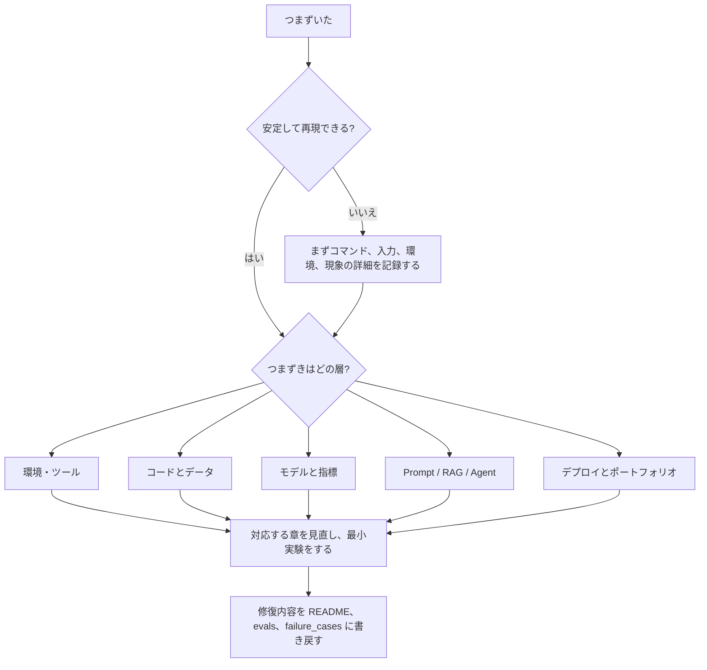

# 学習のつまずき診断マップ


AIフルスタックを学ぶとき、つまずくことは「向いていない」という意味ではありません。今のプロジェクトが、どの層に能力のギャップがあるかを見せているだけです。いちばん効果的なのは、そのまま後ろの章を無理に読み進めることではなく、まずつまずきがどの層にあるかを見極めて、対応する内容に戻って最小再現実験をすることです。

このページと [よくあるエラーとトラブルシュート索引](/intro/troubleshooting-index) の違いは、トラブルシュート索引が具体的なエラー寄りなのに対して、このページは学習の進め方やプロジェクトへの回帰を重視している点です。「失敗の現象からコース章を逆引きする地図」として使ってください。

## 診断の全体フロー



つまずいたら、まず4つのことを確認します。再現できるか、入力は何か、期待していたことは何か、実際に起きたことは何かです。この4つが説明できないなら、知識を足すより先に記録を補うことを優先してください。

## 一覧表で素早く特定する

| つまずきの現象 | 不足していそうなもの | まず見直す場所 | 最小の修復アクション | ポートフォリオの証拠 |
|---|---|---|---|---|
| コマンドが動かない、環境が混乱している | 開発ツールと実行環境 | 1 開発者ツールの基礎、環境準備 | 新しいターミナルで README に従って再実行する | コマンド記録、環境バージョン、修正メモ |
| Pythonスクリプトでパスをよく間違え、ファイルが読めない | ファイルパス、例外処理、プロジェクト構造 | 2 Pythonプログラミング基礎 | 最小のファイル読み書きスクリプトを書く | 入力ファイル、出力ファイル、例外例 |
| データ分析の結論が信用できない | データ品質とクリーニング手順 | 3 データ分析と可視化 | 欠損、重複、異常値のチェックを出力する | データ辞書、クリーンアップログ、図表の説明 |
| 類似度、loss、確率、指標の意味が分からない | 数学的な直感と指標の解釈 | 4 AI数学の基礎 | 5行のコードで1つの指標を再現する | 小さな実験、手計算の説明、指標の境界 |
| モデルのスコアは高いのに、信じてよいか分からない | データリーク、baseline、評価方法 | 5 機械学習 | train/test 分割と Dummy baseline をやり直す | baseline、指標表、誤ったサンプル |
| 训练が収束しない、shape mismatch が起きる | 深層学習の訓練ループ | 6 深層学習と Transformer | tensor の shape を出力し、小さなデータで過学習テストをする | 訓練ログ、曲線、失敗サンプル |
| LLMの出力形式が安定しない、JSONが壊れる | Prompt、schema、検証と再試行 | 7 大規模言語モデルと Prompt | 10個の入力を固定して出力を比較する | Prompt のバージョン、schema 検証結果 |
| RAG が質問に答えない、引用が裏付けになっていない | 文書処理、検索、RAG評価 | 8 LLMアプリケーションと RAG | モデルを呼ばず、検索結果だけを出力する | chunks、retrieval logs、citation_check |
| Agent がループする、ツールを乱用する | 目的の境界、ツール schema、停止条件 | 9 AI Agent | 3ステップに制限して trace を保存する | agent_traces、tool_calls、安全境界 |
| マルチモーダルの出力は良さそうだが制御できない | 素材、審査、書き出し、品質基準 | 10～12 方向の拡張 | 入力素材と人手審査の記録を保存する | 素材の出典、審査表、失敗サンプル |
| プロジェクトは動くのに、うまく説明できない | README、評価、振り返り不足 | プロジェクト提出基準、ポートフォリオ一覧 | 実行方法、サンプル、失敗サンプルを追加する | README、demo_notes、improvement_record |
| 自分の環境では動くが、他の人の環境では動かない | 依存関係、設定、デプロイ説明 | 工程化、環境準備、デプロイの章 | クリーンなディレクトリで README に従って再実行する | `.env.example`、依存ファイル、デプロイログ |

特定できたら、ただ「関連する章をもう一度読む」だけでは足りません。最小の修復アクションを実行し、その結果をプロジェクト資料に書き戻すほうがずっと効果的です。

## 環境とツールのつまずき

環境の問題は、新人に「自分には向いていない」と思わせやすいです。でも実際は、現在のディレクトリ、PATH、Python 環境、Node 依存関係、Git の状態に関係していることがほとんどです。

| 現象 | まず確認すること | 回帰する章 | 修復後に追加するもの |
|---|---|---|---|
| `command not found` | コマンドがインストールされているか、現在の shell が PATH を読み込んでいるか | ターミナルとコマンドライン、パッケージマネージャ | README にインストールコマンドを追加する |
| `ModuleNotFoundError` | pip が現在の Python 環境にインストールされているか | Python 環境、仮想環境 | `requirements.txt` または依存関係の説明 |
| `npm run start` が失敗する | プロジェクトのルートディレクトリにいるか、依存関係をインストールしたか | 開発環境の設定 | Node のバージョンと起動コマンドを記録する |
| Git のコミットに失敗する | 初期化、ステージング、認証情報の設定ができているか | Git とバージョン管理 | `git status` を使った調査手順を記録する |

最小実験は、今のターミナルを閉じて新しく開き、プロジェクトのルートディレクトリから README の手順どおりに最初から最後まで実行することです。それでも動かなければ、README か環境説明がまだ不十分だということです。

## Python、データ、プロジェクト構造のつまずき

コードは少し書けるけれど、パス、JSON、DataFrame、文字エンコーディング、空データでよくつまずくなら、「データがプログラムに入ったあと、どう検査して守るか」に戻る必要があります。

| 現象 | あり得る原因 | 最小実験 | 回帰する章 |
|---|---|---|---|
| 相対パスがディレクトリ移動で壊れる | 作業ディレクトリを理解していない | `Path.cwd()` と対象ファイルのパスを出力する | Python のファイル読み書き |
| JSONファイルが壊れるとプログラムが落ちる | 例外処理が足りない | 壊れた JSON を用意してテストする | 例外処理、ファイル I/O |
| DataFrame の列名が合わない | header、空白、大文字小文字、区切り文字の問題 | `df.columns.tolist()` を出力する | Pandas の読み込みとクリーニング |
| 図表には結論があるのに説明が弱い | ビジネス上の問いと結びついていない | 各図に「何の問いに答えるか」を1文で書く | データ可視化のベストプラクティス |

この層を修正したら、プロジェクトには異常入力サンプル、空入力サンプル、壊れたファイルのサンプル、またはデータ品質チェック表が増えているはずです。

## モデルと指標のつまずき

モデル段階でよくある誤解は、スコアだけを見ることです。スコアが信用できるかどうかを見ていません。「高すぎる、低すぎる、説明できない、チューニングの方向が分からない」と感じたら、baseline、分割、指標、誤ったサンプルに戻りましょう。

| 現象 | まず調べること | 最小実験 | 残すべき証拠 |
|---|---|---|---|
| Accuracy が異常に高い | データリーク、重複サンプル、答えの列 | 怪しい特徴を削除して baseline を再学習する | リーク検査の記録 |
| 検証データがとても悪い | 過学習、データ不足、分割の不適切さ | train/validation 曲線を比較する | 曲線と誤ったサンプル |
| loss が下がらない | 学習率、ラベル形式、正規化 | 小さなデータで過学習テストをする | 設定と訓練ログ |
| 指標の説明ができない | 指標とビジネス上の問題が合っていない | 5サンプルで指標を手計算する | 指標の説明文書 |

プロジェクトに baseline がないなら、モデル改善を急がないでください。まず最も単純な baseline を作ると、たくさんの問題が自然に見えてきます。

## Prompt と LLM のつまずき

LLM プロジェクトで最も多いつまずきは、「答えられているように見えるけれど安定しない」ことです。出力形式がぶれる、フィールドが欠ける、幻覚が出る、コストが急に上がるといった場合は、Prompt を一回きりの文章ではなく、テスト可能なコンポーネントとして扱ってください。

| 現象 | あり得る原因 | 最小修復 | 評価材料 |
|---|---|---|---|
| JSON に必須フィールドがない | schema が不明確、または検証がない | required フィールドと検証を追加する | prompt_eval_cases.csv |
| 同じ質問なのに出力が大きく違う | Prompt の制約が弱い、temperature が高い、例が足りない | 10個の入力を固定してバージョンを比較する | Prompt バージョン表 |
| 事実をでっち上げる | 情報源の制約がない | 根拠がない場合は拒否するよう求める | 失敗サンプルと拒否サンプル |
| コストが高い | コンテキストが長すぎる、再試行が多すぎる | token とリクエスト回数を記録する | llm_calls.jsonl |

Prompt 段階の目標は、万能な一文を作ることではありません。バージョン管理、テスト、回帰の意識を作ることです。

## RAG のつまずき

RAG が失敗したら、まずモデルを疑わないでください。まずモデルを外して、検索結果だけを見ます。正しい資料が検索できていないなら、その後の生成が安定しないのは当然です。

| 現象 | 切り分けの順番 | 最小実験 | 回帰する章 |
|---|---|---|---|
| 関連文書が検索できない | 文書が取り込まれているか、chunk は適切か、query は合っているか | 元の文書のキーワードで検索する | 文書処理、ベクトル検索 |
| 検索はできるが回答が間違う | Prompt がソースに基づくよう求めているか、モデルが断片を無視していないか | 検索片をそのままモデルに渡す | RAG の生成と引用 |
| 引用が回答を裏付けていない | citation が断片まで正確か、文と対応しているか | citation_ok を人手でラベル付けする | RAG 評価 |
| 質問を少し言い換えると失敗する | query rewrite、同義語、metadata フィルタが足りない | 10個の言い換え質問で固定テストする | 検索最適化 |

RAG プロジェクトの重要な証拠は、eval_questions、gold_doc、gold_answer、citation_ok、retrieval_logs、そして失敗タイプの集計です。

## Agent のつまずき

Agent が止まるとき、それはたいてい「モデルが賢くない」からではなく、目的、ツール、状態、停止条件の設計が足りないからです。Agent プロジェクトは各ステップを必ず振り返れるようにしておく必要があります。そうでなければ、1回の成功デモだけでは信頼しにくいです。

| 現象 | まず確認すること | 最小修復 | 証拠 |
|---|---|---|---|
| ずっとループする | 目的が広すぎないか、停止条件が明確か | 最大ステップ数と完了条件を設定する | trace の比較 |
| ツールの引数が間違う | schema、例、必須フィールドが明確か | ツール呼び出しを手で1回書く | tool schema とエラーサンプル |
| ツールを選び間違える | ツール説明が重なっていないか、権限の境界が曖昧でないか | ツール説明を統合または書き直す | tool_calls.jsonl |
| 権限外の操作をする | 読み取り専用、書き込み、削除、送信を区別しているか | 高リスク操作は人間の確認を入れる | 安全境界の説明 |
| 完了したが振り返れない | thought/action/observation を記録していない | agent_traces.jsonl を保存する | trace replay の例 |

Agent の最小合格基準は「1つのタスクを終えたこと」ではなく、「失敗したときに、どのステップで間違ったかを説明できること」です。

## ポートフォリオとコース設計のつまずき

学習者によっては、技術でつまずいているのではなく、コースの進め方とプロジェクトの見せ方でつまずいています。たくさん学んだのに見せ方が分からない、プロジェクトは動くのに説明できない、または各ステージが毎回ゼロから始まるように感じる、というケースです。

| 現象 | 問題の本質 | 回帰ページ | 修復アクション |
|---|---|---|---|
| 何から学べばいいか分からない | ルート選択が不明確 | 4本の主な学習ルート | 1つのルートを選び、その段階を継続する |
| 各段階のプロジェクトがばらばら | 一貫したプロジェクトがない | AI 学習アシスタントのバージョンロードマップ | 段階ごとの成果を同じプロジェクトにまとめる |
| プロジェクトは多いのにポートフォリオにならない | 提出基準がない | プロジェクトページの提出基準、ポートフォリオ一覧 | README、スクリーンショット、評価、振り返りを統一する |
| 1章学ぶと忘れてしまう | 最小練習がない | コースページの使い方ガイド | 各章に1つ、実行できる作業を追加する |
| 卒業プロジェクトを何にするか決められない | 入力材料と目標が不明確 | 卒業プロジェクト設計ガイド | 意思決定ツリーで方向を選ぶ |

コースが大きすぎると感じたら、新しい資料を増やさないでください。まず今の目標を減らします。今のルート、今の段階、今のプロジェクトバージョンの最低限の提出だけに集中してください。

## つまずき記録テンプレート

つまずいたら、再利用できる形で記録するのがおすすめです。そうすれば、失敗は無駄にならず、ポートフォリオの中のエンジニアリング証拠になります。

```md
## つまずきのタイトル

### 現在の段階
今どのステップを学んでいて、どのプロジェクトバージョンを作っているか。

### 現象
どのコマンドを実行したか、または何を入力したか、その結果どうなったか。

### 期待
本来どうなると思っていたか。

### 原因の層
環境 / Python / データ / 数学指標 / 機械学習 / 深層学習 / Prompt / RAG / Agent / デプロイ / ポートフォリオ表現。

### 最小再現
最小の入力または最小のコマンドでこの問題を再現する。

### 回帰する章
どのコースページを見直したか。

### 修復アクション
何を変えたか、なぜそう変えたか。

### 回帰チェック
今後どのテストケースで再発していないことを確認するか。
```

学習が順調というのは、失敗しないことではありません。失敗したあとに、すばやく特定し、修復し、記録し、回帰できることです。つまずきのたびに1つずつ証拠を積み上げれば、コースはどんどん学びやすくなります。
