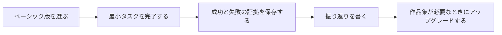

# コース Boss 戦チャレンジマップ


Boss 戦はプレッシャーを増やすためではなく、学習者に「このステージでいったい何をできるようになればいいのか」を分かってもらうためのものです。各 Boss は小さな総合チャレンジで、そのステージで最も重要な力をつなぎ合わせ、見せられる証拠を残します。

Boss 戦は 3 段階に分かれています。ベーシック版は初心者でも達成できることを保証し、スタンダード版は作品集に入れるのに適しており、チャレンジ版は余力のある人向けです。最初の学習では、ベーシック版をクリアできれば十分です。

## Boss を倒す 4 ステップ



最初はチャレンジ版を目指さなくて大丈夫です。Boss 戦の価値は、派手なテクニックを見せることではなく、各ステージで「自分は本当に理解できた」と証明できる証拠を 1 つ残すことにあります。

## Boss 戦の全体像

| ステージ | Boss 名 | コアスキル | ベーシック通過の証拠 |
|---|---|---|---|
| 1 開発者ツール基礎 | ワークベンチの門番 | ターミナル、環境、Git、README | 空のディレクトリから 1 回の Git コミットまで進める |
| 2 Python プログラミング基礎 | JSON ダンジョン管理人 | 関数、ファイル、例外、データ構造 | タスクを保存できる CLI |
| 3 データ分析と可視化 | 汚れたデータ探偵 | クレンジング、統計、グラフ、説明 | データ品質レポート 1 つ |
| 4 AI 数学基礎 | 指標の迷宮 | ベクトル、確率、loss、指標 | 実行できる小さな実験 1 つ |
| 5 機械学習 | Baseline の門番 | 分割、baseline、評価、誤りサンプル | 信頼できる baseline 1 つ |
| 6 深層学習 | Shape の巨獣 | tensor、学習ループ、loss、曲線 | 1 回の学習ログと曲線 |
| 7 Prompt と大規模言語モデル | JSON ドリフト怪物 | Prompt、schema、構造化出力 | 10 件の固定入力出力テスト |
| 8 RAG | 引用幻覚ドラゴン | chunk、検索、引用、評価 | 引用付き Q&A サンプル 10 件 |
| 9 Agent | 無限ループ魔王 | ツール、trace、停止条件、権限 | 3 件の再生可能なタスク trace |
| 10～12 方向拡張 | マルチモーダル混沌体 | 画像、テキスト、マルチモーダル、レビュー | 入力から出力までの完全なケース 1 つ |
| 卒業プロジェクト | 最終製品 Boss | 総合設計、デプロイ、評価、デモ | 実行可能な Demo と評価レポート |

各 Boss 戦では、成功と失敗の証拠を必ず残します。成功は「できる」ことの証明、失敗は「振り返れる」ことの証明です。

## Boss 1：ワークベンチの門番

この Boss は、あなたが本当に再現可能な開発環境を持っているかをチェックします。後のトラブルの多くは、最初の段階で土台ができていないことが原因です。現在のディレクトリが分からない、エラーの見方が分からない、バージョンを保存できない、実行コマンドを書けない、などです。

| 難易度 | タスク | クリア条件 |
|---|---|---|
| ベーシック版 | プロジェクトディレクトリを作成し、`hello_ai.py` を書いて実行する | ターミナルに 1 文が出力される |
| スタンダード版 | README、仮想環境の説明、Git コミットを追加する | 他の人が README どおりに再現できる |
| チャレンジ版 | わざとパスエラーを起こし、トラブルシュート記録を書く | 失敗サンプルと修正記録がある |

クリア後は、「ターミナルで生き残る力」と「Git で保存する力」が身についているはずです。

## Boss 2：JSON ダンジョン管理人

この Boss は、データをきちんと保存できる小さなプログラムを書けるかをチェックします。複雑な画面は不要ですが、通常入力、空入力、壊れたファイルに対応できなければいけません。

| 難易度 | タスク | クリア条件 |
|---|---|---|
| ベーシック版 | 学習タスクの追加、表示、完了処理を実装する | データが JSON に保存される |
| スタンダード版 | 分類、検索、例外処理に対応する | 空ファイルや壊れた JSON で直接クラッシュしない |
| チャレンジ版 | 3 つのコマンドラインテストサンプルを書く | 正常、例外、空入力がすべて記録される |

クリア後は、リスト、辞書、関数、ファイル読み書き、例外処理がどのように 1 つの小さなツールになるかを説明できるはずです。

## Boss 3：汚れたデータ探偵

この Boss は、不完全なデータを信頼できる結論に整えられるかをチェックします。データ分析はグラフを描く競争ではなく、まずデータ品質を見ることから始まります。

| 難易度 | タスク | クリア条件 |
|---|---|---|
| ベーシック版 | 欠損、重複、異常値を確認する | データ品質チェック表を出力する |
| スタンダード版 | データをクレンジングして 2 枚のグラフを描く | 各グラフに 1 文の結論と限界を書く |
| チャレンジ版 | わざと 1 つ誤った結論を残し、なぜ間違いか説明する | クレンジング前後の比較がある |

クリア後は、データがどこから来たのか、どこが信用できないのか、結論の限界は何かをはっきり言えるようになります。

## Boss 4：指標の迷宮

この Boss は、抽象的な数学概念を実行できる小さな実験に変えられるかをチェックします。数学者になる必要はありませんが、コードでモデルに出てくるよくある量を説明できる必要があります。

| 難易度 | タスク | クリア条件 |
|---|---|---|
| ベーシック版 | コードで 2 つのベクトルの類似度を計算する | 結果の大きさが何を表すか説明できる |
| スタンダード版 | 確率、loss、距離指標を比較する | 手計算の例とコード例がある |
| チャレンジ版 | 同じ問題を異なる指標で評価すると何が変わるか説明する | 指標を選んだ理由がある |

クリア後は、類似度、確率、loss、評価指標といった言葉をもう怖がらなくてよくなります。

## Boss 5：Baseline の門番

この Boss は、モデル結果が信頼できるか判断できるかをチェックします。baseline のないモデルプロジェクトでは、本当に効果があるのか説明しにくいです。

| 難易度 | タスク | クリア条件 |
|---|---|---|
| ベーシック版 | train/test 分割を行い、Dummy baseline を学習する | baseline 指標を出力する |
| スタンダード版 | 本物のモデルを学習し、baseline と比較する | 指標表と誤りサンプルがある |
| チャレンジ版 | データリークまたはクラス不均衡を 1 回確認する | リークチェックの記録がある |

クリア後は、モデルが「いちばん単純な方法」より本当に良いのかを説明できるはずです。

## Boss 6：Shape の巨獣

この Boss は、深層学習の学習を 1 回通しで実行できるか、そしてエラーが出たときに shape、loss、データの問題を切り分けられるかをチェックします。

| 難易度 | タスク | クリア条件 |
|---|---|---|
| ベーシック版 | 最小の学習ループを実行する | loss が出力される |
| スタンダード版 | 学習曲線と検証指標を保存する | 過学習かどうか説明できる |
| チャレンジ版 | わざと shape mismatch を起こして修復する | エラーログと修正記録がある |

クリア後は、深層学習プロジェクトでは最終スコアだけでなく、学習の途中経過を見る必要があると分かるはずです。

## Boss 7：JSON ドリフト怪物

この Boss は、LLM に安定して構造化結果を出させられるかをチェックします。Prompt プロジェクトで怖いのは、1 回は成功しても 10 回目で出力がずれることです。

| 難易度 | タスク | クリア条件 |
|---|---|---|
| ベーシック版 | JSON を出力する Prompt を設計する | 少なくとも 5 回、出力フィールドが揃う |
| スタンダード版 | schema で 10 件の固定入力を検証する | 合格率と失敗サンプルがある |
| チャレンジ版 | Prompt のバージョン比較を行う | バージョン表と改善記録がある |

クリア後は、Prompt を神秘的なおまじないではなく、テスト可能なコンポーネントとして扱えるようになります。

## Boss 8：引用幻覚ドラゴン

この Boss は、RAG が資料に基づいて回答できるか、そして引用がその回答を支えていることを証明できるかをチェックします。

| 難易度 | タスク | クリア条件 |
|---|---|---|
| ベーシック版 | 3 つの Markdown 文書を取り込み、5 つの質問に答える | 各回答にソースを示す |
| スタンダード版 | 10 個の評価問題を作り、citation_ok を確認する | 検索ログと引用チェック表がある |
| チャレンジ版 | 異なる chunk や top-k 戦略を比較する | 失敗タイプの集計がある |

クリア後は、「見た目は正しそうな回答」と「ソースで裏付けられた回答」を区別できるようになります。

## Boss 9：無限ループ魔王

この Boss は、制御可能な Agent を設計できるかをチェックします。Agent の難しさはツールを呼び出せることではなく、止まれること、振り返れること、権限を制限できることにあります。

| 難易度 | タスク | クリア条件 |
|---|---|---|
| ベーシック版 | Agent に 3 つの固定タスクを完了させる | 各タスクに手順記録がある |
| スタンダード版 | tool_calls と agent_traces を保存する | 失敗を 1 回再生できる |
| チャレンジ版 | 高リスク操作に人の確認を追加する | 権限逸脱テストと安全説明がある |

クリア後は、Agent がいつ自動で動いてよくて、いつ人に確認すべきかを説明できるはずです。

## 最終 Boss：見せられる AI プロダクト

最終 Boss は、すべての技術を一気に積み上げることではなく、1 つのはっきりした課題を、実行できて、評価できて、デモできるプロダクトにすることです。

| 難易度 | タスク | クリア条件 |
|---|---|---|
| ベーシック版 | ローカルで実行できる Demo | README と入力出力例がそろっている |
| スタンダード版 | 評価セット、ログ、失敗サンプル、デモ用スクリプトがある | 効果と制約を説明できる |
| チャレンジ版 | デプロイし、コスト・安全性・監視について説明する | 完全な作品集ページがある |

最終発表では、「Boss 戦クリア記録」という形で物語を語るのがおすすめです。まず環境を通し、次にデータを扱い、次にモデルを作り、さらに RAG と Agent を作って、最後にそれらを 1 つのプロダクトにまとめた、という流れです。

## Boss 戦記録テンプレート

```md
## Boss 戦：引用幻覚ドラゴン

### チャレンジ目標
RAG でコースに関する 10 個の質問に答え、引用が回答を支えているか確認する。

### 難易度
スタンダード版。

### クリア証拠
eval_questions.csv、retrieval_logs.jsonl、citation_check.csv を保存する。

### 失敗サンプル
質問：Agent と RAG の違いは何ですか？
失敗：検索結果が RAG のページにしかヒットせず、Agent のページにはヒットしなかった。

### 修正アクション
取り込む文書の範囲を広げ、metadata に stage 情報を保存する。

### 次回チャレンジ
chunk size の違いがヒット率にどう影響するかを比較する。
```

Boss 戦の意味は、学習を 1 つずつ明確な関門に変えることです。1 つクリアするたびに、説明できて、見せられて、振り返れる力が手に入ります。
