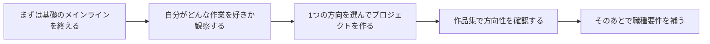

# キャリア方向探索ガイド

> **おすすめの読むタイミング：** 3 データ分析と可視化 を終えたあと（この時点で Python とデータ分析の基礎があり、各方向の違いをより理解しやすくなっています）  
> **読了目安：** 20～30 分  
> **目標：** AI 業界の主なキャリア方向を理解し、どの方向が自分に最も合うかを見極め、具体的な学習計画を立てること

---

## まずは急いで職種を決めない



| もしあなたがより好きなのは | 重点的に見るとよいもの |
|---|---|
| 製品を作る、API をつなぐ、業務課題を解決する | 大規模モデルアプリケーションエンジニア、AI Agent エンジニア |
| データ、指標、実験、モデルの効果 | データサイエンス、機械学習、モデルエンジニアリング |
| 画像、動画、視覚検出 | CV エンジニア、マルチモーダル方向 |
| テキスト理解、抽出、検索、QA | NLP、RAG エンジニア |

## 第1部：AI キャリア方向の全体像

### 7つの主流方向一覧

| 方向 | 一言でいうと | コア技術スタック | 月給レンジ | 求人数 | 参入難易度 |
|------|----------|----------|---------|:---:|:---:|
| **大規模モデルアプリケーションエンジニア** | 大規模モデルで製品を作る | Python、大規模モデル API、RAG、LangChain | 20-50K | ⭐⭐⭐⭐⭐ | ⭐⭐⭐ |
| **AI Agent エンジニア** | 自律的に動く AI を作る | LangGraph、MCP、Function Calling | 25-60K | ⭐⭐⭐⭐ | ⭐⭐⭐⭐ |
| **CV エンジニア** | AI に画像と動画を理解させる | PyTorch、OpenCV、YOLO | 20-45K | ⭐⭐⭐⭐ | ⭐⭐⭐⭐ |
| **NLP エンジニア** | AI にテキストを理解・生成させる | Transformers、BERT、ファインチューニング | 22-50K | ⭐⭐⭐⭐ | ⭐⭐⭐⭐ |
| **AIGC エンジニア** | AI で画像/動画/音楽を生成する | Stable Diffusion、ComfyUI | 25-55K | ⭐⭐⭐ | ⭐⭐⭐⭐⭐ |
| **AI アルゴリズム研究者** | アルゴリズムを改善し、論文を出す | 深層学習、高等数学、論文再現 | 30-80K | ⭐⭐ | ⭐⭐⭐⭐⭐ |
| **MLOps / デプロイエンジニア** | モデルを本番環境で安定稼働させる | Docker、K8s、TensorRT、ONNX | 22-48K | ⭐⭐⭐ | ⭐⭐⭐⭐ |

:::tip 2025年のトレンド
**大規模モデルアプリケーション** と **Agent 開発** は、ここ数年でとても伸びている方向です。CV と NLP の職種は比較的成熟していて安定していますが、その分競争も激しめです。AIGC 方向は将来性が広い一方で、求人数は業界や地域によって変わります。
:::

### 各方向の典型的な1日

入社したあと、1日がどんな感じかをイメージしてみましょう。「これなら一生やってもいいかも」と思えるものはどれでしょうか。

**🔵 大規模モデルアプリケーションエンジニアの1日**

| 時間 | やること |
|------|-------|
| 09:00 | RAG システムの検索再現率を改善し、テキスト分割の方針を調整する |
| 11:00 | Prompt テンプレートを調整して、大規模モデルの JSON 出力をより安定させる |
| 14:00 | ユーザーのフィードバックにある badcase を分析し、検索の問題か生成の問題かを切り分ける |
| 16:00 | DeepSeek と Qwen の性能差を評価し、モデル切り替え案を準備する |

**🟢 CV エンジニアの1日**

| 時間 | やること |
|------|-------|
| 09:00 | 物体検出モデルを学習し、新しいデータ拡張戦略を試す |
| 11:00 | データセットを整理・アノテーションし、検出ミスの badcase を処理する |
| 14:00 | TensorRT でモデル推論速度を最適化し、エッジデバイスへのデプロイを準備する |
| 16:00 | YOLOv11 の論文を読み、アップグレードする価値があるか評価する |

**🟡 AI Agent エンジニアの1日**

| 時間 | やること |
|------|-------|
| 09:00 | 新しい Agent ワークフローを設計する：ユーザー要望を受ける → タスクを分解する → ツールを呼び出す → 結果をまとめる |
| 11:00 | MCP Server を開発し、Agent が社内データベースを検索できるようにする |
| 14:00 | マルチ Agent 協調システムをデバッグし、Agent 間で情報伝達が欠ける問題を解決する |
| 16:00 | Token 消費と応答速度を最適化し、1 回のリクエストを 15 秒から 3 秒に短縮する |

---

## 第2部：方向適性セルフチェック

下の質問で、自分の傾向を見つけてみましょう。厳密に採点する必要はありません。直感で選べば大丈夫です。

### テスト A：何に一番興味がありますか？

- [ ] AI に要件を理解させ、問題を解決し、タスクを完了させる → **大規模モデルアプリケーション / Agent**
- [ ] AI に画像や動画を「見て理解」させる → **CV**
- [ ] AI に人間の言語を理解・生成させる → **NLP**
- [ ] AI に画像、動画、音楽を作らせる → **AIGC**
- [ ] 新しいアルゴリズムを研究し、SOTA を目指す → **アルゴリズム研究**
- [ ] モデルを速く、安定して動かす → **MLOps / デプロイ**

### テスト B：どんな働き方が好きですか？

- [ ] すばやく試して、できるだけ早く製品の効果を見たい → **アプリ開発方向**（大規模モデルアプリケーション、Agent）
- [ ] 深く掘り下げて、細部まで最適化したい → **アルゴリズム / デプロイ方向**
- [ ] 実際の業務課題を解決し、プロダクトや事業側と密に連携したい → **アプリ / Agent**
- [ ] 未知の領域を探究し、最先端を追いたい → **研究 / AIGC**

### テスト C：あなたのバックグラウンドは？

- [ ] 数学が得意で、式の導出が好き → どの方向でもOK、アルゴリズム研究も可
- [ ] 数学は普通だが、理解力が高い → たいていの方向はOK（必要な分だけ数学を使えば大丈夫）
- [ ] 数学は苦手だが、手を動かすのが得意 → **アプリ開発方向**がいちばん入りやすい（フレームワークやツールが多くの数学を隠してくれる）
- [ ] プログラミング経験がゼロ → まだ方向を選ばなくてOK。まずは 2 Python プログラミング基礎 を学び終えてから考えましょう

### 結果の目安

| あなたの選択傾向 | おすすめ方向 | コース内の重点 |
|------------|---------|-------------|
| アプリ系の選択が多い | 大規模モデルアプリケーション + Agent | 8 LLM アプリ開発と RAG、9 AI Agent とインテリジェントエージェントシステムに重点投資 |
| 画像系の選択が多い | CV | 10 コンピュータビジョンに重点投資し、プロジェクトを多めに作る |
| 言語系の選択が多い | NLP + 大規模モデル | 11 自然言語処理、7 大規模モデルの原理、Prompt とファインチューニングに重点投資 |
| クリエイティブ系の選択が多い | AIGC | 12 AIGC とマルチモーダルに重点投資 |
| 研究系の選択が多い | アルゴリズム研究 | 数学をしっかり学び、論文をたくさん読む |
| エンジニアリング系の選択が多い | MLOps / デプロイ | メインライン修了後に、選修モジュール A に重点投資 |

:::info すぐに決められなくても大丈夫
多くの人は、6 深層学習と Transformer 基礎 まで学んでから、はじめて進みたい方向がはっきりします。1～6 の学習ステージは、ほとんどの方向に共通する基礎です。「方向を間違えて時間を無駄にする」ということはありません。まずは学び始めて、学びながら感じてみましょう。
:::

---

## 第3部：あなたの学習計画を立てる

### 4つの例プラン

目標と時間に応じて、いちばん近いものを選んでください。

#### プラン1：大規模モデルアプリケーションエンジニア（最速で就職、推奨）

```
1 開発者ツール基礎 → 2 Python プログラミング基礎 → 3 データ分析と可視化 → 4 AI 数学（必要十分でOK）→
5 機械学習 → 6 深層学習（Transformer を重点）→ 7 大規模モデルの原理 → 8 LLM アプリ開発と RAG（重点）→ 9 AI Agent（重点）→ 就職
```

- **期間：** フルタイム 8～10 か月
- **コア競争力：** RAG システム、Prompt エンジニアリング、Agent 開発
- **向いている人：** できるだけ早く AI 業界に入りたい人

#### プラン2：CV エンジニア

```
1 開発者ツール基礎 → 2 Python プログラミング基礎 → 3 データ分析と可視化 → 4 AI 数学（並行学習）→
5 機械学習 → 6 深層学習 → 10 コンピュータビジョン（重点、3～4 個のプロジェクト）→ デプロイ方向 → 就職
```

- **期間：** フルタイム 10～12 か月
- **コア競争力：** 物体検出、画像セグメンテーション、モデルデプロイ
- **向いている人：** 画像処理に興味があり、可視化で達成感を得るのが好きな人

#### プラン3：フルスタック AI エンジニア（最強の競争力）

```
メインライン全ステージ + 選修モジュール A（デプロイ）+ 選修モジュール E（フロントエンド）→ 上位職種に応募
```

- **期間：** フルタイム 16～20 か月
- **コア競争力：** アルゴリズムから製品までの全工程対応力
- **向いている人：** 十分な時間があり、最強レベルの競争力を目指したい人

#### プラン4：素早く転職する（すでに Python 基礎あり）

```
1 開発者ツール基礎（高速で進める）→ 2 Python プログラミング基礎（高速で進める）→ 3 データ分析と可視化 → 4 AI 数学、5 機械学習（重点実践）→
6 深層学習 → 7 大規模モデルの原理 → 8 LLM アプリ開発と RAG → 9 AI Agent → 就職
```

- **期間：** フルタイム 6～8 か月
- **向いている人：** すでに Python とデータ分析の基礎があり、AI へ素早く転向したい人

### 月ごとの目標の目安（フルタイム学習・プラン1）

| 月 | 学習ステージ | 目標 | 主な成果物 |
|:---:|---------|------|---------|
| 第1月 | 1 開発者ツール基礎、2 Python プログラミング基礎 | Python に慣れる | クローリングプロジェクト、Web API |
| 第2～3月 | 3 データ分析と可視化 | データ分析を身につける | 完成したデータ分析レポート |
| 第4～6月 | 4 AI 数学、5 機械学習、6 深層学習 | ML/DL の原理を理解する | 住宅価格予測、画像分類プロジェクト |
| 第7～9月 | 7 大規模モデルの原理、8 LLM アプリ開発と RAG | 大規模モデルアプリを使いこなす | RAG アプリ、ファインチューニングプロジェクト |
| 第10月 | 9 AI Agent とインテリジェントエージェントシステム | Agent 開発を身につける | Agent プロジェクト + 作品集 |

### 週間の時間配分テンプレート（副業・週15～20時間）

| 時間 | 内容 | 方法 |
|------|------|------|
| 月～金の夜（毎日 2h） | 理論 + コード練習 | チュートリアルを見る + まねしてコードを書く |
| 土曜午前（3～4h） | 新しい知識を集中して学ぶ | 今週の重点を深く学ぶ |
| 土曜午後（2～3h） | プロジェクト実践 | コース課題や Kaggle に取り組む |
| 日曜午前（2～3h） | 復習 + ノート整理 | コードを整理し、学習ノートを書く |

---
