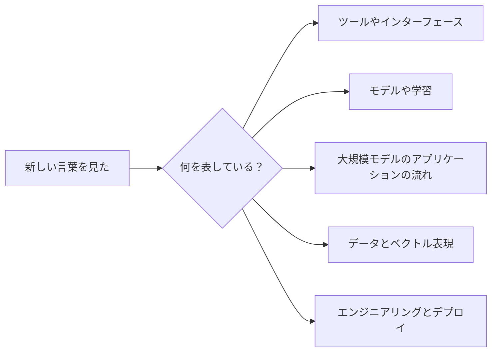

# よくある概念の混同を防ぐ表

## この節の位置づけ

このページは、正式な知識点の解説ではなく、「概念マップ」です。コースで API、SDK、モデル、学習、推論、Prompt、RAG、Agent、Token、Embedding などの言葉を見たときに、まずここでざっと見比べて、似た概念を混同しないようにするためのものです。

## まず、どの種類かを見分ける

| 何について言っているか | まず見るグループ |
|---|---|
| どう呼び出すか、どう接続するか | 開発・呼び出し関連 |
| モデルがどう学習し、どう提供されるか | モデル・サービス関連 |
| Prompt、RAG、Agent、微調整 | 大規模モデルのアプリケーション関連 |
| Token、Embedding、Chunk | データ・ベクトル関連 |
| デプロイ、ログ、評価、セキュリティ | エンジニアリング関連ページ |

## この表の使い方

初心者のうちは、最初から全部の用語を覚える必要はありません。まずは大まかな境界をつかめば十分です。どれがツールで、どれがモデルで、どれが流れで、どれがアーキテクチャなのかを確認しましょう。経験者の学習者は、これを用語の確認表として使い、今後プロジェクト説明、技術文書、面接での説明をするときに、できるだけ正確な言葉を使うようにしましょう。

---

## 開発・呼び出し関連

| 混同しやすい概念 | 簡単な理解 | 重要な違い |
|---|---|---|
| API | プログラムが外部機能を呼び出す入口 | 約束に従ってリクエストを送ると、結果が返ってくる |
| SDK | 開発用にまとめられたツールキット | SDK は通常、API をより簡単に呼び出せるようにしてくれる |
| Library（ライブラリ） | 再利用できるコードの集まり | 自分のプログラムから能動的に呼び出して使う |
| Framework（フレームワーク） | アプリの構造を組み立てるための土台 | 通常はフレームワークのルールに従ってコードを書く |
| CLI | コマンドラインツール | ターミナルでコマンドを入力して使う |
| Web API | HTTP で公開される API | フロントエンドとバックエンド、モデルサービス、外部システムの接続によく使う |

たとえば、OpenAI や Anthropic のモデル機能は通常 Web API として提供されます。Python SDK は HTTP リクエストの細かい部分をまとめてくれるので、数行の Python コードで呼び出しができます。

---

## モデル・サービス関連

| 混同しやすい概念 | 簡単な理解 | 重要な違い |
|---|---|---|
| モデル | 学習されたパラメータを持つ AI システムの中核 | モデル自体が推論や生成を担当する |
| モデルサービス | モデルを呼び出し可能なサービスとして包むもの | インターフェース、同時実行、認証、ログ、デプロイを担当する |
| 推論 | モデルを使って出力を得ること | モデルのパラメータは変えない |
| 学習 | データを使ってモデルのパラメータを更新すること | データ、計算資源、損失関数、最適化が必要 |
| 微調整 | 既存モデルをベースにさらに学習すること | ふつうは分野、形式、タスクへの適応に使う |
| デプロイ | サービスを安定して他者が使えるようにすること | 実行環境、監視、スケーリング、安全性を含む |

初学者は「モデルを呼び出すこと」と「モデルを学習させること」を混同しがちです。モデルを呼び出すのは、すでに完成した道具を使うようなものです。一方、モデルを学習させるのは、その道具自体を作り直すことに近いです。

---

## 大規模モデルのアプリケーション関連

| 混同しやすい概念 | 簡単な理解 | 重要な違い |
|---|---|---|
| Prompt | モデルへの入力とタスク説明 | 今回の応答の仕方に影響する |
| System Prompt | より優先度の高い振る舞い設定 | 役割、制約、出力スタイルの設定によく使う |
| Few-shot | Prompt の中に少数の例を入れること | 例を通して、モデルに形式や考え方をまねさせる |
| Structured Output | 固定された構造で出力させること | JSON、表、フィールド抽出などによく使う |
| Function Calling | モデルにツールの選択と引数入力をさせること | モデルがツールを直接実行するのではなく、システムが実行する |
| Tool Use | 外部ツールを使ってタスクを進めること | 検索、コード、データベース、ファイルなどのツールを含む |

Prompt は「今回どう聞くか」に近く、ツール呼び出しは「モデルが次にどの外部機能を使うか」を決めるものに近いです。両方を一緒に使うことはできますが、解決する問題は同じではありません。

---

## RAG、微調整、Agent

| 混同しやすい概念 | 向いている問題 | 向いていない問題 |
|---|---|---|
| Prompt | タスクの定義が曖昧、出力形式が不安定、要求の伝え方を改善したい | モデルに私有知識を勝手に知ってもらうこと |
| RAG | 外部文書、私有知識、最新情報にもとづいて回答したい | モデル自体の能力やスタイルを変えること |
| 微調整 | 特定の形式、スタイル、分野タスクを安定して覚えさせたい | 大量の最新情報を動的に読み込むこと |
| Agent | 複数ステップが必要で、ツールを使いながら途中結果に応じて進み方を変えるタスク | 固定的で単純、かつ高リスクで完全に制御しなければならない流れ |
| Workflow | 手順が固定され、ルールが明確な自動化の流れ | 開かれた探索や、経路が不確定なタスク |

実用的な見分け方はこうです。問題が「聞き方」の問題なら、まず Prompt を直します。知識が足りないなら、まず RAG を使います。形式やスタイルが長期的に安定しないなら、微調整を考えます。タスクに複数回の行動やツール選択が必要なら、Agent を考えます。

---

## データ・ベクトル関連

| 混同しやすい概念 | 簡単な理解 | 重要な違い |
|---|---|---|
| Token | モデルがテキストを処理するときの基本単位 | 文字、単語、サブワード、記号片のことがある |
| Embedding | テキストや画像などをベクトルとして表すこと | 類似度計算や検索に便利 |
| ベクトルデータベース | ベクトルを保存・検索するシステム | RAG の類似コンテンツ検索によく使う |
| コンテキストウィンドウ | モデルが一度に見られる入力範囲 | 入らない内容はモデルが直接使えない |
| Chunk | 文書を分割した断片 | RAG では全文ではなく断片単位で検索することが多い |
| Metadata | 付加情報 | 出典、タイトル、ページ番号、権限、時刻など |

RAG では、まず文書を Chunk に分け、それを Embedding に変換してベクトルデータベースに保存します。ユーザーが質問すると、その質問もベクトル化し、似ている Chunk を検索して、コンテキストウィンドウに入れ、モデルが回答します。

---

## 全体で用語をそろえるためのおすすめ

初心者の負担を減らすために、今後の記事ではできるだけ同じ呼び方を使うのがおすすめです。最初に出てくるときは、中国語と英語をそろえて書き、後から略称を使うとよいです。たとえば「検索拡張生成（RAG）」「埋め込みベクトル（Embedding）」「ツール呼び出し（Tool Use / Function Calling）」「エージェント（Agent）」のように書きます。ある概念が複数の段階で何度も出てくるなら、最初に「あとでどこで使うか」も説明しておくと親切です。

| 推奨表記 | 使ってよい略称 | 混用を避けたいもの |
|---|---|---|
| 検索拡張生成（RAG） | RAG | 知識ベース、ベクトル庫などを、RAG 全体の流れの代わりに毎回使わない |
| 埋め込みベクトル（Embedding） | Embedding、ベクトル表現 | Embedding をベクトルデータベースと同一視しない |
| ツール呼び出し（Tool Use / Function Calling） | ツール呼び出し、関数呼び出し | 「モデルがツールを選ぶこと」と「システムがツールを実行すること」を一つにしない |
| エージェント（Agent） | Agent | ツール付きの LLM アプリをすべて Agent と呼ばない |
| ワークフロー（Workflow） | 固定フロー | 固定的な自動化フローと、開かれた Agent を混同しない |
| 微調整（Fine-tuning） | 微調整 | Prompt の調整を微調整と呼ばない |

## 学習ステージをまたいで見直す道筋

概念の多くは、1つの段階だけに出てくるわけではありません。次のように見直すとよいです。RAG の評価を学ぶときは、第5ステーションに戻って指標と誤差分析を見ます。Agent のツール呼び出しを学ぶときは、第8ステーションに戻って Function Calling を見ます。Transformer と大規模モデルのコンテキストを学ぶときは、第6ステーションに戻って Attention を見ます。マルチモーダル応用を学ぶときは、第10ステーションと第11ステーションに戻って、それぞれ視覚タスクとテキストタスクを見ます。こうすることで、コース全体がバラバラの章ではなく、互いにつながった知識ネットワークになります。

---

## 学習のヒント

初心者なら、最初から全部の用語を覚えようとしなくて大丈夫です。新しいプロジェクトに出会うたびに、この表に戻って次の3つを確認しましょう。今やっているのはサービスの呼び出しか、それともモデルの学習か。知識を補っているのか、それともモデルの振る舞いを変えているのか。必要なのは固定フローか、それとも Agent に自分で計画させることか。

経験者なら、技術表現をさらに磨くとよいです。プロジェクトの README を書くときは、「どのモデルサービスを使ったか」「どの API で呼び出したか」「RAG を使ったか」「ツール呼び出しを使ったか」「評価指標は何か」「失敗の境界はどこか」を明確に書くようにしましょう。そうすると、あなたのプロジェクトは単なる Demo の動作確認ではなく、実際のエンジニアリング成果物に近づきます。
