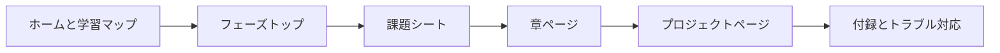

# コースページの使い方

コース内容が少しずつ充実してくると、同じフェーズの中にフェーズトップ、学習ガイド、課題シート、章ページ、プロジェクトページが出てきます。これらは重複した内容ではなく、それぞれ別の学習行動を支えるためのものです。毎回すべてのページを最初から最後まで読む必要はありません。今の目的に合わせて入口を選べば大丈夫です。

## 1枚でわかる：ページの連携



| 今の目的 | まず見る場所 |
|---|---|
| どこから始めればいいかわからない | ホーム、クイック体験、おすすめ学習ルート |
| 新しいフェーズに入る準備をしたい | フェーズトップ、学習ガイド、課題シート |
| プロジェクトを素早く進めたい | 課題シート、プロジェクトページ、提出基準 |
| エラーや用語に困っている | トラブル対応索引、用語集、FAQ |

## ページの役割分担

| ページの種類 | 主な役割 | いつ見るか |
| --- | --- | --- |
| ホーム | コース全体を素早く始める | 初めてコースに入るとき、またはどこから始めるか迷ったとき |
| 学習マップ | ルート、プロジェクト、用語、トラブル対応、作品集の要件を理解する | 学習を始める前、またはルートを見直したいとき |
| フェーズトップ | このフェーズで何を学ぶか、なぜ学ぶか、前後のフェーズとどうつながるかを把握する | 新しいフェーズに入る前 |
| 学習ガイド | 章の学習順と学び方を決める | あるフェーズを体系的に学ぶ準備をするとき |
| フェーズ課題シート | 今フェーズでやるべき練習、プロジェクト、合格基準を明確にする | 学習中に何度も見返す |
| 章ページ | 具体的な概念、コード、実践方法を学ぶ | 学習順に章を読むとき、または抜け漏れを補うとき |
| プロジェクトページ | 知識を動く成果物に変える | フェーズ課題を終えるとき、または作品集を作るとき |
| 付録と用語集 | 概念、リソース、トラブル対応、補足資料を調べる | 行き詰まったときや、知らない用語が出てきたとき |

初めて学ぶ人には、次の順番をおすすめします。ホーム → クイック体験 → AI フルスタック能力マップ → おすすめ学習ルート → フェーズトップ → フェーズ課題シート → 章ページ → プロジェクトページ。以降は、新しいフェーズに入るたびに「フェーズトップ + 課題シート + 章 + プロジェクト」の流れを繰り返します。

## 重複して読まないためのコツ

とにかく早く進めたいなら、まずは課題シートとプロジェクトページを優先してください。課題シートには最低限何を提出すればよいかが書かれており、プロジェクトページには知識をどう作品にするかが書かれています。もし課題がうまくできなければ、そのときに対応する章へ戻って概念とコードを補いましょう。

すでに関連経験がある人は、フェーズトップと課題シートだけ先に見て、そのままプロジェクトページへ進んでも構いません。たとえば Python の経験があるなら、Python 基礎の章を一字一句読む必要はありません。コマンドラインツール、ファイル読み書き、API の小さなプロジェクトを完成させて、重要な抜けがないことを確認できれば十分です。

作品集を準備している人は、プロジェクトのルート、AI 学習アシスタント成長ルート、作品集の確認チェックリスト、卒業プロジェクト設計ガイドを優先してください。章の内容は支えであり、主役はプロジェクトの成果物です。

## 3つの学習モード

クイック体験モードは、まず動かしてみたい人向けです。各フェーズの課題シートにある最小成果物だけを作ればよく、すべての理論を深く理解する必要はありません。このモードは、早く成功体験を得るのに役立ちます。

体系学習モードは、AI フルスタック能力をしっかり身につけたい人向けです。フェーズトップと学習ガイドに従って進め、各フェーズで課題シートと少なくとも 1 つのフェーズプロジェクトを完了しましょう。

作品集モードは、就職、キャリア転換、成果の提示を目的にしている人向けです。1つの連続したプロジェクトを軸に反復改善し、各フェーズの成果を README、実験記録、スクリーンショット、テストセット、失敗サンプルに蓄積していきましょう。

## ページ運用の原則

今後内容を追加するときも、この役割分担をできるだけ保ってください。フェーズトップは位置づけ、学習ガイドは順序、課題シートは提出物、章ページは知識、プロジェクトページは成果物、付録は参照用です。そうすることで、コースは内容が増えるほど豊かになり、混乱しにくくなります。

## フェーズトップの統一構成

各フェーズを読みやすくそろえるために、フェーズトップでは次の 6 つを固定で担当するのがおすすめです。フェーズの位置づけを説明すること、学習クリアマップを示すこと、初心者向け最小ルートと発展ルートを分けること、このフェーズの学習パスを並べること、フェーズプロジェクトと提出物を明確にすること、最後に合格基準を示すことです。

| モジュール | 役割 | 書かないほうがよいもの |
|---|---|---|
| フェーズの位置づけ | このフェーズが何を解決するかを示す | ツール名を並べすぎない |
| 学習クリアマップ | 知識がどうつながるかをフローチャートで示す | 詳細な章の代わりにしない |
| 初心者/発展ルート | 基礎の異なる学習者の選択コストを下げる | すべての人に同じ深さを求めない |
| 学習パス | どの章を先に読むか、後に読むかを伝える | 章タイトルをそのまま並べるだけにしない |
| フェーズ提出物 | 最小版と作品集版の証拠を明確にする | 「プロジェクトを完了する」だけで終わらせない |
| 合格基準 | 次のフェーズに進めるかを判断する | 「コースを見終わったら合格」にしない |

もしあるフェーズトップが短すぎるなら、「初心者向け最小合格ルート」「フェーズプロジェクト」「フェーズ提出物」「フェーズ合格基準」を優先して補ってください。逆に長すぎる場合は、詳細を学習ガイド、課題シート、またはプロジェクトページへ移しましょう。

## 章ページの統一した締めくくりテンプレート

個別の章ページは、1つの知識点をわかりやすく説明する役割があります。ただし、「概念を説明して終わり」にしないでください。学習者が1章ごとに確認できる行動を残すために、重要な章の末尾には次の 4 つの短いモジュールを置くのがおすすめです。

| 締めくくりモジュール | 役割 | 最小の書き方 |
|---|---|---|
| 本節の最小練習 | 知識点を実行できる行動に変える | 1つのコマンド、コード片、確認タスクを示す |
| よくある失敗点 | どこで間違えやすいかを伝える | 2〜4 個の現象、原因、修正方向を列挙する |
| フェーズプロジェクトとの関係 | この節がどのプロジェクト能力に入るかを示す | 課題シート、プロジェクトページ、または通しプロジェクト版につなげる |
| 次の節に進む前の確認 | 「見たけど使えない」を防ぐ | 3 つの質問で続けてよいか確認する |

章の内容が長いときほど、締めくくりモジュールは短くしてください。新しい大きな説明文にしないことが大切です。目的は、学習者に「この節を終えたら、何が実行できるか、何を説明できるか、何を記録できるか」を思い出してもらうことです。

例として、次のように書けます。

~~~md
## 本節の最小練習

本節の方法を使って最小サンプルを処理し、入力、出力、実行コマンドを保存します。

## よくある失敗点

| 現象 | よくある原因 | 修正方向 |
|---|---|---|
| サンプルが動かない | パスまたは依存関係が一致していない | README に戻って実行ディレクトリと環境を確認する |

## フェーズプロジェクトとの関係

この節の力は、今フェーズのあるモジュールに入ります。たとえばデータクレンジング、モデル評価、Prompt のバージョン管理、Agent の trace などです。

## 次の節に進む前の確認

この節の例を一人で再現できますか？ 出力がなぜその形になるのか説明できますか？ 失敗例や境界ケースを 1 つ記録しましたか？
~~~

## 読書ラベル：必読、プロジェクト参照、選択的深掘り

コース内容が増えてくると、すべてのページを同じ重さで精読する必要はありません。今後のメンテナンスでは、フェーズトップ、学習ガイド、または章一覧に 3 種類のラベルを追加するのがおすすめです。

| ラベル | 意味 | 適用ページ |
|---|---|---|
| 必読 | 最初の理解で必ず押さえるべき。これがないと後で頻繁に詰まりやすい | 基礎概念、核心フロー、重要な評価方法 |
| プロジェクト参照 | プロジェクト時に戻って確認する。初回はざっと見ればよい | API パラメータ、デプロイ詳細、フレームワーク比較、拡張テクニック |
| 選択的深掘り | 興味の方向や作品集の必要に応じて学ぶ | 高度なアルゴリズム、最先端手法、複雑な最適化、業界別トピック |

各フェーズトップには、「初回はどう読むか」の小さな表を追加して、そのフェーズの章をこの 3 分類に分けるとよいでしょう。内容を削らなくても、学習の負担を下げられます。

コース内容、ナビゲーション、または新しいページを変更したら、まずプロジェクトルートで次のコマンドを実行することをおすすめします。

```bash
npm run validate:docs
```

このコマンドは、Markdown のコードブロック、内部リンク、sidebar の文書参照、そして `sidebars.js` の構文を確認します。失敗した場合は、まず FAIL の出力に従って問題を修正してから、次へ進んでください。

検証が通ったら、次に次のコマンドを実行します。

```bash
npm run clean
```

このコマンドは Docusaurus が生成したキャッシュとビルド成果物を削除し、`.docusaurus` や `build` に古いパス、古いページ、ローカルの一時パスが残るのを防ぎます。この 2 つを終えてから Git コミットを行うと、より安定します。
