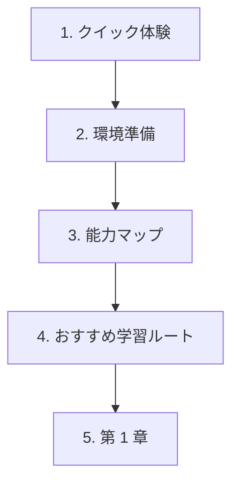

# コースページの使い方

このページが答えるのは、ひとつだけです。**次にどのページを開けばよいか**。

初めて学ぶ場合、入門ページを全部読んでから始める必要はありません。まず小さな例を動かし、最低限の道具を準備し、必要になったら学習マップで方向を確認します。

## 初回はこの順番で開く

| 手順 | ページ | やること |
| --- | --- | --- |
| 1 | [30 分 AI クイック体験](/intro/quick-experience) | まず最小の AI 例を動かします。用語暗記は後で大丈夫です。 |
| 2 | [環境準備](/intro/environment-setup) | Python、VS Code、Git、プロジェクトフォルダを用意します。高度な道具は後で追加します。 |
| 3 | [AI フルスタック能力マップ](/intro/ai-fullstack-map) | 図を見て、大きな層だけ覚えます。 |
| 4 | [おすすめ学習ルート](/intro/learning-path) | 強い理由がなければ、まず標準ルートを進みます。 |
| 5 | [第 1 章：開発者ツール](/ch01-tools) | 再現できる学習ワークスペースを作り始めます。 |

## コース構成をシンプルに言うと

| 部分 | 何か | 使い方 |
| --- | --- | --- |
| 入門ページ | クイック体験、環境、マップ、ルート、用語 | 初回は最初の数ページだけ読み、残りは参照用にします。 |
| ステージトップ | そのステージの意味と作るものを説明するページ | 新しいステージに入る前に読みます。 |
| `0.0 学習ガイドと課題表` | 学習順、必須タスク、合格基準をまとめたページ | ステージ学習中は何度も見ます。 |
| 番号付きレッスン | 概念、コード、出力、よくあるミスを学ぶページ | 基本は順番に進め、経験者は抜け漏れ確認にも使えます。 |
| ワークショップまたはステージプロジェクト | 学んだ内容を動く成果物にするページ | そのステージの主要な理論を学んだ後で取り組みます。 |
| 任意参照 | FAQ、トラブル対応、作品集、キャリア、発展ルート | 詰まったとき、計画するとき、作品集を作るときに開きます。 |

## 学び方のリズム

多くのページはこの流れで進めます。

1. 先に図や流れを見る。
2. 最小コードを実行する。
3. 期待される出力と比べる。
4. コマンド、結果、エラー、スクリーンショットのどれかを記録する。
5. プロジェクトのタスクへ戻る。

これで、コースが読むだけの長い資料になりにくくなります。目標は「ページを見た」ではなく、「結果を出せる、説明できる、証拠を残せる」です。

## 初回は流し読みでよいもの

バッジ、キャリアルート、作品集基準、長期スケジュール、選択ルートは、初回は軽く見るだけで十分です。役に立つ内容ですが、スタート地点ではありません。

学習ペースを決めるとき、作品集を準備するとき、詰まりを直すとき、専門方向を選ぶときに戻って読んでください。

## 迷ったとき

まず、層で考えます。

> 今の詰まりは、ツール、コード、データ、モデルの挙動、LLM アプリのロジック、Agent の動作、デプロイのどれか？

それから対応するページを開きます。

| 詰まり | まず開くページ |
| --- | --- |
| コマンド、フォルダ、Git、Python 環境 | 第 1 章と環境準備 |
| Python 構文やスクリプト構成 | 第 2 章の学習ガイド |
| データファイル、表、グラフ | 第 3 章の学習ガイド |
| モデル概念、指標、評価 | 第 4-6 章 |
| Prompt、RAG、LLM アプリの挙動 | 第 7-8 章 |
| Agent の手順、ツール、記憶、権限 | 第 9 章 |
| 画像、動画、マルチモーダル出力 | 第 12 章 |

迷う場合は、今いるステージの `0.0 学習ガイドと課題表` に戻り、最小タスクを終えてから次へ進みます。
