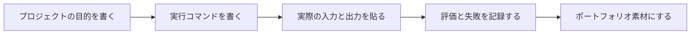

# 実験記録と README テンプレート

AI プロジェクトでは、コードは作品の一部にすぎません。本当に実力を示すのは、「なぜそうしたのか」「どう検証したのか」「何に失敗したのか」「次にどう改善するのか」です。以下のテンプレートは、各段階のプロジェクト README にそのままコピーして使えます。

## 一目でわかる：テンプレートの使い方



| テンプレート部分 | もっとも抜けやすい内容 |
|---|---|
| README | サンプルの入力出力と既知の制限 |
| 実験記録 | 設定、指標、失敗サンプル |
| RAG/Agent 記録 | 検索ログ、trace、ツール呼び出し |
| 振り返り | 何が失敗したか、次にどう検証するか |

## プロジェクト README テンプレート

````md
# プロジェクト名

## プロジェクトの目的

このプロジェクトは何を解決しますか？ユーザーの入力は何で、システムの出力は何ですか？

## 実行方法

```bash
python main.py
```

## サンプル入力出力

入力：

```text
ここに実際の入力を入れる
```

出力：

```text
ここにシステムの出力を入れる
```

## プロジェクト構成

```text
project/
  main.py
  data/
  README.md
```

## 方法の説明

どんなデータ、モデル、ツール、または API を使いましたか？なぜそれを選びましたか？

## 評価方法

どんな指標で効果を判断しますか？baseline は何ですか？エラーサンプルはありますか？

## 発生した問題

少なくとも 1 つ、環境・データ・モデル・インターフェース・実装の問題を記録し、どのように調べたかを書いてください。

## 次の計画

次の版で何を変える予定ですか？その理由は何ですか？
````

プロジェクトがすでに Prompt、RAG、Agent、または卒業制作の段階に入っている場合、README には「実行方法」だけでなく、エンジニアリングとしての一連の流れも示すべきです。

````md
## システムの流れ

ユーザー入力 -> Prompt / RAG / Agent -> ツールまたはナレッジベース -> モデル出力 -> 検証とログ

## LLM 呼び出し層

- モデル：
- Prompt バージョン：
- 構造化出力 schema：
- エラー処理：timeout / retry / fallback
- コスト記録：tokens / latency

## RAG 層

- 元資料：
- chunk 戦略：
- metadata フィールド：
- 検索戦略：キーワード / ベクトル / ハイブリッド / rerank
- 引用の確認方法：

## Agent / ツール層

- ツール一覧：
- ツール schema：
- 最大ステップ数：
- 人手確認の境界：
- trace の例：

## 評価結果

| 実験 | 設定 | 指標 | 失敗サンプル | 結論 |
|---|---|---|---|---|
| baseline |  |  |  |  |
| exp-1 |  |  |  |  |

## 既知の制限

- データの範囲：
- モデルの制限：
- コスト/遅延の制限：
- 安全上の境界：
````

この拡張テンプレートは、段階 8b、段階 9、卒業制作に特に適しています。これにより、単にモデルを呼び出せるだけでなく、観測可能で、評価できて、振り返れる AI アプリを設計できることを示せます。

## 実験記録テンプレート

| 項目 | 内容 |
|---|---|
| 実験日 | 例：2026-04-26 |
| 実験目標 | 今回何を検証したいか |
| データ/入力 | どんなデータやサンプルを使ったか |
| 方法/設定 | モデル、Prompt、パラメータ、ツールのバージョン |
| 結果 | 指標、スクリーンショット、出力サンプル |
| 失敗サンプル | どのサンプルの結果が悪かったか |
| 結論 | 今回何を学んだか |
| 次のステップ | 次の改善で何を変えるか |

## AI アプリの実験記録テンプレート

プロジェクトに LLM、Prompt、RAG、Agent が関わる場合は、より詳細な実験表を使うのがおすすめです。

| 項目 | 例 | 説明 |
|---|---|---|
| `experiment_id` | `rag_exp_003` | 各実験の一意な番号 |
| `goal` | 同義表現での検索ヒット率を向上させる | 今回の実験で解決したい問題 |
| `baseline` | キーワード検索 top-k=3 | 比較対象は何か |
| `change` | query rewrite を追加 | 今回は主要な変数を 1 つだけ変える |
| `prompt_version` | `qa_v2` | Prompt を変更したら、バージョンを記録する |
| `retrieval_config` | hybrid, top-k=5, rerank=true | RAG の設定 |
| `agent_config` | max_steps=4, tools=search/read | Agent の設定 |
| `metrics` | Hit@3=0.82, citation_ok=0.76 | 指標の変化 |
| `latency_cost` | avg_latency=1.2s, avg_tokens=900 | コストと遅延 |
| `fixed_cases` | 返金に関する同義表現 6 件を修正 | どの失敗サンプルが改善したか |
| `new_failures` | 2 件の証明書問題が誤って書き換えられた | 新しい副作用 |
| `decision` | 維持するが、rewrite ルールを制限する | 今回の変更を採用するか |

## エラーサンプル記録テンプレート

| サンプル | 期待される結果 | 実際の結果 | 可能な原因 | 改善の方向 |
|---|---|---|---|---|
| 例 1 | A と答えるべき | 実際は B と答えた | 検索がヒットしていない | chunk か query rewrite を改善する |

## AI アプリの失敗サンプルテンプレート

| 項目 | 例 |
|---|---|
| ユーザー入力 | 「この状況でも返金できますか？」 |
| 期待される結果 | 返金ポリシーに一致し、7 日と学習進捗の条件を説明する |
| 実際の結果 | 「返金申請はできます」とだけ答え、条件を漏らした |
| 失敗レベル | generation / citation |
| 関連ログ | request_id=`req_001`、source=`refund_policy` |
| 可能な原因 | prompt で制限条件を残すように指示していない |
| 修正内容 | 出力形式に `conditions` フィールドを追加する |
| 回帰テスト | `eval_questions.csv` に追加し、今後毎回テストする |

## 最小限のプロジェクトログファイルの提案

AI アプリの段階に入ったら、少なくとも以下のファイルを残すことをおすすめします。すべてのプロジェクトに必須ではありませんが、ポートフォリオに近づくほど、こうした証拠が見えることが重要です。

```text
logs/
├── llm_calls.jsonl
├── retrieval_logs.jsonl
├── agent_traces.jsonl
├── tool_calls.jsonl
└── safety_audit.jsonl

reports/
├── baseline.md
├── failure_cases.md
└── improvement_record.md
```

## なぜ記録を続けるのか

最終コードだけを残しても、他の人には成長の過程が見えにくいです。実験、失敗、改善を記録することで、単に demo を動かせるだけでなく、エンジニアのようにシステムを改善できることを示せます。
