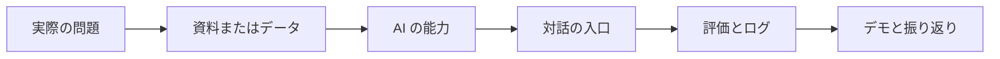
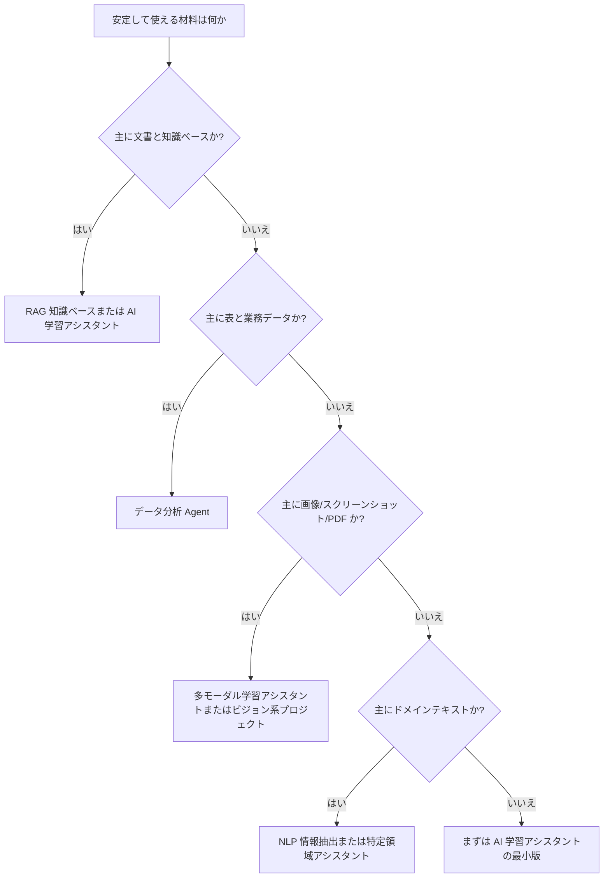

# 卒業プロジェクト設計ガイド


卒業プロジェクトは、ただもっと大きな練習問題を作ることではありません。コース全体で学んだ開発ツール、Python、データ処理、機械学習、深層学習、LLM アプリケーション、RAG、Agent、デプロイ、評価をひとつの完成した作品としてつなげることです。目的は「たくさんの章を読んだ」ことを証明することではなく、実際の問題を自分で要件、データ、モデル、システム、評価、改善計画に分解できることを示すことです。

もし題材選びに迷ったら、コース全体を通して使える「AI 学習アシスタント」を優先しましょう。このプロジェクトは、知識ベースの処理、検索、Q&A、引用、学習計画、ツール呼び出し、ログ、評価、デプロイを自然に含められるので、AI アプリケーション力とエンジニアリング思考の両方を示しやすいです。

## まず図を見よう：卒業プロジェクトは閉ループであるべき



| 閉ループの項目 | 最低要件 |
|---|---|
| 実際の問題 | ユーザー、シーン、悩みを説明する |
| 資料またはデータ | 入手元、形式、クレンジング方法を説明する |
| AI の能力 | Prompt、RAG、Agent、モデル、多モーダルのどれを使うか説明する |
| 評価とログ | 固定サンプル、失敗サンプル、重要ログがある |
| デモと振り返り | README、スクリーンショット、またはデモ用スクリプトがある |

## 卒業プロジェクトは何を解決すべきか

合格レベルの卒業プロジェクトでは、まず誰がユーザーなのか、何が問題なのか、なぜ AI が必要なのか、AI を使わない場合はどう解くのか、AI を入れることで何を改善したいのかを説明する必要があります。最初から「RAG システムを作りたい」や「Agent を作りたい」と書かないでください。RAG や Agent は実装手段であって、プロジェクトの目的ではありません。

よりよい書き方は、たとえば「学習者は講義資料を読んでいて、どの章から学べばよいか分からない」「ある概念が前後の章とどうつながるか分からない」「エラーが出たときにどこを調べればよいか分からない」といった状況を示すことです。そのため、このプロジェクトではコースの Q&A と学習計画アシスタントを提供します。コース文書を読み込み、質問に答えるときに出典を示し、学習目標に合わせて学習ルートを提案し、つまずいたときにはトラブルシュート手順を生成します。

## 卒業プロジェクトの題材選定ツリー

どの卒業プロジェクトを選ぶか迷ったら、まず「どの技術が一番流行っているか」ではなく、「どの材料を一番手に入れやすいか、どの評価基準を一番定めやすいか、どの能力を一番見せたいか」を考えましょう。以下の順番で選ぶとよいです。



| 選定条件 | おすすめ方向 | 最小閉ループ | 評価の重点 |
| --- | --- | --- | --- |
| コース文書、社内文書、知識ベースがある | RAG / AI 学習アシスタント | 文書取り込み、検索、回答、引用 | ヒット率、引用の裏付け、答えがない場合の処理 |
| CSV、Excel、業務指標がある | データ分析 Agent | データ読み込み、図表とレポート生成 | 分析の正しさ、コードの安全性、図表の説明 |
| 画像、スクリーンショット、PDF、講義資料がある | 多モーダル学習アシスタント | 画像情報を抽出して構造化する | OCR/解析品質、不確実性、人手確認 |
| コメント、契約書、履歴書、カスタマーサポート文がある | NLP / 領域アシスタント | 分類、抽出、要約 | ラベル境界、項目精度、事実整合性 |
| AI アプリ全体のエンジニアリング力を見せたい | AI 学習アシスタント | RAG + ツール呼び出し + ログ + 評価 | 再現性、可観測性、振り返りやすさ |

基本のおすすめはやはり AI 学習アシスタントです。Prompt、RAG、Agent、ログ、評価、デプロイを自然にカバーできるからです。もし明確な業界資料があるなら、そのときは特定領域アシスタントを選びましょう。もし画像やクリエイティブ素材があるなら、多モーダルや AIGC プロジェクトを選ぶとよいです。

## 後半でつまずいたときの戻り方

卒業プロジェクトでは、前半で学んだ内容の甘い部分がそのまま表に出ます。つまずきを失敗だと思わないでください。どの単元を見直せばよいかを教えてくれるサインです。

| プロジェクトのつまずき | まず見直すもの | 補うべき力 |
| --- | --- | --- |
| README のコマンドを他人が実行できない | 1 開発者ツール基礎 | 環境、パス、依存関係、Git、再現可能性の説明 |
| Python スクリプトがどんどん散らかる | 2 Python プログラミング基礎 | 関数分割、例外処理、モジュール構成、ファイル入出力 |
| RAG の文書分割やデータ処理が混乱する | 3 データ分析と可視化 | データクレンジング、項目説明、データ品質記録 |
| Embedding、類似度、指標が分からない | 4 AI 数学基礎 | ベクトル、確率、勾配、評価の直感 |
| モデルのスコアが信用できない | 5 機械学習 | baseline、データ分割、指標、誤り分析 |
| 学習曲線が読めない | 6 深層学習と Transformer | loss、最適化器、過学習、学習診断 |
| Prompt の出力が安定しない | 7 大規模言語モデル原理と Prompt | 構造化出力、Prompt のバージョン管理、固定テストサンプル |
| RAG の答えが間違っているのに、どこが悪いか分からない | 8 LLM アプリケーションと RAG | 検索ログ、引用確認、評価セット、失敗原因の切り分け |
| Agent の挙動が制御できない | 9 AI Agent | ツール schema、trace、権限の境界、人間の確認 |
| 多モーダル結果を納品できない | 10 コンピュータビジョン、11 自然言語処理、12 AIGC と多モーダル | アノテーション、素材の出典、確認リスト、出力形式 |

本当に成熟した卒業プロジェクトは、一度で正解することではありません。毎回の失敗を、データ、検索、Prompt、ツール、モデル、デプロイ、評価のどの層の問題かに切り分けられることです。この戻り表は、プロジェクトの振り返り時のチェックリストとして使えます。

## 最小で提出できるバージョン

卒業プロジェクトの第1版は、範囲をしぼって最短ルートだけを通しましょう。AI 学習アシスタントを例にすると、最小版では次のことだけできれば十分です。Markdown のコース文書を一式読み込む、分割して index を作る、学習に関する質問を1つ受け取る、答えと出典を返す、1回分の Q&A ログを保存する、10 個の固定テスト問題を用意する。

この版では、複雑な UI は不要です。複数の Agent も不要です。長期記憶も不要です。学習タスクの自動計画も不要です。まずはシステムが動くこと、観察できること、評価できることを先に作り、それから機能を広げましょう。卒業プロジェクトでよくある問題は、技術力不足ではなく、範囲を広げすぎて最後にどの閉ループも本当に使える形にならないことです。

## 標準バージョンの構成

標準バージョンでは、6 つのモジュールを含めることをおすすめします。データ接続、コア機能、対話の入口、評価体系、可観測性、デプロイ説明です。

データ接続は、データがどこから来るのか、どうクレンジングするのか、どう分割するのか、どう更新するのかを説明します。コア機能は、どのモデル、検索戦略、プロンプト、ツール、Agent フローを使ったかを説明します。対話の入口は、コマンドライン、Notebook、Web ページ、API のいずれかにできます。評価体系には、固定問題集、期待する答えの要点、引用確認、失敗サンプル分析を入れる必要があります。可観測性では、リクエスト、検索断片、モデル出力、ツール呼び出し、処理時間、エラーを記録します。デプロイ説明では、新しい環境でも再現できるようにします。

## チャレンジ版の方向性

標準版が安定したら、1 つだけチャレンジ方向を選んで深めましょう。チャレンジ項目を同時に増やしすぎると、すぐに制御不能になります。向いている拡張としては、学習者のプロフィールと個別最適化ルートの追加、複数ターン会話の記憶、復習計画や練習問題を作るためのツール呼び出し、権限と機密内容のフィルタリング、自動評価ダッシュボード、フロントエンド画面、クラウドサーバーへのデプロイなどがあります。

チャレンジ版の価値は「機能が多いこと」ではありません。なぜその機能を足したのか、それが何を解決するのか、どんなコストが増えるのか、どうやって本当に良くなったかを評価できるのか、を説明できることです。

## README に必須の内容

卒業プロジェクトの README は、レビューする人が質問しなくても内容を理解できるようにしましょう。最低でも、プロジェクト背景、対象ユーザー、機能一覧、アーキテクチャ図、実行方法、入出力例、評価方法、主要技術の選定理由、失敗サンプル、既知の制限、今後の計画を含めます。

特に見落とされやすいのが、失敗サンプルと既知の制限です。ポートフォリオ用の作品だからといって、完璧を装う必要はありません。むしろ、どんな問題で失敗するのか、なぜ失敗するのか、次にどう直すのかをはっきり書ける方が、エンジニアリング力をよく示せます。

## 評価と振り返りの基準

卒業プロジェクトでは、少なくとも 20〜50 件のテスト質問またはタスクを用意しましょう。RAG 系なら、検索が当たっているか、答えに出典があるか、引用が結論を支えているか、幻覚が出ていないかを評価します。Agent 系なら、タスクを完了できたか、ツールを正しく呼べたか、手順を追跡できるか、失敗後に復帰できるかを評価します。多モーダル系なら、出力品質、一貫性、制御可能性、人手確認フローを評価します。

振り返りでは、「うまくいきました」だけを書かないでください。よりよい書き方は、成功サンプル、失敗サンプル、境界サンプルを分けて、それぞれがどんな問題を見せたかを書くことです。たとえば、検索が当たらないなら分割戦略の問題かもしれません。答えが不正確ならプロンプト制約が弱いのかもしれません。ツール呼び出しが間違うならツール説明が不明確なのかもしれません。コストが高すぎるならモデル選定や context 方針がよくないのかもしれません。

## 卒業プロジェクトの能力統合チェックリスト

卒業プロジェクトで最も大事なのは、前に学んだ力をひとつにつなげることです。ある 1 つの技術点だけを単独で見せるのではなく、AI フルスタック卒業プロジェクトとして、以下の各層で何をしたか説明できる必要があります。

| 能力レイヤー | 最低要件 | ポートフォリオ水準の要件 |
| --- | --- | --- |
| 問題定義 | ユーザーとシーンが明確 | なぜ AI が必要か、AI を使わない代替案まで説明できる |
| LLM API レイヤー | 統一されたモデル呼び出し口がある | model、prompt_version、tokens、latency、error を記録する |
| Prompt レイヤー | 再利用できるプロンプトテンプレートがある | バージョン記録、固定テスト入力、失敗サンプルがある |
| RAG レイヤー | 資料を検索して出典を引用できる | chunk、metadata、top-k、score、citation check がある |
| Agent / ツールレイヤー | 少なくとも 1 つのツールを呼べる | ツール schema、権限境界、trace、人間確認の方針がある |
| 評価レイヤー | 固定テスト問題がある | baseline、指標、失敗原因分析、改善記録がある |
| 可観測性 | 基本ログを保存する | 1 回のリクエストの検索、モデル呼び出し、ツール実行を再生できる |
| デプロイレイヤー | 新しい環境で実行できる | 環境変数、起動コマンド、制限説明、本番障害対応方法がある |

この表は、卒業プロジェクトの総合チェック表として使えます。各レイヤーを複雑にしすぎる必要はありませんが、最終的な答えだけあればよいわけではありません。レビューする人が、入力から出力までにどのような手順があり、どこで問題が起きたらどう調べるのかを見られるようにしましょう。

## おすすめの卒業作品ディレクトリ

AI 学習アシスタントまたは知識ベースアシスタントを例にすると、プロジェクト構成は次のようにできます。

```text
ai-fullstack-final-project/
├── README.md
├── docs/
│   ├── architecture.md
│   ├── evaluation.md
│   └── failure_cases.md
├── data/
│   ├── raw/
│   ├── chunks.jsonl
│   └── eval_questions.csv
├── src/
│   ├── llm_client.py
│   ├── prompts.py
│   ├── retrieval.py
│   ├── agent.py
│   ├── observability.py
│   └── app.py
├── logs/
│   ├── llm_calls.jsonl
│   ├── retrieval_logs.jsonl
│   └── agent_traces.jsonl
└── reports/
    ├── baseline.md
    ├── improvement_record.md
    └── demo_notes.md
```

この構成は必須ではありませんが、大事な考え方を表しています。コード、データ、ログ、評価、振り返りは分けて管理するということです。そうすると、見る人がプロジェクトを見たときに、あなたが本当に全体の工程を理解しているか判断しやすくなります。

## 卒業デモのスクリプト

卒業プロジェクトでは、固定のデモスクリプトを用意するのがおすすめです。デモでは、その場で適当に質問するのではなく、決まった順番で閉ループ全体を見せましょう。

| 時間 | 見せる内容 | 重点説明 |
| --- | --- | --- |
| 1 分 | プロジェクト背景とユーザー課題 | なぜこの問題を扱う価値があるのか |
| 2 分 | システムアーキテクチャ | LLM、RAG、Agent、ログがどこにあるか |
| 3 分 | 1 つの成功例 | 入力、ヒットした文書、答え、引用、trace |
| 2 分 | 1 つの失敗例 | どの層で失敗したか、どう特定したか |
| 2 分 | 評価結果 | baseline、改善後、残る問題 |
| 1 分 | 今後の計画 | 何をどう改善するのか、なぜか |

失敗例を見せられることは、卒業プロジェクトが「作品の紹介」から「エンジニアリング力の提示」へ進むための重要なポイントです。実際のシステムは必ず失敗するからです。大事なのは、失敗を特定して改善できるかどうかです。

## 面接でよく聞かれる質問

卒業プロジェクトをポートフォリオに入れると、よく聞かれるのは「どのフレームワークを使ったか」ではなく、次のような質問です。

| 質問 | 答えられるべき内容 |
| --- | --- |
| なぜ RAG を使ったのか、長い context をそのまま使わなかったのはなぜか？ | データ更新、引用、コスト、制御性のトレードオフ |
| なぜ Agent が必要なのか、固定ワークフローではだめなのか？ | 動的判断、多段ツール、見てから行動する必要があるか |
| 答えが間違っていたら、どうやって原因を特定するのか？ | 検索ログ、context、prompt、tool trace、引用確認を見る |
| コストと遅延をどう抑えるのか？ | top-k、context 長、モデル選択、キャッシュ、再試行制限 |
| 高リスクな動作はどう扱うのか？ | ツール権限、人間確認、監査ログ、ロールバック方針 |
| このプロジェクトの制限は何か？ | データ規模、評価セットのカバレッジ、モデルの安定性、デプロイ制約 |

これらにきちんと答えられれば、卒業プロジェクトは「動く」だけでなく、「設計の考え方を話せる」ものになります。

## 卒業プロジェクトの合格基準

| レベル | 基準 | 説明 |
| --- | --- | --- |
| 最低合格 | 完全な流れが通る | 入力、処理、出力、ログ、例がある |
| 推奨合格 | 技術選定を説明できる | なぜこのモデル、フレームワーク、検索方法、ツール設計か説明できる |
| ポートフォリオ合格 | 評価と振り返りができる | テスト集、指標、失敗サンプル、改善計画、再現可能な README がある |
| 面接合格 | トレードオフを説明できる | コスト、遅延、安全性、拡張性、代替案を説明できる |

卒業プロジェクトが終わったら、3 分で背景を説明でき、5 分でコアフローをデモでき、10 分で技術アーキテクチャを説明でき、15 分で評価結果と改善方向を議論できるようになっているのが理想です。そこまで到達できれば、そのプロジェクトはもう単なる授業課題ではなく、ポートフォリオに入れられる AI フルスタックプロジェクトです。
