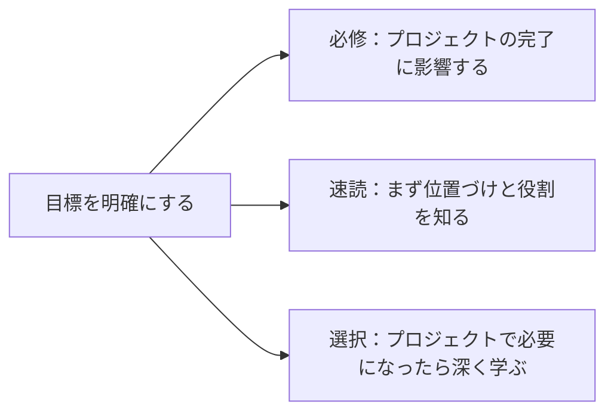

# 学習パスの層分け：必修、速読、選択

このコースは内容が多いので、目標によって同じ読み方をする必要はありません。自分の目標に合わせて、章を必修、速読、選択の深掘りに分けられます。

## 一目でわかる：同じ章に3つの読み方がある

| 読み方 | 判断基準 | どこまで学ぶか |
|---|---|---|
| 必修 | これがないと、今のプロジェクトが進まない | 最小例を動かせて、入力と出力を説明できる |
| 速読 | あとで使うが、最初の1回で深掘りする必要はない | 何を解決するのか、よくある落とし穴は何かを知る |
| 選択 | 特定の方向や卒業プロジェクトにだけ関係する | プロジェクトで必要になったときに、実験や事例を補う |

## ルート1：LLM アプリケーションエンジニアリング

できるだけ早く AI アプリ、RAG、Agent を作りたい学習者に向いています。

| モジュール | おすすめの読み方 |
|---|---|
| 開発ツール、Python、データ分析 | 必修。少なくとも最小プロジェクトを完成させる |
| AI 数学、機械学習、深層学習 | 主線は速読で通し、指標、学習、評価を理解する |
| 大規模モデルの原理、Prompt、RAG、Agent | 必修。ここが主戦場 |
| CV、従来の NLP、マルチモーダル | プロジェクトに応じて選択 |
| 工学化、評価、安全性 | 必修。実際に公開できるかを左右する |

## ルート2：モデル理解を強化する

モデル、学習、微調整、アルゴリズムを深く理解したい人に向いています。

| モジュール | おすすめの読み方 |
|---|---|
| 数学、機械学習、深層学習 | 必修。できるだけ実験を一通り行う |
| CV、NLP、Transformer、事前学習 | 必修、または深めの選択 |
| RAG、Agent | アプリケーションシステムの境界を速読で把握する |
| マルチモーダル、AIGC | 研究の興味に応じて選ぶ |

## ルート3：作品集ルート

学習の過程を作品にしたい人に向いています。

| ステージ | 作品集で重視する点 |
|---|---|
| Python | コマンドラインツール、または Web API |
| データ分析 | 共有できる EDA レポート |
| 機械学習 | baseline と指標を含む予測プロジェクト |
| 深層学習 | 学習曲線と失敗サンプルを含む学習実験 |
| RAG | 引用と評価セットを含むナレッジベースQ&Aアシスタント |
| Agent | trace と安全境界を含む、追跡可能なツール呼び出しアシスタント |
| マルチモーダル | 画像・テキスト/音声/動画のワークフロー作品 |

## どのときに飛ばしてよいかを判断する方法

この章が何を解決するのかを自分の言葉で説明でき、最小プロジェクトの出口まで完成できるなら、その先に進んで大丈夫です。すべての細かい部分を完全に理解できていないからといって、前で止まる必要はありません。多くの概念は、後ろのプロジェクトで何度も出てきます。
