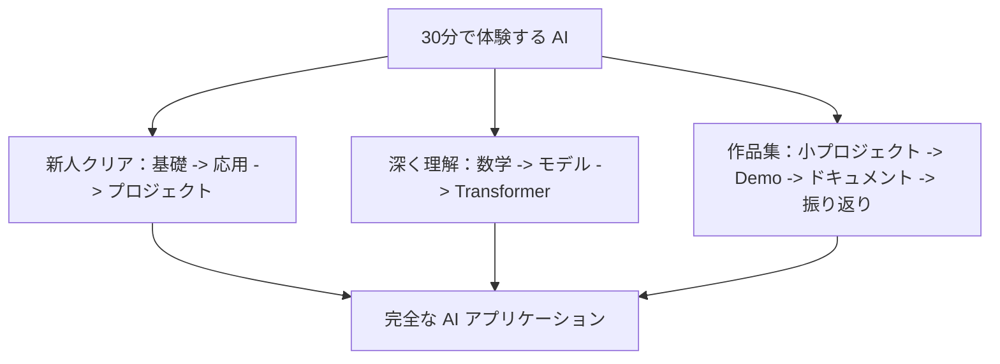

# おすすめの学習ルート

このコースにはたくさんの内容がありますが、最初からすべての分岐を一気に進める必要はありません。よりよい方法は、まず1本の主線を選び、基礎からプロジェクトまでを一通りやり切ってから、興味に応じて他の方向を補うことです。

## まずは学習モードを1つ選ぶ

| 学習モード | こんな人に向いている | 学び方 | 飽きにくくするポイント |
|---|---|---|---|
| 新人クリアモード | 少しプログラミングはできるが、AI の基礎が体系的ではない人 | ルート1を1から9まで順番に進み、各段階で最小プロジェクトを完成させる | 各章では「何ができるか」だけをまず押さえ、最初から細部を追いすぎない |
| 作品集モード | 就職、転職、実力のアピールをしたい人 | ルート1 + ルート3を同時に進め、各段階で1つ作品を残す | 学んだらすぐにプロジェクトの README、スクリーンショット、結果分析を更新する |
| 深い理解モード | アルゴリズム、学習、ファインチューニング、評価をやりたい人 | ルート2を進み、数学・深層学習・Transformer を多めに学ぶ | すべての概念で「前の世代のどんな問題を解決したのか」を考える |
| 速攻アプリケーションモード | 開発経験があり、できるだけ早く LLM アプリを作りたい人 | 1～6 をざっと見て、7～9 を重点的に学ぶ | 1つの実際の業務課題を通して Prompt、RAG、Agent をつなげて学ぶ |

どれを選ぶか迷ったら、デフォルトは「新人クリアモード」です。まずは1本の完全な主線を通し、そのあとで足りない部分を補強しましょう。

## 3本の主線を1枚で見る

## 時間と目標に合わせてルートを選ぶ

学習ルートは、興味だけで選ぶのではなく、使える時間と最終目標でも選びましょう。

| 現在の状況 | おすすめルート | 学習戦略 | 各段階の成果物 |
|---|---|---|---|
| 週3～5時間しか取れない | 最小クリアルート | 各段階では核心概念と1つの最小プロジェクトだけに絞る | README、実行コマンド、サンプル出力 |
| 週6～10時間取れる | アプリケーションエンジニアルート | Python、データ、Prompt、RAG、Agent を重点的に完成させる | 小プロジェクト、ログ、失敗サンプル、評価表 |
| 作品集や就職準備をしたい | 作品集ルート | 各メイン段階で見せられる証拠を残す | スクリーンショット/GIF、指標、振り返り、デプロイ説明 |
| 開発経験がある | 速攻アプリケーションルート | 基礎は素早く流し見し、LLM アプリの一連の流れに集中する | LLM API、RAG、Agent、リリースチェックリスト |
| モデル/アルゴリズムを目指したい | モデル理解ルート | 数学、機械学習、深層学習、Transformer を深める | 実験記録、モデル比較、誤差分析 |

ルートを決めたら、あまり頻繁に切り替えないようにしましょう。より安定したやり方は、まず1周目の主線を終え、その後で [全コース能力評価とクリア基準](/intro/assessment-standards) で弱点を確認し、最後に対応する章へ戻って補強することです。

## 重要な参考ページはこちら

| 必要なもの | 参照先 |
| --- | --- |
| 2025～2026年の AI アプリケーションエンジニアリングに追いつきたい | [2025-2026 AI アプリ技術マップ](/intro/modern-ai-stack) |
| 主線をさらに確認したい | [4本の主線学習ルート](/intro/main-learning-routes) |
| 1つのプロジェクトを通して学びたい | [通しプロジェクト：AI 学習アシスタント成長ルート](/intro/ai-learning-assistant-project) |
| RAG、Agent、マルチモーダルがどう段階的に進化するか見たい | [AI 学習アシスタント バージョンロードマップ](/intro/ai-learning-assistant-version-roadmap) |
| すでに明確なキャリア目標がある | [役割ベースのルート選択](/intro/role-based-paths) |
| プロジェクト品質を確認したい | [AI エンジニアリング評価とリリースチェックリスト](/intro/ai-engineering-checklist) |
| 毎週の計画が必要 | [学習ペースの計画](/intro/learning-schedule) |

## ルート切り替えのルール

| どこから切り替えるか | いつ切り替えるか | どう補うか |
|---|---|---|
| 新人クリア -> 作品集 | すでに3つ以上の段階プロジェクトを終えている | README、スクリーンショット、失敗サンプル、評価方法を補う |
| 速攻アプリケーション -> 体系学習 | RAG や Agent で基礎問題につまずくことが多い | Python、データ処理、HTTP/API、データベース基礎を補う |
| アプリケーションエンジニア -> モデル理解 | モデルの性能やファインチューニングに関心が出てきた | 数学、機械学習、深層学習、Transformer を補う |
| モデル理解 -> アプリケーションエンジニア | モデルの力を製品にしたい | バックエンド API、Prompt、RAG、ログ、デプロイを補う |

ルート切り替えで大事なのは、「もう一度全部やり直す」ことではなく、今のプロジェクトに足りない能力を補うことです。プロジェクトで問題を見つけ、それに応じて章で知識を補うと、学習がずっとスムーズになります。

## プロジェクトでのクリア線：各段階で1つ作品を残す

AI 学習がいちばん退屈になりやすい理由は、概念を見るだけで成果物がないことです。コース全体を作品のアップグレード線だと思って、各段階を終えるたびに、説明できて、動かせて、見せられる小さな成果を残すのがおすすめです。

| 段階 | クリア課題 | 作品の基準 |
|---|---|---|
| 1 開発者ツール基礎 | 開発環境を整え、コマンドラインと Git を使えるようにする | ゼロからプロジェクトを作成し、コードをコミットし、実行方法を説明できる |
| 2 Python プログラミング基礎 | 小さな問題を解決するスクリプトまたは API を書く | 入力、出力、例外処理があり、他人が実行できる |
| 3 データ分析と可視化 | 実データまたはシミュレーションデータを分析する | 前処理、重要なグラフ、結論、限界がある |
| 4 AI 数学の最小必要基礎 | 数式をモデルの直感に置き換える | ベクトル、確率、勾配がモデルの中で何をしているか説明できる |
| 5 機械学習入門から実践 | 予測、分類、クラスタリングのプロジェクトを作る | baseline、指標、誤差分析、改善方向がある |
| 6 深層学習と Transformer 基礎 | ニューラルネットワークの学習実験を最後まで動かす | 学習曲線、テスト結果、失敗サンプル分析がある |
| 7 大規模モデルの原理、Prompt、ファインチューニング | 安定した Prompt かファインチューニング案を設計する | なぜ Prompt、RAG、ファインチューニングを使うのか説明できる |
| 8 LLM アプリ開発と RAG | 引用付きのナレッジベースアシスタントを作る | 文書処理、検索、回答、引用、RAGOps ログ、評価サンプルがある |
| 9 AI Agent とエージェントシステム | 手順を分けて実行できる Agent を作る | ツール呼び出し、実行軌跡、権限の境界、失敗処理、ログがある |
| 10～12 方向拡張 | コンピュータビジョン、自然言語処理、または AIGC マルチモーダルを選んで卒業作品を作る | 問題定義、技術ルート、評価、発表資料がそろっている |

このクリア線は、どの学習ルートにも重ねて使えます。初心者は基礎版でよく、経験者は各作品をより完成度の高い工程プロジェクトにできます。

## 3つのルートの読み方

| ルート | 向いている人 | 1回目はどう読むか |
| --- | --- | --- |
| 応用型 AI フルスタック主線 | AI アプリケーションエンジニア、RAG、Agent、自動化ツールを作りたい人 | 1～9章を順番に進み、数学とモデルはまず直感をつかむ |
| モデル理解強化ルート | アルゴリズム、学習、ファインチューニング、評価、モデルエンジニアリングをやりたい人 | 数学、機械学習、深層学習、Transformer を多めに学ぶ |
| 作品集ルート | 就職、転職、実力のアピールをしたい人 | 各段階で README、スクリーンショット、結果分析、次の計画を残す |

どのルートも独立しているわけではありません。応用ルートには少しモデルの直感が必要で、モデルルートにもプロジェクト実践が必要です。作品集ルートでは、なおさら実際に動くコードが必要になります。

## どう選ぶか

迷ったら、まずはルート1を選びましょう。これは「少しプログラミングができる」状態から「AI アプリを作れる」状態へ進むのに最も向いています。

学習中に、モデルの内部で何が起きているのかをどうしても知りたくなるなら、機械学習と深層学習の部分で少し長めに立ち止まり、CV、NLP、数学の章も補いましょう。

もっと早く成果を見たいなら、各段階を終えるたびに小さなプロジェクトを1つ完成させてください。コースを全部学び終えてからプロジェクトを始めるのでは遅すぎます。プロジェクトは、あなたが本当に理解できていない部分を逆に見せてくれます。

## おすすめの学習ペース

初回学習では、すべての細部を完璧に理解しようとしないでください。「主線優先、プロジェクト駆動、後で方向を補う」という進め方がおすすめです。

各段階を終えたら、少なくとも1回は振り返りをしましょう。この段階は何を解決するのか、自分の言葉で核心概念を説明できるか、実際にコードを自分で動かしたか、見せられる小さな成果物があるか、を確認します。

ある章が難しすぎる場合は、まずその章が全体のどこにあるのかだけ理解して、先へ進んでかまいません。AI 学習は一度で直線的にクリアするものではなく、何度も戻って補強していくプロセスです。
