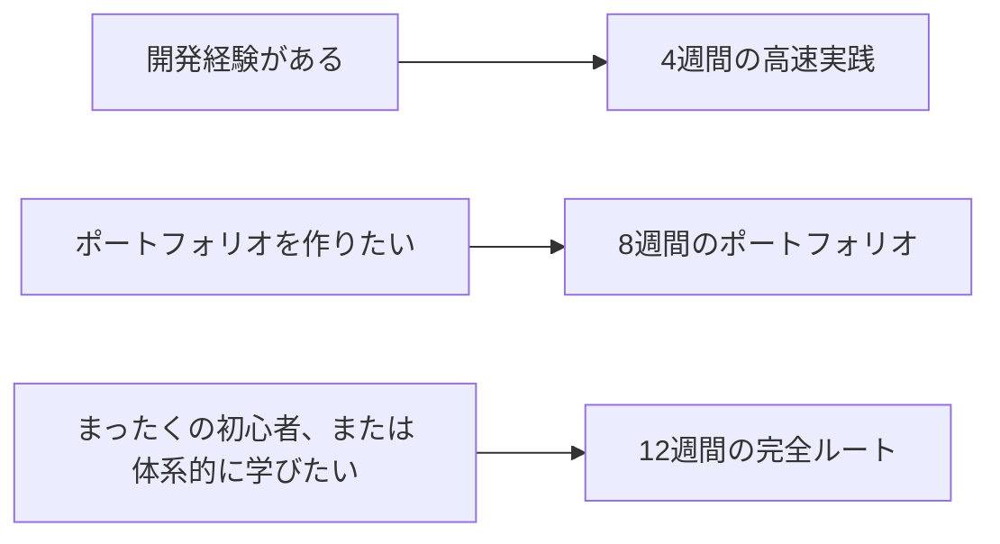

# 学習ペースの設計：4週間、8週間、12週間をどう進めるか

## この節の位置づけ

このコースは内容が多いので、記事の数だけを追って進めると、学びがどんどん散らばってしまいがちです。よりよい方法は、時間で区切って学ぶことです。毎週は1つの主軸だけに集中し、見せられる成果物を1つ残します。

このページは、唯一の進め方を決めるものではありません。4週間の高速実践ルート、8週間のポートフォリオルート、12週間の完全ルートという3つの実行しやすい計画を示します。自分の時間と基礎に合わせて、1つ選んでください。

## まずペースを選ぶ

| 今の状況 | おすすめのペース |
|---|---|
| すでにプログラミングはできていて、RAG/Agent のプロトタイプを素早く作りたい | 4週間ルート |
| AIアプリへの転向を目指し、安定したポートフォリオが必要 | 8週間ルート |
| 初心者で、基礎が体系化されておらず、環境やデータでつまずきやすい | 12週間ルート |

## 4週間の高速実践ルート

このルートは、すでにプログラミング経験があり、できるだけ早く LLM / RAG / Agent のプロトタイプを作りたい人向けです。細かい部分はかなり省きますが、評価、ログ、境界条件は省けません。

| 週 | 学習重点 | 成果物 |
|---|---|---|
| 第1週 | 1～6章をざっと確認し、Python、データ、モデル、Transformer の最小概念を補う | 動作する Python プロジェクトの土台と README |
| 第2週 | 7～8章を丁寧に読み、Prompt アシスタントと最小 RAG を作る | 出典引用付きの授業Q&Aデモ |
| 第3週 | 9章を丁寧に読み、最小 Agent とツール呼び出しの Trace を作る | タスク分解、ツール呼び出し、軌跡記録ができる Agent |
| 第4週 | 工程化、評価、コスト、安全性、デプロイの説明を補う | プロジェクト README、評価セット、失敗サンプル、デプロイ説明 |

4週間ルートの目標は、「すべてを学び終えること」ではなく、説明できる AI アプリ作品を素早く手に入れることです。面接前の追い込み、開発経験から AI アプリへの転向、あるいは自分がこの方向に向いているかを先に確かめたい人に向いています。

## 8週間のポートフォリオルート

このルートは、AIアプリ、RAG、Agent 開発へ転向したい多くの人に向いています。2週間ごとに1つの段階作品を作り、最後に1つのポートフォリオとしてつなげることを重視します。

| 週 | 学習重点 | 成果物 |
|---|---|---|
| 第1週 | 1～2章：環境、Git、Python 基礎 | コマンドライン学習アシスタント v0.2 |
| 第2週 | 3章：データ分析と可視化 | 学習データ分析レポートと図表 |
| 第3週 | 4～5章：数学の直感と機械学習 | 学習タスク分類または進捗予測の baseline |
| 第4週 | 6章：深層学習と Transformer | 小規模な学習実験と学習曲線 |
| 第5週 | 7章：大規模モデルの原理、Prompt、微調整 | Prompt アシスタント、Prompt のバージョン、失敗サンプル |
| 第6週 | 8章：RAG とアプリ開発 | 出典、ログ、評価セット付きの RAG アシスタント |
| 第7週 | 9章：Agent システム | ツール呼び出し、Trace、権限境界付きの Agent |
| 第8週 | 工程化の仕上げと方向別の選択学習の予備調査 | ポートフォリオ README、スクリーンショット、デプロイ説明、次の計画 |

8週間ルートで最も大事なのは、継続して蓄積することです。毎週の終わりに README を更新しましょう。今週どんな能力を追加したか、どう実行するか、入力と出力の例は何か、失敗サンプルは何か、次にどう改善するかを残してください。

## 12週間の完全ルート

このルートは、初心者や、基礎を体系的に補いたい人に向いています。プログラミング、データ、モデル、大規模モデルアプリ、RAG、Agent、多モーダルまで、より安定してカバーします。

| 週 | 学習重点 | 成果物 |
|---|---|---|
| 第1週 | 1章：開発者ツールの基礎 | Git リポジトリ、環境のスクリーンショット、プロジェクト構成 |
| 第2週 | 2章：Python プログラミング基礎 | コマンドラインツールまたは簡単な API |
| 第3週 | 3章：データ分析と可視化 | データクリーニング、分析図表、結論 |
| 第4週 | 4章：AI 数学の最小基礎 | ベクトル、確率、勾配の概念カードと小実験 |
| 第5週 | 5章：機械学習 | baseline、指標、誤りサンプル分析 |
| 第6週 | 6章：深層学習と Transformer | 学習実験、loss 曲線、振り返り |
| 第7週 | 7章：LLM の原理、Prompt、微調整 | Prompt アシスタントと Prompt 評価記録 |
| 第8週 | 8章：RAG 基礎 | 最小 RAG、出典引用、検索ログ |
| 第9週 | 8章の発展：RAGOps と工程化 | 評価セット、失敗サンプル、コスト記録、デプロイ説明 |
| 第10週 | 9章：Agent 基礎とツール | 最小 Agent、ツール schema、実行軌跡 |
| 第11週 | 9章の発展：AgentOps と安全性 | 権限境界、手動確認、失敗復旧、評価タスクセット |
| 第12週 | 12章：多モーダル、または卒業プロジェクト | 多モーダル学習アシスタント、クリエイティブワークベンチ、または方向別ポートフォリオ |

12週間ルートは、ゼロから体系を作るのに向いています。大事なのは毎日たくさん学ぶことではなく、毎週1つずつ保存できる成果を残すことです。

## 毎週の振り返りテンプレート

毎週の終わりには、次の6つの質問で振り返ることをおすすめします。「某章を学んだ」と書くだけで終わらせないようにしましょう。

| 振り返りの質問 | 回答の例 |
|---|---|
| 今週は何の問題を解決したか？ | 文書を扱えなかったところから、出典付きで RAG 回答ができるようになった |
| 何の能力を新しく身につけたか？ | 文書分割、検索、引用、評価セット |
| どんなコードを動かせるようになったか？ | `python -m src.rag.demo` |
| どんな失敗があったか？ | 検索で関係のない断片が返ってきた |
| どうやって原因を突き止めたか？ | top-k の断片を出力して、chunk が短すぎると分かった |
| 来週は何を優先して直すか？ | Hybrid Search を追加し、評価セットを固定する |

## 基礎が違う人はどう調整するか

すでに Python ができるなら、第1～2週は数日で圧縮し、その分の時間を8～9章に回せます。機械学習の経験があるなら、第4～6章は素早く流しても大丈夫ですが、評価、学習曲線、誤りサンプルは飛ばさないでください。これらの力は、RAG や Agent の評価でもそのまま必要になります。

まったくの初心者なら、4週間ルートが速そうだからといって無理に選ばないでください。初心者には12週間ルートのほうが向いています。AIアプリ工程で本当に詰まりやすいのは、モデル名そのものではなく、環境、データ形式、APIエラー、ログ、評価、プロジェクトの境界だからです。

## 合格基準

どのルートを選んでも、最終的には少なくとも4種類の材料を残すべきです。動作するプロジェクトリポジトリ、プロジェクトの目的と実行方法を説明できる README、評価またはテストのサンプル集、失敗サンプルと改善記録です。

これらをきちんと説明できれば、単に「コースを見た」だけではなく、コースを自分のプロジェクト経験に変えられたということです。
