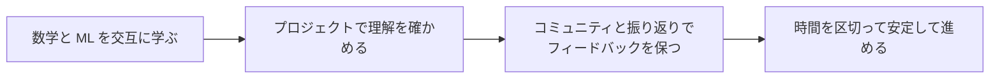

# 学習戦略のおすすめ

> 方法が合えば、効果は何倍にもなります。このページでは、実践で効果が確認された3つの学習法を紹介します。**本格的に学び始める前に、ぜひ読んでおくことを強くおすすめします。**

---

## まず全体像を見る：3つの戦略を組み合わせる

| 戦略 | 何の問題を解決するか | 毎週の最小アクション |
|---|---|---|
| 数学 + ML の融合 | 数学を長く学んだのに AI の効果が見えないのを防ぐ | 数学の直感を1つ学び、モデルの小さな例を1つ動かす |
| プロジェクト駆動 | 教材を見るだけで、能力の証拠が残らないのを防ぐ | 各段階で1つ、動くプロジェクトを残す |
| コミュニティと振り返り | 1人で長く行き詰まるのを防ぐ | 毎週1つ、質問か結果を共有する |

## 戦略1：数学 + 機械学習の融合学習法

### なぜ数学を全部学んでから ML を始めないの？

よくある考え方は「まず数学をしっかり固めてから、機械学習を学ぶ」です。聞こえはもっともですが、実際には大きな問題があります。

> 2か月数学だけを学んで、まだ AI に触れていないと、熱意が下がり、やる気がゼロになって、そのままやめてしまいます。

私たちの方針は、**数学を1章学んだら、すぐに ML で試してみる**ことです。ベクトルと行列を学んだら、すぐに線形回帰を実装して、ベクトル計算がどうやって家賃を計算するのか見てみましょう。確率論を学んだら、すぐにロジスティック回帰の損失関数を見て、なぜ交差エントロピーを使うのかを理解します。

### 具体的にどうやって交互に学ぶの？

| ステップ | 先に学ぶ数学（4 AI 数学の最小必須基礎） | そのあとにやる ML（5 機械学習入門から実践まで） | 得られること |
|:---:|---------|---------|----------|
| **第1歩** | 線形代数：ベクトル、行列演算 | ML 基礎 + 線形回帰 | 学んだばかりの行列演算で回帰を理解でき、すぐ達成感が得られる |
| **第2歩** | 確率・統計 | ロジスティック回帰 + 決定木 | ベイズの定理で分類を理解し、学んだことをすぐ使える |
| **第3歩** | 微積分と最適化 | アンサンブル学習 + 完成版 ML プロジェクト | 勾配降下法を理解したあと、アルゴリズムと実践に集中できる |

数学の各章を学び終えるたびに、コース内の **🔀 融合学習ジャンプ** が案内され、ML のどこへ進むべきかが分かるようになっています。

### 3つの実践アドバイス

**1. 100% 理解を目指しすぎない**

AI エンジニアに必要なのは、「数学を使って問題を解決できること」であって、「数学の証明を書けること」ではありません。ある式を3回見てもまだよく分からない？ まずはその**直感的な意味**を覚えて、NumPy のコードで実行して結果を見てから、先に進みましょう。実践で何回か使っていくうちに、自然と分かるようになります。

**2. 数学が苦手なら、これらの動画を見る**

- **3Blue1Brown** の線形代数と微積分のシリーズ（B 站で「3b1b」と検索すると中国語字幕付きで見られます）
- これは世界で最も優れた数学の可視化教材です。間違いなくトップクラスです
- 全部を見る必要はありません。4 AI 数学の最小必須基礎で学ぶ各章に合わせて、対応する動画だけ見れば十分です

**3. この言葉を覚えておく**

> 「私は数学者になる必要はない。AI の問題を数学で解ければいい。」

このコースの数学パートは、すべてコード + 可視化で説明します。黒板の上で数式をひたすら導くやり方ではありません。

---

## 戦略2：プロジェクト駆動学習法

### なぜプロジェクトは教材より大事なの？

残酷な事実があります。100時間教材を見るより、自分で10時間プロジェクトを作るほうが効果があります。

理由はシンプルです。教材を見ているとき、脳は「受け取るモード」（分かった分かった）にあります。でもプロジェクトを作るとき、脳は「創るモード」（えっ、この bug は何？ このパラメータはなぜこう設定するの？）になります。本当に知識を能力に変えられるのは、創るモードだけです。

### 各段階のプロジェクト計画

このコースでは、各段階にプロジェクトが用意されています。**1つひとつ丁寧に完成させてください。**

| 段階 | プロジェクト | 得られるもの |
|------|------|------------|
| 1 開発者ツール基礎 | 開発環境を整える | これ自体が最初の成果になる |
| 2 Python プログラミング基礎 | コマンドラインツール、スクレイピング、Web API、AI API 体験 | Python プログラミング力 + 4つの作品 |
| 3 データ分析と可視化 | 完全な EDA データ分析レポート | データ分析力 |
| 4～5 AI 数学と機械学習 | 住宅価格予測、顧客離反予測、ユーザーセグメント分け | ML モデリングの一連の流れ |
| 6 深層学習と Transformer 基礎 | 画像分類、テキスト感情分析 | PyTorch の実践力 |
| 8 LLM アプリ開発と RAG | 企業ナレッジベース質問応答システム（RAG） | 大規模言語モデルアプリ開発力 |
| 9 AI Agent とインテリジェントエージェントシステム | スマートリサーチアシスタント、データ分析 Agent | Agent 開発力 |

### プロジェクトの進め方

プロジェクトは「教材を見ながらそのまま写す」ことではありません。正しい方法は次の通りです。

1. **まず10分、自分で考える：** 要件を見たら、すぐに答えを見るのではなく、まず大まかな方針を考える
2. **行き詰まったらヒントを見る：** 各プロジェクトには段階的なヒントがあります。詰まったら1つずつ見て、全部は見ない
3. **動いたら改善する：** まずはコードを動かす（見た目が悪くてもOK）。そのあとで改善する
4. **README を書く：** 各プロジェクトごとに README を作り、何をしたか、何を使ったか、結果はどうだったかをはっきり書く。これは将来の就職用ポートフォリオの素材になります
5. **GitHub に置く：** 最初のプロジェクトから、GitHub に積み上げていきましょう

### プロジェクトを終えたあとの自己チェックリスト

1つのプロジェクトが終わったら、次のことを自分に質問してみてください。

- [ ] コードを見ずに、自分の言葉でこのプロジェクトが何をしたか説明できるか？
- [ ] データが変わっても、コードを修正して新しいデータに対応できるか？
- [ ] なぜこのモデル/方法を選んだのか聞かれたら、理由を説明できるか？
- [ ] コードにコメントはあるか？ 他の人が読んで理解できるか？

---

## 戦略3：コミュニティ学習法

### なぜ1人で学ぶとやめやすいの？

独学最大の敵は、難しさではなく**孤独**です。バグが出ても聞ける人がいない、学習が行き詰まっても励ましてくれる人がいない、他の人の進み具合が見えず比較対象がない。学習コミュニティに入ると、この3つの問題を解決できます。

### おすすめの参加方法

| プラットフォーム | 参加方法 | 得られるもの |
|------|---------|------------|
| **GitHub** | 関連プロジェクトに Star を付ける、Issue を出す、コードに貢献する | オープンソース協業を学ぶ、ポートフォリオを作る |
| **Kaggle** | 入門コンペに参加する、優れた Notebook を学ぶ | 実データでの実践、ベストプラクティス |
| **Discord** | HuggingFace、LangChain のコミュニティに参加する | 世界中の開発者と交流する |
| **知乎 / B站** | AI の話題をフォローする、学習動画を見る | 中国語の情報源、学習経験 |
| **微信群** | AI 学習グループを探す | 質問し合う、リソースを共有する |
| **Reddit** | r/learnmachinelearning | 国際的な視点、英語の情報源 |

### コミュニティ参加のペースの目安

コミュニティに時間を使いすぎる必要はありません。週に2〜3時間で十分です。

- **毎日：** 5分だけコミュニティの議論を見て、面白い話題がないか確認する
- **毎週：** 誰かの質問に1つ答える（教えることは、最高の学びです）
- **毎月：** 自分の学習進捗やプロジェクト成果を1回共有する

:::tip ひとつの実証済みの方法
**フェイマン学習法：** ある概念を学んだら、できるだけ簡単な言葉で他の人に説明してみましょう（コミュニティの人でも、アヒルでも大丈夫です）。うまく説明できないなら、まだ本当に理解できていないということです。
:::

---

## 補足戦略：時間管理

### ポモドーロ・テクニック（おすすめ）

- 学習25分 → 休憩5分 → 学習25分 → 休憩5分
- ポモドーロ4回ごとに15〜30分休憩する
- AI 学習では新しい概念がたくさん出てくるので、25分単位がちょうどいいです

### よくある落とし穴を避ける

| 落とし穴 | 表れ方 | 解決策 |
|------|------|---------|
| **教材地獄** | 1つの概念を5本の動画で見てもまだ見続けている | 1つ見たら、すぐにコードを書く |
| **完璧主義** | 1つの bug で3時間止まる | 30分以上かかったら検索するか、誰かに聞く |
| **保存だけして見ない** | 200個の教材を保存したのに、1つも見ていない | 今の段階で必要なものだけを見る |
| **飛び級学習** | 歩く前に走ろうとする | 段階順に進める。飛ばさない |
| **見るだけで練習しない** | 「分かった」=「できる」という勘違い | 教材を閉じて、最初から自分で書き直す |

---
