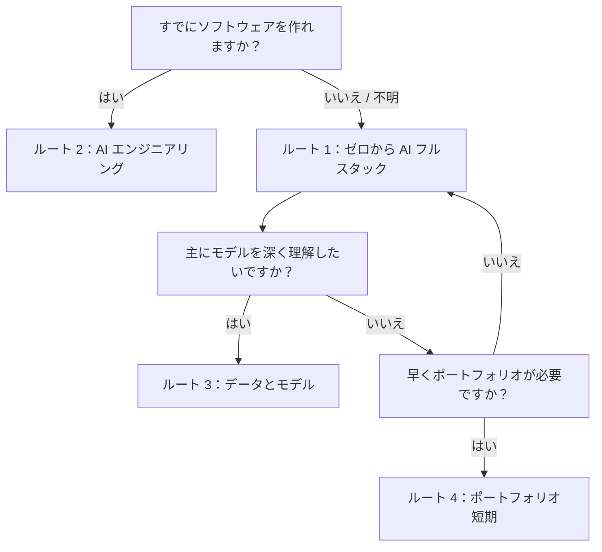

# 4 つの主な学習ルート

迷う場合は **ルート 1** を選んでください。標準ルートで、多くの学習者にとって一番安定しています。

## ルートカード

| ルート | 向いている人 | 初回に深く読むもの | 最初に見える成果 |
| --- | --- | --- | --- |
| 1. ゼロから AI フルスタック | 初心者、または全体を通して学びたい人 | 第 1-3 章、その後 第 7-9 章 | 学習アシスタントまたはコース Q&A Demo |
| 2. AI エンジニアリング | すでにソフトウェアを作れる人 | Python プロジェクト構成、API、RAG、Agent、デプロイ | デプロイ可能な LLM アプリまたは自動化ツール |
| 3. データとモデル理解 | データ、ML、モデル評価、研究支援を目指す人 | データ、数学、ML、DL、評価 | 指標と失敗例を含む実験レポート |
| 4. ポートフォリオ短期ルート | 就職、転職、能力証明を急ぐ人 | プロジェクトページ、README、評価、Demo | 3-5 個の小プロジェクト + 1 個の主プロジェクト |

## すばやく選ぶ

毎日ルートを変えないでください。まず 1 つのステージを終え、プロジェクト証拠を見てから調整します。

## どのルートでも必要な最低基準

どのルートを選んでも、各ステージで次を残します。

| 証拠 | 意味 |
| --- | --- |
| 実行コマンド | 他の人が再現できる |
| サンプル入力と出力 | 結果が見える |
| 失敗例 | どこで壊れるか分かっている |
| 評価または確認 | 偶然動いただけの Demo ではない |
| 次の一歩 | どう改善するか分かっている |

ルートは学習順にすぎません。本当の進捗証明はプロジェクトの証拠です。
