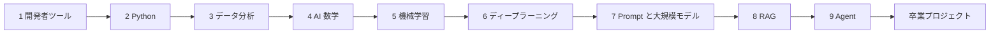
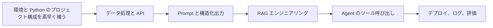
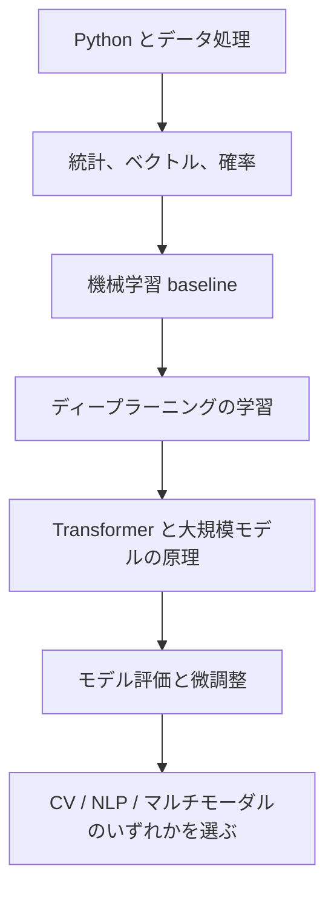
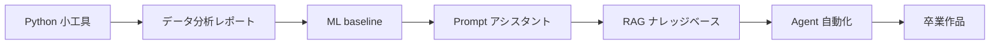

# 4本の主な学習ルート

このコースは、順番どおりに全部学ぶこともできますし、目標に合わせて主なルートを選ぶこともできます。ルートの役割は内容を減らすことではなく、1回目にどの内容を深く読み、どの内容はまず「ある場所を知っておく」程度にし、どの内容はプロジェクトが必要になったときに戻ってくるかを示すことです。

どれを選べばよいか迷ったら、デフォルトでは「初心者向けフルスタック AI アプリケーションルート」を選びましょう。いちばん安定していて、ツール、Python、データから RAG、Agent、卒業プロジェクトまで進むのに最適です。

## 4本のルートの選び方

| ルート | 向いている人 | 最初の目標 | 最終的な成果物 |
|---|---|---|---|
| 初心者向けフルスタック AI アプリケーションルート | 少しだけPC操作ができる人、またはプログラミングを始めたばかりの人 | 環境、Python、データから AI アプリケーションまで一通り完走する | AI学習アシスタント、または講座Q&Aアシスタント |
| 開発経験者向け AI エンジニアルート | すでにコード、API、または製品開発ができる人 | データ、Prompt、RAG、Agent、そしてエンジニアリングを素早く補う | デプロイ可能な LLM アプリ、または Agent ツール |
| データとモデル理解ルート | データ分析、機械学習、モデル評価を目指す人 | データ、指標、モデル学習、誤差分析を深く理解する | データ分析 + ML/DL 実験レポート |
| ポートフォリオ集中ルート | 就職、転職、スキルアピールの準備をしたい人 | 動かせる、説明できる、評価できるプロジェクトを最速で積み上げる | 3〜5個のプロジェクトセット + 卒業作品 |

4本のルートは切り替え可能ですが、毎日切り替えないようにしましょう。より良い方法は、まず1本のルートで1つの段階を終え、そのあとプロジェクトで見つかった問題に応じて戻って補講することです。

## ルート1：初心者向けフルスタック AI アプリケーションルート

このルートは、ほとんどの学習者に向いています。コースの標準順序に沿って進み、目標は完全な能力のつながりを作ることです。つまり、環境をセットアップできる、Python を書ける、データを扱える、モデルの基本ロジックを理解できる、最後に RAG、Agent、卒業プロジェクトまで作れる、という状態です。

1回目の学習では、各段階で「最小プロジェクトを1つ動かせること、重要な概念を説明できること、失敗サンプルを1つ記録できること」だけを目指します。数学、ディープラーニング、Transformer は一度で専門家レベルになる必要はありませんが、なぜそれらが後の Embedding、検索、Prompt、モデル評価、マルチモーダルを支えているのかは理解しておきましょう。

| 段階 | 1回目の重点 | ひとまず深掘りしなくてよいもの | 必須成果物 |
|---|---|---|---|
| 1〜3 | 環境、Python、データ読み込み、クリーニング、グラフ作成 | 複雑なツールチェーンや高度な Pandas テクニック | 実行可能なスクリプト、データ分析グラフ |
| 4〜6 | ベクトル、確率、baseline、学習曲線、過学習 | 複雑な数式導出や大規模学習 | baseline、指標、失敗サンプル |
| 7〜9 | Prompt、構造化出力、RAG、ツール呼び出し、Agent trace | 高度なフレームワークの詳細や複雑な multi-Agent | RAG Q&A、Agent 実行トレース |
| 10〜12 | 1つの方向を選んで卒業作品を作る | 3つの方向すべてを深く作る | 発表できる卒業プロジェクト |

到達基準は、ゼロから AI アプリケーションプロジェクトを作成できること、そのデータがどこから来たのか、モデルまたは LLM が何をしたのか、結果をどう評価したのか、失敗したときにどう振り返るのかを説明できることです。

## ルート2：開発経験者向け AI エンジニアルート

このルートは、すでにコード、API、フロントエンド、またはバックエンドを書ける人に向いています。基礎文法で長く立ち止まる必要はありませんが、データ、評価、エンジニアリングの境界は飛ばしてはいけません。飛ばすと、あとで RAG や Agent を作るときに、入出力、ログ、権限、デプロイで詰まりやすくなります。

| 学習区分 | 丁寧に読む内容 | さっと見る内容 | プロジェクトでやること |
|---|---|---|---|
| 基礎補強 | Python ファイル、例外、API、データ処理 | ターミナル基礎、文法入門 | 既存の開発習慣を Python プロジェクトに移す |
| AI アプリ | Prompt、LLM API、構造化出力、RAG | 機械学習アルゴリズムの詳細 | 講座や業務のナレッジベースアシスタントを作る |
| システムエンジニアリング | ツール schema、Agent trace、権限、安全性、ログ | 複雑な multi-Agent フレームワーク | 制御しやすい Agent、または自動化ツールを作る |
| 納品と公開 | README、環境変数、デプロイ、監視、コスト見積もり | 大規模学習 | 発表可能な Demo と評価レポートを作る |

このルートでいちばん起こりやすいミスは、「API はつなげるけれど、評価できない」ことです。どの LLM 機能にも、固定テスト例、失敗サンプル、ログ項目、回帰チェック方法を残しましょう。

## ルート3：データとモデル理解ルート

このルートは、データ分析、機械学習、モデル評価、モデルエンジニアリング、または研究アシスタントを目指す人に向いています。データ品質、数理的な直感、baseline、実験記録、誤差分析をより重視します。

| 学習区分 | 重要な問い | プロジェクトの証拠 |
|---|---|---|
| データ分析 | データは信頼できるか、結論に限界はあるか | データ辞書、クリーニングログ、グラフの説明 |
| 数学と指標 | 類似度、確率、loss、指標はそれぞれ何を説明するか | 小さな実験、指標の説明、手計算の例 |
| 機械学習 | baseline とは何か、データリークはないか | train/test 分割、指標表、誤りサンプル |
| ディープラーニング | loss はなぜ変化するのか、モデルはどこで失敗するのか | 学習曲線、混同行列、失敗画像またはテキスト |
| 大規模モデルと評価 | Prompt、RAG、微調整はそれぞれ何に向いているか | 比較実験、固定テストセット、結論の範囲 |

このルートは理論だけを学ぶものではありません。各モデル概念を必ず1つの実験に落とし込みましょう。入力は何か、出力は何か、指標は何か、失敗サンプルは何か、次の改善は何か、まで確認します。

## ルート4：ポートフォリオ集中ルート

このルートは、時間に制約があり、できるだけ早くポートフォリオを作りたい人に向いています。すべての章を最深部まで読むことが目的ではなく、プロジェクト主導で学び、作りながら不足分を補うことが中心です。

| 期間 | 学習重点 | ポートフォリオ成果物 |
|---|---|---|
| 第1段階 | 環境、Python、README、Git | 動く小さなツール |
| 第2段階 | データクリーニング、可視化、結論の表現 | 1つのデータ分析レポート |
| 第3段階 | baseline、指標、エラーサンプル | 1つの ML または分類実験 |
| 第4段階 | Prompt、構造化出力、LLM API | 1つの Prompt アシスタント |
| 第5段階 | 文書処理、検索、引用、評価 | 1つの RAG Q&A プロジェクト |
| 第6段階 | ツール呼び出し、trace、権限、失敗回復 | 1つの Agent 自動化プロジェクト |
| 第7段階 | デプロイ、デモ、振り返り、ポートフォリオ化 | 1つの卒業作品 |

ポートフォリオ集中ルートでは、「成功デモだけを作る」のは避けなければいけません。各プロジェクトには少なくとも README、実行コマンド、入出力例、評価方法、失敗サンプル、次の計画を入れましょう。就職準備では、機能の数が多いことよりも、プロジェクトをきちんと説明できることのほうが重要です。

## ルートの切り替えと戻り方のルール

学習中に詰まっても、すぐにルート全体を否定しないでください。まず、どの層で詰まっているのかを判断し、その章に戻って最小限の能力を補いましょう。

| 現在のルート | よくあるつまずき | 戻り方 |
|---|---|---|
| 初心者向けフルスタックルート | 後半の内容が多く、RAG と Agent が混ざってしまう | まず RAG Q&A を完成させてから Agent を作る。すべてのフレームワークを同時に追わない |
| AI エンジニアルート | API は動くが、答えが安定しない | データ、評価、Prompt schema、RAG 評価を見直す |
| データ・モデルルート | 理論はわかるが、プロジェクトの見せ方が弱い | README、プロジェクトの納品基準、ポートフォリオ一覧を見直す |
| ポートフォリオ集中ルート | プロジェクトは見せられるが、原理を説明しづらい | 能力マップ、数学の最小基礎、モデル評価を見直す |

ある段階で3回続けて詰まったら、追加資料を読み続けるより、まず最小実験をしましょう。動かせる、再現できる、記録できる、これが次の段階に進めるサインです。

## 各ルートの最低卒業基準

どのルートを選んでも、最後には必ず1つの完全なプロジェクトを提出できるようにしましょう。完全なプロジェクトとは、機能が最も多いことではなく、問題定義、実行方法、入出力、評価例、失敗分析、改善計画がはっきりしていることです。

| ルート | 最低卒業作品 | 必ず示すべきこと |
|---|---|---|
| 初心者向けフルスタック AI アプリケーション | AI学習アシスタント、または講座Q&Aアシスタント | 基礎から AI アプリケーションまでの完全な流れ |
| AI エンジニアルート | デプロイ可能な LLM / RAG / Agent アプリ | エンジニアリングが動く、観測できる、回帰確認できる |
| データとモデルルート | モデル実験、または評価レポート | データが信頼できる、指標が明確、結論に範囲がある |
| ポートフォリオ集中ルート | 3〜5個のプロジェクトセットと1つの主力プロジェクト | 見せられる、説明できる、振り返れる |

ルートは学習順序にすぎず、プロジェクトこそが能力の証拠です。1つの段階を終えるたびに、プロジェクトへ戻って実行記録を1つ、結果のスクリーンショットを1枚、または失敗サンプルを1つ追加しましょう。そうすると学習がより安定します。
