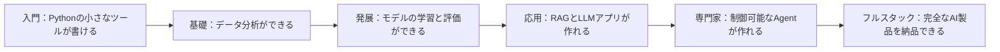

# 学習マイルストーン

> 1つの複雑なスキルを学ぶとき、一番こわいのは難しさではなく、**自分がどこまで進んだのか、あとどれくらいかかるのかが分からないこと**です。  
> このページは、あなたの地図です。マイルストーンに着いたらここに戻ってきて、確認しましょう。あなたはちゃんと前に進んでいます。

---

## 1枚で分かる6つのマイルストーン

各マイルストーンでは、「どの章を学び終えたか」だけでなく、「どんな成果物を出せるか」も見るようにしましょう。プロジェクト、スクリーンショット、評価表、失敗例、振り返りこそが、次の段階へ進んだ証拠です。

## 全体像：ゼロからAIフルスタックまでの6つのマイルストーン

| マイルストーン | 学習完了ステージ | できること | 求職の目安 | フルタイム学習時間 |
|:---:|---------|----------|---------|:---:|
| 🌱 **入門** | 1 開発者ツール基礎、2 Pythonプログラミング基礎 | Pythonで自動化スクリプト、クローラー、簡単なAPIを作る | まだAI職種には応募できないが、Python職種なら挑戦可能 | 1〜2か月 |
| 🌿 **基礎** | + 3 データ分析と可視化 | データ分析、可視化レポート、データクレンジング | データ分析のインターンに挑戦可能 | 3〜4か月 |
| 🌳 **発展** | + 4 AI数学、5 機械学習、6 深層学習 | AIモデルの学習、画像分類、テキスト分類 | AIエンジニアのインターンに挑戦可能 | 6〜8か月 |
| 🌲 **応用** | + 7 大規模モデルの原理、8 RAGアプリケーション | AIアプリ開発、大規模モデルのファインチューニング、RAGシステム構築 | **AIアプリケーションエンジニア** | 10〜12か月 |
| 🏆 **専門家** | + 9 AI Agent とインテリジェントエージェントシステム | AI Agent開発、自律推論システム、マルチAgent協調 | **上級AIエンジニア** | 12〜15か月 |
| 🎯 **フルスタック** | すべての学習ステージ + デプロイ | アルゴリズムから製品までの一連の開発 | **AIフルスタックエンジニア / Tech Lead** | 16〜20か月 |

:::note 時間の見積もりについて
上記はフルタイム学習（1日6〜8時間）の目安です。パートタイム学習（1日2〜3時間）の場合は、およそ2〜2.5倍の時間がかかります。人によってペースは違うので、数字にこだわりすぎなくて大丈夫です。大切なのは**継続して前進すること**です。
:::

---

## 各マイルストーンの詳しい説明

### 🌱 マイルストーン1：入門（1 開発者ツール基礎 + 2 Pythonプログラミング基礎）

**完了したこと：**
- ターミナル、Git、VS Code などの開発ツールを使えるようになった
- Pythonの基本文法、データ構造、関数、オブジェクト指向を学んだ
- 4つの小さなプロジェクト（コマンドラインツール、クローラー、Web API、AI API体験）を完成させた

**能力レベル：**
- Pythonで200〜500行くらいのプログラムが書ける
- インターネットからデータを取得して保存できる
- FastAPIで簡単なバックエンドサービスを作れる
- 大規模モデルAPIを呼び出して簡単なアプリを作れる

**実感：** 「やっと、コンピュータを自分の思い通りに動かせるようになった！コードはまだそんなにきれいじゃないけど、ちゃんと動いている。」

**セルフチェック：** 教材を見ずに、「数字当てゲーム」を1つ独力で書けますか？ `requests` ライブラリを使って、あるWebサイトからタイトル一覧を取得できますか？

---

### 🌿 マイルストーン2：基礎（+ 3 データ分析と可視化）

**完了したこと：**
- NumPy、Pandas、Matplotlib などのデータ分析ツールを使えるようになった
- データクレンジング、探索的分析、可視化を学んだ

**能力レベル：**
- CSVデータセットを1つ受け取ったら、独力でデータ分析の一連の流れを完了できる
- 分かりやすいデータ可視化グラフを作れる
- データを使って業務上の質問に答えられる（「どの月の売上が一番高い？」「ユーザー離脱率はどのくらい？」）

**実感：** 「データの中には、こんなにたくさんの物語が隠れていたんだ！1枚のグラフで、1つのことを分かりやすく伝えられる。」

**セルフチェック：** Kaggleからデータセット（たとえばタイタニック生存予測データセット）をダウンロードして、Pandasで完全なEDAを行い、少なくとも5枚の意味のあるグラフを描けますか？

---

### 🌳 マイルストーン3：発展（+ 4 AI数学、5 機械学習、6 深層学習）

**完了したこと：**
- 線形代数、確率統計、微積分がAIでどう使われるかを理解した
- 代表的な機械学習アルゴリズム（線形回帰、ロジスティック回帰、決定木、ランダムフォレスト、XGBoost）を身につけた
- PyTorchフレームワークと深層学習のコア概念（CNN、RNN、Transformerの基礎）を学んだ

**能力レベル：**
- 機械学習プロジェクトの全工程（データ処理 → 特徴量エンジニアリング → モデル学習 → 評価と改善）を独力で進められる
- PyTorchでニューラルネットワークを構築して学習できる
- 画像分類、テキスト分類などの実タスクに取り組める
- AIの核心原理を体系的に理解している

**実感：** 「昔はAIを魔法みたいに思っていたけど、今は数学 + データ + コードだと分かった。神秘的ではないけれど、本当に精巧だ。」

**セルフチェック：** PyTorchでCNNをゼロから実装して、CIFAR-10データセットで80%以上の精度まで学習できますか？ 手書きで逆伝播の簡単な導出ができますか？

---

### 🌲 マイルストーン4：応用（+ 7 大規模モデルの原理、8 LLMアプリ開発とRAG）

**完了したこと：**
- 大規模言語モデルの原理（Transformer、事前学習、ファインチューニング、アライメント）を理解した
- PromptエンジニアリングとLoRAファインチューニングを身につけた
- RAGシステムの開発、ローカル大規模モデルのデプロイ、本番レベルのAIサービス構築を学んだ
- Docker、FastAPI などのエンジニアリングスキルを身につけた

**能力レベル：**
- 企業向けのナレッジベースQAシステム（RAG）を独力で開発できる
- オープンソースの大規模モデルを特定分野向けにファインチューニングできる
- DockerでAIサービスをパッケージ化してデプロイできる
- ログ、エラー処理、APIドキュメントを備えたコードが書ける

**実感：** 「もう本当に、ユーザーが使えるAI製品を作れるようになった。デモを動かすだけの段階ではない。」

**セルフチェック：** PDF文書を大量に読み込む → ベクトル化してデータベースに保存する → ユーザーの質問時に関連内容を検索する → 大規模モデルで回答を生成する、というRAGシステムを独力で構築できますか？

:::tip 求職のマイルストーン
この段階まで来れば、あなたはすでに **AIアプリケーションエンジニア** に必要な核心能力を備えています。できるだけ早く就職したいなら、ここから履歴書と面接対策を始めましょう。
:::

---

### 🏆 マイルストーン5：専門家（+ 9 AI Agent とインテリジェントエージェントシステム）

**完了したこと：**
- AI Agentのコアアーキテクチャ（推論、ツール利用、メモリシステム）を身につけた
- MCPプロトコル、LangGraph、CrewAI などのフレームワークを学んだ
- 単体AgentとマルチAgent協調システムを開発できる
- Agentの評価、安全対策、本番デプロイの能力を備えた

**能力レベル：**
- 自律的に推論し、ツールを呼び出し、文脈を記憶できるAI Agentを設計・開発できる
- マルチAgent協調システムを構築できる（たとえば、調査Agent + 執筆Agent + レビューAgentが協力して調査レポートを完成させる）
- Agentの性能評価、安全対策、コスト管理ができる

**実感：** 「AIはもうただのQ&Aツールではない。複雑なワークフローを自動でこなしてくれる。自分は『AI社員』を作っているんだ。」

---

### 🎯 マイルストーン6：フルスタック（全ステージ + 選択科目）

**完了したこと：**
- メインラインをすべて終え、選択モジュールは必要に応じて学習した
- CV、NLP、AIGC、Agentについて理解し、少なくともそのうち1〜2分野は深く身につけた
- 要件分析から製品デプロイまで、一連の流れを完走できる

**能力レベル：**
- AI関連の業務要件を受け取ったら、技術選定、アーキテクチャ設計、開発実装、テスト、デプロイまで独力で進められる
- チームを率いてAIプロジェクトを進められる
- AI業界の発展トレンドをはっきり判断できる

---

## 学習ペースの参考

### フルタイム学習（1日6〜8時間）

| 月 | 学習内容 | 主要成果物 |
|:---:|---------|---------|
| 1か月目 | 1 開発者ツール基礎、2 Pythonプログラミング基礎 | Pythonクローラープロジェクト、Web APIプロジェクト |
| 2〜3か月目 | 3 データ分析と可視化 | 完全なデータ分析レポート |
| 4〜6か月目 | 4 AI数学、5 機械学習、6 深層学習（統合学習） | MLプロジェクト + PyTorchプロジェクト |
| 7〜9か月目 | 7 大規模モデルの原理、8 LLMアプリ開発とRAG | RAGシステム、大規模モデルのファインチューニングプロジェクト |
| 10〜12か月目 | 9 AI Agent とインテリジェントエージェントシステム + 就職準備 | Agentプロジェクト + 完全なポートフォリオ |

### パートタイム学習（1日2〜3時間）

上の表の内容をそのまま2倍にすれば大丈夫です。大切なのは**毎日少しでも学ぶこと**です。たとえ30分だけでも、週に1日まとめて学ぶよりずっと効果があります。

---
